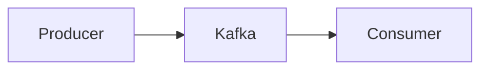
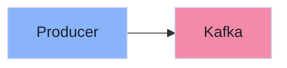

# AGENTS.md

## Documentation Collaboration & AI Agents Context

This file provides context for AI agents working on this documentation project.

## Project Overview

**Project Name:** TechDocs  
**Framework:** MkDocs Material  
**Languages:** English (primary), French (secondary)  
**Theme:** Catppuccin Mocha (Base light, Sapphire dark)  
**Documentation Framework:** Diátaxis

## Documentation Structure

We follow the [Diátaxis framework](https://diataxis.fr/) for organizing documentation:

```
docs/
├── tutorials/        # Learning-oriented (getting started, step-by-step)
├── how-to/          # Goal-oriented (practical guides, recipes)
├── reference/       # Information-oriented (technical specifications)
└── explanation/     # Understanding-oriented (concepts, theory)
```

## Content Guidelines

### Language Support

- **Primary Language:** English
- **Secondary Language:** French
- All major documentation pages should have French translations
- French files use `.fr.md` suffix (e.g., `index.fr.md`)
- Navigation supports language switching

### Writing Style

- **Clear and concise:** Technical accuracy without unnecessary jargon
- **Code examples:** Include practical, runnable examples
- **Bilingual:** Maintain parity between English and French versions
- **Accessible:** Explain concepts before diving into technical details
- **Material Design:** Use MkDocs Material features to enhance readability (see MkDocs Material Features section below)

### Diátaxis Quadrants

#### 1. Tutorials (`docs/tutorials/`)

- **Purpose:** Learning by doing
- **Audience:** Beginners
- **Style:** Step-by-step, prescriptive
- **Example:** "Getting Started with Kafka"

#### 2. How-to Guides (`docs/how-to/`)

- **Purpose:** Solve specific problems
- **Audience:** Users with basic knowledge
- **Style:** Goal-oriented, practical
- **Example:** "How to Configure Kafka Producers"

#### 3. Reference (`docs/reference/`)

- **Purpose:** Technical information
- **Audience:** Practitioners needing precise details
- **Style:** Factual, comprehensive
- **Example:** "Kafka Configuration Parameters"

#### 4. Explanation (`docs/explanation/`)

- **Purpose:** Understanding concepts
- **Audience:** Users wanting deeper knowledge
- **Style:** Discursive, theoretical
- **Example:** "Understanding Kafka Event Streaming Architecture"

## Development Workflow

### MkDocs Material Features

This project leverages advanced MkDocs Material features to create engaging, professional documentation. **Always use these features when creating or updating documentation.**

#### 1. Admonitions (Call-out Boxes)

Admonitions highlight important information with visual boxes. Use them strategically to draw attention to key concepts, warnings, tips, and summaries.

**Syntax:**

```markdown
!!! note "Optional Title"

    Content goes here

!!! tip "Pro Tip"

    Content here

!!! warning "Important"

    Content here

!!! danger "Critical"

    Content here

!!! success "Success"

    Content here

!!! info "Information"

    Content here

!!! summary "Key Takeaways"

    Content here

??? bug "Collapsible Troubleshooting"

    This is collapsed by default (use ??? instead of !!!)
```

**CRITICAL FORMATTING RULE:**

!!! danger "Admonition Indentation"

    For MkDocs Material admonitions to render correctly, you **MUST**:
    
    1. Leave **one blank line** after the admonition declaration (`!!! type "Title"`)
    2. Indent the content with **4 spaces** (or 1 tab)
    
    **❌ WRONG:**
    ```markdown
    !!! tip "Title"
    Content without blank line and proper indentation
    ```
    
    **✅ CORRECT:**
    ```markdown
    !!! tip "Title"

        Content with blank line and 4-space indentation
        Multiple lines must all be indented
    ```
    
    See: [MkDocs Material Admonitions Reference](https://squidfunk.github.io/mkdocs-material/reference/admonitions/)

**When to use:**

- `!!! note` - Supplementary information or clarifications
- `!!! tip` - Best practices, helpful hints, mental models
- `!!! warning` - Important caveats, limitations, trade-offs
- `!!! danger` - Critical distinctions, breaking changes, security concerns
- `!!! success` - Benefits, advantages, positive outcomes
- `!!! info` - Neutral information, configuration details
- `!!! summary` - Key takeaways, section summaries (especially useful at end of tutorials)
- `??? bug` - Collapsible troubleshooting sections

**Example from Kafka tutorial:**

```markdown
!!! tip "Mental Model Shift"
Kafka encourages you to shift your thinking from **things** to **events**—moments in time when something happens.

!!! warning "Hardware Failure is Inevitable"
Disk and server failures **will happen**. Replication protects against data loss.
```

#### 2. Code Annotations

Code annotations add numbered inline explanations that appear as hover tooltips, perfect for explaining specific lines of code.

**Syntax:**

````markdown
```python
bootstrap.servers='localhost:9092'  # (1)!
key.serializer='StringSerializer'   # (2)!
```
````

1. Kafka broker address - can be a comma-separated list
2. Converts keys to bytes for transmission

````

**When to use:**
- Explaining configuration parameters
- Clarifying non-obvious code patterns
- Providing context for specific values
- Teaching complex code snippets

**Example from Producer guide:**
```markdown
```java
props.put("bootstrap.servers", "localhost:9092");  // (1)!
props.put("acks", "all");                          // (2)!
props.put("compression.type", "snappy");           // (3)!
````

1. Connect to Kafka broker - can specify multiple brokers for redundancy
2. Wait for all replicas to acknowledge - strongest durability guarantee
3. Compress messages using Snappy algorithm - reduces network bandwidth

````

#### 3. Linked Content Tabs

Linked tabs allow users to switch between code examples in different languages, and the selection persists across all code blocks in the documentation.

**Requires:** `content.tabs.link` feature enabled in `mkdocs.yml`

**Syntax:**
```markdown
=== ":simple-openjdk: Java"

    ```java
    KafkaProducer<String, String> producer = new KafkaProducer<>(props);
    ```

=== ":simple-python: Python"

    ```python
    producer = KafkaProducer(**config)
    ```

=== ":simple-nodedotjs: Node.js"

    ```javascript
    const producer = new Kafka.Producer(config);
    ```

=== ":simple-go: Go"

    ```go
    producer := kafka.NewProducer(config)
    ```
````

**When to use:**

- Multi-language code examples in how-to guides
- Platform-specific configurations (AWS/Azure/GCP)
- Different approaches to the same problem

**Important:** The icon syntax `:simple-*:` uses [Simple Icons](https://simpleicons.org/) via Material Design Icons. Common ones:

- `:simple-openjdk:` - Java
- `:simple-python:` - Python
- `:simple-nodedotjs:` - Node.js
- `:simple-go:` - Go
- `:simple-rust:` - Rust
- `:fontawesome-solid-*:` - FontAwesome icons

#### 4. Enhanced Code Blocks

Add titles, line numbers, and highlight specific lines for better code presentation.

**Syntax:**

````markdown
```java title="KafkaProducerExample.java" linenums="1" hl_lines="3-5"
import org.apache.kafka.clients.producer.*;

Properties props = new Properties();
props.put("bootstrap.servers", "localhost:9092");
props.put("acks", "all");

KafkaProducer<String, String> producer = new KafkaProducer<>(props);
```
````

````

**Attributes:**
- `title="filename"` - Shows filename above code block
- `linenums="1"` - Adds line numbers starting from 1
- `hl_lines="3-5"` - Highlights lines 3, 4, 5

#### 5. Grid Cards

Create visually organized comparison tables or feature highlights using grid cards.

**Syntax:**
```markdown
<div class="grid cards" markdown>

- :material-check-circle:{ .lg .middle } **DO**

    ---

    Use meaningful topic names like `orders.created`

- :material-close-circle:{ .lg .middle } **DON'T**

    ---

    Use generic names like `data` or `events`

</div>
````

**When to use:**

- DO/DON'T best practices
- Feature comparison matrices
- Step-by-step visual workflows
- Configuration option comparisons

#### 6. Task Lists

Show progress or checklists using task list syntax.

**Syntax:**

```markdown
- [x] Configure bootstrap servers
- [x] Set serializer
- [ ] Add compression (optional)
- [ ] Configure idempotence
```

**When to use:**

- Setup checklists in tutorials
- Feature completeness indicators
- Migration tracking

#### 7. Material Buttons

Create prominent call-to-action links.

**Syntax:**

```markdown
[Get Started :fontawesome-solid-rocket:](getting-started.md){ .md-button .md-button--primary }

[View Examples](examples.md){ .md-button }
```

**When to use:**

- Important navigation links
- Call-to-action buttons
- Next steps sections

#### 8. Icons in Text

Add inline icons to enhance readability.

**Syntax:**

```markdown
:material-check: Success
:material-alert: Warning
:fontawesome-solid-rocket: Launch
:simple-github: GitHub
```

**When to use:**

- Indicating status (✓, ×)
- Platform/technology indicators
- Navigation hints

#### 9. Mermaid Diagrams

Create architecture diagrams, flowcharts, sequence diagrams, and more using Mermaid.

**Syntax:**

````markdown

````

**CRITICAL RULE: Never Add Colors to Mermaid Diagrams**

**❌ NEVER DO THIS:**

````markdown

````

**✅ ALWAYS DO THIS:**

````markdown

````

**Why:**

- **Theme compatibility:** Hardcoded colors break dark mode and light mode switching
- **Accessibility:** Theme colors are optimized for contrast and readability
- **Maintainability:** Color styles must be manually updated when themes change
- **Consistency:** Native colors ensure diagrams match the site's visual design

**Exception:** Only use Mermaid's built-in semantic node types (e.g., `([Start])`, `{{Decision}}`, `[(Database)]`) which automatically adapt to themes.

**When to use Mermaid:**

- System architecture diagrams
- Data flow visualizations
- Process workflows
- State machines
- Sequence diagrams
- Entity relationships

**Common diagram types:**

- `graph LR` / `graph TD` - Flowcharts (left-to-right / top-down)
- `sequenceDiagram` - Interaction sequences
- `stateDiagram-v2` - State machines
- `erDiagram` - Entity relationships
- `journey` - User journeys

### Feature Usage Guidelines by Document Type

#### Tutorials (`docs/tutorials/`)

**Primary features:**

- `!!! tip` for mental model shifts
- `!!! info` for key concepts
- `!!! summary` for section takeaways
- Code annotations for teaching
- Mermaid diagrams for architecture
- Task lists for learning steps

**Avoid:**

- Linked tabs (tutorials typically use one language)
- Complex grid cards (keep it simple for beginners)

**Example:** `kafka-getting-started.md` - Uses admonitions for key concepts, annotations for message components, summary boxes for takeaways

#### How-to Guides (`docs/how-to/`)

**Primary features:**

- `=== "Language"` linked tabs for multi-language examples
- Code annotations for configuration details
- `!!! warning` for gotchas and limitations
- `!!! tip` for best practices
- Grid cards for DO/DON'T comparisons
- Enhanced code blocks with titles and line highlights

**Avoid:**

- Lengthy explanations (link to explanation docs instead)
- Too many collapsed sections (keep it actionable)

**Example:** `kafka-produce-messages.md` - Uses linked tabs for Java/Python/Node.js/Go examples, annotations for config params, grid cards for compression comparison

#### Reference (`docs/reference/`)

**Primary features:**

- Tables for parameter lists
- `!!! info` for parameter details
- Code blocks with titles
- Definition lists

**Avoid:**

- Admonitions everywhere (use sparingly)
- Linked tabs (show all variations in tables)

#### Explanation (`docs/explanation/`)

**Primary features:**

- `!!! note` for deep dives
- `!!! tip` for conceptual insights
- Mermaid diagrams for architecture
- Regular paragraphs (less code, more prose)

**Avoid:**

- Linked tabs (not code-focused)
- Task lists (not procedural)

### Pre-commit Hooks

All commits must pass:

- ✅ Trailing whitespace checks
- ✅ YAML/JSON validation
- ✅ EditorConfig compliance
- ✅ Markdown linting
- ✅ Prettier formatting
- ✅ Conventional commits validation

### Commit Message Format

We use [Conventional Commits](https://www.conventionalcommits.org/):

```
<type>[optional scope]: <description>

[optional body]

[optional footer]
```

**Types:**

- `feat:` - New features or content
- `docs:` - Documentation changes
- `fix:` - Bug fixes
- `chore:` - Maintenance tasks
- `refactor:` - Code restructuring

**Examples:**

```
feat: add Apache Kafka how-to guide
docs: translate Kafka guide to French
fix: correct code example in Kafka producer guide
```

### Git Workflow Rules

**CRITICAL: Never Push to Remote**

- ❌ **NEVER** run `git push` to remote repositories
- ✅ Always commit changes locally with `git commit`
- ✅ Keep commits ready for manual push by the user
- 🔒 This ensures user control over what gets published

**Why:**

- User maintains full control over published content
- Allows review before making changes public
- Prevents accidental publication of work-in-progress
- User decides when and what to deploy

**Correct workflow:**

```bash
# ✅ DO: Commit locally
git add .
git commit -m "feat: add new documentation"

# ❌ DON'T: Never push automatically
# git push origin main  # NEVER DO THIS

# ✅ User pushes manually when ready
```

## Best Practices & Common Patterns

### Apache Kafka - Bootstrap Servers

When documenting Kafka bootstrap servers configuration, **always include this best practice guidance:**

!!! tip "Bootstrap Servers Best Practice"
You don't need to list **all** brokers—just enough for initial discovery. The producer will automatically learn about the rest of the cluster.

**Key points to include:**

- One broker is sufficient, but 2-3 recommended for redundancy
- Client discovers full cluster topology automatically
- More brokers = better fault tolerance during initial connection
- No performance benefit beyond initial discovery

**Example annotation pattern to use in documentation:**

````markdown
```java
props.put("bootstrap.servers", "localhost:9092,localhost:9093");  // (1)!
```

1. List 2-3 brokers for redundancy during initial connection. The client will automatically discover the full cluster topology.
````

### Kubernetes - Talos Linux Context

When documenting Kubernetes deployments on Talos Linux:

!!! note "Talos-Specific Considerations"
Talos Linux is API-driven and immutable. Configuration cannot be changed via SSH or direct file editing.

**Key Talos requirements to mention:**

- **KubePrism:** API server runs on `localhost:7445` (not standard `6443`)
- **CGroup v2:** Pre-mounted at `/sys/fs/cgroup`, no autoMount needed
- **No SSH access:** All changes via `talosctl` API calls
- **Security contexts:** Some capabilities (like `SYS_MODULE`) unavailable
- **Interface names:** Usually `enp0s*`, `ens*`, or `eth*` depending on hypervisor

**Cross-reference pattern:**

When creating Kubernetes documentation, reference the related homelab_automation implementation:

```markdown
!!! info "Implementation Reference"
For production-ready configuration files and deployment automation, see the [homelab_automation repository](https://github.com/mombe090/homelab_automation).
```

## Current Topics

### Implemented

- MkDocs setup with bilingual support
- Catppuccin Mocha theming
- Diátaxis documentation structure
- Pre-commit hooks and validation
- Apache Kafka documentation (from Confluent course)
- Kubernetes Cilium L2 LoadBalancer on Talos documentation

### In Progress

- Kubernetes networking and service mesh guides

### Planned

- More streaming technologies
- Cloud platform guides
- DevOps best practices

## Agent Instructions

When creating new documentation:

1. **Determine the quadrant:** Is it a tutorial, how-to, reference, or explanation?
2. **Place files correctly:** Use the appropriate directory structure
3. **Create bilingual content:** Provide both English and French versions
4. **Update navigation:** Add entries to `mkdocs.yml` for both languages
5. **Follow conventions:** Use consistent formatting and style
6. **Test locally:** Run `mkdocs serve` to preview
7. **Commit properly:** Use conventional commit format

## Example Documentation Creation Flow

For "Apache Kafka Basics":

1. **Identify content types:**

- Tutorial: Getting started with Kafka
- How-to: Configure producers/consumers
- Reference: Configuration parameters
- Explanation: Event streaming concepts

2. **Create files:**

```
docs/tutorials/kafka-getting-started.md
docs/tutorials/kafka-getting-started.fr.md
docs/how-to/kafka-configure-producer.md
docs/how-to/kafka-configure-producer.fr.md
docs/reference/kafka-config-reference.md
docs/reference/kafka-config-reference.fr.md
docs/explanation/kafka-event-streaming.md
docs/explanation/kafka-event-streaming.fr.md
```

3. **Update `mkdocs.yml`:**

```yaml
nav:
  - Tutorials:
      - Apache Kafka: tutorials/kafka-getting-started.md
  - How-to:
      - Kafka Producer: how-to/kafka-configure-producer.md
```

4. **Commit:**

```bash
git add docs/ mkdocs.yml
git commit -m "feat: add Apache Kafka documentation with French translations"
```

## Resources

- [Diátaxis Framework](https://diataxis.fr/)
- [MkDocs Material](https://squidfunk.github.io/mkdocs-material/)
- [Conventional Commits](https://www.conventionalcommits.org/)
- [Catppuccin Theme](https://github.com/catppuccin/catppuccin)

## Questions or Improvements?

This is a living document. Update it as the project evolves and new patterns emerge.

---

**Last Updated:** 2025-12-05  
**Maintainer:** Mamadou Yaya DIALLO
