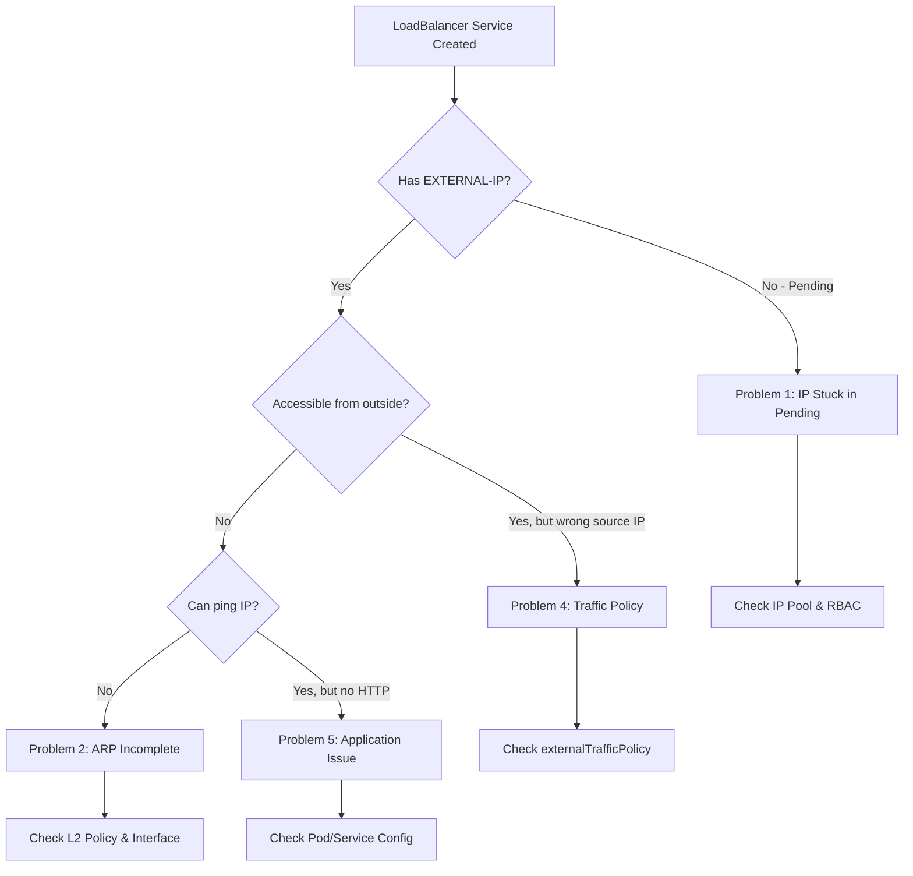

# How to Troubleshoot Cilium LoadBalancer Issues on Talos Linux

**Goal**: Diagnose and fix common LoadBalancer problems in Cilium L2 announcement deployments.

**Audience**: Kubernetes administrators and SREs managing Talos clusters with Cilium.

**Time**: Variable (5 minutes to 1 hour depending on issue complexity)

---

## Quick Diagnostic Decision Tree



---

## Problem 1: LoadBalancer IP Stuck in Pending

### Symptoms

```bash
kubectl get svc my-service
```

Output shows `<pending>` indefinitely:

```
NAME         TYPE           CLUSTER-IP      EXTERNAL-IP   PORT(S)        AGE
my-service   LoadBalancer   10.96.100.123   <pending>     80:30123/TCP   5m
```

### Root Causes

1. **No IP pool configured** or IP pool exhausted
2. **LB-IPAM not enabled** in Cilium
3. **Service selector doesn't match** any IP pool
4. **RBAC permissions missing** for IPAM controller

---

### Solution 1.1: Verify IP Pool Exists

Check for IP pools:

```bash
kubectl get ciliumloadbalancerippool
```

Expected output:

```
NAME          DISABLED   CONFLICTING   IPS AVAILABLE   AGE
prod-pool     false      false         14              10m
```

If no pools exist, create one:

```bash
cat <<EOF | kubectl apply -f -
apiVersion: cilium.io/v2alpha1
kind: CiliumLoadBalancerIPPool
metadata:
  name: default-pool
spec:
  blocks:
    - cidr: "192.168.10.64/28"
EOF
```

### Solution 1.2: Check IP Pool Availability

Verify pool has available IPs:

```bash
kubectl describe ciliumloadbalancerippool prod-pool
```

Look for:

```yaml
Status:
  Conditions:
    Status: True
    Type: io.cilium/ips-available
```

If `IPS AVAILABLE` is 0, expand your pool or create a new one:

```bash
kubectl edit ciliumloadbalancerippool prod-pool
```

Change CIDR to larger range:

```yaml
spec:
  blocks:
    - cidr: "192.168.10.64/27" # Changed from /28 to /27 (32 IPs)
```

### Solution 1.3: Check Service Selector Matching

View pool's service selector:

```bash
kubectl get ciliumloadbalancerippool prod-pool -o yaml
```

Example with namespace restriction:

```yaml
spec:
  serviceSelector:
    matchExpressions:
      - key: io.kubernetes.service.namespace
        operator: In
        values:
          - production
          - staging
```

If your service is in `default` namespace, it won't match. Either:

**Option A**: Remove selector to match all services:

```bash
kubectl patch ciliumloadbalancerippool prod-pool --type=merge -p '{"spec":{"serviceSelector":{"matchLabels":{}}}}'
```

**Option B**: Add label to your service:

```bash
kubectl label service my-service pool=production
```

And update pool selector:

```yaml
spec:
  serviceSelector:
    matchLabels:
      pool: production
```

### Solution 1.4: Verify IPAM is Enabled

Check Cilium operator logs:

```bash
kubectl logs -n kube-system deployment/cilium-operator | grep -i ipam
```

Should see:

```
level=info msg="LB-IPAM is enabled"
```

If not enabled, check Helm values:

```bash
helm get values cilium -n kube-system | grep -i ipam
```

Should have:

```yaml
l2announcements:
  enabled: true
externalIPs:
  enabled: true
```

If missing, upgrade Cilium:

```bash
helm upgrade cilium cilium/cilium \
  --namespace kube-system \
  --reuse-values \
  --set l2announcements.enabled=true \
  --set externalIPs.enabled=true
```

### Solution 1.5: Check RBAC Permissions

Verify IPAM controller has permissions:

```bash
kubectl get role cilium-l2-announcement -n kube-system
kubectl get rolebinding cilium-l2-announcement -n kube-system
```

If missing, create RBAC:

```yaml
apiVersion: v1
kind: ServiceAccount
metadata:
  name: cilium-l2-announcement
  namespace: kube-system
---
apiVersion: rbac.authorization.k8s.io/v1
kind: Role
metadata:
  name: cilium-l2-announcement
  namespace: kube-system
rules:
  - apiGroups: ["coordination.k8s.io"]
    resources: ["leases"]
    verbs: ["create", "get", "update"]
  - apiGroups: [""]
    resources: ["services", "endpoints"]
    verbs: ["get", "list", "watch"]
---
apiVersion: rbac.authorization.k8s.io/v1
kind: RoleBinding
metadata:
  name: cilium-l2-announcement
  namespace: kube-system
roleRef:
  apiGroup: rbac.authorization.k8s.io
  kind: Role
  name: cilium-l2-announcement
subjects:
  - kind: ServiceAccount
    name: cilium-l2-announcement
    namespace: kube-system
```

Apply:

```bash
kubectl apply -f cilium-l2-rbac.yaml
```

Restart Cilium operator to pick up permissions:

```bash
kubectl rollout restart deployment/cilium-operator -n kube-system
```

---

## Problem 2: IP Assigned but Not Accessible (ARP Incomplete)

### Symptoms

Service has EXTERNAL-IP assigned:

```bash
kubectl get svc my-service
```

```
NAME         TYPE           CLUSTER-IP      EXTERNAL-IP     PORT(S)        AGE
my-service   LoadBalancer   10.96.100.123   192.168.10.75   80:30123/TCP   5m
```

But cannot reach from outside cluster. ARP shows incomplete:

```bash
arp -a | grep 192.168.10.75
```

```
? (192.168.10.75) at (incomplete) on enp0s1
```

Or ping fails:

```bash
ping -c 3 192.168.10.75
```

```
PING 192.168.10.75 (192.168.10.75) 56(84) bytes of data.
--- 192.168.10.75 ping statistics ---
3 packets transmitted, 0 received, 100% packet loss, time 2047ms
```

### Root Causes

1. **L2 announcements not enabled** in Cilium
2. **No L2 announcement policy** configured
3. **Wrong network interface** selected in policy
4. **No nodes match** the node selector
5. **Leader election failing** due to lease issues

---

### Solution 2.1: Verify L2 Announcements Enabled

Check Cilium agent status:

```bash
kubectl exec -n kube-system ds/cilium -- cilium-dbg status | grep -i l2
```

Expected output:

```
L2 Announcements:     Enabled
```

If disabled, check Helm configuration:

```bash
helm get values cilium -n kube-system | grep -A5 l2announcements
```

Should have:

```yaml
l2announcements:
  enabled: true
```

If missing, upgrade:

```bash
helm upgrade cilium cilium/cilium \
  --namespace kube-system \
  --reuse-values \
  --set l2announcements.enabled=true
```

### Solution 2.2: Check L2 Announcement Policy Exists

List policies:

```bash
kubectl get ciliuml2announcementpolicy
```

If none exist, create one:

```yaml
apiVersion: cilium.io/v2alpha1
kind: CiliumL2AnnouncementPolicy
metadata:
  name: default-l2-policy
spec:
  serviceSelector:
    matchLabels: {} # Match all services
  nodeSelector:
    matchExpressions:
      - key: node-role.kubernetes.io/control-plane
        operator: DoesNotExist # Only worker nodes
  interfaces:
    - ^enp0s.*
    - ^eth0$
    - ^ens18$
  externalIPs: true
  loadBalancerIPs: true
```

Apply:

```bash
kubectl apply -f l2-announcement-policy.yaml
```

### Solution 2.3: Verify Correct Network Interface

This is the **most common issue**.

#### Step 1: Find your node's actual interface

From Talos node:

```bash
talosctl get links -n <node-ip>
```

Example output:

```
NAME          TYPE     ENABLED
enp0s1        ether    true
lo            loopback true
cilium_host   ether    true
cilium_net    ether    true
cilium_vxlan  ether    true
```

The physical interface is `enp0s1`.

#### Step 2: Check policy's interface regex

```bash
kubectl get ciliuml2announcementpolicy default-l2-policy -o yaml
```

Look at `spec.interfaces`:

```yaml
spec:
  interfaces:
    - ^eth0$ # This won't match enp0s1!
```

#### Step 3: Update policy with correct interface

```bash
kubectl edit ciliuml2announcementpolicy default-l2-policy
```

Change to match your interface:

```yaml
spec:
  interfaces:
    - ^enp0s1$ # Exact match
```

Or use pattern to match multiple:

```yaml
spec:
  interfaces:
    - ^enp0s.* # Matches enp0s1, enp0s3, enp0s8, etc.
```

#### Step 4: Verify from debug pod

Run pod with host network:

```bash
kubectl run net-debug --rm -it --image=nicolaka/netshoot --overrides='{"spec":{"hostNetwork":true}}' -- ip link show
```

Identify the interface that connects to your LAN (usually the one with the node's IP).

### Solution 2.4: Check Node Selector Matches Nodes

View policy's node selector:

```bash
kubectl get ciliuml2announcementpolicy default-l2-policy -o jsonpath='{.spec.nodeSelector}' | jq
```

Check if any nodes match:

```bash
kubectl get nodes --show-labels
```

Common issue: Policy excludes control plane, but you're running single-node cluster:

```yaml
nodeSelector:
  matchExpressions:
    - key: node-role.kubernetes.io/control-plane
      operator: DoesNotExist
```

For single-node cluster, remove node selector:

```bash
kubectl patch ciliuml2announcementpolicy default-l2-policy --type=json -p='[{"op": "remove", "path": "/spec/nodeSelector"}]'
```

Or specifically include control plane:

```yaml
nodeSelector:
  matchLabels: {} # Match all nodes
```

### Solution 2.5: Check Lease Leader Election

Verify lease exists and has owner:

```bash
kubectl get lease -n kube-system | grep cilium-l2
```

Should see lease for each service:

```
NAME                          HOLDER                     AGE
cilium-l2-default-my-service  worker-01                  5m
```

If no lease or no holder, check Cilium logs:

```bash
kubectl logs -n kube-system -l k8s-app=cilium --tail=100 | grep -i "lease\|l2"
```

Look for errors like:

```
level=error msg="Failed to acquire lease" error="leases.coordination.k8s.io is forbidden"
```

This indicates RBAC issue. Apply RBAC from [Solution 1.5](#solution-15-check-rbac-permissions).

### Solution 2.6: Force Announcement Refresh

Delete and recreate the service to trigger new announcement:

```bash
kubectl get svc my-service -o yaml > my-service-backup.yaml
kubectl delete svc my-service
kubectl apply -f my-service-backup.yaml
```

Or restart Cilium agent on announcing node:

```bash
# Find which node is announcing
kubectl get lease -n kube-system | grep cilium-l2

# Restart Cilium on that node
kubectl delete pod -n kube-system -l k8s-app=cilium --field-selector spec.nodeName=worker-01
```

---

## Problem 3: RBAC Errors in Cilium Logs

### Symptoms

Checking Cilium operator logs shows permission denied:

```bash
kubectl logs -n kube-system deployment/cilium-operator | grep -i error
```

```
level=error msg="Failed to create lease" error="leases.coordination.k8s.io is forbidden: User 'system:serviceaccount:kube-system:cilium-operator' cannot create resource 'leases'"
```

Or Cilium agent logs show:

```bash
kubectl logs -n kube-system ds/cilium | grep -i forbidden
```

```
level=error msg="cannot list services" error="services is forbidden"
```

### Root Causes

1. Missing RBAC Role/RoleBinding for lease management
2. ClusterRole/ClusterRoleBinding not created during installation
3. ServiceAccount not assigned to Cilium pods

---

### Solution 3.1: Create Complete RBAC Configuration

Create comprehensive RBAC covering all L2 announcement needs:

```yaml
---
apiVersion: v1
kind: ServiceAccount
metadata:
  name: cilium-l2-announcement
  namespace: kube-system
---
apiVersion: rbac.authorization.k8s.io/v1
kind: Role
metadata:
  name: cilium-l2-announcement
  namespace: kube-system
rules:
  # Lease management for leader election
  - apiGroups: ["coordination.k8s.io"]
    resources: ["leases"]
    verbs: ["create", "get", "update", "list", "watch"]
  # Service and endpoint access
  - apiGroups: [""]
    resources: ["services", "endpoints"]
    verbs: ["get", "list", "watch"]
  # Node information
  - apiGroups: [""]
    resources: ["nodes"]
    verbs: ["get", "list", "watch"]
---
apiVersion: rbac.authorization.k8s.io/v1
kind: RoleBinding
metadata:
  name: cilium-l2-announcement
  namespace: kube-system
roleRef:
  apiGroup: rbac.authorization.k8s.io
  kind: Role
  name: cilium-l2-announcement
subjects:
  - kind: ServiceAccount
    name: cilium-l2-announcement
    namespace: kube-system
---
apiVersion: rbac.authorization.k8s.io/v1
kind: ClusterRole
metadata:
  name: cilium-l2-announcement
rules:
  # Access to Cilium CRDs
  - apiGroups: ["cilium.io"]
    resources:
      - ciliumloadbalancerippools
      - ciliuml2announcementpolicies
    verbs: ["get", "list", "watch"]
  # Service access across namespaces
  - apiGroups: [""]
    resources: ["services"]
    verbs: ["get", "list", "watch"]
---
apiVersion: rbac.authorization.k8s.io/v1
kind: ClusterRoleBinding
metadata:
  name: cilium-l2-announcement
roleRef:
  apiGroup: rbac.authorization.k8s.io
  kind: ClusterRole
  name: cilium-l2-announcement
subjects:
  - kind: ServiceAccount
    name: cilium-l2-announcement
    namespace: kube-system
```

Apply:

```bash
kubectl apply -f cilium-l2-rbac-complete.yaml
```

### Solution 3.2: Verify ServiceAccount Assignment

Check Cilium operator deployment uses correct ServiceAccount:

```bash
kubectl get deployment cilium-operator -n kube-system -o jsonpath='{.spec.template.spec.serviceAccountName}'
```

Should output: `cilium-operator` (Cilium's default SA)

Check if Cilium operator's SA has proper ClusterRole:

```bash
kubectl get clusterrolebinding | grep cilium-operator
```

Should see:

```
cilium-operator    ClusterRole/cilium-operator    10d
```

### Solution 3.3: Restart Cilium Components

After applying RBAC, restart to pick up new permissions:

```bash
# Restart operator
kubectl rollout restart deployment/cilium-operator -n kube-system

# Restart agents
kubectl rollout restart daemonset/cilium -n kube-system
```

Wait for rollout:

```bash
kubectl rollout status daemonset/cilium -n kube-system
kubectl rollout status deployment/cilium-operator -n kube-system
```

---

## Problem 4: Wrong externalTrafficPolicy Behavior

### Symptoms

**Scenario A**: Service works but can't see client source IP in application logs.

**Scenario B**: Service is inaccessible, but only when using `externalTrafficPolicy: Local`.

### Root Cause

`externalTrafficPolicy: Local` requires the announcing node to have a local pod. If not, traffic is dropped.

---

### Solution 4.1: Understand Traffic Policy Differences

| Policy              | Client IP Preserved | Works Without Local Pod | Load Distribution       |
| ------------------- | ------------------- | ----------------------- | ----------------------- |
| `Cluster` (default) | ❌ No (SNAT'd)      | ✅ Yes                  | ✅ Even across all pods |
| `Local`             | ✅ Yes              | ❌ No                   | ⚠️ Only to local pods   |

### Solution 4.2: Check Current Policy

```bash
kubectl get svc my-service -o jsonpath='{.spec.externalTrafficPolicy}'
```

### Solution 4.3: Verify Pod Distribution with Local Policy

If using `Local`, check which node is announcing:

```bash
kubectl get lease -n kube-system | grep cilium-l2
```

```
cilium-l2-default-my-service   worker-02   5m
```

Check if that node has pods:

```bash
kubectl get pods -l app=my-service -o wide
```

```
NAME                          READY   STATUS    NODE
my-service-7d4c9b8f6d-abc123  1/1     Running   worker-01
my-service-7d4c9b8f6d-def456  1/1     Running   worker-01
```

**Problem**: Worker-02 is announcing but pods are on worker-01!

### Solution 4.4: Fix Pod Distribution

**Option A**: Force pods to announcing node:

```yaml
apiVersion: v1
kind: Pod
metadata:
  name: my-service
spec:
  nodeSelector:
    kubernetes.io/hostname: worker-02
```

**Option B**: Increase replicas for better distribution:

```bash
kubectl scale deployment my-service --replicas=3
```

**Option C**: Use pod anti-affinity to spread pods:

```yaml
apiVersion: apps/v1
kind: Deployment
spec:
  template:
    spec:
      affinity:
        podAntiAffinity:
          preferredDuringSchedulingIgnoredDuringExecution:
            - weight: 100
              podAffinityTerm:
                labelSelector:
                  matchLabels:
                    app: my-service
                topologyKey: kubernetes.io/hostname
```

### Solution 4.5: Switch to Cluster Policy (If Source IP Not Needed)

```bash
kubectl patch svc my-service -p '{"spec":{"externalTrafficPolicy":"Cluster"}}'
```

### Solution 4.6: Keep Local Policy and Use Ingress

If you need source IP preservation, use ingress controller with `Local` policy:

```yaml
apiVersion: v1
kind: Service
metadata:
  name: traefik
spec:
  type: LoadBalancer
  externalTrafficPolicy: Local # Preserves source IP
  selector:
    app: traefik
---
apiVersion: apps/v1
kind: DaemonSet # Runs on all nodes
metadata:
  name: traefik
spec:
  template:
    spec:
      containers:
        - name: traefik
          image: traefik:v2.10
```

DaemonSet ensures every node has a pod, making `Local` policy work reliably.

---

## Problem 5: Service Accessible but Application Not Responding

### Symptoms

- Can ping LoadBalancer IP ✅
- TCP handshake fails or HTTP returns errors ❌

```bash
ping -c 3 192.168.10.75  # Works
curl http://192.168.10.75  # Fails or times out
```

### Root Cause

This is typically an application or service configuration issue, not Cilium L2.

---

### Solution 5.1: Verify Pods Are Running

```bash
kubectl get pods -l app=my-service
```

All pods should be `Running` and `READY 1/1`.

### Solution 5.2: Check Service Selector Matches Pods

Get service selector:

```bash
kubectl get svc my-service -o jsonpath='{.spec.selector}' | jq
```

Output:

```json
{
  "app": "my-service"
}
```

Verify pods have matching labels:

```bash
kubectl get pods -l app=my-service --show-labels
```

If no pods match, update service selector or pod labels.

### Solution 5.3: Verify Service Port Configuration

Describe service:

```bash
kubectl describe svc my-service
```

Check `TargetPort` matches container port:

```yaml
Port: 80/TCP
TargetPort: 8080/TCP # Must match container's port
```

Verify container port:

```bash
kubectl get pod <pod-name> -o jsonpath='{.spec.containers[0].ports}' | jq
```

### Solution 5.4: Test Pod Directly

Port-forward to pod to bypass service:

```bash
kubectl port-forward pod/<pod-name> 8080:8080
```

Test locally:

```bash
curl http://localhost:8080
```

If this works, issue is with Service configuration, not application.

### Solution 5.5: Check Network Policies

Verify no NetworkPolicy is blocking traffic:

```bash
kubectl get networkpolicy -n <namespace>
```

If policies exist, ensure they allow ingress from all sources:

```yaml
apiVersion: networking.k8s.io/v1
kind: NetworkPolicy
metadata:
  name: allow-loadbalancer
spec:
  podSelector:
    matchLabels:
      app: my-service
  policyTypes:
    - Ingress
  ingress:
    - from:
        - ipBlock:
            cidr: 0.0.0.0/0 # Allow from anywhere
      ports:
        - protocol: TCP
          port: 8080
```

---

## Advanced Troubleshooting Techniques

### Technique 1: Enable Debug Logging

Enable debug logs for Cilium agent:

```bash
kubectl exec -n kube-system ds/cilium -- cilium-dbg config set debug true
```

Watch logs:

```bash
kubectl logs -n kube-system -l k8s-app=cilium --tail=100 -f | grep -i "l2\|announce"
```

Disable when done:

```bash
kubectl exec -n kube-system ds/cilium -- cilium-dbg config set debug false
```

### Technique 2: Check L2 Announcement Status

Get detailed status for specific service:

```bash
kubectl exec -n kube-system ds/cilium -- cilium-dbg service list | grep <EXTERNAL-IP>
```

### Technique 3: Monitor ARP Announcements

From node announcing the IP:

```bash
# Find announcing node
ANNOUNCING_NODE=$(kubectl get lease -n kube-system -l cilium.io/service=default/my-service -o jsonpath='{.items[0].spec.holderIdentity}')

# SSH to node (if using SSH) or use Talos
talosctl -n $ANNOUNCING_NODE logs kubelet | grep -i arp
```

Or capture ARP packets from external machine:

```bash
sudo tcpdump -i enp0s1 arp -n
```

Should see:

```
ARP, Request who-has 192.168.10.75 tell 192.168.10.1
ARP, Reply 192.168.10.75 is-at aa:bb:cc:dd:ee:ff
```

### Technique 4: Verify Cilium BPF Program

Check BPF programs loaded:

```bash
kubectl exec -n kube-system ds/cilium -- cilium-dbg bpf lb list
```

Should show LoadBalancer IP and backends.

### Technique 5: Check Cilium Connectivity

Test Cilium connectivity:

```bash
kubectl exec -n kube-system ds/cilium -- cilium-dbg connectivity test
```

This runs comprehensive tests (takes 5-10 minutes).

---

## Common Error Messages and Solutions

### Error: "no CiliumLoadBalancerIPPool matches"

**Message in logs**:

```
level=warning msg="No CiliumLoadBalancerIPPool matches service" service=default/my-service
```

**Solution**: Check service namespace matches pool selector (see [Solution 1.3](#solution-13-check-service-selector-matching))

---

### Error: "interface not found"

**Message in logs**:

```
level=error msg="Failed to announce IP" error="interface eth0 not found"
```

**Solution**: Update L2 policy with correct interface name (see [Solution 2.3](#solution-23-verify-correct-network-interface))

---

### Error: "failed to acquire lease"

**Message in logs**:

```
level=error msg="Failed to acquire lease" error="leases.coordination.k8s.io is forbidden"
```

**Solution**: Apply RBAC permissions (see [Solution 3.1](#solution-31-create-complete-rbac-configuration))

---

### Error: "no nodes match announcement policy"

**Message in logs**:

```
level=warning msg="No nodes match CiliumL2AnnouncementPolicy" policy=default-l2-policy
```

**Solution**: Adjust node selector in policy (see [Solution 2.4](#solution-24-check-node-selector-matches-nodes))

---

## Debugging Command Cheat Sheet

```bash
# Check Cilium components status
kubectl get pods -n kube-system -l k8s-app=cilium
kubectl exec -n kube-system ds/cilium -- cilium-dbg status

# Verify L2 feature enabled
kubectl exec -n kube-system ds/cilium -- cilium-dbg status | grep -i l2

# List IP pools and policies
kubectl get ciliumloadbalancerippool
kubectl get ciliuml2announcementpolicy

# Check RBAC
kubectl get role,rolebinding -n kube-system | grep cilium-l2
kubectl get clusterrole,clusterrolebinding | grep cilium

# View leases (shows which node is announcing)
kubectl get lease -n kube-system | grep cilium-l2

# Check service details
kubectl describe svc <service-name>
kubectl get svc <service-name> -o yaml

# View Cilium logs
kubectl logs -n kube-system -l k8s-app=cilium --tail=100 | grep -i "l2\|announce\|lease"
kubectl logs -n kube-system deployment/cilium-operator | grep -i "l2\|ipam"

# Test from external machine
ping <LOADBALANCER_IP>
curl -v http://<LOADBALANCER_IP>
arp -a | grep <LOADBALANCER_IP>

# Check node interfaces (Talos)
talosctl get links -n <node-ip>

# Verify pod distribution
kubectl get pods -o wide -l app=<service>
```

---

## Prevention Best Practices

### 1. Always Test in Development First

Create test service before deploying production:

```bash
kubectl create deployment test-nginx --image=nginx
kubectl expose deployment test-nginx --type=LoadBalancer --port=80
kubectl get svc test-nginx -w
```

### 2. Document Your IP Pool Allocations

Keep a record:

```
192.168.10.64 - 192.168.10.79: Production services
192.168.10.80 - 192.168.10.95: Staging services
192.168.10.96 - 192.168.10.111: Development services
```

### 3. Use Explicit IP Assignment for Critical Services

```yaml
metadata:
  annotations:
    io.cilium/lb-ipam-ips: "192.168.10.75"
```

### 4. Monitor IP Pool Usage

Set up alert when pool is 80% full:

```bash
# Check current usage
kubectl get ciliumloadbalancerippool -o json | jq '.items[] | {name: .metadata.name, available: .status.ipsAvailable}'
```

### 5. Label Services for Troubleshooting

```yaml
metadata:
  labels:
    app: my-service
    team: platform
    environment: production
```

Makes filtering logs easier:

```bash
kubectl logs -n kube-system -l k8s-app=cilium | grep "service=production/my-service"
```

---

## When to Escalate

If you've tried all solutions and still have issues, gather this information before escalating:

1. **Cilium version**: `helm list -n kube-system`
2. **Talos version**: `talosctl version`
3. **Full Cilium status**: `kubectl exec -n kube-system ds/cilium -- cilium-dbg status`
4. **Configuration dumps**:

   ```bash
   helm get values cilium -n kube-system > cilium-values.yaml
   kubectl get ciliumloadbalancerippool -o yaml > ip-pools.yaml
   kubectl get ciliuml2announcementpolicy -o yaml > l2-policies.yaml
   ```

5. **Recent logs**:

   ```bash
   kubectl logs -n kube-system -l k8s-app=cilium --tail=500 > cilium-logs.txt
   kubectl logs -n kube-system deployment/cilium-operator --tail=500 > operator-logs.txt
   ```

6. **Service and lease details**:

   ```bash
   kubectl describe svc <service-name> > service-details.txt
   kubectl get lease -n kube-system -o yaml > leases.yaml
   ```

Open issue at: https://github.com/cilium/cilium/issues

---

## Related Documentation

- [Tutorial: Deploy Cilium with L2 LoadBalancer on Talos](../../../../../tutorials/containers/kubernetes/networking/cilium/cilium-l2-loadbalancer-talos.md)
- [How to: Configure Cilium L2 Announcements](cilium-configure-l2-announcements.md)
- [Explanation: Cilium L2 Networking Architecture](../../../../../explanation/containers/kubernetes/networking/cilium/cilium-l2-networking-talos.md)

---

## References

- [Cilium Troubleshooting Guide](https://docs.cilium.io/en/stable/operations/troubleshooting/)
- [Cilium L2 Announcements Docs](https://docs.cilium.io/en/stable/network/l2-announcements/)
- [Kubernetes Service Debugging](https://kubernetes.io/docs/tasks/debug/debug-application/debug-service/)
