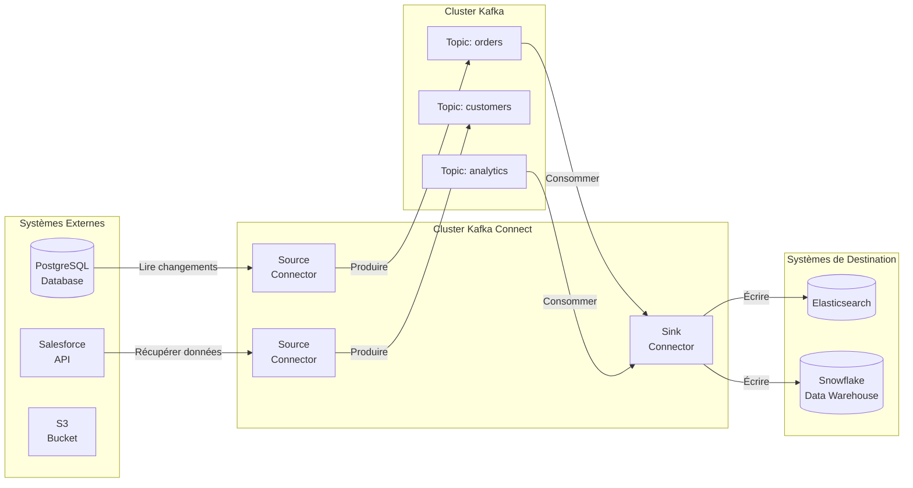

# Intégrer des Systèmes Externes avec Kafka Connect

## Vue d'ensemble

Apprenez à utiliser **Kafka Connect** pour construire des pipelines d'intégration de données entre Apache Kafka et des systèmes externes sans écrire de code personnalisé. Ce guide couvre la configuration des connecteurs, les Single Message Transforms (SMTs), et les meilleures pratiques pour construire des pipelines de données prêts pour la production.

!!! info "Ce que vous allez apprendre" - Comprendre l'architecture de Kafka Connect - Configurer des connecteurs source et sink - Appliquer des transformations avec les SMTs - Déployer et surveiller les connecteurs - Choisir entre auto-géré et géré dans le cloud

## Prérequis

- Docker et Docker Compose installés
- Compréhension de base des [topics et partitions Kafka](../tutorials/kafka-getting-started.md)
- Identifiants du système cible (base de données, API, etc.)

---

## Démarrage Rapide : Exécuter Kafka Connect avec Docker Compose

Utilisez cette configuration Docker Compose pour exécuter Kafka avec **KRaft** et **Kafka Connect** en mode distribué :

```yaml title="docker-compose.yml" linenums="1"
version: "3.8"

services:
  kafka:
    image: confluentinc/cp-kafka:latest # (1)!
    container_name: kafka-kraft
    ports:
      - "9092:9092"
    environment:
      # Paramètres KRaft
      KAFKA_NODE_ID: 1
      KAFKA_PROCESS_ROLES: broker,controller
      KAFKA_LISTENERS: PLAINTEXT://0.0.0.0:9092,CONTROLLER://0.0.0.0:9093
      KAFKA_ADVERTISED_LISTENERS: PLAINTEXT://kafka:9092 # (2)!
      KAFKA_CONTROLLER_LISTENER_NAMES: CONTROLLER
      KAFKA_LISTENER_SECURITY_PROTOCOL_MAP: CONTROLLER:PLAINTEXT,PLAINTEXT:PLAINTEXT
      KAFKA_CONTROLLER_QUORUM_VOTERS: 1@kafka:9093
      CLUSTER_ID: MkU3OEVBNTcwNTJENDM2Qk
      KAFKA_LOG_DIRS: /var/lib/kafka/data

      # Désactiver les métriques Confluent (optionnel pour configuration minimale)
      KAFKA_CONFLUENT_SUPPORT_METRICS_ENABLE: "false" # (3)!
    volumes:
      - kafka-data:/var/lib/kafka/data
    healthcheck:
      test: ["CMD-SHELL", "kafka-broker-api-versions --bootstrap-server localhost:9092"]
      interval: 10s
      timeout: 5s
      retries: 5

  kafka-connect:
    image: confluentinc/cp-kafka-connect:latest # (4)!
    container_name: kafka-connect
    depends_on:
      kafka:
        condition: service_healthy
    ports:
      - "8083:8083" # (5)!
    environment:
      # Paramètres du cluster Connect
      CONNECT_BOOTSTRAP_SERVERS: kafka:9092 # (6)!
      CONNECT_REST_ADVERTISED_HOST_NAME: kafka-connect
      CONNECT_REST_PORT: 8083
      CONNECT_GROUP_ID: kafka-connect-cluster # (7)!

      # Configuration des topics
      CONNECT_CONFIG_STORAGE_TOPIC: _connect-configs # (8)!
      CONNECT_OFFSET_STORAGE_TOPIC: _connect-offsets
      CONNECT_STATUS_STORAGE_TOPIC: _connect-status
      CONNECT_CONFIG_STORAGE_REPLICATION_FACTOR: 1 # (9)!
      CONNECT_OFFSET_STORAGE_REPLICATION_FACTOR: 1
      CONNECT_STATUS_STORAGE_REPLICATION_FACTOR: 1

      # Configuration des convertisseurs
      CONNECT_KEY_CONVERTER: org.apache.kafka.connect.json.JsonConverter # (10)!
      CONNECT_VALUE_CONVERTER: org.apache.kafka.connect.json.JsonConverter
      CONNECT_KEY_CONVERTER_SCHEMAS_ENABLE: "false"
      CONNECT_VALUE_CONVERTER_SCHEMAS_ENABLE: "false"

      # Chemin des plugins pour les connecteurs
      CONNECT_PLUGIN_PATH: /usr/share/java,/usr/share/confluent-hub-components # (11)!

      # Journalisation
      CONNECT_LOG4J_ROOT_LOGLEVEL: INFO
    volumes:
      - connect-plugins:/usr/share/confluent-hub-components
    healthcheck:
      test: ["CMD-SHELL", "curl -f http://localhost:8083/ || exit 1"]
      interval: 10s
      timeout: 5s
      retries: 5

volumes:
  kafka-data:
    driver: local
  connect-plugins:
    driver: local
```

1. Image Confluent Platform Kafka (inclut le mode KRaft)
2. Utiliser le nom de service `kafka` pour la communication interne entre conteneurs
3. Désactiver la collecte de métriques Confluent Support pour une configuration locale minimale
4. L'image Confluent Platform inclut de nombreux connecteurs pré-installés
5. Port de l'API REST Kafka Connect pour gérer les connecteurs
6. Bootstrap servers pointant vers le service Kafka
7. ID de groupe unique pour ce cluster Connect
8. Topics internes pour stocker les configs, offsets et statuts des connecteurs
9. Facteur de réplication 1 pour le développement (utiliser 3+ en production)
10. Convertisseur JSON pour la sérialisation des messages (peut utiliser Avro avec Schema Registry)
11. Chemin des plugins où les JARs des connecteurs sont chargés

### Démarrer Kafka Connect

```bash
# Démarrer les services
docker-compose up -d

# Attendre que les services soient prêts
docker-compose ps

# Vérifier que Kafka Connect fonctionne
curl http://localhost:8083/

# Lister les connecteurs installés
curl http://localhost:8083/connector-plugins | jq

# Arrêter les services
docker-compose down
```

!!! tip "Installer des Connecteurs Supplémentaires"
```bash # Installer un connecteur depuis Confluent Hub (exemple: Elasticsearch Sink)
docker exec kafka-connect confluent-hub install \
 confluentinc/kafka-connect-elasticsearch:latest --no-prompt

    # Redémarrer Connect pour charger le nouveau connecteur
    docker-compose restart kafka-connect
    ```

!!! warning "Considérations de Production"
Ceci est une configuration minimale pour le développement. Pour la production : - Exécuter plusieurs workers Connect (3+) pour la haute disponibilité - Définir le facteur de réplication à 3 pour les topics internes - Activer SSL/SASL pour la communication sécurisée - Utiliser Avro avec Schema Registry pour la sérialisation des données - Surveiller la santé des connecteurs et le lag

## Qu'est-ce que Kafka Connect ?

!!! note "Définition de Kafka Connect"
**Kafka Connect** est le framework d'intégration de Kafka pour le streaming de données entre Kafka et des systèmes externes. Il fournit :

    - **Connecteurs plug-and-play** pour systèmes populaires
    - **Configuration déclarative** (basée sur JSON)
    - **Scaling automatique et tolérance aux pannes**
    - **Aucun code personnalisé requis** pour la plupart des cas d'usage



### Types de Connecteurs

<div class="grid cards" markdown>

- :material-import:{ .lg .middle } **Connecteurs Source**

  ***

  **Objectif :** Importer des données DANS Kafka

  **Exemples :**
  - CDC bases de données (Debezium)
  - Sources fichiers (S3, HDFS)
  - Files de messages (RabbitMQ)
  - APIs (Salesforce, REST)

  **Sortie :** Topics Kafka

- :material-export:{ .lg .middle } **Connecteurs Sink**

  ***

  **Objectif :** Exporter des données DEPUIS Kafka

  **Exemples :**
  - Bases de données (PostgreSQL, MySQL)
  - Moteurs de recherche (Elasticsearch)
  - Entrepôts de données (Snowflake)
  - Stockage objets (S3, GCS)

  **Entrée :** Topics Kafka

</div>

---

## Étape 1 : Configurer Kafka Connect

### Modes de Déploiement

Kafka Connect peut s'exécuter en deux modes :

=== "Mode Standalone"

    !!! warning "Développement Uniquement"
        Le mode standalone exécute un seul processus worker. À utiliser uniquement pour le développement et les tests.

    ```bash title="Démarrer worker standalone" linenums="1"
    # Éditer fichier de config
    vi config/connect-standalone.properties  # (1)!

    # Démarrer worker avec config connecteur
    bin/connect-standalone.sh \
        config/connect-standalone.properties \
        config/connector-config.json  # (2)!
    ```

    1. Configuration worker : bootstrap servers, convertisseurs key/value
    2. Fichier de configuration du connecteur (JSON)

=== "Mode Distribué (Production)"

    !!! success "Recommandé pour la Production"
        Le mode distribué exécute un cluster de workers avec équilibrage de charge automatique et tolérance aux pannes.

    ```bash title="Démarrer worker distribué" linenums="1"
    # Éditer config worker
    vi config/connect-distributed.properties  # (1)!

    # Démarrer chaque nœud worker
    bin/connect-distributed.sh \
        config/connect-distributed.properties  # (2)!

    # Les workers forment automatiquement un cluster
    # Déployer connecteurs via REST API  # (3)!
    ```

    1. Configuration cluster : group.id, topics stockage offsets
    2. Démarrer sur plusieurs machines pour HA
    3. Utiliser REST API (port 8083 par défaut) pour gérer connecteurs

### Configuration Worker

=== "Worker Standalone"

    ```properties title="connect-standalone.properties" linenums="1"
    bootstrap.servers=localhost:9092  # (1)!

    key.converter=org.apache.kafka.connect.json.JsonConverter  # (2)!
    value.converter=org.apache.kafka.connect.json.JsonConverter  # (3)!
    key.converter.schemas.enable=true
    value.converter.schemas.enable=true

    offset.storage.file.filename=/tmp/connect.offsets  # (4)!
    offset.flush.interval.ms=10000
    ```

    1. Adresse cluster Kafka
    2. Comment sérialiser les clés (JSON, Avro, String)
    3. Comment sérialiser les valeurs
    4. Stockage offsets basé fichier (standalone uniquement)

=== "Worker Distribué"

    ```properties title="connect-distributed.properties" linenums="1"
    bootstrap.servers=localhost:9092

    group.id=connect-cluster  # (1)!

    key.converter=org.apache.kafka.connect.json.JsonConverter
    value.converter=org.apache.kafka.connect.json.JsonConverter

    # Topics internes pour coordination
    config.storage.topic=connect-configs  # (2)!
    config.storage.replication.factor=3

    offset.storage.topic=connect-offsets  # (3)!
    offset.storage.replication.factor=3

    status.storage.topic=connect-status  # (4)!
    status.storage.replication.factor=3

    # REST API
    rest.port=8083  # (5)!
    ```

    1. Identifiant unique du cluster - workers avec même ID forment un cluster
    2. Stocke les configurations des connecteurs
    3. Suit les positions des connecteurs source
    4. Stocke les statuts des connecteurs et tâches
    5. Point de terminaison REST API pour gestion connecteurs

---

## Étape 2 : Configurer les Connecteurs Source

Les connecteurs source importent des données DEPUIS des systèmes externes VERS Kafka.

### Exemple : CDC PostgreSQL avec Debezium

!!! tip "Change Data Capture (CDC)"
Les connecteurs CDC capturent les changements de base de données (insertions, mises à jour, suppressions) et les diffusent vers Kafka en temps réel.

```json title="postgres-source-connector.json" linenums="1"
{
  "name": "postgres-source", // (1)!
  "config": {
    "connector.class": "io.debezium.connector.postgresql.PostgresConnector", // (2)!
    "tasks.max": "1", // (3)!

    "database.hostname": "localhost", // (4)!
    "database.port": "5432",
    "database.user": "postgres",
    "database.password": "secret",
    "database.dbname": "orders_db", // (5)!

    "database.server.name": "orders", // (6)!
    "table.include.list": "public.orders,public.customers", // (7)!

    "plugin.name": "pgoutput", // (8)!
    "publication.autocreate.mode": "filtered",

    "key.converter": "org.apache.kafka.connect.json.JsonConverter",
    "value.converter": "org.apache.kafka.connect.json.JsonConverter",

    "transforms": "route", // (9)!
    "transforms.route.type": "org.apache.kafka.connect.transforms.RegexRouter",
    "transforms.route.regex": "([^.]+)\\.([^.]+)\\.([^.]+)",
    "transforms.route.replacement": "$3"
  }
}
```

1. Nom unique du connecteur dans le cluster
2. Nom complet de la classe du connecteur
3. Nombre de tâches parallèles (échelle selon tables/partitions)
4. Détails de connexion base de données
5. Nom de la base de données pour capturer changements
6. Nom logique utilisé dans le nommage des topics
7. Liste blanche tables spécifiques (séparées par virgules)
8. Plugin de décodage logique PostgreSQL
9. Appliquer des transformations (voir section SMTs)

### Déployer le Connecteur

=== "REST API (Distribué)"

    ```bash
    # Créer connecteur
    curl -X POST http://localhost:8083/connectors \  # (1)!
      -H "Content-Type: application/json" \
      -d @postgres-source-connector.json

    # Vérifier statut
    curl http://localhost:8083/connectors/postgres-source/status  # (2)!

    # Lister tous les connecteurs
    curl http://localhost:8083/connectors  # (3)!
    ```

    1. POST config connecteur vers REST API
    2. Vérifier que connecteur est RUNNING
    3. Voir tous les connecteurs déployés

=== "CLI (Standalone)"

    ```bash
    bin/connect-standalone.sh \
        config/connect-standalone.properties \
        postgres-source-connector.json  # (1)!
    ```

    1. Passer config connecteur comme argument ligne de commande

### Connecteurs Source Courants

!!! info "Connecteurs Source Populaires"
| Connecteur | Cas d'Usage | Format Données |
|-----------|----------|-------------|
| **Debezium (PostgreSQL, MySQL)** | CDC base de données | JSON, Avro |
| **JDBC Source** | Interroger tables DB | JSON, Avro |
| **S3 Source** | Lire fichiers depuis S3 | CSV, JSON, Avro |
| **Salesforce** | Récupérer données CRM | JSON |
| **MongoDB** | Capturer change streams | JSON, BSON |
| **Syslog** | Collecter événements log | String, JSON |

---

## Étape 3 : Configurer les Connecteurs Sink

Les connecteurs sink envoient des données DEPUIS Kafka VERS des systèmes externes.

### Exemple : Elasticsearch Sink

```json title="elasticsearch-sink-connector.json" linenums="1"
{
  "name": "elasticsearch-sink",
  "config": {
    "connector.class": "io.confluent.connect.elasticsearch.ElasticsearchSinkConnector", // (1)!
    "tasks.max": "2", // (2)!

    "topics": "orders,customers", // (3)!

    "connection.url": "http://localhost:9200", // (4)!
    "connection.username": "elastic",
    "connection.password": "changeme",

    "type.name": "_doc", // (5)!
    "key.ignore": "false", // (6)!
    "schema.ignore": "false",

    "behavior.on.null.values": "delete", // (7)!
    "behavior.on.malformed.documents": "warn",

    "transforms": "unwrap", // (8)!
    "transforms.unwrap.type": "io.debezium.transforms.ExtractNewRecordState",
    "transforms.unwrap.drop.tombstones": "false"
  }
}
```

1. Classe connecteur sink Elasticsearch
2. Paralléliser entre partitions
3. Liste séparée par virgules des topics à consommer
4. Connexion cluster Elasticsearch
5. Type de document (déprécié dans ES 7+, utiliser "\_doc")
6. Utiliser clé message Kafka comme ID document
7. Supprimer document ES sur valeur null (tombstone)
8. Déballer l'enveloppe CDC Debezium

### Exemple : JDBC Sink (PostgreSQL)

```json title="jdbc-sink-connector.json" linenums="1"
{
  "name": "jdbc-sink",
  "config": {
    "connector.class": "io.confluent.connect.jdbc.JdbcSinkConnector",
    "tasks.max": "1",

    "topics": "orders",

    "connection.url": "jdbc:postgresql://localhost:5432/analytics", // (1)!
    "connection.user": "analytics_user",
    "connection.password": "secret",

    "insert.mode": "upsert", // (2)!
    "pk.mode": "record_key", // (3)!
    "pk.fields": "order_id", // (4)!

    "table.name.format": "orders_from_kafka", // (5)!
    "auto.create": "true", // (6)!
    "auto.evolve": "true" // (7)!
  }
}
```

1. Chaîne de connexion JDBC
2. Mode insertion : insert, upsert, ou update
3. Mode clé primaire : record_key, record_value, ou kafka
4. Champs à utiliser comme clé primaire
5. Pattern nom table cible
6. Auto-créer table si n'existe pas
7. Auto-ajouter colonnes quand schéma change

### Connecteurs Sink Courants

!!! info "Connecteurs Sink Populaires"
| Connecteur | Cas d'Usage | Fonctionnalités |
|-----------|----------|----------|
| **Elasticsearch** | Recherche & analytics | Recherche full-text, indexation temps réel |
| **JDBC Sink** | Bases relationnelles | Support upsert, auto-créer tables |
| **S3 Sink** | Stockage data lake | Partitionnement, compression, formats |
| **Snowflake** | Entrepôt données cloud | Chargement batch, évolution schéma |
| **BigQuery** | Analytics Google | Insertions streaming, partitionnement |
| **MongoDB Sink** | Base de données documents | Upsert, compatibilité change stream |

---

## Étape 4 : Appliquer les Single Message Transforms (SMTs)

!!! tip "Transformations Légères"
Les SMTs effectuent des transformations simples et sans état sur les messages qui transitent par les connecteurs.

    **Utiliser les SMTs pour :**

    - Ajouter/supprimer champs
    - Renommer champs
    - Filtrer messages
    - Masquer données sensibles
    - Router vers différents topics

    **Ne PAS utiliser les SMTs pour :**

    - Opérations avec état (agrégations, jointures)
    - Logique métier complexe
    - Transformations multi-messages

### Exemples SMT Courants

#### 1. Ajouter un Champ (Enrichissement Contexte)

```json
{
  "transforms": "addSource",
  "transforms.addSource.type": "org.apache.kafka.connect.transforms.InsertField$Value", // (1)!
  "transforms.addSource.static.field": "source_system", // (2)!
  "transforms.addSource.static.value": "production_db" // (3)!
}
```

1. Classe SMT pour ajouter champs à la valeur
2. Nom du champ à ajouter
3. Valeur statique à définir

**Résultat :**

```json
// Avant
{"order_id": 123, "amount": 99.99}

// Après
{"order_id": 123, "amount": 99.99, "source_system": "production_db"}
```

#### 2. Masquer Données Sensibles

```json
{
  "transforms": "maskPII",
  "transforms.maskPII.type": "org.apache.kafka.connect.transforms.MaskField$Value",
  "transforms.maskPII.fields": "credit_card,ssn", // (1)!
  "transforms.maskPII.replacement": "****" // (2)!
}
```

1. Champs à masquer
2. Valeur de remplacement

#### 3. Filtrer Messages

```json
{
  "transforms": "filter",
  "transforms.filter.type": "io.confluent.connect.transforms.Filter$Value", // (1)!
  "transforms.filter.filter.condition": "$.status == 'CANCELLED'", // (2)!
  "transforms.filter.filter.type": "exclude" // (3)!
}
```

1. Transform filtre (nécessite licence Confluent ou SMT personnalisé)
2. Condition JSONPath
3. Exclure ou inclure messages correspondants

#### 4. Renommer Champs

```json
{
  "transforms": "rename",
  "transforms.rename.type": "org.apache.kafka.connect.transforms.ReplaceField$Value",
  "transforms.rename.renames": "old_name:new_name,user_id:customer_id" // (1)!
}
```

1. Mappages champs séparés par virgules

#### 5. Router vers Différents Topics

```json
{
  "transforms": "route",
  "transforms.route.type": "org.apache.kafka.connect.transforms.RegexRouter",
  "transforms.route.regex": "(.*)orders(.*)", // (1)!
  "transforms.route.replacement": "$1orders_v2$2" // (2)!
}
```

1. Pattern regex pour matcher nom topic
2. Pattern de remplacement

### Chaîner Plusieurs Transformations

```json
{
  "transforms": "unwrap,addTimestamp,maskPII", // (1)!

  "transforms.unwrap.type": "io.debezium.transforms.ExtractNewRecordState",
  "transforms.unwrap.drop.tombstones": "false",

  "transforms.addTimestamp.type": "org.apache.kafka.connect.transforms.InsertField$Value",
  "transforms.addTimestamp.timestamp.field": "ingestion_time",

  "transforms.maskPII.type": "org.apache.kafka.connect.transforms.MaskField$Value",
  "transforms.maskPII.fields": "ssn,credit_card"
}
```

1. Appliquées dans l'ordre : unwrap → add timestamp → mask PII

---

## Étape 5 : Surveiller et Gérer les Connecteurs

### Cycle de Vie des Connecteurs

=== "Créer"

    ```bash
    curl -X POST http://localhost:8083/connectors \
      -H "Content-Type: application/json" \
      -d @connector-config.json
    ```

=== "Statut"

    ```bash
    curl http://localhost:8083/connectors/my-connector/status

    # Réponse :
    {
      "name": "my-connector",
      "connector": {
        "state": "RUNNING",  // (1)!
        "worker_id": "connect-worker-1:8083"
      },
      "tasks": [
        {
          "id": 0,
          "state": "RUNNING",  // (2)!
          "worker_id": "connect-worker-1:8083"
        }
      ]
    }
    ```

    1. État connecteur : RUNNING, PAUSED, FAILED
    2. État tâche - chaque tâche traite sous-ensemble données

=== "Pause/Reprendre"

    ```bash
    # Mettre en pause connecteur
    curl -X PUT http://localhost:8083/connectors/my-connector/pause  // (1)!

    # Reprendre connecteur
    curl -X PUT http://localhost:8083/connectors/my-connector/resume  // (2)!
    ```

    1. Arrêter traitement sans supprimer configuration
    2. Redémarrer depuis dernier offset committé

=== "Redémarrer"

    ```bash
    # Redémarrer connecteur
    curl -X POST http://localhost:8083/connectors/my-connector/restart

    # Redémarrer tâche spécifique
    curl -X POST http://localhost:8083/connectors/my-connector/tasks/0/restart
    ```

=== "Mettre à Jour"

    ```bash
    # Mettre à jour configuration
    curl -X PUT http://localhost:8083/connectors/my-connector/config \
      -H "Content-Type: application/json" \
      -d @updated-config.json  // (1)!
    ```

    1. Connecteur redémarre automatiquement avec nouvelle config

=== "Supprimer"

    ```bash
    curl -X DELETE http://localhost:8083/connectors/my-connector  // (1)!
    ```

    1. Supprime connecteur et arrête toutes les tâches

### Surveiller les Métriques

!!! info "Métriques Clés à Surveiller"
| Métrique | Description | Action sur Alerte |
|--------|-------------|----------------|
| **État connecteur** | RUNNING, PAUSED, FAILED | Redémarrer si FAILED |
| **État tâche** | Statut tâche individuelle | Vérifier logs, redémarrer tâche |
| **Records traités** | Taux de débit | Augmenter tâches si lent |
| **Compte erreurs** | Nombre messages échoués | Vérifier logs erreurs, corriger config |
| **Lag offset** | Lag connecteur source | Augmenter parallélisme |

### Problèmes Courants

??? bug "Dépannage Connecteurs"
**1. Le Connecteur Ne Démarre Pas**
```bash # Vérifier logs
tail -f logs/connect.log

    # Causes courantes :
    # - Plugin connecteur manquant
    # - Configuration invalide
    # - Connectivité réseau
    ```

    **2. Performance Lente**
    ```json
    {
      "tasks.max": "4"  // Augmenter parallélisme
    }
    ```

    **3. Erreurs Évolution Schéma**
    ```json
    {
      "value.converter.schemas.enable": "false",  // Désactiver schémas
      "auto.evolve": "true"  // Auto-adapter aux changements schéma
    }
    ```

    **4. Corruption Offset**
    ```bash
    # Réinitialiser offsets (consumer group)
    kafka-consumer-groups.sh --bootstrap-server localhost:9092 \
      --group connect-my-connector \
      --reset-offsets --to-earliest --execute --all-topics
    ```

---

## Écosystème des Connecteurs

### Confluent Hub

!!! tip "Dépôt de Connecteurs"
[Confluent Hub](https://www.confluent.io/hub/) fournit plus de 100 connecteurs certifiés.

    **Installer connecteurs :**
    ```bash
    # Installer Confluent Hub CLI
    confluent-hub install confluentinc/kafka-connect-jdbc:10.7.4  // (1)!

    # Lister installés
    confluent-hub list
    ```

    1. Installe connecteur et dépendances

### Auto-géré vs Géré Cloud

<div class="grid cards" markdown>

- :material-server:{ .lg .middle } **Auto-géré**

  ***

  **Avantages :**
  - Contrôle total infrastructure
  - Pas de verrouillage fournisseur
  - Connecteurs personnalisés

  **Inconvénients :**
  - Charge opérationnelle
  - Scaling manuel
  - Gestion sécurité

  **Utiliser quand :** On-premises ou besoin connecteurs personnalisés

- :material-cloud:{ .lg .middle } **Géré Cloud (Confluent Cloud)**

  ***

  **Avantages :**
  - Zéro charge opérationnelle
  - Auto-scaling
  - 80+ connecteurs gérés

  **Inconvénients :**
  - Spécifique fournisseur
  - Personnalisation limitée

  **Utiliser quand :** Préférer services gérés, connecteurs standards

</div>

---

## Meilleures Pratiques

!!! success "Liste de Contrôle Déploiement Production"
**Configuration :**

    - [x] Utiliser mode distribué pour production
    - [x] Définir facteur réplication ≥ 3 pour topics internes
    - [x] Activer authentification et chiffrement
    - [x] Configurer `tasks.max` approprié pour parallélisme

    **Surveillance :**

    - [x] Surveiller états connecteur et tâches
    - [x] Suivre métriques débit et lag
    - [x] Configurer alertes pour état FAILED
    - [x] Logger erreurs vers système centralisé

    **Qualité Données :**

    - [x] Activer validation schéma (Schema Registry)
    - [x] Utiliser SMTs pour vérifications qualité données
    - [x] Gérer évolution schéma gracieusement
    - [x] Tester avec données échantillon d'abord

    **Performance :**

    - [x] Ajuster `batch.size` et `linger.ms`
    - [x] Adapter `tasks.max` selon charge
    - [x] Utiliser compression pour gros messages
    - [x] Surveiller consumer lag

### Meilleures Pratiques SMT

!!! warning "Quand NE PAS Utiliser les SMTs"
Les SMTs sont sans état et mono-record. **Ne PAS utiliser SMTs pour :**

    - Agrégations (utiliser Kafka Streams/Flink)
    - Jointures (utiliser stream processing)
    - Logique métier complexe
    - Enrichissement nécessitant lookups externes

    **À la place :** Streamer données vers Kafka d'abord, puis traiter avec stream processing dédié.

---

## Exemple Complet : Pipeline End-to-End

Voici un pipeline de données complet de PostgreSQL vers Elasticsearch :

```bash title="deploy-pipeline.sh" linenums="1"
#!/bin/bash

# 1. Déployer connecteur source PostgreSQL
curl -X POST http://localhost:8083/connectors \
  -H "Content-Type: application/json" \
  -d '{
    "name": "postgres-orders-source",
    "config": {
      "connector.class": "io.debezium.connector.postgresql.PostgresConnector",
      "tasks.max": "1",
      "database.hostname": "postgres.example.com",
      "database.port": "5432",
      "database.user": "kafka_connect",
      "database.password": "${file:/secrets/db-password.txt:password}",
      "database.dbname": "production",
      "database.server.name": "orders_db",
      "table.include.list": "public.orders",
      "plugin.name": "pgoutput",

      "transforms": "unwrap,addSource",
      "transforms.unwrap.type": "io.debezium.transforms.ExtractNewRecordState",
      "transforms.addSource.type": "org.apache.kafka.connect.transforms.InsertField$Value",
      "transforms.addSource.static.field": "source",
      "transforms.addSource.static.value": "production_postgres"
    }
  }'

# 2. Déployer connecteur sink Elasticsearch
curl -X POST http://localhost:8083/connectors \
  -H "Content-Type: application/json" \
  -d '{
    "name": "elasticsearch-orders-sink",
    "config": {
      "connector.class": "io.confluent.connect.elasticsearch.ElasticsearchSinkConnector",
      "tasks.max": "2",
      "topics": "orders",
      "connection.url": "https://elasticsearch.example.com:9200",
      "connection.username": "kafka_connect",
      "connection.password": "${file:/secrets/es-password.txt:password}",
      "type.name": "_doc",
      "key.ignore": "false",
      "behavior.on.null.values": "delete"
    }
  }'

# 3. Vérifier statut
echo "En attente du démarrage des connecteurs..."
sleep 5

curl http://localhost:8083/connectors/postgres-orders-source/status
curl http://localhost:8083/connectors/elasticsearch-orders-sink/status
```

---

## Prochaines Étapes

!!! tip "Continuez Votre Apprentissage" - [:fontawesome-solid-diagram-project: **Utiliser Schema Registry**](kafka-use-schema-registry.md) - Gérer schémas pour qualité données - [:fontawesome-solid-stream: **Traiter des Streams**](kafka-stream-processing.md) - Transformer données avec Flink ou Kafka Streams - [:fontawesome-solid-paper-plane: **Produire des Messages**](kafka-produce-messages.md) - Écrire producers personnalisés - [:fontawesome-solid-download: **Consommer des Messages**](kafka-consume-messages.md) - Écrire consumers personnalisés

## Ressources Supplémentaires

- [Documentation Kafka Connect](https://kafka.apache.org/documentation/#connect)
- [Cours Kafka Connect 101](https://developer.confluent.io/learn-kafka/kafka-connect/intro/)
- [Confluent Hub - Dépôt Connecteurs](https://www.confluent.io/hub/)
- [Connecteurs CDC Debezium](https://debezium.io/documentation/)
- [Référence Single Message Transforms](https://kafka.apache.org/documentation/#connect_transforms)

---

!!! info "Pratique Hands-On"
Essayez l'[exercice interactif Kafka Connect](https://developer.confluent.io/courses/apache-kafka/exercise-kafka-connect/) de Confluent pour pratiquer le déploiement de connecteurs.
