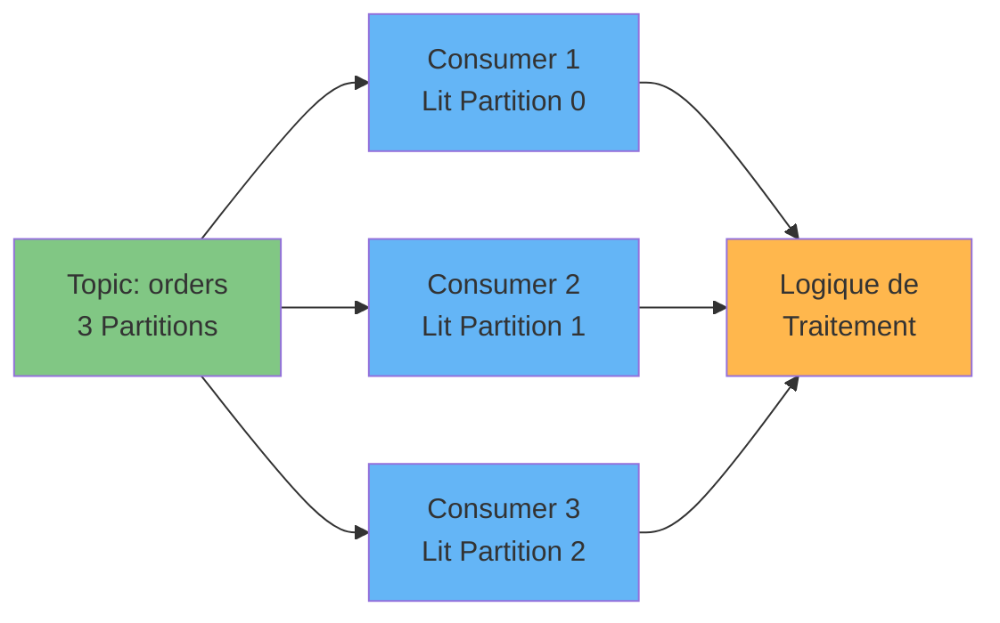
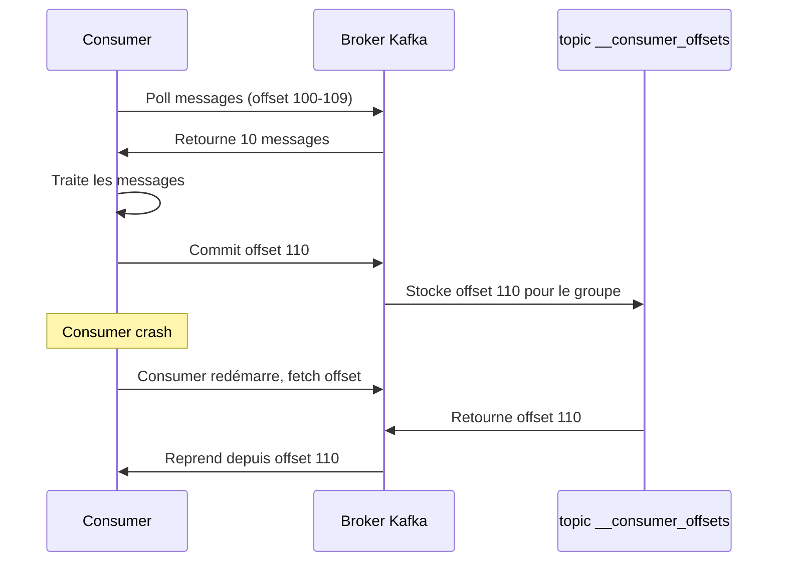
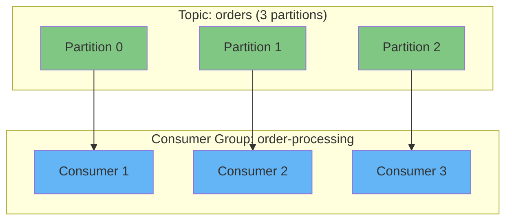
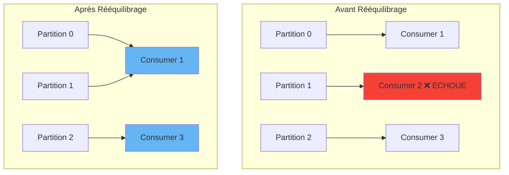

# Consommer des Messages depuis Apache Kafka

## Vue d'ensemble

Apprenez à construire des **applications consumer Kafka** qui lisent et traitent des flux d'événements depuis les topics Kafka. Ce guide couvre la configuration des consumers, la gestion des offsets, les consumer groups pour le traitement parallèle, et les meilleures pratiques pour construire des applications de streaming fiables.

!!! info "Ce que vous allez apprendre" - Configurer et créer des consumers Kafka - S'abonner à des topics et interroger pour des messages - Gérer les offsets des consumers pour la tolérance aux pannes - Mettre à l'échelle avec les consumer groups - Implémenter la gestion d'erreurs et la récupération

## Prérequis

- Docker et Docker Compose installés
- Compréhension de base des [topics et partitions Kafka](../tutorials/kafka-getting-started.md#topics-kafka-logs-dévénements-immuables)
- Environnement de développement avec les bibliothèques client Kafka

---

## Démarrage Rapide : Exécuter Kafka avec Docker Compose

Utilisez cette configuration Docker Compose pour exécuter un cluster Kafka à nœud unique avec **KRaft** (pas besoin de Zookeeper) :

```yaml title="docker-compose.yml" linenums="1"
version: "3.8"

services:
  kafka:
    image: confluentinc/cp-kafka:latest # (1)!
    container_name: kafka-kraft
    ports:
      - "9092:9092" # (2)!
    environment:
      # Paramètres KRaft
      KAFKA_NODE_ID: 1 # (3)!
      KAFKA_PROCESS_ROLES: broker,controller # (4)!
      KAFKA_LISTENERS: PLAINTEXT://0.0.0.0:9092,CONTROLLER://0.0.0.0:9093 # (5)!
      KAFKA_ADVERTISED_LISTENERS: PLAINTEXT://localhost:9092 # (6)!
      KAFKA_CONTROLLER_LISTENER_NAMES: CONTROLLER
      KAFKA_LISTENER_SECURITY_PROTOCOL_MAP: CONTROLLER:PLAINTEXT,PLAINTEXT:PLAINTEXT
      KAFKA_CONTROLLER_QUORUM_VOTERS: 1@localhost:9093 # (7)!

      # ID du cluster (générer avec: kafka-storage random-uuid)
      CLUSTER_ID: MkU3OEVBNTcwNTJENDM2Qk # (8)!

      # Stockage
      KAFKA_LOG_DIRS: /var/lib/kafka/data # (9)!

      # Désactiver les métriques Confluent (optionnel pour configuration minimale)
      KAFKA_CONFLUENT_SUPPORT_METRICS_ENABLE: "false" # (10)!
    volumes:
      - kafka-data:/var/lib/kafka/data
    healthcheck:
      test: ["CMD-SHELL", "kafka-broker-api-versions --bootstrap-server localhost:9092"]
      interval: 10s
      timeout: 5s
      retries: 5

volumes:
  kafka-data:
    driver: local
```

1. Image Confluent Platform Kafka (inclut le mode KRaft)
2. Port du broker Kafka exposé à l'hôte
3. ID de nœud unique dans le cluster KRaft
4. Ce nœud agit à la fois comme broker et controller (mode combiné)
5. Listeners : PLAINTEXT pour les clients, CONTROLLER pour la communication interne du cluster
6. Listener annoncé pour les clients externes
7. Votants du quorum pour le consensus KRaft (format : `id@host:port`)
8. ID de cluster unique - générer avec `docker run confluentinc/cp-kafka kafka-storage random-uuid`
9. Répertoire de logs pour le stockage des données Kafka
10. Désactiver la collecte de métriques Confluent Support pour une configuration locale minimale

### Démarrer Kafka

```bash
# Démarrer Kafka
docker-compose up -d

# Attendre que Kafka soit prêt
docker-compose ps

# Créer un topic avec quelques données de test
docker exec kafka-kraft kafka-topics \
  --bootstrap-server localhost:9092 \
  --create --topic orders --partitions 3 --replication-factor 1

# Produire des messages de test
docker exec -i kafka-kraft kafka-console-producer \
  --bootstrap-server localhost:9092 \
  --topic orders << EOF
{"order_id": "ORD-001", "amount": 99.99}
{"order_id": "ORD-002", "amount": 149.50}
{"order_id": "ORD-003", "amount": 75.25}
EOF

# Arrêter Kafka
docker-compose down
```

!!! tip "Vérifier les Messages"
`bash
    # Consommer les messages depuis le début
    docker exec kafka-kraft kafka-console-consumer \
      --bootstrap-server localhost:9092 \
      --topic orders --from-beginning --max-messages 3
    `

## Fondamentaux des Consumers

### Qu'est-ce qu'un Consumer Kafka ?

!!! note "Définition du Consumer"
Un **consumer** est une application client qui lit des données depuis les topics Kafka. Les consumers :

    - Récupèrent les messages d'un ou plusieurs topics
    - Traitent les événements en temps réel ou quasi-temps réel
    - Suivent leur position de lecture avec les offsets
    - Peuvent évoluer horizontalement avec les consumer groups



---

## Étape 1 : Configurer Votre Consumer

### Configuration Requise

Tous les consumers ont besoin d'une configuration de base pour se connecter au cluster Kafka :

=== ":simple-openjdk: Java"

    ```java title="ConsumerConfig.java" linenums="1"
    import org.apache.kafka.clients.consumer.*;
    import org.apache.kafka.common.serialization.StringDeserializer;
    import java.util.Properties;

    Properties props = new Properties();
    props.put("bootstrap.servers", "localhost:9092");           // (1)!
    props.put("group.id", "order-processing-service");          // (2)!
    props.put("key.deserializer", StringDeserializer.class);    // (3)!
    props.put("value.deserializer", StringDeserializer.class);  // (4)!
    props.put("auto.offset.reset", "earliest");                 // (5)!
    ```

    1. Adresses des brokers Kafka - spécifier plusieurs pour la redondance
    2. ID du consumer group - les consumers avec le même ID partagent la charge des partitions
    3. Désérialiseur pour les clés des messages - convertit les bytes en objets
    4. Désérialiseur pour les valeurs des messages - doit correspondre au sérialiseur du producer
    5. Où commencer la lecture si aucun offset n'existe : `earliest` ou `latest`

=== ":simple-python: Python"

    ```python title="consumer_config.py" linenums="1"
    from kafka import KafkaConsumer

    consumer = KafkaConsumer(
        bootstrap_servers='localhost:9092',        # (1)!
        group_id='order-processing-service',       # (2)!
        key_deserializer=lambda k: k.decode('utf-8'),   # (3)!
        value_deserializer=lambda v: v.decode('utf-8'), # (4)!
        auto_offset_reset='earliest'               # (5)!
    )
    ```

    1. Adresses des brokers Kafka - peut être une liste pour plusieurs brokers
    2. ID du consumer group - permet l'équilibrage de charge entre consumers
    3. Désérialiser les clés de bytes vers string
    4. Désérialiser les valeurs de bytes vers string
    5. Lire depuis le début si pas d'offset précédent

=== ":simple-nodedotjs: Node.js"

    ```javascript title="consumerConfig.js" linenums="1"
    const { Kafka } = require('kafkajs');

    const kafka = new Kafka({
      clientId: 'order-processing-service',
      brokers: ['localhost:9092']              // (1)!
    });

    const consumer = kafka.consumer({
      groupId: 'order-processing-service'      // (2)!
    });

    // Auto-désérialisation en string par défaut
    // Configurer dans la boucle de consommation si nécessaire  // (3)!
    ```

    1. Tableau d'adresses de brokers pour la connexion au cluster
    2. ID du consumer group pour la consommation coordonnée
    3. KafkaJS gère automatiquement la désérialisation pour les strings

=== ":simple-go: Go"

    ```go title="consumer_config.go" linenums="1"
    package main

    import (
        "github.com/confluentinc/confluent-kafka-go/kafka"
    )

    config := &kafka.ConfigMap{
        "bootstrap.servers": "localhost:9092",          // (1)!
        "group.id":          "order-processing-service", // (2)!
        "auto.offset.reset": "earliest",                 // (3)!
    }

    consumer, err := kafka.NewConsumer(config)
    if err != nil {
        panic(err)
    }
    defer consumer.Close()
    ```

    1. Adresses des brokers du cluster Kafka
    2. Identifiant du consumer group
    3. Stratégie de réinitialisation d'offset pour nouveaux consumers

### Configuration Optionnelle

!!! tip "Optimisation des Performances"
Considérez ces paramètres optionnels pour la production :

    | Paramètre | Description | Défaut | Recommandation |
    |-----------|-------------|---------|----------------|
    | `fetch.min.bytes` | Données minimales par requête fetch | 1 | Augmenter pour le débit |
    | `fetch.max.wait.ms` | Temps d'attente max si min bytes non atteint | 500ms | Équilibrer latence vs débit |
    | `max.poll.records` | Records max par poll | 500 | Ajuster selon temps de traitement |
    | `enable.auto.commit` | Auto-commit des offsets | `true` | `false` pour contrôle manuel |
    | `session.timeout.ms` | Timeout heartbeat du consumer | 10s | Augmenter pour traitement lent |

---

## Étape 2 : S'abonner aux Topics

### Abonnement à un Topic Unique

=== ":simple-openjdk: Java"

    ```java
    KafkaConsumer<String, String> consumer = new KafkaConsumer<>(props);

    // S'abonner à un topic unique
    consumer.subscribe(Collections.singletonList("orders"));  // (1)!
    ```

    1. Passer une liste même pour un seul topic - l'API attend une Collection

=== ":simple-python: Python"

    ```python
    # S'abonner à un topic unique
    consumer.subscribe(['orders'])  // (1)!
    ```

    1. Notation liste même pour un seul topic

=== ":simple-nodedotjs: Node.js"

    ```javascript
    await consumer.connect();  // (1)!
    await consumer.subscribe({
      topic: 'orders',         // (2)!
      fromBeginning: true      // (3)!
    });
    ```

    1. Se connecter explicitement avant de s'abonner
    2. Topic unique en tant que string
    3. Équivalent à `auto.offset.reset=earliest`

=== ":simple-go: Go"

    ```go
    err := consumer.SubscribeTopics([]string{"orders"}, nil)  // (1)!
    if err != nil {
        panic(err)
    }
    ```

    1. S'abonner aux topics par nom

### Topics Multiples

=== ":simple-openjdk: Java"

    ```java
    consumer.subscribe(Arrays.asList("orders", "payments", "shipments"));
    ```

=== ":simple-python: Python"

    ```python
    consumer.subscribe(['orders', 'payments', 'shipments'])
    ```

=== ":simple-nodedotjs: Node.js"

    ```javascript
    await consumer.subscribe({ topics: ['orders', 'payments', 'shipments'] });
    ```

=== ":simple-go: Go"

    ```go
    consumer.SubscribeTopics([]string{"orders", "payments", "shipments"}, nil)
    ```

### Abonnement Basé sur Pattern

!!! warning "Fonctionnalité Avancée"
S'abonner aux topics correspondant à un pattern regex - utile pour la création dynamique de topics mais nécessite une gestion attentive.

=== ":simple-openjdk: Java"

    ```java
    import java.util.regex.Pattern;

    consumer.subscribe(Pattern.compile("order-.*"));  // (1)!
    ```

    1. Correspond à tous les topics commençant par "order-"

=== ":simple-python: Python"

    ```python
    import re

    consumer.subscribe(pattern=re.compile(r'order-.*'))  // (1)!
    ```

    1. Pattern regex Python pour abonnement dynamique

---

## Étape 3 : Interroger pour des Messages

### La Boucle de Poll

!!! info "Polling Infini"
Les applications de streaming s'exécutent indéfiniment, interrogeant continuellement pour de nouveaux messages. C'est le comportement normal pour les systèmes événementiels.

=== ":simple-openjdk: Java"

    ```java title="ConsumerLoop.java" linenums="1" hl_lines="5-6"
    try {
        while (true) {  // (1)!
            ConsumerRecords<String, String> records =
                consumer.poll(Duration.ofMillis(100));  // (2)!

            for (ConsumerRecord<String, String> record : records) {  // (3)!
                System.out.printf(
                    "Topic=%s Partition=%d Offset=%d Key=%s Value=%s%n",
                    record.topic(),      // (4)!
                    record.partition(),  // (5)!
                    record.offset(),     // (6)!
                    record.key(),        // (7)!
                    record.value()       // (8)!
                );

                // Traitez votre message ici
                processOrder(record.value());
            }
        }
    } finally {
        consumer.close();  // (9)!
    }
    ```

    1. Boucle infinie - normal pour applications de streaming
    2. Poll avec timeout - retourne immédiatement si messages disponibles
    3. Itérer sur le batch de records retournés
    4. De quel topic provient ce message
    5. Numéro de partition (indexé à 0)
    6. Position offset dans la partition
    7. Clé du message (peut être null)
    8. Valeur du message - vos données réelles
    9. Arrêt propre à la sortie de l'application

=== ":simple-python: Python"

    ```python title="consumer_loop.py" linenums="1"
    try:
        for message in consumer:  // (1)!
            print(f"Topic={message.topic} "
                  f"Partition={message.partition} "
                  f"Offset={message.offset} "
                  f"Key={message.key} "
                  f"Value={message.value}")

            # Traitez votre message ici
            process_order(message.value)  // (2)!

    finally:
        consumer.close()  // (3)!
    ```

    1. Pattern itérateur Python - plus propre que while loop
    2. Votre logique métier ici
    3. Arrêt gracieux

=== ":simple-nodedotjs: Node.js"

    ```javascript title="consumerLoop.js" linenums="1"
    await consumer.run({  // (1)!
      eachMessage: async ({ topic, partition, message }) => {  // (2)!
        console.log({
          topic,
          partition,
          offset: message.offset,
          key: message.key?.toString(),      // (3)!
          value: message.value.toString(),   // (4)!
        });

        // Traitez votre message ici
        await processOrder(message.value.toString());  // (5)!
      },
    });
    ```

    1. Consommation async avec batching automatique
    2. Callback par message
    3. Chaînage optionnel - key peut être null
    4. Convertir Buffer en string
    5. Traitement async supporté

=== ":simple-go: Go"

    ```go title="consumer_loop.go" linenums="1"
    for {  // (1)!
        msg, err := consumer.ReadMessage(-1)  // (2)!
        if err != nil {
            fmt.Printf("Consumer error: %v\n", err)
            continue
        }

        fmt.Printf("Topic=%s Partition=%d Offset=%d Key=%s Value=%s\n",
            *msg.TopicPartition.Topic,
            msg.TopicPartition.Partition,
            msg.TopicPartition.Offset,
            string(msg.Key),
            string(msg.Value))

        // Traitez votre message ici
        processOrder(string(msg.Value))  // (3)!
    }
    ```

    1. Boucle infinie pour polling continu
    2. Lecture bloquante avec timeout -1 (attendre indéfiniment)
    3. Votre logique de traitement

---

## Étape 4 : Gérer les Offsets des Consumers

### Comprendre les Offsets

!!! note "Suivi des Offsets"
Kafka suit l'**offset** (position) de chaque message qu'un consumer a traité. Cela permet :

    - **Tolérance aux pannes** : Reprendre depuis la dernière position après un crash
    - **Sémantique exactly-once** : Éviter de retraiter les messages
    - **Rejouabilité** : Revenir à un offset antérieur si nécessaire



### Auto vs Commit Manuel

<div class="grid cards" markdown>

- :material-check-circle:{ .lg .middle } **Auto-Commit (Défaut)**

  ***

  **Avantages :**
  - Simple - aucun code nécessaire
  - Commits périodiques automatiques

  **Inconvénients :**
  - Risque de traitement dupliqué
  - Aucun contrôle sur le timing

  ```java
  props.put("enable.auto.commit", "true");
  props.put("auto.commit.interval.ms", "5000");
  ```

- :material-hand-pointing-right:{ .lg .middle } **Commit Manuel (Recommandé)**

  ***

  **Avantages :**
  - Contrôle précis
  - Garantie at-least-once
  - Commit après traitement réussi

  **Inconvénients :**
  - Complexité de code accrue
  - Doit être géré explicitement

  ```java
  props.put("enable.auto.commit", "false");
  consumer.commitSync();  // ou commitAsync()
  ```

</div>

### Exemples de Commit Manuel

=== ":simple-openjdk: Java"

    ```java
    props.put("enable.auto.commit", "false");  // (1)!

    while (true) {
        ConsumerRecords<String, String> records = consumer.poll(Duration.ofMillis(100));

        for (ConsumerRecord<String, String> record : records) {
            try {
                processOrder(record.value());

                // Commit après traitement réussi
                consumer.commitSync();  // (2)!
            } catch (Exception e) {
                // Gérer l'erreur - ne pas commiter en cas d'échec
                log.error("Processing failed", e);  // (3)!
            }
        }
    }
    ```

    1. Désactiver auto-commit pour contrôle manuel
    2. Commit synchrone - bloque jusqu'à acknowledgement
    3. Messages échoués n'auront pas leurs offsets commités

=== ":simple-python: Python"

    ```python
    consumer = KafkaConsumer(
        'orders',
        enable_auto_commit=False  // (1)!
    )

    for message in consumer:
        try:
            process_order(message.value)
            consumer.commit()  // (2)!
        except Exception as e:
            print(f"Error processing: {e}")  // (3)!
            # Ne pas commiter - réessayera au redémarrage
    ```

    1. Mode commit manuel
    2. Commit après traitement réussi
    3. Ignorer le commit en cas d'erreur pour retry

=== ":simple-nodedotjs: Node.js"

    ```javascript
    await consumer.run({
      autoCommit: false,  // (1)!
      eachMessage: async ({ message, heartbeat, pause }) => {
        try {
          await processOrder(message.value.toString());
          await consumer.commitOffsets([{  // (2)!
            topic: 'orders',
            partition: message.partition,
            offset: (parseInt(message.offset) + 1).toString()
          }]);
        } catch (error) {
          console.error('Processing failed:', error);
          pause();  // (3)!
          setTimeout(() => consumer.resume([{ topic: 'orders' }]), 5000);
        }
      }
    });
    ```

    1. Désactiver auto-commit
    2. Commit manuel d'offset après succès
    3. Pause et retry en cas d'erreur

=== ":simple-go: Go"

    ```go
    config := &kafka.ConfigMap{
        "enable.auto.commit": false,  // (1)!
    }

    for {
        msg, err := consumer.ReadMessage(-1)
        if err != nil {
            continue
        }

        if err := processOrder(string(msg.Value)); err == nil {
            _, err := consumer.CommitMessage(msg)  // (2)!
            if err != nil {
                log.Printf("Commit failed: %v\n", err)
            }
        } else {
            log.Printf("Processing failed: %v\n", err)  // (3)!
        }
    }
    ```

    1. Mode commit manuel
    2. Commiter le message spécifique après traitement
    3. Ne pas commiter en cas d'échec

---

## Étape 5 : Mettre à l'Échelle avec les Consumer Groups

### Concepts des Consumer Groups

!!! tip "Mise à l'Échelle Horizontale"
Les consumer groups permettent le **traitement parallèle** en distribuant les partitions entre plusieurs instances de consumers.

    **Règles Clés :**

    - Les consumers dans le même groupe partagent la charge des partitions
    - Chaque partition est assignée à **un seul** consumer du groupe
    - Plusieurs groupes peuvent lire le même topic indépendamment



### Rééquilibrage

!!! warning "Rééquilibrage Automatique"
Quand des consumers rejoignent ou quittent un groupe, Kafka **rééquilibre** automatiquement les assignations de partitions.

    **Déclencheurs :**

    - Un nouveau consumer rejoint le groupe
    - Un consumer existant échoue/s'arrête
    - Le nombre de partitions du topic change

    **Pendant le rééquilibrage :**

    - Courte pause de traitement (habituellement < 1 seconde)
    - Partitions réassignées aux consumers disponibles



### Directives de Mise à l'Échelle

!!! info "Nombre Optimal de Consumers"
| Scénario | Recommandation |
|----------|----------------|
| **Partitions = Consumers** | Idéal - parallélisme complet |
| **Partitions > Consumers** | OK - certains consumers gèrent plusieurs partitions |
| **Consumers > Partitions** | Gaspillage - consumers inactifs restent inutilisés |

**Exemple :**

- Topic avec 6 partitions → Déployer 6 consumers pour débit maximum
- Topic avec 3 partitions → Ne pas déployer plus de 3 consumers

---

## Gestion d'Erreurs et Meilleures Pratiques

### Gérer les Échecs de Traitement

??? bug "Scénarios d'Échec Courants"
**1. Erreurs Réseau Transitoires**
```java
int maxRetries = 3;
int retryCount = 0;

    while (retryCount < maxRetries) {
        try {
            processOrder(record.value());
            consumer.commitSync();
            break;  // Succès
        } catch (TransientException e) {
            retryCount++;
            Thread.sleep(1000 * retryCount);  // Backoff exponentiel
        }
    }
    ```

    **2. Poison Pills (Messages Corrompus)**
    ```java
    try {
        processOrder(record.value());
    } catch (DeserializationException e) {
        // Envoyer vers dead letter queue
        producer.send(new ProducerRecord<>("orders-dlq", record.value()));
        consumer.commitSync();  // Ignorer le mauvais message
    }
    ```

    **3. Service Downstream Indisponible**
    ```java
    try {
        sendToDatabase(record.value());
    } catch (DatabaseException e) {
        consumer.pause(Collections.singleton(
            new TopicPartition(record.topic(), record.partition())
        ));
        // Réessayer après délai
        scheduleRetry();
    }
    ```

### Liste de Contrôle des Meilleures Pratiques

!!! success "Consumers Prêts pour la Production" - [x] Utiliser les commits d'offset manuels pour données critiques - [x] Implémenter un traitement idempotent (gérer les duplicatas) - [x] Définir un `session.timeout.ms` approprié pour votre charge de travail - [x] Surveiller les métriques de lag des consumers - [x] Gérer les rééquilibrages gracieusement - [x] Utiliser des dead letter queues pour poison pills - [x] Implémenter des hooks d'arrêt appropriés - [x] Logger les offsets et métadonnées de traitement

### Arrêt Gracieux

=== ":simple-openjdk: Java"

    ```java
    final KafkaConsumer<String, String> consumer = new KafkaConsumer<>(props);

    Runtime.getRuntime().addShutdownHook(new Thread(() -> {  // (1)!
        System.out.println("Shutting down gracefully...");
        consumer.wakeup();  // (2)!
    }));

    try {
        consumer.subscribe(Collections.singletonList("orders"));
        while (true) {
            ConsumerRecords<String, String> records = consumer.poll(Duration.ofMillis(100));
            // Traiter les records...
        }
    } catch (WakeupException e) {
        // Attendu pendant l'arrêt  // (3)!
    } finally {
        consumer.close();  // (4)!
        System.out.println("Consumer closed");
    }
    ```

    1. Enregistrer shutdown hook pour SIGTERM/SIGINT
    2. Interrompre poll() pour déclencher sortie propre
    3. WakeupException signale arrêt gracieux
    4. Fermer consumer pour commiter offsets finaux

=== ":simple-python: Python"

    ```python
    import signal
    import sys

    def shutdown(signum, frame):  // (1)!
        print("Shutting down gracefully...")
        consumer.close()  // (2)!
        sys.exit(0)

    signal.signal(signal.SIGINT, shutdown)   # Ctrl+C
    signal.signal(signal.SIGTERM, shutdown)  # Docker stop

    try:
        for message in consumer:
            process_order(message.value)
    except KeyboardInterrupt:
        pass
    finally:
        consumer.close()  // (3)!
    ```

    1. Gestionnaire de signal pour arrêt gracieux
    2. Fermer consumer commite les offsets
    3. Assurer le nettoyage dans bloc finally

---

## Exemple Complet : Service de Traitement de Commandes

Voici un exemple de consumer prêt pour la production :

=== ":simple-openjdk: Java"

    ```java title="OrderConsumerService.java" linenums="1"
    import org.apache.kafka.clients.consumer.*;
    import java.time.Duration;
    import java.util.*;

    public class OrderConsumerService {
        private final KafkaConsumer<String, String> consumer;
        private volatile boolean running = true;

        public OrderConsumerService(Properties config) {
            this.consumer = new KafkaConsumer<>(config);
        }

        public void start() {
            Runtime.getRuntime().addShutdownHook(new Thread(this::shutdown));

            consumer.subscribe(Collections.singletonList("orders"));
            System.out.println("Consumer started, waiting for messages...");

            try {
                while (running) {
                    ConsumerRecords<String, String> records =
                        consumer.poll(Duration.ofMillis(100));

                    for (ConsumerRecord<String, String> record : records) {
                        processRecord(record);
                    }

                    // Commit après le batch
                    consumer.commitSync();
                }
            } catch (WakeupException e) {
                // Attendu pendant l'arrêt
            } catch (Exception e) {
                System.err.println("Consumer error: " + e.getMessage());
            } finally {
                consumer.close();
                System.out.println("Consumer closed");
            }
        }

        private void processRecord(ConsumerRecord<String, String> record) {
            try {
                System.out.printf("Processing order: %s = %s%n",
                    record.key(), record.value());

                // Votre logique métier ici
                // ex : parser JSON, valider, stocker en base de données

            } catch (Exception e) {
                System.err.println("Failed to process record: " + e.getMessage());
                // Envoyer vers DLQ ou implémenter logique de retry
            }
        }

        private void shutdown() {
            System.out.println("Shutdown signal received");
            running = false;
            consumer.wakeup();
        }

        public static void main(String[] args) {
            Properties props = new Properties();
            props.put("bootstrap.servers", "localhost:9092");
            props.put("group.id", "order-processing-service");
            props.put("key.deserializer", "org.apache.kafka.common.serialization.StringDeserializer");
            props.put("value.deserializer", "org.apache.kafka.common.serialization.StringDeserializer");
            props.put("enable.auto.commit", "false");
            props.put("auto.offset.reset", "earliest");

            OrderConsumerService service = new OrderConsumerService(props);
            service.start();
        }
    }
    ```

=== ":simple-python: Python"

    ```python title="order_consumer_service.py" linenums="1"
    from kafka import KafkaConsumer
    import signal
    import sys
    import json

    class OrderConsumerService:
        def __init__(self, config):
            self.consumer = KafkaConsumer(
                'orders',
                **config,
                value_deserializer=lambda m: json.loads(m.decode('utf-8'))
            )
            self.running = True

        def start(self):
            signal.signal(signal.SIGINT, self._shutdown)
            signal.signal(signal.SIGTERM, self._shutdown)

            print("Consumer started, waiting for messages...")

            try:
                for message in self.consumer:
                    if not self.running:
                        break
                    self._process_message(message)
                    self.consumer.commit()
            except Exception as e:
                print(f"Consumer error: {e}")
            finally:
                self.consumer.close()
                print("Consumer closed")

        def _process_message(self, message):
            try:
                order = message.value
                print(f"Processing order: {message.key} = {order}")

                # Votre logique métier ici
                # ex : valider commande, mettre à jour inventaire, envoyer notification

            except Exception as e:
                print(f"Failed to process message: {e}")
                # Envoyer vers DLQ ou implémenter logique de retry

        def _shutdown(self, signum, frame):
            print("Shutdown signal received")
            self.running = False

    if __name__ == "__main__":
        config = {
            'bootstrap_servers': 'localhost:9092',
            'group_id': 'order-processing-service',
            'enable_auto_commit': False,
            'auto_offset_reset': 'earliest'
        }

        service = OrderConsumerService(config)
        service.start()
    ```

---

## Prochaines Étapes

!!! tip "Continuez Votre Apprentissage" - [:fontawesome-solid-diagram-project: **Utiliser Schema Registry**](kafka-use-schema-registry.md) - Gérer les schémas de données pour la sécurité des types - [:fontawesome-solid-link: **Connecter des Systèmes Externes**](kafka-connect-systems.md) - Intégrer Kafka avec des bases de données - [:fontawesome-solid-stream: **Traiter des Streams**](kafka-stream-processing.md) - Transformer des données en temps réel - [:fontawesome-solid-book: **Retour au Tutoriel**](../tutorials/kafka-getting-started.md) - Réviser les concepts fondamentaux

## Ressources Supplémentaires

### Documentation Officielle

- [Documentation API Apache Kafka Consumer](https://kafka.apache.org/documentation/#consumerapi)
- [Référence Configuration Kafka Consumer](https://kafka.apache.org/documentation/#consumerconfigs)
- [Protocole Consumer Group - Détails Internes](https://kafka.apache.org/documentation/#impl_consumerRebalance)
- [Guide Configuration Consumer Confluent](https://docs.confluent.io/platform/current/installation/configuration/consumer-configs.html)

### Tutoriels & Cours

- [Cours Kafka Consumer 101](https://developer.confluent.io/learn-kafka/apache-kafka/consumers/) - Cours gratuit Confluent
- [Exercice Interactif Kafka Consumer](https://developer.confluent.io/courses/apache-kafka/exercise-kafka-consumers/)
- [Meilleures Pratiques Consumer](https://www.confluent.io/blog/kafka-consumer-best-practices/)

### Sujets Avancés

- [Optimisation Performance Consumer](https://docs.confluent.io/platform/current/kafka/deployment.html#consumer-performance-tuning)
- [Rééquilibrage Consumer Group - Analyse Approfondie](https://www.confluent.io/blog/cooperative-rebalancing-in-kafka-streams-consumer-ksqldb/)
- [Stratégies de Gestion des Offsets](https://www.confluent.io/blog/guide-to-apache-kafka-offsets/)

---

!!! info "Attribution du Cours"
Ce guide est basé sur le contenu du [cours Apache Kafka 101](https://developer.confluent.io/courses/apache-kafka/consumers/) de Confluent et la documentation officielle Apache Kafka.
