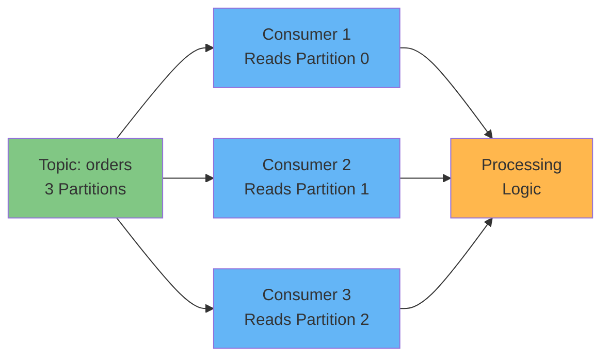
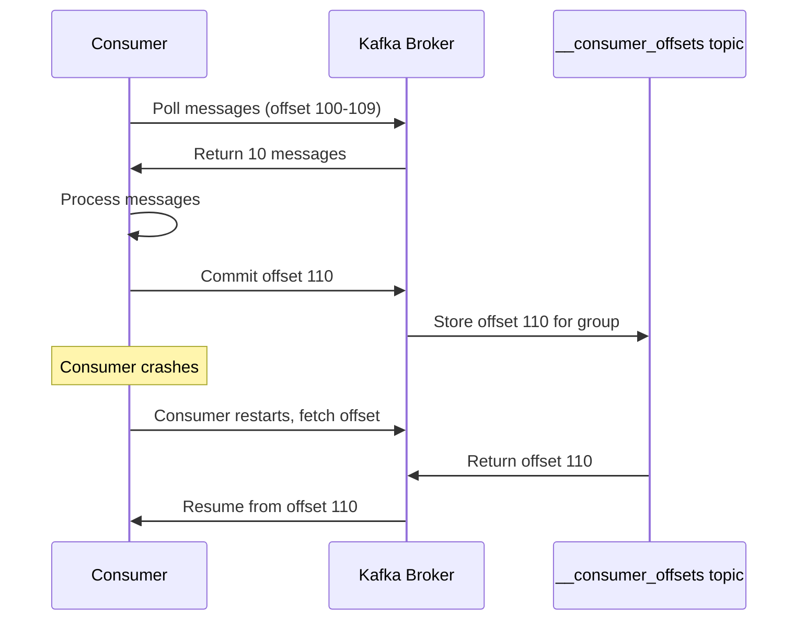
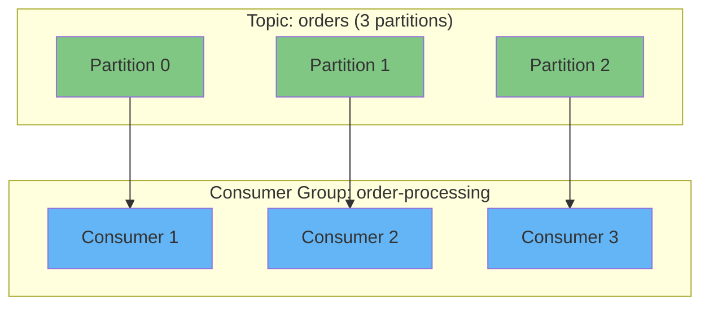
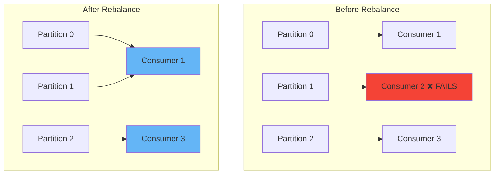

# Consuming Messages from Apache Kafka

## Overview

Learn how to build **Kafka consumer applications** that read and process event streams from Kafka topics. This guide covers consumer configuration, offset management, consumer groups for parallel processing, and best practices for building reliable streaming applications.

!!! info "What You'll Learn" - Configure and create Kafka consumers - Subscribe to topics and poll for messages - Manage consumer offsets for fault tolerance - Scale with consumer groups - Implement error handling and recovery

## Prerequisites

- Docker and Docker Compose installed
- Basic understanding of [Kafka topics and partitions](../tutorials/kafka-getting-started.md#topics-kafka-logs-dévénements-immuables)
- Development environment with Kafka client libraries

---

## Quick Start: Run Kafka with Docker Compose

Use this Docker Compose configuration to run a single-node Kafka cluster with **KRaft** (no Zookeeper needed):

```yaml title="docker-compose.yml" linenums="1"
version: "3.8"

services:
  kafka:
    image: confluentinc/cp-kafka:latest # (1)!
    container_name: kafka-kraft
    ports:
      - "9092:9092" # (2)!
    environment:
      # KRaft settings
      KAFKA_NODE_ID: 1 # (3)!
      KAFKA_PROCESS_ROLES: broker,controller # (4)!
      KAFKA_LISTENERS: PLAINTEXT://0.0.0.0:9092,CONTROLLER://0.0.0.0:9093 # (5)!
      KAFKA_ADVERTISED_LISTENERS: PLAINTEXT://localhost:9092 # (6)!
      KAFKA_CONTROLLER_LISTENER_NAMES: CONTROLLER
      KAFKA_LISTENER_SECURITY_PROTOCOL_MAP: CONTROLLER:PLAINTEXT,PLAINTEXT:PLAINTEXT
      KAFKA_CONTROLLER_QUORUM_VOTERS: 1@localhost:9093 # (7)!

      # Cluster ID (generate with: kafka-storage random-uuid)
      CLUSTER_ID: MkU3OEVBNTcwNTJENDM2Qk # (8)!

      # Storage
      KAFKA_LOG_DIRS: /var/lib/kafka/data # (9)!

      # Disable Confluent metrics (optional for minimal setup)
      KAFKA_CONFLUENT_SUPPORT_METRICS_ENABLE: "false" # (10)!
    volumes:
      - kafka-data:/var/lib/kafka/data
    healthcheck:
      test: ["CMD-SHELL", "kafka-broker-api-versions --bootstrap-server localhost:9092"]
      interval: 10s
      timeout: 5s
      retries: 5

volumes:
  kafka-data:
    driver: local
```

1. Confluent Platform Kafka image (includes KRaft mode)
2. Kafka broker port exposed to host
3. Unique node ID in the KRaft cluster
4. This node acts as both broker and controller (combined mode)
5. Listeners: PLAINTEXT for clients, CONTROLLER for internal cluster communication
6. Advertised listener for external clients
7. Quorum voters for KRaft consensus (format: `id@host:port`)
8. Unique cluster ID - generate with `docker run confluentinc/cp-kafka kafka-storage random-uuid`
9. Log directory for Kafka data storage
10. Disable Confluent Support metrics collection for minimal local setup

### Start Kafka

```bash
# Start Kafka
docker-compose up -d

# Wait for Kafka to be ready
docker-compose ps

# Create a topic with some test data
docker exec kafka-kraft kafka-topics \
  --bootstrap-server localhost:9092 \
  --create --topic orders --partitions 3 --replication-factor 1

# Produce test messages
docker exec -i kafka-kraft kafka-console-producer \
  --bootstrap-server localhost:9092 \
  --topic orders << EOF
{"order_id": "ORD-001", "amount": 99.99}
{"order_id": "ORD-002", "amount": 149.50}
{"order_id": "ORD-003", "amount": 75.25}
EOF

# Stop Kafka
docker-compose down
```

!!! tip "Verify Messages"
`bash
    # Consume messages from beginning
    docker exec kafka-kraft kafka-console-consumer \
      --bootstrap-server localhost:9092 \
      --topic orders --from-beginning --max-messages 3
    `

## Consumer Fundamentals

### What is a Kafka Consumer?

!!! note "Consumer Definition"
A **consumer** is a client application that reads data from Kafka topics. Consumers:

    - Pull messages from one or more topics
    - Process events in real-time or near-real-time
    - Track their reading position using offsets
    - Can scale horizontally using consumer groups



---

## Step 1: Configure Your Consumer

### Required Configuration

All consumers need basic configuration to connect to the Kafka cluster:

=== ":simple-openjdk: Java"

    ```java title="ConsumerConfig.java" linenums="1"
    import org.apache.kafka.clients.consumer.*;
    import org.apache.kafka.common.serialization.StringDeserializer;
    import java.util.Properties;

    Properties props = new Properties();
    props.put("bootstrap.servers", "localhost:9092");           // (1)!
    props.put("group.id", "order-processing-service");          // (2)!
    props.put("key.deserializer", StringDeserializer.class);    // (3)!
    props.put("value.deserializer", StringDeserializer.class);  // (4)!
    props.put("auto.offset.reset", "earliest");                 // (5)!
    ```

    1. Kafka broker addresses - specify multiple for redundancy
    2. Consumer group ID - consumers with same ID share partition load
    3. Deserializer for message keys - converts bytes back to objects
    4. Deserializer for message values - must match producer's serializer
    5. Where to start reading if no offset exists: `earliest` or `latest`

=== ":simple-python: Python"

    ```python title="consumer_config.py" linenums="1"
    from kafka import KafkaConsumer

    consumer = KafkaConsumer(
        bootstrap_servers='localhost:9092',        # (1)!
        group_id='order-processing-service',       # (2)!
        key_deserializer=lambda k: k.decode('utf-8'),   # (3)!
        value_deserializer=lambda v: v.decode('utf-8'), # (4)!
        auto_offset_reset='earliest'               # (5)!
    )
    ```

    1. Kafka broker addresses - can be a list for multiple brokers
    2. Consumer group ID - enables load balancing across consumers
    3. Deserialize keys from bytes to string
    4. Deserialize values from bytes to string
    5. Read from beginning if no previous offset

=== ":simple-nodedotjs: Node.js"

    ```javascript title="consumerConfig.js" linenums="1"
    const { Kafka } = require('kafkajs');

    const kafka = new Kafka({
      clientId: 'order-processing-service',
      brokers: ['localhost:9092']              // (1)!
    });

    const consumer = kafka.consumer({
      groupId: 'order-processing-service'      // (2)!
    });

    // Auto-deserialization to string by default
    // Configure in consume loop if needed       // (3)!
    ```

    1. Array of broker addresses for cluster connection
    2. Consumer group ID for coordinated consumption
    3. KafkaJS handles deserialization automatically for strings

=== ":simple-go: Go"

    ```go title="consumer_config.go" linenums="1"
    package main

    import (
        "github.com/confluentinc/confluent-kafka-go/kafka"
    )

    config := &kafka.ConfigMap{
        "bootstrap.servers": "localhost:9092",          // (1)!
        "group.id":          "order-processing-service", // (2)!
        "auto.offset.reset": "earliest",                 // (3)!
    }

    consumer, err := kafka.NewConsumer(config)
    if err != nil {
        panic(err)
    }
    defer consumer.Close()
    ```

    1. Kafka cluster broker addresses
    2. Consumer group identifier
    3. Offset reset strategy for new consumers

### Optional Configuration

!!! tip "Performance Tuning"
Consider these optional settings for production:

    | Parameter | Description | Default | Recommendation |
    |-----------|-------------|---------|----------------|
    | `fetch.min.bytes` | Minimum data per fetch request | 1 | Increase for throughput |
    | `fetch.max.wait.ms` | Max wait time if min bytes not met | 500ms | Balance latency vs throughput |
    | `max.poll.records` | Max records per poll | 500 | Tune based on processing time |
    | `enable.auto.commit` | Auto-commit offsets | `true` | `false` for manual control |
    | `session.timeout.ms` | Consumer heartbeat timeout | 10s | Increase for slow processing |

---

## Step 2: Subscribe to Topics

### Single Topic Subscription

=== ":simple-openjdk: Java"

    ```java
    KafkaConsumer<String, String> consumer = new KafkaConsumer<>(props);

    // Subscribe to single topic
    consumer.subscribe(Collections.singletonList("orders"));  // (1)!
    ```

    1. Pass a list even for single topic - API expects Collection

=== ":simple-python: Python"

    ```python
    # Subscribe to single topic
    consumer.subscribe(['orders'])  # (1)!
    ```

    1. List notation even for single topic

=== ":simple-nodedotjs: Node.js"

    ```javascript
    await consumer.connect();  // (1)!
    await consumer.subscribe({
      topic: 'orders',         // (2)!
      fromBeginning: true      // (3)!
    });
    ```

    1. Explicitly connect before subscribing
    2. Single topic as string
    3. Equivalent to `auto.offset.reset=earliest`

=== ":simple-go: Go"

    ```go
    err := consumer.SubscribeTopics([]string{"orders"}, nil)  // (1)!
    if err != nil {
        panic(err)
    }
    ```

    1. Subscribe to topics by name

### Multiple Topics

=== ":simple-openjdk: Java"

    ```java
    consumer.subscribe(Arrays.asList("orders", "payments", "shipments"));
    ```

=== ":simple-python: Python"

    ```python
    consumer.subscribe(['orders', 'payments', 'shipments'])
    ```

=== ":simple-nodedotjs: Node.js"

    ```javascript
    await consumer.subscribe({ topics: ['orders', 'payments', 'shipments'] });
    ```

=== ":simple-go: Go"

    ```go
    consumer.SubscribeTopics([]string{"orders", "payments", "shipments"}, nil)
    ```

### Pattern-Based Subscription

!!! warning "Advanced Feature"
Subscribe to topics matching a regex pattern - useful for dynamic topic creation but requires careful management.

=== ":simple-openjdk: Java"

    ```java
    import java.util.regex.Pattern;

    consumer.subscribe(Pattern.compile("order-.*"));  // (1)!
    ```

    1. Matches all topics starting with "order-"

=== ":simple-python: Python"

    ```python
    import re

    consumer.subscribe(pattern=re.compile(r'order-.*'))  # (1)!
    ```

    1. Python regex pattern for dynamic subscription

---

## Step 3: Poll for Messages

### The Poll Loop

!!! info "Infinite Polling"
Streaming applications run indefinitely, continuously polling for new messages. This is the normal behavior for event-driven systems.

=== ":simple-openjdk: Java"

    ```java title="ConsumerLoop.java" linenums="1" hl_lines="5-6"
    try {
        while (true) {  // (1)!
            ConsumerRecords<String, String> records =
                consumer.poll(Duration.ofMillis(100));  // (2)!

            for (ConsumerRecord<String, String> record : records) {  // (3)!
                System.out.printf(
                    "Topic=%s Partition=%d Offset=%d Key=%s Value=%s%n",
                    record.topic(),      // (4)!
                    record.partition(),  // (5)!
                    record.offset(),     // (6)!
                    record.key(),        // (7)!
                    record.value()       // (8)!
                );

                // Process your message here
                processOrder(record.value());
            }
        }
    } finally {
        consumer.close();  // (9)!
    }
    ```

    1. Infinite loop - normal for streaming applications
    2. Poll with timeout - returns immediately if messages available
    3. Iterate over batch of records returned
    4. Which topic this message came from
    5. Partition number (0-indexed)
    6. Offset position within partition
    7. Message key (can be null)
    8. Message value - your actual data
    9. Clean shutdown on application exit

=== ":simple-python: Python"

    ```python title="consumer_loop.py" linenums="1"
    try:
        for message in consumer:  # (1)!
            print(f"Topic={message.topic} "
                  f"Partition={message.partition} "
                  f"Offset={message.offset} "
                  f"Key={message.key} "
                  f"Value={message.value}")

            # Process your message here
            process_order(message.value)  # (2)!

    finally:
        consumer.close()  # (3)!
    ```

    1. Python's iterator pattern - cleaner than while loop
    2. Your business logic here
    3. Graceful shutdown

=== ":simple-nodedotjs: Node.js"

    ```javascript title="consumerLoop.js" linenums="1"
    await consumer.run({  // (1)!
      eachMessage: async ({ topic, partition, message }) => {  // (2)!
        console.log({
          topic,
          partition,
          offset: message.offset,
          key: message.key?.toString(),      // (3)!
          value: message.value.toString(),   // (4)!
        });

        // Process your message here
        await processOrder(message.value.toString());  // (5)!
      },
    });
    ```

    1. Async consumption with automatic batching
    2. Callback per message
    3. Optional chaining - key might be null
    4. Convert Buffer to string
    5. Async processing supported

=== ":simple-go: Go"

    ```go title="consumer_loop.go" linenums="1"
    for {  // (1)!
        msg, err := consumer.ReadMessage(-1)  // (2)!
        if err != nil {
            fmt.Printf("Consumer error: %v\n", err)
            continue
        }

        fmt.Printf("Topic=%s Partition=%d Offset=%d Key=%s Value=%s\n",
            *msg.TopicPartition.Topic,
            msg.TopicPartition.Partition,
            msg.TopicPartition.Offset,
            string(msg.Key),
            string(msg.Value))

        // Process your message here
        processOrder(string(msg.Value))  // (3)!
    }
    ```

    1. Infinite loop for continuous polling
    2. Blocking read with -1 timeout (wait indefinitely)
    3. Your processing logic

---

## Step 4: Manage Consumer Offsets

### Understanding Offsets

!!! note "Offset Tracking"
Kafka tracks the **offset** (position) of each message a consumer has processed. This enables:

    - **Fault tolerance**: Resume from last position after crash
    - **Exactly-once semantics**: Avoid reprocessing messages
    - **Replayability**: Rewind to earlier offset if needed



### Auto vs Manual Commit

<div class="grid cards" markdown>

- :material-check-circle:{ .lg .middle } **Auto-Commit (Default)**

  ***

  **Pros:**
  - Simple - no code needed
  - Automatic periodic commits

  **Cons:**
  - Risk of duplicate processing
  - No control over timing

  ```java
  props.put("enable.auto.commit", "true");
  props.put("auto.commit.interval.ms", "5000");
  ```

- :material-hand-pointing-right:{ .lg .middle } **Manual Commit (Recommended)**

  ***

  **Pros:**
  - Precise control
  - At-least-once guarantee
  - Commit after successful processing

  **Cons:**
  - More code complexity
  - Must handle explicitly

  ```java
  props.put("enable.auto.commit", "false");
  consumer.commitSync();  // or commitAsync()
  ```

</div>

### Manual Commit Examples

=== ":simple-openjdk: Java"

    ```java
    props.put("enable.auto.commit", "false");  // (1)!

    while (true) {
        ConsumerRecords<String, String> records = consumer.poll(Duration.ofMillis(100));

        for (ConsumerRecord<String, String> record : records) {
            try {
                processOrder(record.value());

                // Commit after successful processing
                consumer.commitSync();  // (2)!
            } catch (Exception e) {
                // Handle error - don't commit on failure
                log.error("Processing failed", e);  // (3)!
            }
        }
    }
    ```

    1. Disable auto-commit for manual control
    2. Synchronous commit - blocks until acknowledged
    3. Failed messages won't have offsets committed

=== ":simple-python: Python"

    ```python
    consumer = KafkaConsumer(
        'orders',
        enable_auto_commit=False  # (1)!
    )

    for message in consumer:
        try:
            process_order(message.value)
            consumer.commit()  # (2)!
        except Exception as e:
            print(f"Error processing: {e}")  # (3)!
            # Don't commit - will retry on restart
    ```

    1. Manual commit mode
    2. Commit after successful processing
    3. Skip commit on error for retry

=== ":simple-nodedotjs: Node.js"

    ```javascript
    await consumer.run({
      autoCommit: false,  // (1)!
      eachMessage: async ({ message, heartbeat, pause }) => {
        try {
          await processOrder(message.value.toString());
          await consumer.commitOffsets([{  // (2)!
            topic: 'orders',
            partition: message.partition,
            offset: (parseInt(message.offset) + 1).toString()
          }]);
        } catch (error) {
          console.error('Processing failed:', error);
          pause();  // (3)!
          setTimeout(() => consumer.resume([{ topic: 'orders' }]), 5000);
        }
      }
    });
    ```

    1. Disable auto-commit
    2. Manual offset commit after success
    3. Pause and retry on error

=== ":simple-go: Go"

    ```go
    config := &kafka.ConfigMap{
        "enable.auto.commit": false,  // (1)!
    }

    for {
        msg, err := consumer.ReadMessage(-1)
        if err != nil {
            continue
        }

        if err := processOrder(string(msg.Value)); err == nil {
            _, err := consumer.CommitMessage(msg)  // (2)!
            if err != nil {
                log.Printf("Commit failed: %v\n", err)
            }
        } else {
            log.Printf("Processing failed: %v\n", err)  // (3)!
        }
    }
    ```

    1. Manual commit mode
    2. Commit specific message after processing
    3. Don't commit on failure

---

## Step 5: Scale with Consumer Groups

### Consumer Group Concepts

!!! tip "Horizontal Scaling"
Consumer groups enable **parallel processing** by distributing partitions across multiple consumer instances.

    **Key Rules:**

    - Consumers in same group share partition load
    - Each partition assigned to **one** consumer in the group
    - Multiple groups can read same topic independently



### Rebalancing

!!! warning "Automatic Rebalancing"
When consumers join or leave a group, Kafka automatically **rebalances** partition assignments.

    **Triggers:**

    - New consumer joins group
    - Existing consumer fails/stops
    - Topic partition count changes

    **During rebalance:**

    - Short processing pause (usually < 1 second)
    - Partitions reassigned to available consumers



### Scaling Guidelines

!!! info "Optimal Consumer Count"
| Scenario | Recommendation |
|----------|----------------|
| **Partitions = Consumers** | Ideal - full parallelism |
| **Partitions > Consumers** | Okay - some consumers handle multiple partitions |
| **Consumers > Partitions** | Wasteful - idle consumers sit unused |

**Example:**

- Topic with 6 partitions → Deploy 6 consumers for maximum throughput
- Topic with 3 partitions → Don't deploy more than 3 consumers

---

## Error Handling and Best Practices

### Handling Processing Failures

??? bug "Common Failure Scenarios"
**1. Transient Network Errors**
```java
int maxRetries = 3;
int retryCount = 0;

    while (retryCount < maxRetries) {
        try {
            processOrder(record.value());
            consumer.commitSync();
            break;  // Success
        } catch (TransientException e) {
            retryCount++;
            Thread.sleep(1000 * retryCount);  // Exponential backoff
        }
    }
    ```

    **2. Poison Pills (Bad Messages)**
    ```java
    try {
        processOrder(record.value());
    } catch (DeserializationException e) {
        // Send to dead letter queue
        producer.send(new ProducerRecord<>("orders-dlq", record.value()));
        consumer.commitSync();  // Skip bad message
    }
    ```

    **3. Downstream Service Unavailable**
    ```java
    try {
        sendToDatabase(record.value());
    } catch (DatabaseException e) {
        consumer.pause(Collections.singleton(
            new TopicPartition(record.topic(), record.partition())
        ));
        // Retry after delay
        scheduleRetry();
    }
    ```

### Best Practices Checklist

!!! success "Production-Ready Consumers" - [x] Use manual offset commits for critical data - [x] Implement idempotent processing (handle duplicates) - [x] Set appropriate `session.timeout.ms` for your workload - [x] Monitor consumer lag metrics - [x] Handle rebalances gracefully - [x] Use dead letter queues for poison pills - [x] Implement proper shutdown hooks - [x] Log offsets and processing metadata

### Graceful Shutdown

=== ":simple-openjdk: Java"

    ```java
    final KafkaConsumer<String, String> consumer = new KafkaConsumer<>(props);

    Runtime.getRuntime().addShutdownHook(new Thread(() -> {  // (1)!
        System.out.println("Shutting down gracefully...");
        consumer.wakeup();  // (2)!
    }));

    try {
        consumer.subscribe(Collections.singletonList("orders"));
        while (true) {
            ConsumerRecords<String, String> records = consumer.poll(Duration.ofMillis(100));
            // Process records...
        }
    } catch (WakeupException e) {
        // Expected during shutdown  // (3)!
    } finally {
        consumer.close();  // (4)!
        System.out.println("Consumer closed");
    }
    ```

    1. Register shutdown hook for SIGTERM/SIGINT
    2. Interrupt poll() to trigger clean exit
    3. WakeupException signals graceful shutdown
    4. Close consumer to commit final offsets

=== ":simple-python: Python"

    ```python
    import signal
    import sys

    def shutdown(signum, frame):  # (1)!
        print("Shutting down gracefully...")
        consumer.close()  # (2)!
        sys.exit(0)

    signal.signal(signal.SIGINT, shutdown)   # Ctrl+C
    signal.signal(signal.SIGTERM, shutdown)  # Docker stop

    try:
        for message in consumer:
            process_order(message.value)
    except KeyboardInterrupt:
        pass
    finally:
        consumer.close()  # (3)!
    ```

    1. Signal handler for graceful shutdown
    2. Close consumer commits offsets
    3. Ensure cleanup in finally block

---

## Complete Example: Order Processing Service

Here's a production-ready consumer example:

=== ":simple-openjdk: Java"

    ```java title="OrderConsumerService.java" linenums="1"
    import org.apache.kafka.clients.consumer.*;
    import java.time.Duration;
    import java.util.*;

    public class OrderConsumerService {
        private final KafkaConsumer<String, String> consumer;
        private volatile boolean running = true;

        public OrderConsumerService(Properties config) {
            this.consumer = new KafkaConsumer<>(config);
        }

        public void start() {
            Runtime.getRuntime().addShutdownHook(new Thread(this::shutdown));

            consumer.subscribe(Collections.singletonList("orders"));
            System.out.println("Consumer started, waiting for messages...");

            try {
                while (running) {
                    ConsumerRecords<String, String> records =
                        consumer.poll(Duration.ofMillis(100));

                    for (ConsumerRecord<String, String> record : records) {
                        processRecord(record);
                    }

                    // Commit after batch
                    consumer.commitSync();
                }
            } catch (WakeupException e) {
                // Expected during shutdown
            } catch (Exception e) {
                System.err.println("Consumer error: " + e.getMessage());
            } finally {
                consumer.close();
                System.out.println("Consumer closed");
            }
        }

        private void processRecord(ConsumerRecord<String, String> record) {
            try {
                System.out.printf("Processing order: %s = %s%n",
                    record.key(), record.value());

                // Your business logic here
                // e.g., parse JSON, validate, store in database

            } catch (Exception e) {
                System.err.println("Failed to process record: " + e.getMessage());
                // Send to DLQ or implement retry logic
            }
        }

        private void shutdown() {
            System.out.println("Shutdown signal received");
            running = false;
            consumer.wakeup();
        }

        public static void main(String[] args) {
            Properties props = new Properties();
            props.put("bootstrap.servers", "localhost:9092");
            props.put("group.id", "order-processing-service");
            props.put("key.deserializer", "org.apache.kafka.common.serialization.StringDeserializer");
            props.put("value.deserializer", "org.apache.kafka.common.serialization.StringDeserializer");
            props.put("enable.auto.commit", "false");
            props.put("auto.offset.reset", "earliest");

            OrderConsumerService service = new OrderConsumerService(props);
            service.start();
        }
    }
    ```

=== ":simple-python: Python"

    ```python title="order_consumer_service.py" linenums="1"
    from kafka import KafkaConsumer
    import signal
    import sys
    import json

    class OrderConsumerService:
        def __init__(self, config):
            self.consumer = KafkaConsumer(
                'orders',
                **config,
                value_deserializer=lambda m: json.loads(m.decode('utf-8'))
            )
            self.running = True

        def start(self):
            signal.signal(signal.SIGINT, self._shutdown)
            signal.signal(signal.SIGTERM, self._shutdown)

            print("Consumer started, waiting for messages...")

            try:
                for message in self.consumer:
                    if not self.running:
                        break
                    self._process_message(message)
                    self.consumer.commit()
            except Exception as e:
                print(f"Consumer error: {e}")
            finally:
                self.consumer.close()
                print("Consumer closed")

        def _process_message(self, message):
            try:
                order = message.value
                print(f"Processing order: {message.key} = {order}")

                # Your business logic here
                # e.g., validate order, update inventory, send notification

            except Exception as e:
                print(f"Failed to process message: {e}")
                # Send to DLQ or implement retry logic

        def _shutdown(self, signum, frame):
            print("Shutdown signal received")
            self.running = False

    if __name__ == "__main__":
        config = {
            'bootstrap_servers': 'localhost:9092',
            'group_id': 'order-processing-service',
            'enable_auto_commit': False,
            'auto_offset_reset': 'earliest'
        }

        service = OrderConsumerService(config)
        service.start()
    ```

---

## What's Next?

!!! tip "Continue Learning" - [:fontawesome-solid-diagram-project: **Use Schema Registry**](kafka-use-schema-registry.md) - Manage data schemas for type safety - [:fontawesome-solid-link: **Connect External Systems**](kafka-connect-systems.md) - Integrate Kafka with databases - [:fontawesome-solid-stream: **Process Streams**](kafka-stream-processing.md) - Transform data in real-time - [:fontawesome-solid-book: **Back to Tutorial**](../tutorials/kafka-getting-started.md) - Review core concepts

## Additional Resources

### Official Documentation

- [Apache Kafka Consumer API Documentation](https://kafka.apache.org/documentation/#consumerapi)
- [Kafka Consumer Configuration Reference](https://kafka.apache.org/documentation/#consumerconfigs)
- [Consumer Group Protocol Internals](https://kafka.apache.org/documentation/#impl_consumerRebalance)
- [Confluent Consumer Configuration Guide](https://docs.confluent.io/platform/current/installation/configuration/consumer-configs.html)

### Tutorials & Courses

- [Kafka Consumer 101 Course](https://developer.confluent.io/learn-kafka/apache-kafka/consumers/) - Free Confluent course
- [Interactive Kafka Consumer Exercise](https://developer.confluent.io/courses/apache-kafka/exercise-kafka-consumers/)
- [Consumer Best Practices](https://www.confluent.io/blog/kafka-consumer-best-practices/)

### Advanced Topics

- [Consumer Performance Tuning](https://docs.confluent.io/platform/current/kafka/deployment.html#consumer-performance-tuning)
- [Consumer Group Rebalancing Deep Dive](https://www.confluent.io/blog/cooperative-rebalancing-in-kafka-streams-consumer-ksqldb/)
- [Offset Management Strategies](https://www.confluent.io/blog/guide-to-apache-kafka-offsets/)

---

!!! info "Course Attribution"
This guide is based on content from the [Apache Kafka 101 course](https://developer.confluent.io/courses/apache-kafka/consumers/) by Confluent and official Apache Kafka documentation.
