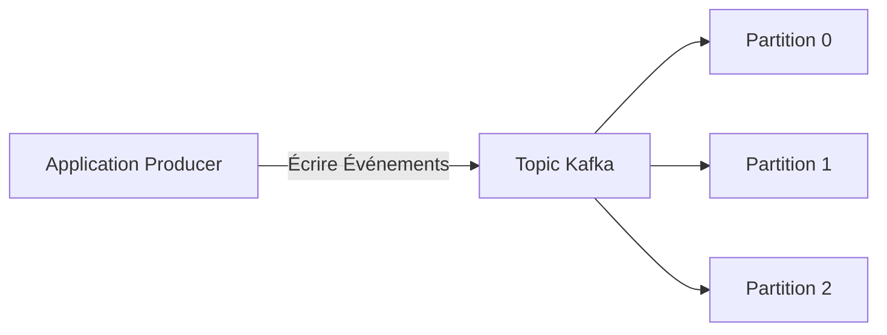
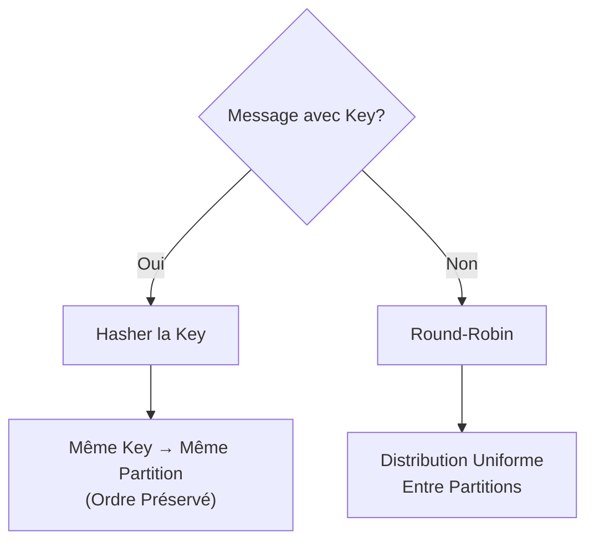
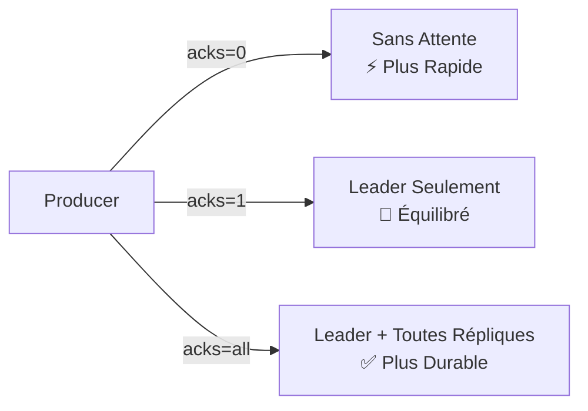
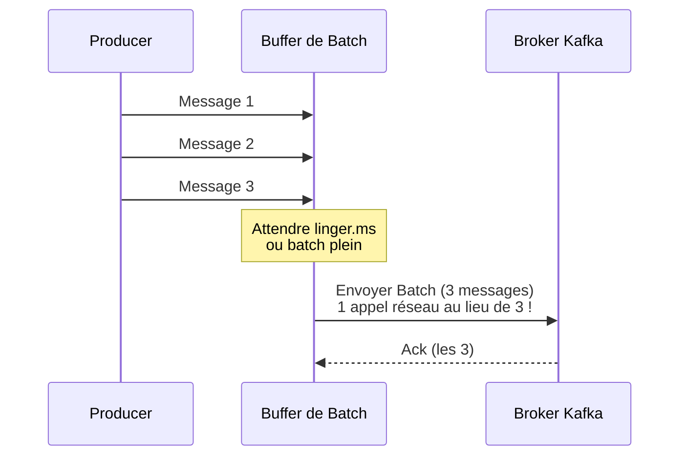

# Comment Produire des Messages vers Apache Kafka

Ce guide vous accompagne dans le processus d'écriture de données dans les topics Apache Kafka en utilisant les producers Kafka.

## Prérequis

Avant de commencer, assurez-vous d'avoir :

- [x] Docker et Docker Compose installés
- [x] Environnement de développement configuré (JDK 11+, Python 3.8+, ou Node.js 16+)
- [x] Une compréhension de base des [concepts Kafka](../tutorials/kafka-getting-started.md)

---

## Démarrage Rapide : Exécuter Kafka avec Docker Compose

Utilisez cette configuration Docker Compose pour exécuter un cluster Kafka à nœud unique avec **KRaft** (pas besoin de Zookeeper) :

```yaml title="docker-compose.yml" linenums="1"
version: "3.8"

services:
  kafka:
    image: confluentinc/cp-kafka:latest # (1)!
    container_name: kafka-kraft
    ports:
      - "9092:9092" # (2)!
    environment:
      # Paramètres KRaft
      KAFKA_NODE_ID: 1 # (3)!
      KAFKA_PROCESS_ROLES: broker,controller # (4)!
      KAFKA_LISTENERS: PLAINTEXT://0.0.0.0:9092,CONTROLLER://0.0.0.0:9093 # (5)!
      KAFKA_ADVERTISED_LISTENERS: PLAINTEXT://localhost:9092 # (6)!
      KAFKA_CONTROLLER_LISTENER_NAMES: CONTROLLER
      KAFKA_LISTENER_SECURITY_PROTOCOL_MAP: CONTROLLER:PLAINTEXT,PLAINTEXT:PLAINTEXT
      KAFKA_CONTROLLER_QUORUM_VOTERS: 1@localhost:9093 # (7)!

      # ID du cluster (générer avec: kafka-storage random-uuid)
      CLUSTER_ID: MkU3OEVBNTcwNTJENDM2Qk # (8)!

      # Stockage
      KAFKA_LOG_DIRS: /var/lib/kafka/data # (9)!

      # Confluent Metrics Reporter (optionnel - désactiver pour configuration minimale)
      KAFKA_CONFLUENT_SUPPORT_METRICS_ENABLE: "false" # (10)!
    volumes:
      - kafka-data:/var/lib/kafka/data
    healthcheck:
      test: ["CMD-SHELL", "kafka-broker-api-versions --bootstrap-server localhost:9092"]
      interval: 10s
      timeout: 5s
      retries: 5

volumes:
  kafka-data:
    driver: local
```

1. Image Kafka de Confluent Platform - inclut des outils supplémentaires et fonctionnalités enterprise
2. Port du broker Kafka exposé à l'hôte
3. ID de nœud unique dans le cluster KRaft
4. Ce nœud agit à la fois comme broker et controller (mode combiné)
5. Listeners : PLAINTEXT pour les clients, CONTROLLER pour la communication interne du cluster
6. Listener annoncé pour les clients externes (utiliser `localhost` pour le développement local)
7. Votants du quorum pour le consensus KRaft (format : `id@host:port`)
8. ID de cluster unique - générer avec `docker run confluentinc/cp-kafka kafka-storage random-uuid`
9. Répertoire de logs pour le stockage des données Kafka (chemin par défaut Confluent)
10. Désactiver Confluent Metrics Reporter pour une configuration de développement minimale

### Démarrer Kafka

```bash
# Démarrer Kafka
docker-compose up -d

# Attendre que Kafka soit prêt (vérifier le statut de santé)
docker-compose ps

# Voir les logs
docker-compose logs -f kafka

# Arrêter Kafka
docker-compose down
```

!!! tip "Vérifier que Kafka Fonctionne"
```bash # Créer un topic de test
docker exec kafka-kraft kafka-topics \
 --bootstrap-server localhost:9092 \
 --create --topic test-topic --partitions 3 --replication-factor 1

    # Lister les topics
    docker exec kafka-kraft kafka-topics \
      --bootstrap-server localhost:9092 --list
    ```

!!! warning "Considérations de Production"
Ceci est une configuration à nœud unique pour le développement. Pour la production : - Utilisez au moins 3 nœuds Kafka pour la haute disponibilité - Configurez des nœuds controller et broker séparés - Utilisez des volumes persistants pour le stockage des données - Activez l'authentification et le chiffrement (SASL/SSL)

## Comprendre les Producers

!!! abstract "Qu'est-ce qu'un Producer ?"
Les **producers** sont des applications clientes responsables de l'**écriture de données** dans les **topics** Kafka. Toute application qui pousse des données—qu'il s'agisse de télémétrie, de logs, d'événements ou d'activités utilisateur—dans Kafka est considérée comme un producer.



---

## Étape 1 : Configurer Votre Producer

### Propriétés de Configuration de Base

=== ":simple-openjdk: Java"

    ```properties title="kafka.properties"
    # Connexion
    bootstrap.servers=localhost:9092 # (1)!

    # Sérialisation
    key.serializer=org.apache.kafka.common.serialization.StringSerializer # (2)!
    value.serializer=org.apache.kafka.common.serialization.StringSerializer

    # Optionnel : Optimisation des performances
    acks=all # (3)!
    retries=3
    linger.ms=1
    ```

    1.  :material-server-network: Liste des adresses des brokers pour la découverte initiale du cluster
    2.  :material-cog-transfer: Convertit vos objets clé/valeur en tableaux d'octets
    3.  :material-check-all: Attendre que toutes les répliques accusent réception (durabilité maximale)

=== ":simple-python: Python"

    ```python title="config.py"
    config = {
        'bootstrap.servers': 'localhost:9092',  # (1)!
        'acks': 'all',  # (2)!
        'retries': 3,
        'linger.ms': 1
    }
    ```

    1.  :material-server-network: Adresses des brokers (séparées par des virgules si multiples)
    2.  :material-check-all: Attendre toutes les répliques in-sync

=== ":simple-nodedotjs: Node.js"

    ```javascript title="config.js"
    const config = {
      'bootstrap.servers': 'localhost:9092',  // (1)!
      'dr_msg_cb': true,  // (2)!
      'acks': 'all',
      'retries': 3
    };
    ```

    1.  :material-server-network: Points de connexion initiaux aux brokers
    2.  :material-message-check: Activer le callback de rapport de livraison

=== ":simple-go: Go"

    ```go title="config.go"
    config := &kafka.ConfigMap{
        "bootstrap.servers": "localhost:9092", // (1)!
        "acks":              "all",            // (2)!
        "retries":           3,
    }
    ```

    1.  :material-server-network: Adresses des brokers
    2.  :material-check-all: Attendre toutes les répliques

### Référence de Configuration

| Propriété           | Objectif                                | Valeurs Courantes                       |
| ------------------- | --------------------------------------- | --------------------------------------- |
| `bootstrap.servers` | Liste des adresses des brokers          | `localhost:9092` ou plusieurs hôtes     |
| `key.serializer`    | Comment convertir les clés en octets    | `StringSerializer`, `IntegerSerializer` |
| `value.serializer`  | Comment convertir les valeurs en octets | `StringSerializer`, `JsonSerializer`    |
| `acks`              | Niveau d'accusé de réception            | `0`, `1`, `all`                         |
| `retries`           | Nombre de tentatives de réessai         | `0` à `Integer.MAX_VALUE`               |

!!! tip "Bonne Pratique Bootstrap Servers"
Vous n'avez pas besoin de lister **tous** les brokers—juste assez pour la découverte initiale. Le producer apprendra automatiquement le reste du cluster.

---

## Étape 2 : Créer une Instance de Producer

=== ":simple-openjdk: Java"

    ```java title="SimpleProducer.java" linenums="1"
    import org.apache.kafka.clients.producer.KafkaProducer;
    import org.apache.kafka.clients.producer.ProducerRecord;
    import java.util.Properties;

    public class SimpleProducer {
        public static void main(String[] args) {
            // Charger la configuration
            Properties config = new Properties();
            config.put("bootstrap.servers", "localhost:9092");
            config.put("key.serializer",
                       "org.apache.kafka.common.serialization.StringSerializer");
            config.put("value.serializer",
                       "org.apache.kafka.common.serialization.StringSerializer");

            // Créer le producer
            KafkaProducer<String, String> producer = new KafkaProducer<>(config);

            System.out.println("✓ Producer créé avec succès");
            producer.close();
        }
    }
    ```

=== ":simple-python: Python"

    ```python title="simple_producer.py" linenums="1"
    from confluent_kafka import Producer

    # Configuration
    config = {
        'bootstrap.servers': 'localhost:9092'
    }

    # Créer le producer
    producer = Producer(config)
    print("✓ Producer créé avec succès")

    # S'assurer que tous les messages sont envoyés avant de fermer
    producer.flush()
    ```

=== ":simple-nodedotjs: Node.js"

    ```javascript title="simpleProducer.js" linenums="1"
    const Kafka = require('node-rdkafka');

    // Configuration
    const config = {
      'bootstrap.servers': 'localhost:9092',
      'dr_msg_cb': true
    };

    // Créer le producer
    const producer = new Kafka.Producer(config);

    producer.on('ready', () => {
      console.log('✓ Producer créé avec succès');
      producer.disconnect();
    });

    producer.connect();
    ```

=== ":simple-go: Go"

    ```go title="simple_producer.go" linenums="1"
    package main

    import (
        "fmt"
        "github.com/confluentinc/confluent-kafka-go/kafka"
    )

    func main() {
        // Créer le producer
        producer, err := kafka.NewProducer(&kafka.ConfigMap{
            "bootstrap.servers": "localhost:9092",
        })
        if err != nil {
            panic(err)
        }
        defer producer.Close()

        fmt.Println("✓ Producer créé avec succès")
    }
    ```

---

## Étape 3 : Envoyer des Messages

### Stratégies d'Envoi

=== "Fire-and-Forget :fire:"

    !!! warning "Aucune Garantie de Livraison"
        Le fire-and-forget ne fournit **aucune confirmation**. Les messages peuvent être perdus en cas de défaillance.

    === ":simple-openjdk: Java"

        ```java
        ProducerRecord<String, String> record =
            new ProducerRecord<>("events", "key1", "value1");

        producer.send(record); // (1)!
        ```

        1.  :material-send: Envoie sans attendre d'accusé de réception

    === ":simple-python: Python"

        ```python
        producer.produce(
            'events',  # topic
            key='key1',
            value='value1'
        )
        # Pas de callback - fire and forget !
        ```

    === ":simple-nodedotjs: Node.js"

        ```javascript
        producer.produce(
          'events',           // topic
          null,               // partition (automatique)
          Buffer.from('value1'),
          'key1'
        );
        // Pas de callback - fire and forget
        ```

    === ":simple-go: Go"

        ```go
        topic := "events"
        producer.Produce(&kafka.Message{
            TopicPartition: kafka.TopicPartition{
                Topic: &topic,
                Partition: kafka.PartitionAny,
            },
            Key:   []byte("key1"),
            Value: []byte("value1"),
        }, nil) // Pas de canal de livraison
        ```

=== "Synchrone :hourglass:"

    !!! success "Garantie Forte"
        Bloque jusqu'à réception de l'accusé. À utiliser pour les messages critiques.

    === ":simple-openjdk: Java"

        ```java
        try {
            RecordMetadata metadata = producer.send(record).get(); // (1)!
            System.out.printf("✓ Envoyé vers partition %d à l'offset %d%n",
                              metadata.partition(),
                              metadata.offset());
        } catch (Exception e) {
            System.err.println("✗ Échec : " + e.getMessage());
        }
        ```

        1.  :material-clock-check: `.get()` bloque jusqu'à la fin

    === ":simple-python: Python"

        ```python
        try:
            producer.produce('events', key='key1', value='value1')
            producer.flush()  # (1)!
            print("✓ Message envoyé avec succès")
        except Exception as e:
            print(f"✗ Échec : {e}")
        ```

        1.  :material-sync: Bloque jusqu'à la livraison de tous les messages

    === ":simple-nodedotjs: Node.js"

        ```javascript
        // Node.js n'a pas d'envoi sync natif
        // Utiliser async avec wrapper Promise
        function sendSync(producer, topic, key, value) {
          return new Promise((resolve, reject) => {
            producer.produce(
              topic, null, Buffer.from(value), key,
              Date.now(),
              (err, offset) => {
                if (err) reject(err);
                else resolve(offset);
              }
            );
            producer.flush(10000, (err) => {
              if (err) reject(err);
            });
          });
        }

        // Utilisation
        try {
          const offset = await sendSync(producer, 'events', 'key1', 'value1');
          console.log(`✓ Envoyé à l'offset ${offset}`);
        } catch (err) {
          console.error(`✗ Échec : ${err}`);
        }
        ```

    === ":simple-go: Go"

        ```go
        deliveryChan := make(chan kafka.Event)

        err := producer.Produce(&kafka.Message{
            TopicPartition: kafka.TopicPartition{
                Topic: &topic,
                Partition: kafka.PartitionAny,
            },
            Key:   []byte("key1"),
            Value: []byte("value1"),
        }, deliveryChan)

        if err != nil {
            fmt.Printf("✗ Échec : %v\n", err)
        }

        // Attendre le rapport de livraison
        e := <-deliveryChan
        m := e.(*kafka.Message)

        if m.TopicPartition.Error != nil {
            fmt.Printf("✗ Livraison échouée : %v\n", m.TopicPartition.Error)
        } else {
            fmt.Printf("✓ Envoyé vers partition %d à l'offset %v\n",
                       m.TopicPartition.Partition, m.TopicPartition.Offset)
        }
        close(deliveryChan)
        ```

=== "Asynchrone :rocket: (Recommandé)"

    !!! tip "Bonne Pratique"
        **L'asynchrone avec callbacks** offre le meilleur équilibre entre performance et fiabilité.

    === ":simple-openjdk: Java"

        ```java hl_lines="1-9"
        producer.send(record, (metadata, exception) -> { // (1)!
            if (exception == null) {
                System.out.printf("✓ Envoyé vers partition %d, offset %d%n",
                                  metadata.partition(),
                                  metadata.offset());
            } else {
                System.err.println("✗ Échec : " + exception.getMessage());
            }
        });
        ```

        1.  :material-function: Callback exécuté à la fin de l'envoi

    === ":simple-python: Python"

        ```python hl_lines="1-7"
        def delivery_callback(err, msg):  # (1)!
            if err:
                print(f"✗ Échec : {err}")
            else:
                print(f"✓ Envoyé vers partition {msg.partition()}, "
                      f"offset {msg.offset()}")

        producer.produce(
            'events',
            key='key1',
            value='value1',
            callback=delivery_callback  # (2)!
        )
        producer.poll(0)  # Déclencher les callbacks
        ```

        1.  :material-function: Fonction callback pour les rapports de livraison
        2.  :material-link: Attacher le callback à ce message

    === ":simple-nodedotjs: Node.js"

        ```javascript hl_lines="7-13"
        producer.produce(
          'events',           // topic
          null,               // partition (null = automatique)
          Buffer.from('value1'),  // valeur
          'key1',             // clé
          Date.now(),         // timestamp
          (err, offset) => {  // (1)!
            if (err) {
              console.error('✗ Échec :', err);
            } else {
              console.log(`✓ Envoyé à l'offset ${offset}`);
            }
          }
        );
        ```

        1.  :material-function: Callback pour confirmation de livraison

    === ":simple-go: Go"

        ```go hl_lines="1 14-23"
        deliveryChan := make(chan kafka.Event, 10000) // (1)!

        err := producer.Produce(&kafka.Message{
            TopicPartition: kafka.TopicPartition{
                Topic: &topic,
                Partition: kafka.PartitionAny,
            },
            Key:   []byte("key1"),
            Value: []byte("value1"),
        }, deliveryChan)

        // Gérer les rapports de livraison de manière asynchrone
        go func() {
            for e := range deliveryChan {
                m := e.(*kafka.Message)
                if m.TopicPartition.Error != nil {
                    fmt.Printf("✗ Échec : %v\n", m.TopicPartition.Error)
                } else {
                    fmt.Printf("✓ Envoyé vers partition %d à l'offset %v\n",
                               m.TopicPartition.Partition,
                               m.TopicPartition.Offset)
                }
            }
        }()
        ```

        1.  :material-buffer: Canal bufferisé pour envois non-bloquants

---

## Étape 4 : Contrôler le Routage des Messages

### Stratégies d'Attribution de Partition



### Exemples de Routage

=== "Routage par Clé :key:"

    !!! info "Garantie d'Ordre"
        Les messages avec la **même clé** vont toujours vers la **même partition**, préservant l'ordre.

    === ":simple-openjdk: Java"

        ```java
        // Tous les messages pour user-123 vont vers la même partition
        ProducerRecord<String, String> record1 =
            new ProducerRecord<>("events", "user-123", "login");
        ProducerRecord<String, String> record2 =
            new ProducerRecord<>("events", "user-123", "purchase");

        producer.send(record1);  // → Partition 2 (exemple)
        producer.send(record2);  // → Partition 2 (idem !)
        ```

    === ":simple-python: Python"

        ```python
        # Même clé = Même partition = Ordre préservé
        producer.produce('events', key='user-123', value='login')
        producer.produce('events', key='user-123', value='purchase')
        # Les deux vont vers la même partition
        ```

    === ":simple-nodedotjs: Node.js"

        ```javascript
        // Même clé assure la même partition
        producer.produce('events', null, Buffer.from('login'), 'user-123');
        producer.produce('events', null, Buffer.from('purchase'), 'user-123');
        // Les deux vont vers la même partition
        ```

    === ":simple-go: Go"

        ```go
        // Même clé route vers la même partition
        key := []byte("user-123")

        producer.Produce(&kafka.Message{
            TopicPartition: kafka.TopicPartition{Topic: &topic},
            Key:            key,
            Value:          []byte("login"),
        }, nil)

        producer.Produce(&kafka.Message{
            TopicPartition: kafka.TopicPartition{Topic: &topic},
            Key:            key,
            Value:          []byte("purchase"),
        }, nil)
        ```

=== "Sans Clé (Round-Robin) :arrows_counterclockwise:"

    === ":simple-openjdk: Java"

        ```java
        // Pas de clé = Distribution entre partitions
        ProducerRecord<String, String> record =
            new ProducerRecord<>("events", null, "anonymous-event");

        producer.send(record);  // → N'importe quelle partition
        ```

    === ":simple-python: Python"

        ```python
        # Omettre la clé pour distribution round-robin
        producer.produce('events', value='anonymous-event')
        ```

    === ":simple-nodedotjs: Node.js"

        ```javascript
        // Pas de clé = round-robin
        producer.produce('events', null, Buffer.from('anonymous-event'), null);
        ```

    === ":simple-go: Go"

        ```go
        // Pas de clé = round-robin
        producer.Produce(&kafka.Message{
            TopicPartition: kafka.TopicPartition{Topic: &topic},
            Value:          []byte("anonymous-event"),
        }, nil)
        ```

=== "Partitioner Personnalisé :wrench:"

    === ":simple-openjdk: Java"

        ```java title="CustomPartitioner.java"
        // 1. Configurer le partitioner personnalisé
        config.put("partitioner.class", "com.example.CustomPartitioner");

        // 2. Implémenter l'interface Partitioner
        public class CustomPartitioner implements Partitioner {
            @Override
            public int partition(String topic, Object key, byte[] keyBytes,
                                Object value, byte[] valueBytes,
                                Cluster cluster) {
                // Router les messages haute priorité vers partition 0
                if (value.toString().contains("URGENT")) {
                    return 0;  // (1)!
                }

                // Routage par hash par défaut pour les autres
                return Math.abs(key.hashCode()) %
                       cluster.partitionCountForTopic(topic);
            }

            // ... autres méthodes requises
        }
        ```

        1.  :material-alert: Les messages urgents obtiennent une partition dédiée pour traitement plus rapide

    === ":simple-python: Python"

        ```python title="custom_partitioner.py"
        def custom_partitioner(key, all_partitions, available):
            """
            Fonction de partitioner personnalisé.
            """
            # Router les messages URGENT vers partition 0
            if key and b'URGENT' in key:
                return 0

            # Partitionnement par hash par défaut pour les autres
            return hash(key) % len(all_partitions)

        # Configurer le producer avec partitioner personnalisé
        config = {
            'bootstrap.servers': 'localhost:9092',
            'partitioner': custom_partitioner
        }
        ```

    === ":simple-go: Go"

        ```go
        // Go utilise librdkafka qui supporte les partitioners personnalisés
        // via l'option de configuration 'partitioner'
        config := &kafka.ConfigMap{
            "bootstrap.servers": "localhost:9092",
            "partitioner":       "murmur2_random", // ou personnalisé
        }

        // Pour logique vraiment personnalisée, calculer partition manuellement :
        partition := customPartitionLogic(key, value)
        producer.Produce(&kafka.Message{
            TopicPartition: kafka.TopicPartition{
                Topic:     &topic,
                Partition: int32(partition),
            },
            Key:   key,
            Value: value,
        }, nil)
        ```

---

## Étape 5 : Configurer les Accusés de Réception

### Comprendre `acks`



### Matrice de Comparaison

| Paramètre  | Durabilité  | Latence     | Débit      | Cas d'Usage              |
| ---------- | ----------- | ----------- | ---------- | ------------------------ |
| `acks=0`   | ❌ Aucune   | ⚡ Minimale | 🚀 Maximal | Logs fire-and-forget     |
| `acks=1`   | ⚠️ Moyenne  | 🚀 Moyenne  | 🚀 Élevé   | Usage général            |
| `acks=all` | ✅ Maximale | 🐢 Maximale | 🐢 Minimal | Transactions financières |

### Exemple de Configuration

=== "Durabilité Maximale"

    === ":simple-openjdk: Java"

        ```properties title="kafka.properties"
        # Attendre toutes les répliques in-sync (1)
        acks=all

        # Exiger au moins 2 répliques (2)
        min.insync.replicas=2

        # Réessayer en cas d'échec (3)
        retries=3
        ```

        1.  :material-check-all: Le producer attend que toutes les répliques accusent réception
        2.  :material-shield-check: Au moins 2 répliques doivent être in-sync
        3.  :material-refresh: Réessai automatique des envois échoués

    === ":simple-python: Python"

        ```python
        config = {
            'bootstrap.servers': 'localhost:9092',
            'acks': 'all',           # (1)!
            'retries': 3,            # (2)!
            'request.required.acks': -1  # Même chose que 'all'
        }
        ```

        1.  :material-check-all: Attendre toutes les répliques in-sync
        2.  :material-refresh: Réessayer en cas d'échec

    === ":simple-nodedotjs: Node.js"

        ```javascript
        const config = {
          'bootstrap.servers': 'localhost:9092',
          'acks': -1,  // -1 = 'all'
          'retries': 3
        };
        ```

    === ":simple-go: Go"

        ```go
        config := &kafka.ConfigMap{
            "bootstrap.servers": "localhost:9092",
            "acks":              "all",
            "retries":           3,
        }
        ```

=== "Performance Équilibrée"

    ```properties
    acks=1
    retries=3
    retry.backoff.ms=100
    ```

=== "Débit Maximal"

    ```properties
    acks=0
    retries=0
    # Attention : Perte de données possible !
    ```

---

## Étape 6 : Gérer les Erreurs et Réessais

### Erreurs Courantes

??? danger "TimeoutException"
**Cause :** Broker inaccessible ou problèmes réseau

    **Solutions :**

    - Vérifier la connectivité réseau et les règles de pare-feu
    - Vérifier la configuration `bootstrap.servers`
    - Augmenter `request.timeout.ms`

??? danger "RecordTooLargeException"
**Cause :** Le message dépasse `message.max.bytes` du broker

    **Solutions :**

    - Réduire la taille du message ou diviser en messages plus petits
    - Augmenter config broker : `message.max.bytes`
    - Augmenter config producer : `max.request.size`

??? danger "SerializationException"
**Cause :** Format de données invalide pour le serializer

    **Solutions :**

    - Valider les données avant production
    - Vérifier la configuration du serializer
    - Utiliser Schema Registry pour validation

### Configuration des Réessais

=== "Paramètres de Réessai Auto"

    ```properties title="kafka.properties"
    # Nombre maximal de tentatives
    retries=3

    # Attente entre réessais
    retry.backoff.ms=100

    # Timeout global
    request.timeout.ms=30000
    delivery.timeout.ms=120000
    ```

=== "Code de Gestion d'Erreurs"

    === ":simple-openjdk: Java"

        ```java
        producer.send(record, (metadata, exception) -> {
            if (exception != null) {
                if (exception instanceof RetriableException) {
                    // Kafka réessaiera automatiquement (1)
                    log.warn("Erreur réessayable : {}", exception.getMessage());
                } else {
                    // Non-réessayable - gérer manuellement (2)
                    log.error("Erreur fatale : {}", exception.getMessage());
                    // Stocker dans dead-letter queue ou alerter
                    deadLetterQueue.send(record);
                }
            }
        });
        ```

        1.  :material-refresh: Erreurs transitoires (réseau, broker temporairement indisponible)
        2.  :material-alert-circle: Erreurs permanentes (données invalides, échec auth)

    === ":simple-python: Python"

        ```python
        def delivery_callback(err, msg):
            if err:
                if err.code() == KafkaError._MSG_TIMED_OUT:
                    # Erreur réessayable
                    logger.warning(f"Timeout : {err}")
                else:
                    # Erreur non-réessayable
                    logger.error(f"Fatale : {err}")
                    # Envoyer vers DLQ
                    dlq_producer.produce('dead-letter-queue', msg.value())
            else:
                logger.info(f"✓ Livré : {msg.offset()}")
        ```

    === ":simple-nodedotjs: Node.js"

        ```javascript
        producer.on('delivery-report', (err, report) => {
          if (err) {
            if (err.code === 'MSG_TIMED_OUT') {
              // Réessayable
              console.warn('Timeout :', err);
            } else {
              // Non-réessayable
              console.error('Fatale :', err);
              // Envoyer vers DLQ
            }
          } else {
            console.log(`✓ Livré à l'offset ${report.offset}`);
          }
        });
        ```

    === ":simple-go: Go"

        ```go
        for e := range deliveryChan {
            m := e.(*kafka.Message)

            if m.TopicPartition.Error != nil {
                err := m.TopicPartition.Error

                // Vérifier si réessayable
                if err.(kafka.Error).IsRetriable() {
                    log.Printf("Erreur réessayable : %v", err)
                } else {
                    log.Printf("Erreur fatale : %v", err)
                    // Envoyer vers DLQ
                }
            } else {
                log.Printf("✓ Livré à l'offset %v",
                           m.TopicPartition.Offset)
            }
        }
        ```

---

## Étape 7 : Optimiser les Performances

### Configuration du Batching

!!! tip "Avantages du Batching"
Grouper les messages en lots **améliore considérablement le débit** en réduisant la surcharge réseau.



=== "Paramètres de Batch"

    ```properties title="kafka.properties"
    # Taille du batch en octets (16KB par défaut)
    batch.size=16384  # (1)!

    # Temps d'attente avant envoi batch partiel (0ms = envoi immédiat)
    linger.ms=10  # (2)!

    # Compression
    compression.type=snappy  # (3)!
    ```

    1.  :material-package-variant: Lots plus grands = meilleur débit (mais plus de mémoire)
    2.  :material-timer: Échanger un peu de latence pour un meilleur batching
    3.  :material-zip-box: Compresser les lots pour économiser la bande passante

=== ":simple-python: Python"

    ```python
    config = {
        'bootstrap.servers': 'localhost:9092',
        'linger.ms': 10,
        'compression.type': 'snappy',
        'batch.size': 16384
    }
    ```

=== ":simple-nodedotjs: Node.js"

    ```javascript
    const config = {
      'bootstrap.servers': 'localhost:9092',
      'linger.ms': 10,
      'compression.type': 'snappy',
      'batch.size': 16384
    };
    ```

=== ":simple-go: Go"

    ```go
    config := &kafka.ConfigMap{
        "bootstrap.servers": "localhost:9092",
        "linger.ms":         10,
        "compression.type":  "snappy",
        "batch.size":        16384,
    }
    ```

### Comparaison de Compression

<div class="grid cards" markdown>

- :material-file-outline: **None**

  ***
  - **Ratio :** 1x (pas de compression)
  - **CPU :** Minimal
  - **Idéal pour :** Données déjà compressées

- :material-lightning-bolt: **Snappy** ⭐

  ***
  - **Ratio :** 2-3x
  - **CPU :** Faible
  - **Idéal pour :** Usage général (recommandé)

- :material-flash: **LZ4**

  ***
  - **Ratio :** 2-3x
  - **CPU :** Faible
  - **Idéal pour :** Exigences faible latence

- :material-zip-box: **GZIP**

  ***
  - **Ratio :** 4-5x
  - **CPU :** Élevé
  - **Idéal pour :** Optimisation du stockage

- :material-star: **ZSTD**

  ***
  - **Ratio :** 3-5x
  - **CPU :** Moyen
  - **Idéal pour :** Meilleur équilibre ratio/vitesse

</div>

---

## Exemple Complet Fonctionnel

=== ":simple-openjdk: Java"

    ```java title="KafkaProducerExample.java" linenums="1"
    package com.example.kafka;

    import org.apache.kafka.clients.producer.*;
    import org.apache.kafka.common.serialization.StringSerializer;
    import java.util.Properties;

    public class KafkaProducerExample {

        private static final String TOPIC = "events";
        private static final String BOOTSTRAP_SERVERS = "localhost:9092";

        public static void main(String[] args) {
            // 1. Configurer le producer
            Properties config = new Properties();
            config.put(ProducerConfig.BOOTSTRAP_SERVERS_CONFIG, BOOTSTRAP_SERVERS);
            config.put(ProducerConfig.KEY_SERIALIZER_CLASS_CONFIG,
                       StringSerializer.class.getName());
            config.put(ProducerConfig.VALUE_SERIALIZER_CLASS_CONFIG,
                       StringSerializer.class.getName());
            config.put(ProducerConfig.ACKS_CONFIG, "all");
            config.put(ProducerConfig.RETRIES_CONFIG, 3);
            config.put(ProducerConfig.COMPRESSION_TYPE_CONFIG, "snappy");

            // 2. Créer producer (try-with-resources pour fermeture auto)
            try (KafkaProducer<String, String> producer =
                     new KafkaProducer<>(config)) {

                // 3. Envoyer 10 messages
                for (int i = 0; i < 10; i++) {
                    String key = "key-" + i;
                    String value = "message-" + i;

                    ProducerRecord<String, String> record =
                        new ProducerRecord<>(TOPIC, key, value);

                    // 4. Envoyer de manière asynchrone avec callback
                    producer.send(record, (metadata, exception) -> {
                        if (exception == null) {
                            System.out.printf(
                                "✓ Envoyé : key=%s, partition=%d, offset=%d%n",
                                key, metadata.partition(), metadata.offset()
                            );
                        } else {
                            System.err.printf(
                                "✗ Échec : key=%s, erreur=%s%n",
                                key, exception.getMessage()
                            );
                        }
                    });
                }

                // 5. Attendre que tous les messages soient envoyés
                producer.flush();
                System.out.println("✅ Tous les messages envoyés avec succès");

            } catch (Exception e) {
                System.err.println("❌ Erreur du producer : " + e.getMessage());
                e.printStackTrace();
            }
        }
    }
    ```

=== ":simple-python: Python"

    ```python title="kafka_producer_example.py" linenums="1"
    from confluent_kafka import Producer
    import sys

    TOPIC = 'events'
    BOOTSTRAP_SERVERS = 'localhost:9092'

    def delivery_callback(err, msg):
        """Appelé une fois pour chaque message produit."""
        if err:
            print(f'✗ Échec : {err}', file=sys.stderr)
        else:
            print(f'✓ Envoyé : key={msg.key().decode()}, '
                  f'partition={msg.partition()}, '
                  f'offset={msg.offset()}')

    def main():
        # 1. Configurer le producer
        config = {
            'bootstrap.servers': BOOTSTRAP_SERVERS,
            'acks': 'all',
            'retries': 3,
            'compression.type': 'snappy'
        }

        # 2. Créer le producer
        producer = Producer(config)

        try:
            # 3. Envoyer 10 messages
            for i in range(10):
                key = f'key-{i}'
                value = f'message-{i}'

                # 4. Produire de manière asynchrone avec callback
                producer.produce(
                    TOPIC,
                    key=key,
                    value=value,
                    callback=delivery_callback
                )

                # Poll pour déclencher les callbacks
                producer.poll(0)

            # 5. Attendre que tous les messages soient envoyés
            producer.flush()
            print('✅ Tous les messages envoyés avec succès')

        except Exception as e:
            print(f'❌ Erreur du producer : {e}', file=sys.stderr)
        finally:
            producer.flush()

    if __name__ == '__main__':
        main()
    ```

=== ":simple-nodedotjs: Node.js"

    ```javascript title="kafkaProducerExample.js" linenums="1"
    const Kafka = require('node-rdkafka');

    const TOPIC = 'events';
    const BOOTSTRAP_SERVERS = 'localhost:9092';

    // 1. Configurer le producer
    const config = {
      'bootstrap.servers': BOOTSTRAP_SERVERS,
      'dr_msg_cb': true,
      'acks': 'all',
      'retries': 3,
      'compression.type': 'snappy'
    };

    // 2. Créer le producer
    const producer = new Kafka.Producer(config);

    producer.on('ready', () => {
      console.log('Producer prêt');

      // 3. Envoyer 10 messages
      for (let i = 0; i < 10; i++) {
        const key = `key-${i}`;
        const value = `message-${i}`;

        try {
          // 4. Produire le message
          producer.produce(
            TOPIC,
            null,  // partition (null = automatique)
            Buffer.from(value),
            key,
            Date.now(),
            (err, offset) => {
              if (err) {
                console.error(`✗ Échec : key=${key}, erreur=${err}`);
              } else {
                console.log(`✓ Envoyé : key=${key}, offset=${offset}`);
              }
            }
          );
        } catch (err) {
          console.error(`✗ Exception : ${err}`);
        }
      }

      // 5. Vider et déconnecter
      producer.flush(10000, () => {
        console.log('✅ Tous les messages envoyés avec succès');
        producer.disconnect();
      });
    });

    producer.on('event.error', (err) => {
      console.error('❌ Erreur du producer :', err);
    });

    producer.connect();
    ```

=== ":simple-go: Go"

    ```go title="kafka_producer_example.go" linenums="1"
    package main

    import (
        "fmt"
        "github.com/confluentinc/confluent-kafka-go/kafka"
    )

    const (
        TOPIC             = "events"
        BOOTSTRAP_SERVERS = "localhost:9092"
    )

    func main() {
        // 1. Configurer le producer
        config := &kafka.ConfigMap{
            "bootstrap.servers": BOOTSTRAP_SERVERS,
            "acks":              "all",
            "retries":           3,
            "compression.type":  "snappy",
        }

        // 2. Créer le producer
        producer, err := kafka.NewProducer(config)
        if err != nil {
            panic(err)
        }
        defer producer.Close()

        // Gestionnaire de rapport de livraison (goroutine)
        go func() {
            for e := range producer.Events() {
                switch ev := e.(type) {
                case *kafka.Message:
                    if ev.TopicPartition.Error != nil {
                        fmt.Printf("✗ Échec : key=%s, erreur=%v\n",
                                   string(ev.Key), ev.TopicPartition.Error)
                    } else {
                        fmt.Printf("✓ Envoyé : key=%s, partition=%d, offset=%v\n",
                                   string(ev.Key),
                                   ev.TopicPartition.Partition,
                                   ev.TopicPartition.Offset)
                    }
                }
            }
        }()

        // 3. Envoyer 10 messages
        topic := TOPIC
        for i := 0; i < 10; i++ {
            key := fmt.Sprintf("key-%d", i)
            value := fmt.Sprintf("message-%d", i)

            // 4. Produire le message
            err := producer.Produce(&kafka.Message{
                TopicPartition: kafka.TopicPartition{
                    Topic:     &topic,
                    Partition: kafka.PartitionAny,
                },
                Key:   []byte(key),
                Value: []byte(value),
            }, nil)

            if err != nil {
                fmt.Printf("✗ Production échouée : %v\n", err)
            }
        }

        // 5. Attendre que tous les messages soient livrés
        producer.Flush(15 * 1000)
        fmt.Println("✅ Tous les messages envoyés avec succès")
    }
    ```

---

## Exercice Pratique

!!! example "Pratiquer avec le Lab Interactif Confluent"

    Prêt à l'essayer vous-même ? L'exercice pratique officiel de Confluent fournit un environnement pré-configuré avec validation en temps réel.

    [Commencer l'Exercice :material-arrow-right:](https://developer.confluent.io/courses/apache-kafka/get-started-hands-on/){ .md-button .md-button--primary }

    **Ce que vous obtenez :**

    - :material-cloud: Cluster Kafka pré-configuré
    - :material-book-open-variant: Instructions étape par étape
    - :material-code-braces: Exemples multi-langages
    - :material-check-circle: Validation en temps réel

---

## Résumé des Bonnes Pratiques

<div class="grid cards" markdown>

- :material-check-all: **À FAIRE**

  ***
  - Utiliser `acks=all` pour les données critiques
  - Activer la compression (`snappy` ou `zstd`)
  - Envoyer de manière asynchrone avec callbacks
  - Fermer les producers proprement (`flush()` puis `close()`)
  - Surveiller les métriques du producer
  - Utiliser des clés pour les messages ordonnés

- :material-close-circle: **À ÉVITER**

  ***
  - Utiliser des envois synchrones dans des scénarios à haut débit
  - Ignorer les exceptions des callbacks
  - Créer un nouveau producer par message (réutiliser les instances !)
  - Envoyer des données sensibles sans chiffrement
  - Utiliser `acks=0` pour des données importantes
  - Oublier d'appeler `flush()` avant arrêt

</div>

---

## Dépannage

??? bug "Producer Bloqué / Se Bloque Indéfiniment"

    **Symptômes :** Le producer se bloque indéfiniment sur `send()` ou `flush()`

    **Solutions :**

    ```properties
    # Ajouter des timeouts
    max.block.ms=60000
    request.timeout.ms=30000
    delivery.timeout.ms=120000
    ```

??? bug "Débit Faible / Envois Lents"

    **Symptômes :** Messages envoyés à un rythme très lent

    **Solutions :**

    ```properties
    # Augmenter le batching
    batch.size=32768
    linger.ms=20

    # Activer la compression
    compression.type=snappy

    # Augmenter la mémoire du buffer
    buffer.memory=67108864
    ```

??? bug "Messages Désordonnés"

    **Symptômes :** Messages arrivent dans le mauvais ordre

    **Solutions :**

    ```properties
    # Garantir l'ordre (réduit le débit)
    max.in.flight.requests.per.connection=1
    enable.idempotence=true
    ```

??? bug "Connexion Refusée"

    **Symptômes :** Impossible de se connecter aux brokers

    **Liste de vérification :**

    - [ ] Les brokers Kafka sont en cours d'exécution (`jps` ou `docker ps`)
    - [ ] `bootstrap.servers` correspond aux adresses réelles des brokers
    - [ ] Le pare-feu autorise la connexion sur le port 9092
    - [ ] Pour Docker : utiliser la configuration réseau/hôte correcte

---

## Prochaines Étapes

<div class="grid cards" markdown>

- :material-download: **Consommer des Messages**

  ***

  Apprenez à lire les données des topics Kafka avec les consumers

  [:octicons-arrow-right-24: Guide Consumer](kafka-consume-messages.md)

- :material-schema: **Schema Registry**

  ***

  Ajoutez validation et évolution de schémas à vos pipelines de données

  [:octicons-arrow-right-24: Guide Schema](kafka-use-schema-registry.md)

- :material-book-open-page-variant: **Concepts Fondamentaux**

  ***

  Plongée profonde dans l'architecture et les mécanismes internes de Kafka

  [:octicons-arrow-right-24: Tutoriel Kafka](../tutorials/kafka-getting-started.md)

</div>

---

## Ressources Supplémentaires

- :material-file-document: [Documentation API Kafka Producer](https://kafka.apache.org/documentation/#producerapi)
- :material-cog: [Référence Configuration Producer](https://docs.confluent.io/platform/current/installation/configuration/producer-configs.html)
- :material-speedometer: [Guide d'Optimisation des Performances Producer](https://docs.confluent.io/platform/current/kafka/deployment.html#producer-performance-tuning)
- :material-lightbulb: [Bonnes Pratiques pour les Producers Apache Kafka](https://www.confluent.io/blog/kafka-producer-performance-tuning/)
