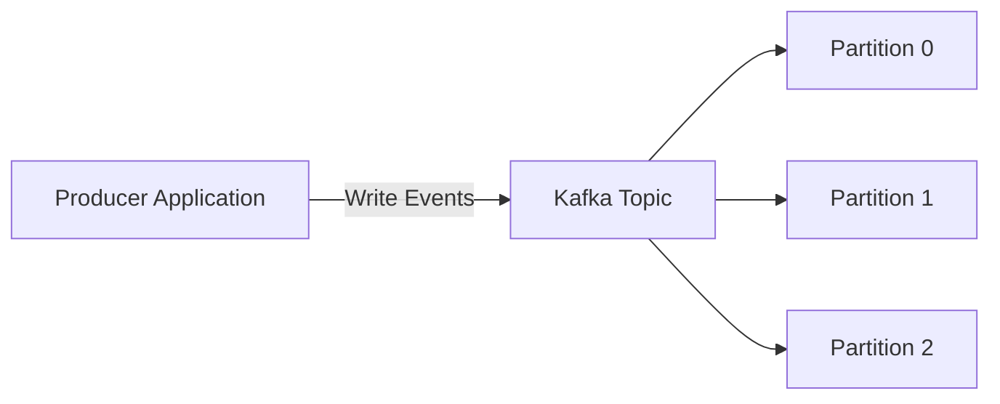
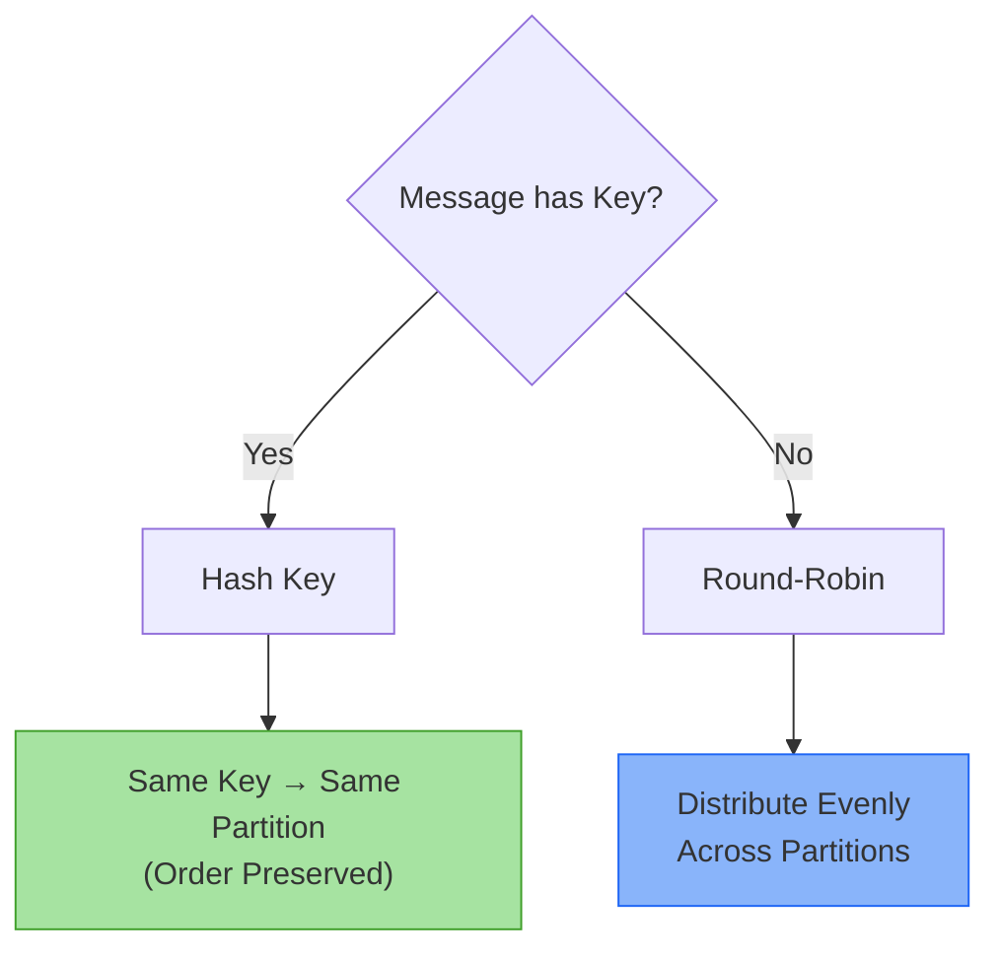
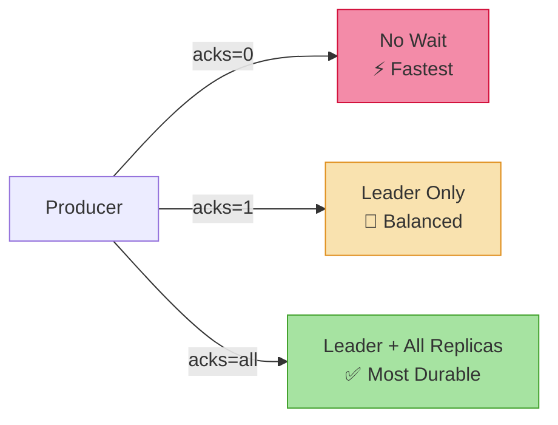
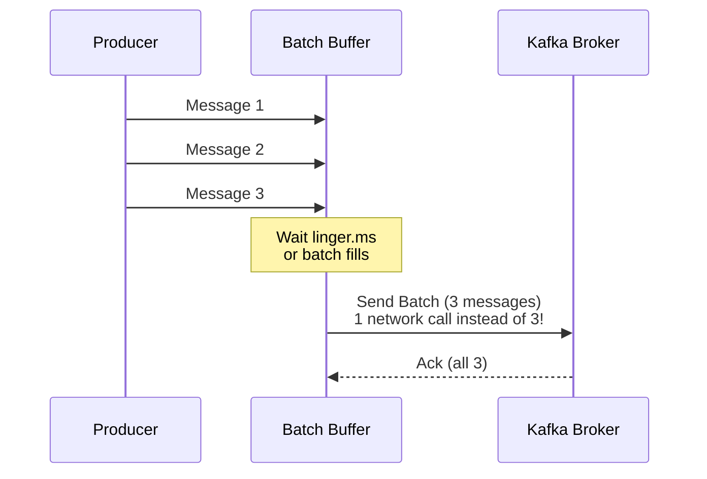

# How to Produce Messages to Apache Kafka

This guide walks you through the process of writing data into Apache Kafka topics using Kafka producers.

## Prerequisites

Before you begin, ensure you have:

- [x] Docker and Docker Compose installed
- [x] Development environment set up (JDK 11+, Python 3.8+, or Node.js 16+)
- [x] Basic understanding of [Kafka concepts](../tutorials/kafka-getting-started.md)

---

## Quick Start: Run Kafka with Docker Compose

Use this Docker Compose configuration to run a single-node Kafka cluster with **KRaft** (no Zookeeper needed):

```yaml title="docker-compose.yml" linenums="1"
version: "3.8"

services:
  kafka:
    image: confluentinc/cp-kafka:latest # (1)!
    container_name: kafka-kraft
    ports:
      - "9092:9092" # (2)!
    environment:
      # KRaft settings
      KAFKA_NODE_ID: 1 # (3)!
      KAFKA_PROCESS_ROLES: broker,controller # (4)!
      KAFKA_LISTENERS: PLAINTEXT://0.0.0.0:9092,CONTROLLER://0.0.0.0:9093 # (5)!
      KAFKA_ADVERTISED_LISTENERS: PLAINTEXT://localhost:9092 # (6)!
      KAFKA_CONTROLLER_LISTENER_NAMES: CONTROLLER
      KAFKA_LISTENER_SECURITY_PROTOCOL_MAP: CONTROLLER:PLAINTEXT,PLAINTEXT:PLAINTEXT
      KAFKA_CONTROLLER_QUORUM_VOTERS: 1@localhost:9093 # (7)!

      # Cluster ID (generate with: kafka-storage random-uuid)
      CLUSTER_ID: MkU3OEVBNTcwNTJENDM2Qk # (8)!

      # Storage
      KAFKA_LOG_DIRS: /var/lib/kafka/data # (9)!

      # Confluent Metrics Reporter (optional - disable for minimal setup)
      KAFKA_CONFLUENT_SUPPORT_METRICS_ENABLE: "false" # (10)!
    volumes:
      - kafka-data:/var/lib/kafka/data
    healthcheck:
      test: ["CMD-SHELL", "kafka-broker-api-versions --bootstrap-server localhost:9092"]
      interval: 10s
      timeout: 5s
      retries: 5

volumes:
  kafka-data:
    driver: local
```

1. Confluent Platform Kafka image - includes additional tools and enterprise features
2. Kafka broker port exposed to host
3. Unique node ID in the KRaft cluster
4. This node acts as both broker and controller (combined mode)
5. Listeners: PLAINTEXT for clients, CONTROLLER for internal cluster communication
6. Advertised listener for external clients (use `localhost` for local development)
7. Quorum voters for KRaft consensus (format: `id@host:port`)
8. Unique cluster ID - generate with `docker run confluentinc/cp-kafka kafka-storage random-uuid`
9. Log directory for Kafka data storage (Confluent default path)
10. Disable Confluent Metrics Reporter for minimal development setup

### Start Kafka

```bash
# Start Kafka
docker-compose up -d

# Wait for Kafka to be ready (check health status)
docker-compose ps

# View logs
docker-compose logs -f kafka

# Stop Kafka
docker-compose down
```

!!! tip "Verify Kafka is Running"
```bash # Create a test topic
docker exec kafka-kraft kafka-topics \
 --bootstrap-server localhost:9092 \
 --create --topic test-topic --partitions 3 --replication-factor 1

    # List topics
    docker exec kafka-kraft kafka-topics \
      --bootstrap-server localhost:9092 --list
    ```

!!! warning "Production Considerations"
This is a single-node setup for development. For production: - Use at least 3 Kafka nodes for high availability - Configure separate controller and broker nodes - Use persistent volumes for data storage - Enable authentication and encryption (SASL/SSL)

## Understanding Producers

!!! abstract "What is a Producer?"
**Producers** are client applications responsible for **writing data** into Kafka **topics**. Any application that pushes data—whether telemetry, logs, events, or user activity—into Kafka is considered a producer.



---

## Step 1: Configure Your Producer

### Basic Configuration Properties

=== ":simple-openjdk: Java"

    ```properties title="kafka.properties"
    # Connection
    bootstrap.servers=localhost:9092 # (1)!

    # Serialization
    key.serializer=org.apache.kafka.common.serialization.StringSerializer # (2)!
    value.serializer=org.apache.kafka.common.serialization.StringSerializer

    # Optional: Performance tuning
    acks=all # (3)!
    retries=3
    linger.ms=1
    ```

    1.  :material-server-network: List of broker addresses for initial cluster discovery
    2.  :material-cog-transfer: Converts your key/value objects to byte arrays
    3.  :material-check-all: Wait for all replicas to acknowledge (highest durability)

=== ":simple-python: Python"

    ```python title="config.py"
    config = {
        'bootstrap.servers': 'localhost:9092',  # (1)!
        'acks': 'all',  # (2)!
        'retries': 3,
        'linger.ms': 1
    }
    ```

    1.  :material-server-network: Broker addresses (comma-separated if multiple)
    2.  :material-check-all: Wait for all in-sync replicas

=== ":simple-nodedotjs: Node.js"

    ```javascript title="config.js"
    const config = {
      'bootstrap.servers': 'localhost:9092',  // (1)!
      'dr_msg_cb': true,  // (2)!
      'acks': 'all',
      'retries': 3
    };
    ```

    1.  :material-server-network: Initial broker connection points
    2.  :material-message-check: Enable delivery report callback

=== ":simple-go: Go"

    ```go title="config.go"
    config := &kafka.ConfigMap{
        "bootstrap.servers": "localhost:9092", // (1)!
        "acks":              "all",            // (2)!
        "retries":           3,
    }
    ```

    1.  :material-server-network: Broker addresses
    2.  :material-check-all: Wait for all replicas

### Configuration Reference

| Property            | Purpose                        | Common Values                           |
| ------------------- | ------------------------------ | --------------------------------------- |
| `bootstrap.servers` | List of broker addresses       | `localhost:9092` or multiple hosts      |
| `key.serializer`    | How to convert keys to bytes   | `StringSerializer`, `IntegerSerializer` |
| `value.serializer`  | How to convert values to bytes | `StringSerializer`, `JsonSerializer`    |
| `acks`              | Acknowledgment level           | `0`, `1`, `all`                         |
| `retries`           | Number of retry attempts       | `0` to `Integer.MAX_VALUE`              |

!!! tip "Bootstrap Servers Best Practice"
You don't need to list **all** brokers—just enough for initial discovery. The producer will automatically learn about the rest of the cluster.

---

## Step 2: Create a Producer Instance

=== ":simple-openjdk: Java"

    ```java title="SimpleProducer.java" linenums="1"
    import org.apache.kafka.clients.producer.KafkaProducer;
    import org.apache.kafka.clients.producer.ProducerRecord;
    import java.util.Properties;

    public class SimpleProducer {
        public static void main(String[] args) {
            // Load configuration
            Properties config = new Properties();
            config.put("bootstrap.servers", "localhost:9092");
            config.put("key.serializer",
                       "org.apache.kafka.common.serialization.StringSerializer");
            config.put("value.serializer",
                       "org.apache.kafka.common.serialization.StringSerializer");

            // Create producer
            KafkaProducer<String, String> producer = new KafkaProducer<>(config);

            System.out.println("✓ Producer created successfully");
            producer.close();
        }
    }
    ```

=== ":simple-python: Python"

    ```python title="simple_producer.py" linenums="1"
    from confluent_kafka import Producer

    # Configuration
    config = {
        'bootstrap.servers': 'localhost:9092'
    }

    # Create producer
    producer = Producer(config)
    print("✓ Producer created successfully")

    # Ensure all messages are sent before closing
    producer.flush()
    ```

=== ":simple-nodedotjs: Node.js"

    ```javascript title="simpleProducer.js" linenums="1"
    const Kafka = require('node-rdkafka');

    // Configuration
    const config = {
      'bootstrap.servers': 'localhost:9092',
      'dr_msg_cb': true
    };

    // Create producer
    const producer = new Kafka.Producer(config);

    producer.on('ready', () => {
      console.log('✓ Producer created successfully');
      producer.disconnect();
    });

    producer.connect();
    ```

=== ":simple-go: Go"

    ```go title="simple_producer.go" linenums="1"
    package main

    import (
        "fmt"
        "github.com/confluentinc/confluent-kafka-go/kafka"
    )

    func main() {
        // Create producer
        producer, err := kafka.NewProducer(&kafka.ConfigMap{
            "bootstrap.servers": "localhost:9092",
        })
        if err != nil {
            panic(err)
        }
        defer producer.Close()

        fmt.Println("✓ Producer created successfully")
    }
    ```

---

## Step 3: Send Messages

### Sending Strategies

=== "Fire-and-Forget :fire:"

    !!! warning "No Delivery Guarantee"
        Fire-and-forget provides **no confirmation**. Messages may be lost if failures occur.

    === ":simple-openjdk: Java"

        ```java
        ProducerRecord<String, String> record =
            new ProducerRecord<>("events", "key1", "value1");

        producer.send(record); // (1)!
        ```

        1.  :material-send: Sends without waiting for acknowledgment

    === ":simple-python: Python"

        ```python
        producer.produce(
            'events',  # topic
            key='key1',
            value='value1'
        )
        # No callback - fire and forget!
        ```

    === ":simple-nodedotjs: Node.js"

        ```javascript
        producer.produce(
          'events',           // topic
          null,               // partition (automatic)
          Buffer.from('value1'),
          'key1'
        );
        // No callback - fire and forget
        ```

    === ":simple-go: Go"

        ```go
        topic := "events"
        producer.Produce(&kafka.Message{
            TopicPartition: kafka.TopicPartition{
                Topic: &topic,
                Partition: kafka.PartitionAny,
            },
            Key:   []byte("key1"),
            Value: []byte("value1"),
        }, nil) // No delivery channel
        ```

=== "Synchronous :hourglass:"

    !!! success "Strong Guarantee"
        Blocks until acknowledgment received. Use for critical messages.

    === ":simple-openjdk: Java"

        ```java
        try {
            RecordMetadata metadata = producer.send(record).get(); // (1)!
            System.out.printf("✓ Sent to partition %d at offset %d%n",
                              metadata.partition(),
                              metadata.offset());
        } catch (Exception e) {
            System.err.println("✗ Failed: " + e.getMessage());
        }
        ```

        1.  :material-clock-check: `.get()` blocks until completed

    === ":simple-python: Python"

        ```python
        try:
            producer.produce('events', key='key1', value='value1')
            producer.flush()  # (1)!
            print("✓ Message sent successfully")
        except Exception as e:
            print(f"✗ Failed: {e}")
        ```

        1.  :material-sync: Blocks until all messages delivered

    === ":simple-nodedotjs: Node.js"

        ```javascript
        // Node.js doesn't have native sync sends
        // Use async with Promise wrapper
        function sendSync(producer, topic, key, value) {
          return new Promise((resolve, reject) => {
            producer.produce(
              topic, null, Buffer.from(value), key,
              Date.now(),
              (err, offset) => {
                if (err) reject(err);
                else resolve(offset);
              }
            );
            producer.flush(10000, (err) => {
              if (err) reject(err);
            });
          });
        }

        // Usage
        try {
          const offset = await sendSync(producer, 'events', 'key1', 'value1');
          console.log(`✓ Sent to offset ${offset}`);
        } catch (err) {
          console.error(`✗ Failed: ${err}`);
        }
        ```

    === ":simple-go: Go"

        ```go
        deliveryChan := make(chan kafka.Event)

        err := producer.Produce(&kafka.Message{
            TopicPartition: kafka.TopicPartition{
                Topic: &topic,
                Partition: kafka.PartitionAny,
            },
            Key:   []byte("key1"),
            Value: []byte("value1"),
        }, deliveryChan)

        if err != nil {
            fmt.Printf("✗ Failed: %v\n", err)
        }

        // Wait for delivery report
        e := <-deliveryChan
        m := e.(*kafka.Message)

        if m.TopicPartition.Error != nil {
            fmt.Printf("✗ Delivery failed: %v\n", m.TopicPartition.Error)
        } else {
            fmt.Printf("✓ Sent to partition %d at offset %v\n",
                       m.TopicPartition.Partition, m.TopicPartition.Offset)
        }
        close(deliveryChan)
        ```

=== "Asynchronous :rocket: (Recommended)"

    !!! tip "Best Practice"
        **Asynchronous with callbacks** provides the best balance of performance and reliability.

    === ":simple-openjdk: Java"

        ```java hl_lines="1-9"
        producer.send(record, (metadata, exception) -> { // (1)!
            if (exception == null) {
                System.out.printf("✓ Sent to partition %d, offset %d%n",
                                  metadata.partition(),
                                  metadata.offset());
            } else {
                System.err.println("✗ Failed: " + exception.getMessage());
            }
        });
        ```

        1.  :material-function: Callback executed when send completes

    === ":simple-python: Python"

        ```python hl_lines="1-7"
        def delivery_callback(err, msg):  # (1)!
            if err:
                print(f"✗ Failed: {err}")
            else:
                print(f"✓ Sent to partition {msg.partition()}, "
                      f"offset {msg.offset()}")

        producer.produce(
            'events',
            key='key1',
            value='value1',
            callback=delivery_callback  # (2)!
        )
        producer.poll(0)  # Trigger callbacks
        ```

        1.  :material-function: Callback function for delivery reports
        2.  :material-link: Attach callback to this message

    === ":simple-nodedotjs: Node.js"

        ```javascript hl_lines="7-13"
        producer.produce(
          'events',           // topic
          null,               // partition (null = automatic)
          Buffer.from('value1'),  // value
          'key1',             // key
          Date.now(),         // timestamp
          (err, offset) => {  // (1)!
            if (err) {
              console.error('✗ Failed:', err);
            } else {
              console.log(`✓ Sent to offset ${offset}`);
            }
          }
        );
        ```

        1.  :material-function: Callback for delivery confirmation

    === ":simple-go: Go"

        ```go hl_lines="1 14-23"
        deliveryChan := make(chan kafka.Event, 10000) // (1)!

        err := producer.Produce(&kafka.Message{
            TopicPartition: kafka.TopicPartition{
                Topic: &topic,
                Partition: kafka.PartitionAny,
            },
            Key:   []byte("key1"),
            Value: []byte("value1"),
        }, deliveryChan)

        // Handle delivery reports asynchronously
        go func() {
            for e := range deliveryChan {
                m := e.(*kafka.Message)
                if m.TopicPartition.Error != nil {
                    fmt.Printf("✗ Failed: %v\n", m.TopicPartition.Error)
                } else {
                    fmt.Printf("✓ Sent to partition %d at offset %v\n",
                               m.TopicPartition.Partition,
                               m.TopicPartition.Offset)
                }
            }
        }()
        ```

        1.  :material-buffer: Buffered channel for non-blocking sends

---

## Step 4: Control Message Routing

### Partition Assignment Strategies



### Routing Examples

=== "Key-Based Routing :key:"

    !!! info "Order Guarantee"
        Messages with the **same key** always go to the **same partition**, preserving order.

    === ":simple-openjdk: Java"

        ```java
        // All messages for user-123 go to same partition
        ProducerRecord<String, String> record1 =
            new ProducerRecord<>("events", "user-123", "login");
        ProducerRecord<String, String> record2 =
            new ProducerRecord<>("events", "user-123", "purchase");

        producer.send(record1);  // → Partition 2 (example)
        producer.send(record2);  // → Partition 2 (same!)
        ```

    === ":simple-python: Python"

        ```python
        # Same key = Same partition = Order preserved
        producer.produce('events', key='user-123', value='login')
        producer.produce('events', key='user-123', value='purchase')
        # Both go to same partition
        ```

    === ":simple-nodedotjs: Node.js"

        ```javascript
        // Same key ensures same partition
        producer.produce('events', null, Buffer.from('login'), 'user-123');
        producer.produce('events', null, Buffer.from('purchase'), 'user-123');
        // Both go to same partition
        ```

    === ":simple-go: Go"

        ```go
        // Same key routes to same partition
        key := []byte("user-123")

        producer.Produce(&kafka.Message{
            TopicPartition: kafka.TopicPartition{Topic: &topic},
            Key:            key,
            Value:          []byte("login"),
        }, nil)

        producer.Produce(&kafka.Message{
            TopicPartition: kafka.TopicPartition{Topic: &topic},
            Key:            key,
            Value:          []byte("purchase"),
        }, nil)
        ```

=== "No Key (Round-Robin) :arrows_counterclockwise:"

    === ":simple-openjdk: Java"

        ```java
        // No key = Distributed across partitions
        ProducerRecord<String, String> record =
            new ProducerRecord<>("events", null, "anonymous-event");

        producer.send(record);  // → Any partition
        ```

    === ":simple-python: Python"

        ```python
        # Omit key for round-robin distribution
        producer.produce('events', value='anonymous-event')
        ```

    === ":simple-nodedotjs: Node.js"

        ```javascript
        // No key = round-robin
        producer.produce('events', null, Buffer.from('anonymous-event'), null);
        ```

    === ":simple-go: Go"

        ```go
        // No key = round-robin
        producer.Produce(&kafka.Message{
            TopicPartition: kafka.TopicPartition{Topic: &topic},
            Value:          []byte("anonymous-event"),
        }, nil)
        ```

=== "Custom Partitioner :wrench:"

    === ":simple-openjdk: Java"

        ```java title="CustomPartitioner.java"
        // 1. Configure custom partitioner
        config.put("partitioner.class", "com.example.CustomPartitioner");

        // 2. Implement Partitioner interface
        public class CustomPartitioner implements Partitioner {
            @Override
            public int partition(String topic, Object key, byte[] keyBytes,
                                Object value, byte[] valueBytes,
                                Cluster cluster) {
                // Route high-priority messages to partition 0
                if (value.toString().contains("URGENT")) {
                    return 0;  // (1)!
                }

                // Default hash-based routing for others
                return Math.abs(key.hashCode()) %
                       cluster.partitionCountForTopic(topic);
            }

            // ... other required methods
        }
        ```

        1.  :material-alert: Urgent messages get dedicated partition for faster processing

    === ":simple-python: Python"

        ```python title="custom_partitioner.py"
        def custom_partitioner(key, all_partitions, available):
            """
            Custom partitioner function.
            """
            # Route URGENT messages to partition 0
            if key and b'URGENT' in key:
                return 0

            # Default hash partitioning for others
            return hash(key) % len(all_partitions)

        # Configure producer with custom partitioner
        config = {
            'bootstrap.servers': 'localhost:9092',
            'partitioner': custom_partitioner
        }
        ```

    === ":simple-go: Go"

        ```go
        // Go uses librdkafka which supports custom partitioners
        // via the 'partitioner' configuration option
        config := &kafka.ConfigMap{
            "bootstrap.servers": "localhost:9092",
            "partitioner":       "murmur2_random", // or custom
        }

        // For truly custom logic, calculate partition manually:
        partition := customPartitionLogic(key, value)
        producer.Produce(&kafka.Message{
            TopicPartition: kafka.TopicPartition{
                Topic:     &topic,
                Partition: int32(partition),
            },
            Key:   key,
            Value: value,
        }, nil)
        ```

---

## Step 5: Configure Acknowledgments

### Understanding `acks`



### Comparison Matrix

| Setting    | Durability | Latency    | Throughput | Use Case               |
| ---------- | ---------- | ---------- | ---------- | ---------------------- |
| `acks=0`   | ❌ None    | ⚡ Lowest  | 🚀 Highest | Fire-and-forget logs   |
| `acks=1`   | ⚠️ Medium  | 🚀 Medium  | 🚀 High    | General purpose        |
| `acks=all` | ✅ Highest | 🐢 Highest | 🐢 Lowest  | Financial transactions |

### Configuration Example

=== "Maximum Durability"

    === ":simple-openjdk: Java"

        ```properties title="kafka.properties"
        # Wait for all in-sync replicas (1)
        acks=all

        # Require at least 2 replicas (2)
        min.insync.replicas=2

        # Retry on failure (3)
        retries=3
        ```

        1.  :material-check-all: Producer waits for all replicas to acknowledge
        2.  :material-shield-check: At least 2 replicas must be in-sync
        3.  :material-refresh: Automatically retry failed sends

    === ":simple-python: Python"

        ```python
        config = {
            'bootstrap.servers': 'localhost:9092',
            'acks': 'all',           # (1)!
            'retries': 3,            # (2)!
            'request.required.acks': -1  # Same as 'all'
        }
        ```

        1.  :material-check-all: Wait for all in-sync replicas
        2.  :material-refresh: Retry on failure

    === ":simple-nodedotjs: Node.js"

        ```javascript
        const config = {
          'bootstrap.servers': 'localhost:9092',
          'acks': -1,  // -1 = 'all'
          'retries': 3
        };
        ```

    === ":simple-go: Go"

        ```go
        config := &kafka.ConfigMap{
            "bootstrap.servers": "localhost:9092",
            "acks":              "all",
            "retries":           3,
        }
        ```

=== "Balanced Performance"

    ```properties
    acks=1
    retries=3
    retry.backoff.ms=100
    ```

=== "Maximum Throughput"

    ```properties
    acks=0
    retries=0
    # Warning: Possible data loss!
    ```

---

## Step 6: Handle Errors and Retries

### Common Errors

??? danger "TimeoutException"
**Cause:** Broker unreachable or network issues

    **Solutions:**

    - Check network connectivity and firewall rules
    - Verify `bootstrap.servers` configuration
    - Increase `request.timeout.ms`

??? danger "RecordTooLargeException"
**Cause:** Message exceeds broker's `message.max.bytes`

    **Solutions:**

    - Reduce message size or split into smaller messages
    - Increase broker config: `message.max.bytes`
    - Increase producer config: `max.request.size`

??? danger "SerializationException"
**Cause:** Invalid data format for serializer

    **Solutions:**

    - Validate data before producing
    - Check serializer configuration
    - Use Schema Registry for validation

### Retry Configuration

=== "Auto-Retry Settings"

    ```properties title="kafka.properties"
    # Maximum retry attempts
    retries=3

    # Wait between retries
    retry.backoff.ms=100

    # Overall timeout
    request.timeout.ms=30000
    delivery.timeout.ms=120000
    ```

=== "Error Handling Code"

    === ":simple-openjdk: Java"

        ```java
        producer.send(record, (metadata, exception) -> {
            if (exception != null) {
                if (exception instanceof RetriableException) {
                    // Kafka will retry automatically (1)
                    log.warn("Retriable error: {}", exception.getMessage());
                } else {
                    // Non-retriable - handle manually (2)
                    log.error("Fatal error: {}", exception.getMessage());
                    // Store to dead-letter queue or alert
                    deadLetterQueue.send(record);
                }
            }
        });
        ```

        1.  :material-refresh: Transient errors (network, broker temporarily down)
        2.  :material-alert-circle: Permanent errors (invalid data, auth failure)

    === ":simple-python: Python"

        ```python
        def delivery_callback(err, msg):
            if err:
                if err.code() == KafkaError._MSG_TIMED_OUT:
                    # Retriable error
                    logger.warning(f"Timeout: {err}")
                else:
                    # Non-retriable error
                    logger.error(f"Fatal: {err}")
                    # Send to DLQ
                    dlq_producer.produce('dead-letter-queue', msg.value())
            else:
                logger.info(f"✓ Delivered: {msg.offset()}")
        ```

    === ":simple-nodedotjs: Node.js"

        ```javascript
        producer.on('delivery-report', (err, report) => {
          if (err) {
            if (err.code === 'MSG_TIMED_OUT') {
              // Retriable
              console.warn('Timeout:', err);
            } else {
              // Non-retriable
              console.error('Fatal:', err);
              // Send to DLQ
            }
          } else {
            console.log(`✓ Delivered to offset ${report.offset}`);
          }
        });
        ```

    === ":simple-go: Go"

        ```go
        for e := range deliveryChan {
            m := e.(*kafka.Message)

            if m.TopicPartition.Error != nil {
                err := m.TopicPartition.Error

                // Check if retriable
                if err.(kafka.Error).IsRetriable() {
                    log.Printf("Retriable error: %v", err)
                } else {
                    log.Printf("Fatal error: %v", err)
                    // Send to DLQ
                }
            } else {
                log.Printf("✓ Delivered to offset %v",
                           m.TopicPartition.Offset)
            }
        }
        ```

---

## Step 7: Optimize Performance

### Batching Configuration

!!! tip "Batching Benefits"
Grouping messages into batches **dramatically improves throughput** by reducing network overhead.



=== "Batch Settings"

    ```properties title="kafka.properties"
    # Batch size in bytes (16KB default)
    batch.size=16384  # (1)!

    # Wait time before sending partial batch (0ms = send immediately)
    linger.ms=10  # (2)!

    # Compression
    compression.type=snappy  # (3)!
    ```

    1.  :material-package-variant: Larger batches = better throughput (but more memory)
    2.  :material-timer: Trade a little latency for better batching
    3.  :material-zip-box: Compress batches to save network bandwidth

=== ":simple-python: Python"

    ```python
    config = {
        'bootstrap.servers': 'localhost:9092',
        'linger.ms': 10,
        'compression.type': 'snappy',
        'batch.size': 16384
    }
    ```

=== ":simple-nodedotjs: Node.js"

    ```javascript
    const config = {
      'bootstrap.servers': 'localhost:9092',
      'linger.ms': 10,
      'compression.type': 'snappy',
      'batch.size': 16384
    };
    ```

=== ":simple-go: Go"

    ```go
    config := &kafka.ConfigMap{
        "bootstrap.servers": "localhost:9092",
        "linger.ms":         10,
        "compression.type":  "snappy",
        "batch.size":        16384,
    }
    ```

### Compression Comparison

<div class="grid cards" markdown>

- :material-file-outline: **None**

  ***
  - **Ratio:** 1x (no compression)
  - **CPU:** Minimal
  - **Best for:** Already compressed data

- :material-lightning-bolt: **Snappy** ⭐

  ***
  - **Ratio:** 2-3x
  - **CPU:** Low
  - **Best for:** General purpose (recommended)

- :material-flash: **LZ4**

  ***
  - **Ratio:** 2-3x
  - **CPU:** Low
  - **Best for:** Low-latency requirements

- :material-zip-box: **GZIP**

  ***
  - **Ratio:** 4-5x
  - **CPU:** High
  - **Best for:** Storage optimization

- :material-star: **ZSTD**

  ***
  - **Ratio:** 3-5x
  - **CPU:** Medium
  - **Best for:** Best balance of ratio/speed

</div>

---

## Complete Working Example

=== ":simple-openjdk: Java"

    ```java title="KafkaProducerExample.java" linenums="1"
    package com.example.kafka;

    import org.apache.kafka.clients.producer.*;
    import org.apache.kafka.common.serialization.StringSerializer;
    import java.util.Properties;

    public class KafkaProducerExample {

        private static final String TOPIC = "events";
        private static final String BOOTSTRAP_SERVERS = "localhost:9092";

        public static void main(String[] args) {
            // 1. Configure producer
            Properties config = new Properties();
            config.put(ProducerConfig.BOOTSTRAP_SERVERS_CONFIG, BOOTSTRAP_SERVERS);
            config.put(ProducerConfig.KEY_SERIALIZER_CLASS_CONFIG,
                       StringSerializer.class.getName());
            config.put(ProducerConfig.VALUE_SERIALIZER_CLASS_CONFIG,
                       StringSerializer.class.getName());
            config.put(ProducerConfig.ACKS_CONFIG, "all");
            config.put(ProducerConfig.RETRIES_CONFIG, 3);
            config.put(ProducerConfig.COMPRESSION_TYPE_CONFIG, "snappy");

            // 2. Create producer (try-with-resources for auto-close)
            try (KafkaProducer<String, String> producer =
                     new KafkaProducer<>(config)) {

                // 3. Send 10 messages
                for (int i = 0; i < 10; i++) {
                    String key = "key-" + i;
                    String value = "message-" + i;

                    ProducerRecord<String, String> record =
                        new ProducerRecord<>(TOPIC, key, value);

                    // 4. Send asynchronously with callback
                    producer.send(record, (metadata, exception) -> {
                        if (exception == null) {
                            System.out.printf(
                                "✓ Sent: key=%s, partition=%d, offset=%d%n",
                                key, metadata.partition(), metadata.offset()
                            );
                        } else {
                            System.err.printf(
                                "✗ Failed: key=%s, error=%s%n",
                                key, exception.getMessage()
                            );
                        }
                    });
                }

                // 5. Wait for all messages to be sent
                producer.flush();
                System.out.println("✅ All messages sent successfully");

            } catch (Exception e) {
                System.err.println("❌ Producer error: " + e.getMessage());
                e.printStackTrace();
            }
        }
    }
    ```

=== ":simple-python: Python"

    ```python title="kafka_producer_example.py" linenums="1"
    from confluent_kafka import Producer
    import sys

    TOPIC = 'events'
    BOOTSTRAP_SERVERS = 'localhost:9092'

    def delivery_callback(err, msg):
        """Called once for each message produced."""
        if err:
            print(f'✗ Failed: {err}', file=sys.stderr)
        else:
            print(f'✓ Sent: key={msg.key().decode()}, '
                  f'partition={msg.partition()}, '
                  f'offset={msg.offset()}')

    def main():
        # 1. Configure producer
        config = {
            'bootstrap.servers': BOOTSTRAP_SERVERS,
            'acks': 'all',
            'retries': 3,
            'compression.type': 'snappy'
        }

        # 2. Create producer
        producer = Producer(config)

        try:
            # 3. Send 10 messages
            for i in range(10):
                key = f'key-{i}'
                value = f'message-{i}'

                # 4. Produce asynchronously with callback
                producer.produce(
                    TOPIC,
                    key=key,
                    value=value,
                    callback=delivery_callback
                )

                # Poll to trigger callbacks
                producer.poll(0)

            # 5. Wait for all messages to be sent
            producer.flush()
            print('✅ All messages sent successfully')

        except Exception as e:
            print(f'❌ Producer error: {e}', file=sys.stderr)
        finally:
            producer.flush()

    if __name__ == '__main__':
        main()
    ```

=== ":simple-nodedotjs: Node.js"

    ```javascript title="kafkaProducerExample.js" linenums="1"
    const Kafka = require('node-rdkafka');

    const TOPIC = 'events';
    const BOOTSTRAP_SERVERS = 'localhost:9092';

    // 1. Configure producer
    const config = {
      'bootstrap.servers': BOOTSTRAP_SERVERS,
      'dr_msg_cb': true,
      'acks': 'all',
      'retries': 3,
      'compression.type': 'snappy'
    };

    // 2. Create producer
    const producer = new Kafka.Producer(config);

    producer.on('ready', () => {
      console.log('Producer ready');

      // 3. Send 10 messages
      for (let i = 0; i < 10; i++) {
        const key = `key-${i}`;
        const value = `message-${i}`;

        try {
          // 4. Produce message
          producer.produce(
            TOPIC,
            null,  // partition (null = automatic)
            Buffer.from(value),
            key,
            Date.now(),
            (err, offset) => {
              if (err) {
                console.error(`✗ Failed: key=${key}, error=${err}`);
              } else {
                console.log(`✓ Sent: key=${key}, offset=${offset}`);
              }
            }
          );
        } catch (err) {
          console.error(`✗ Exception: ${err}`);
        }
      }

      // 5. Flush and disconnect
      producer.flush(10000, () => {
        console.log('✅ All messages sent successfully');
        producer.disconnect();
      });
    });

    producer.on('event.error', (err) => {
      console.error('❌ Producer error:', err);
    });

    producer.connect();
    ```

=== ":simple-go: Go"

    ```go title="kafka_producer_example.go" linenums="1"
    package main

    import (
        "fmt"
        "github.com/confluentinc/confluent-kafka-go/kafka"
    )

    const (
        TOPIC             = "events"
        BOOTSTRAP_SERVERS = "localhost:9092"
    )

    func main() {
        // 1. Configure producer
        config := &kafka.ConfigMap{
            "bootstrap.servers": BOOTSTRAP_SERVERS,
            "acks":              "all",
            "retries":           3,
            "compression.type":  "snappy",
        }

        // 2. Create producer
        producer, err := kafka.NewProducer(config)
        if err != nil {
            panic(err)
        }
        defer producer.Close()

        // Delivery report handler (goroutine)
        go func() {
            for e := range producer.Events() {
                switch ev := e.(type) {
                case *kafka.Message:
                    if ev.TopicPartition.Error != nil {
                        fmt.Printf("✗ Failed: key=%s, error=%v\n",
                                   string(ev.Key), ev.TopicPartition.Error)
                    } else {
                        fmt.Printf("✓ Sent: key=%s, partition=%d, offset=%v\n",
                                   string(ev.Key),
                                   ev.TopicPartition.Partition,
                                   ev.TopicPartition.Offset)
                    }
                }
            }
        }()

        // 3. Send 10 messages
        topic := TOPIC
        for i := 0; i < 10; i++ {
            key := fmt.Sprintf("key-%d", i)
            value := fmt.Sprintf("message-%d", i)

            // 4. Produce message
            err := producer.Produce(&kafka.Message{
                TopicPartition: kafka.TopicPartition{
                    Topic:     &topic,
                    Partition: kafka.PartitionAny,
                },
                Key:   []byte(key),
                Value: []byte(value),
            }, nil)

            if err != nil {
                fmt.Printf("✗ Produce failed: %v\n", err)
            }
        }

        // 5. Wait for all messages to be delivered
        producer.Flush(15 * 1000)
        fmt.Println("✅ All messages sent successfully")
    }
    ```

---

## Hands-on Exercise

!!! example "Practice with Confluent's Interactive Lab"

    Ready to try it yourself? The official Confluent hands-on exercise provides a pre-configured environment with real-time validation.

    [Start Exercise :material-arrow-right:](https://developer.confluent.io/courses/apache-kafka/get-started-hands-on/){ .md-button .md-button--primary }

    **What you'll get:**

    - :material-cloud: Pre-configured Kafka cluster
    - :material-book-open-variant: Step-by-step instructions
    - :material-code-braces: Multi-language examples
    - :material-check-circle: Real-time validation

---

## Best Practices Summary

<div class="grid cards" markdown>

- :material-check-all: **DO**

  ***
  - Use `acks=all` for critical data
  - Enable compression (`snappy` or `zstd`)
  - Send asynchronously with callbacks
  - Close producers gracefully (`flush()` then `close()`)
  - Monitor producer metrics
  - Use keys for ordered messages

- :material-close-circle: **DON'T**

  ***
  - Use synchronous sends in high-throughput scenarios
  - Ignore callback exceptions
  - Create a new producer per message (reuse instances!)
  - Send sensitive data without encryption
  - Use `acks=0` for important data
  - Forget to call `flush()` before shutdown

</div>

---

## Troubleshooting

??? bug "Producer Hangs / Blocks Forever"

    **Symptoms:** Producer blocks indefinitely on `send()` or `flush()`

    **Solutions:**

    ```properties
    # Add timeouts
    max.block.ms=60000
    request.timeout.ms=30000
    delivery.timeout.ms=120000
    ```

??? bug "Low Throughput / Slow Sends"

    **Symptoms:** Messages sent at a very slow rate

    **Solutions:**

    ```properties
    # Increase batching
    batch.size=32768
    linger.ms=20

    # Enable compression
    compression.type=snappy

    # Increase buffer memory
    buffer.memory=67108864
    ```

??? bug "Messages Out of Order"

    **Symptoms:** Messages arrive in wrong sequence

    **Solutions:**

    ```properties
    # Guarantee ordering (reduces throughput)
    max.in.flight.requests.per.connection=1
    enable.idempotence=true
    ```

??? bug "Connection Refused"

    **Symptoms:** Cannot connect to brokers

    **Checklist:**

    - [ ] Kafka brokers are running (`jps` or `docker ps`)
    - [ ] `bootstrap.servers` matches actual broker addresses
    - [ ] Firewall allows connection on port 9092
    - [ ] For Docker: using correct network/host configuration

---

## Next Steps

<div class="grid cards" markdown>

- :material-download: **Consume Messages**

  ***

  Learn how to read data from Kafka topics using consumers

  [:octicons-arrow-right-24: Consumer Guide](kafka-consume-messages.md)

- :material-schema: **Schema Registry**

  ***

  Add schema validation and evolution to your data pipelines

  [:octicons-arrow-right-24: Schema Guide](kafka-use-schema-registry.md)

- :material-book-open-page-variant: **Core Concepts**

  ***

  Deep dive into Kafka architecture and internals

  [:octicons-arrow-right-24: Kafka Tutorial](../tutorials/kafka-getting-started.md)

</div>

---

## Additional Resources

- :material-file-document: [Kafka Producer API Documentation](https://kafka.apache.org/documentation/#producerapi)
- :material-cog: [Producer Configuration Reference](https://docs.confluent.io/platform/current/installation/configuration/producer-configs.html)
- :material-speedometer: [Producer Performance Tuning Guide](https://docs.confluent.io/platform/current/kafka/deployment.html#producer-performance-tuning)
- :material-lightbulb: [Best Practices for Apache Kafka Producers](https://www.confluent.io/blog/kafka-producer-performance-tuning/)
