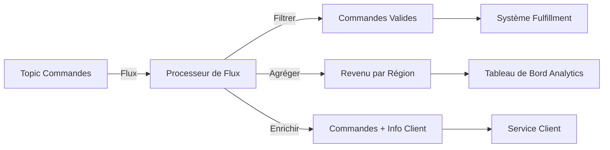

# Traiter des Flux de Données avec Kafka

Apprenez à transformer, agréger et enrichir des données en temps réel avec Kafka Streams et Apache Flink.

---

## Ce que Vous Allez Apprendre

À la fin de ce guide, vous serez capable de :

- ✅ Comprendre les concepts et cas d'usage du traitement de flux
- ✅ Créer des transformations sans état et avec état
- ✅ Implémenter du fenêtrage et des agrégations temporelles
- ✅ Joindre des flux et des tables en temps réel
- ✅ Utiliser Kafka Streams pour du traitement léger
- ✅ Utiliser Apache Flink pour de l'analytique avancée
- ✅ Déployer des applications de traitement de flux en production

**Prérequis :**

- Docker et Docker Compose installés
- Compréhension des producteurs et consommateurs
- Familiarité avec Java ou Python (pour les exemples de code)

**Temps Estimé :** 45 minutes

---

## Démarrage Rapide : Exécuter Kafka avec Docker Compose

Utilisez cette configuration Docker Compose pour exécuter un cluster Kafka à nœud unique avec **KRaft** (pas besoin de Zookeeper) :

```yaml title="docker-compose.yml" linenums="1"
version: "3.8"

services:
  kafka:
    image: confluentinc/cp-kafka:latest # (1)!
    container_name: kafka-kraft
    ports:
      - "9092:9092" # (2)!
    environment:
      # Paramètres KRaft
      KAFKA_NODE_ID: 1 # (3)!
      KAFKA_PROCESS_ROLES: broker,controller # (4)!
      KAFKA_LISTENERS: PLAINTEXT://0.0.0.0:9092,CONTROLLER://0.0.0.0:9093 # (5)!
      KAFKA_ADVERTISED_LISTENERS: PLAINTEXT://localhost:9092 # (6)!
      KAFKA_CONTROLLER_LISTENER_NAMES: CONTROLLER
      KAFKA_LISTENER_SECURITY_PROTOCOL_MAP: CONTROLLER:PLAINTEXT,PLAINTEXT:PLAINTEXT
      KAFKA_CONTROLLER_QUORUM_VOTERS: 1@localhost:9093 # (7)!

      # ID du cluster (générer avec: kafka-storage random-uuid)
      CLUSTER_ID: MkU3OEVBNTcwNTJENDM2Qk # (8)!

      # Stockage
      KAFKA_LOG_DIRS: /var/lib/kafka/data # (9)!

      # Désactiver les métriques Confluent (optionnel pour configuration minimale)
      KAFKA_CONFLUENT_SUPPORT_METRICS_ENABLE: "false" # (10)!

      # Optimisations pour le traitement de flux
      KAFKA_NUM_PARTITIONS: 3 # (11)!
      KAFKA_DEFAULT_REPLICATION_FACTOR: 1
      KAFKA_MIN_INSYNC_REPLICAS: 1
    volumes:
      - kafka-data:/var/lib/kafka/data
    healthcheck:
      test: ["CMD-SHELL", "kafka-broker-api-versions --bootstrap-server localhost:9092"]
      interval: 10s
      timeout: 5s
      retries: 5

volumes:
  kafka-data:
    driver: local
```

1. Image Confluent Platform Kafka (inclut le mode KRaft)
2. Port du broker Kafka exposé à l'hôte
3. ID de nœud unique dans le cluster KRaft
4. Ce nœud agit à la fois comme broker et controller (mode combiné)
5. Listeners : PLAINTEXT pour les clients, CONTROLLER pour la communication interne du cluster
6. Listener annoncé pour les clients externes
7. Votants du quorum pour le consensus KRaft (format : `id@host:port`)
8. ID de cluster unique - générer avec `docker run confluentinc/cp-kafka kafka-storage random-uuid`
9. Répertoire de logs pour le stockage des données Kafka
10. Désactiver la collecte de métriques Confluent Support pour une configuration locale minimale
11. Nombre de partitions par défaut pour les nouveaux topics (bon pour le traitement de flux parallèle)

### Démarrer Kafka et Créer les Topics

```bash
# Démarrer Kafka
docker-compose up -d

# Attendre que Kafka soit prêt
docker-compose ps

# Créer les topics d'entrée pour le traitement de flux
docker exec kafka-kraft kafka-topics \
  --bootstrap-server localhost:9092 \
  --create --topic orders --partitions 3 --replication-factor 1

docker exec kafka-kraft kafka-topics \
  --bootstrap-server localhost:9092 \
  --create --topic customers --partitions 3 --replication-factor 1 \
  --config cleanup.policy=compact  # (1)!

# Produire des données d'exemple
docker exec -i kafka-kraft kafka-console-producer \
  --bootstrap-server localhost:9092 \
  --topic orders \
  --property "parse.key=true" \
  --property "key.separator=:" << EOF
ORD-001:{"order_id":"ORD-001","customer_id":"CUST-123","amount":99.99,"region":"US-WEST"}
ORD-002:{"order_id":"ORD-002","customer_id":"CUST-456","amount":149.50,"region":"US-EAST"}
ORD-003:{"order_id":"ORD-003","customer_id":"CUST-123","amount":75.25,"region":"US-WEST"}
EOF

# Arrêter Kafka
docker-compose down
```

1. Topic compacté pour les données client (garde uniquement la dernière valeur par clé)

!!! tip "Vérifier la Configuration du Traitement de Flux"
```bash # Lister les topics
docker exec kafka-kraft kafka-topics \
 --bootstrap-server localhost:9092 --list

    # Consommer depuis le topic orders
    docker exec kafka-kraft kafka-console-consumer \
      --bootstrap-server localhost:9092 \
      --topic orders --from-beginning --max-messages 3
    ```

!!! warning "Exécution des Applications Kafka Streams"
Les applications Kafka Streams s'exécutent comme des **processus Java séparés**, pas à l'intérieur de Kafka :

    ```bash
    # Construire votre application Kafka Streams
    mvn clean package

    # Exécuter localement (se connecte à Docker Kafka)
    java -jar target/stream-processor-1.0.jar
    ```

    Pour Flink, vous aurez besoin d'un cluster Flink séparé (voir la section [Stratégies de Déploiement](#stratégies-de-déploiement)).

---

## Qu'est-ce que le Traitement de Flux ?

Le **Traitement de Flux** est le traitement en temps réel de flux de données continus. Contrairement au traitement par lot (qui traite des données historiques), le traitement de flux analyse les données dès leur arrivée—permettant des insights et actions instantanés.

!!! info "Traitement de Flux vs Traitement par Lot"
**Traitement par Lot :** Traiter les données en gros morceaux chaque heure/jour (ex: jobs ETL nocturnes)  
 **Traitement de Flux :** Traiter chaque événement immédiatement à son arrivée (ex: détection de fraude, tableaux de bord temps réel)



!!! tip "Quand Utiliser le Traitement de Flux" - **Analytique temps réel** - Tableaux de bord live, métriques, surveillance - **Actions pilotées par événements** - Détection de fraude, alertes, notifications - **Enrichissement de données** - Joindre des événements avec des données de référence en temps réel - **ETL continu** - Transformer et router les données entre systèmes - **Traitement d'événements complexes** - Détecter des patterns à travers plusieurs événements

---

## Frameworks de Traitement de Flux

L'écosystème Kafka offre deux frameworks principaux :

<div class="grid cards" markdown>

- **:simple-apachekafka: Kafka Streams**

  ***

  **Idéal Pour :** Traitement léger et embarqué

  **Avantages :**
  - Bibliothèque Java - pas de cluster séparé nécessaire
  - Sémantique exactly-once intégrée
  - Auto-scaling avec groupes de consommateurs
  - Déploiement simple (juste un fichier JAR)

  **Inconvénients :**
  - Java/Scala uniquement (pas de Python)
  - Limité à Kafka comme source/sink
  - Fonctionnalités analytiques avancées limitées

- **:simple-apacheflink: Apache Flink**

  ***

  **Idéal Pour :** Analytique avancée, CEP complexe

  **Avantages :**
  - Interface SQL puissante
  - Fenêtrage et jointures avancés
  - Support Python (PyFlink)
  - Sources/sinks multiples (Kafka, bases de données, fichiers)

  **Inconvénients :**
  - Nécessite un cluster séparé (JobManager + TaskManagers)
  - Complexité opérationnelle plus élevée
  - Empreinte mémoire plus lourde

</div>

!!! tip "Quel Framework Choisir ?" - **Commencez avec Kafka Streams** si vous avez besoin de transformations simples et voulez un minimum de surcharge opérationnelle - **Utilisez Apache Flink** si vous avez besoin de SQL, support Python, ou fenêtrage/jointures avancés

---

## Étape 1 : Transformations Sans État (Filter, Map)

Les opérations sans état traitent chaque événement indépendamment sans mémoriser les événements précédents.

### Exemple Kafka Streams : Filtrer et Transformer les Commandes

=== ":simple-openjdk: Java (Kafka Streams)"

    ```java title="OrderProcessor.java" linenums="1" hl_lines="15-19 21-25"
    import org.apache.kafka.streams.*;
    import org.apache.kafka.streams.kstream.*;
    import org.apache.kafka.common.serialization.Serdes;

    public class OrderProcessor {
        public static void main(String[] args) {
            Properties props = new Properties();
            props.put(StreamsConfig.APPLICATION_ID_CONFIG, "order-processor");  // (1)!
            props.put(StreamsConfig.BOOTSTRAP_SERVERS_CONFIG, "localhost:9092");
            props.put(StreamsConfig.DEFAULT_KEY_SERDE_CLASS_CONFIG, Serdes.String().getClass());
            props.put(StreamsConfig.DEFAULT_VALUE_SERDE_CLASS_CONFIG, Serdes.String().getClass());

            StreamsBuilder builder = new StreamsBuilder();

            // Lire depuis le topic orders
            KStream<String, String> orders = builder.stream("orders");  // (2)!

            // Filtrer : uniquement les commandes de grande valeur (> $100)
            KStream<String, String> highValueOrders = orders.filter(  // (3)!
                (key, value) -> parseAmount(value) > 100.0
            );

            // Map : ajouter le flag VIP aux commandes de grande valeur
            KStream<String, String> vipOrders = highValueOrders.mapValues(  // (4)!
                value -> value + ",vip=true"
            );

            // Écrire vers un nouveau topic
            vipOrders.to("vip-orders");  // (5)!

            KafkaStreams streams = new KafkaStreams(builder.build(), props);
            streams.start();

            Runtime.getRuntime().addShutdownHook(new Thread(streams::close));
        }

        private static double parseAmount(String json) {
            // Parser le JSON et extraire le champ amount
            return 150.0; // Simplifié
        }
    }
    ```

    1. ID d'application - utilisé pour le groupe de consommateurs et le nommage des state stores
    2. Lire le flux depuis le topic `orders` - crée un KStream
    3. Opération de filtre - garde uniquement les commandes > $100 (sans état)
    4. Opération de map - transforme chaque commande en ajoutant le flag VIP
    5. Écrire le flux filtré/transformé vers le topic `vip-orders`

=== ":simple-python: Python (Flink)"

    ```python title="order_processor.py" linenums="1"
    from pyflink.datastream import StreamExecutionEnvironment
    from pyflink.datastream.connectors.kafka import KafkaSource, KafkaOffsetsInitializer
    from pyflink.common.serialization import SimpleStringSchema
    import json

    env = StreamExecutionEnvironment.get_execution_environment()

    # Source Kafka
    kafka_source = KafkaSource.builder() \
        .set_bootstrap_servers("localhost:9092") \
        .set_topics("orders") \
        .set_group_id("order-processor") \
        .set_starting_offsets(KafkaOffsetsInitializer.earliest()) \
        .set_value_only_deserializer(SimpleStringSchema()) \
        .build()

    # Lire le flux
    orders = env.from_source(kafka_source, "Kafka Source")  # (1)!

    # Filtrer : uniquement les commandes de grande valeur
    def is_high_value(order_json):
        order = json.loads(order_json)
        return order.get('amount', 0) > 100.0  # (2)!

    high_value_orders = orders.filter(is_high_value)  # (3)!

    # Map : ajouter le flag VIP
    def add_vip_flag(order_json):
        order = json.loads(order_json)
        order['vip'] = True
        return json.dumps(order)  # (4)!

    vip_orders = high_value_orders.map(add_vip_flag)

    # Afficher les résultats (en production, écrire vers un sink Kafka)
    vip_orders.print()

    env.execute("Order Processor")
    ```

    1. Créer un DataStream Flink depuis la source Kafka
    2. Prédicat de filtre - retourner True pour conserver l'événement
    3. Opération de filtre - supprime les commandes de faible valeur
    4. Transformation map - ajoute le flag VIP et retourne une chaîne JSON

### Cas d'Usage pour les Transformations Sans État

- **Filtrage :** Supprimer les événements invalides, router par type, filtrage de conformité
- **Mapping :** Conversion de format, extraction de champs, enrichissement avec des constantes
- **FlatMap :** Parser des événements complexes en plusieurs événements simples

---

## Étape 2 : Agrégations Avec État (Count, Sum)

Les opérations avec état maintiennent un état à travers plusieurs événements—permettant des agrégations comme des comptages, sommes et moyennes.

### Exemple Kafka Streams : Compter les Commandes par Région

=== ":simple-openjdk: Java (Kafka Streams)"

    ```java title="RegionalOrderCount.java" linenums="1" hl_lines="16-20 22-26"
    import org.apache.kafka.streams.*;
    import org.apache.kafka.streams.kstream.*;
    import org.apache.kafka.common.serialization.Serdes;

    public class RegionalOrderCount {
        public static void main(String[] args) {
            Properties props = new Properties();
            props.put(StreamsConfig.APPLICATION_ID_CONFIG, "regional-order-count");
            props.put(StreamsConfig.BOOTSTRAP_SERVERS_CONFIG, "localhost:9092");

            StreamsBuilder builder = new StreamsBuilder();

            KStream<String, String> orders = builder.stream("orders");

            // Extraire la région de la commande et l'utiliser comme clé
            KStream<String, String> ordersByRegion = orders.selectKey(  // (1)!
                (key, value) -> extractRegion(value)  // la région devient la clé
            );

            // Grouper par clé (région) et compter
            KTable<String, Long> orderCounts = ordersByRegion  // (2)!
                .groupByKey()  // (3)!
                .count(Materialized.as("order-count-store"));  // (4)!

            // Écrire les comptages vers un topic
            orderCounts.toStream().to("order-counts",  // (5)!
                Produced.with(Serdes.String(), Serdes.Long())
            );

            KafkaStreams streams = new KafkaStreams(builder.build(), props);
            streams.start();
        }

        private static String extractRegion(String json) {
            return "US-WEST"; // Simplifié - parser le JSON en réalité
        }
    }
    ```

    1. Re-keyer le flux par région - requis pour le groupement
    2. KTable représente l'état agrégé (région → comptage)
    3. Grouper par clé (région) - prépare pour l'agrégation
    4. Opération de comptage - maintient l'état dans le store RocksDB nommé "order-count-store"
    5. Convertir KTable en KStream et écrire vers le topic de sortie

=== ":simple-python: Python (Flink)"

    ```python title="regional_order_count.py" linenums="1"
    from pyflink.datastream import StreamExecutionEnvironment
    from pyflink.datastream.connectors.kafka import KafkaSource
    from pyflink.common.serialization import SimpleStringSchema
    import json

    env = StreamExecutionEnvironment.get_execution_environment()

    kafka_source = KafkaSource.builder() \
        .set_bootstrap_servers("localhost:9092") \
        .set_topics("orders") \
        .set_group_id("regional-count") \
        .set_value_only_deserializer(SimpleStringSchema()) \
        .build()

    orders = env.from_source(kafka_source, "Kafka Source")

    # Extraire la région de la commande
    def extract_region(order_json):
        order = json.loads(order_json)
        region = order.get('region', 'UNKNOWN')
        return (region, 1)  # (1)!

    region_counts = orders.map(extract_region) \
        .key_by(lambda x: x[0]) \  # (2)!
        .sum(1)  # (3)!

    region_counts.print()

    env.execute("Regional Order Count")
    ```

    1. Transformer en tuple (région, 1) - 1 représente une commande
    2. Keyer par région (premier élément du tuple)
    3. Sommer le second élément (comptage) - Flink maintient l'état automatiquement

!!! warning "Gestion de l'État"
Les opérations avec état nécessitent des **state stores persistants** : - **Kafka Streams :** Utilise RocksDB (base de données clé-valeur embarquée) + topic changelog pour la tolérance aux pannes - **Flink :** Utilise des snapshots de checkpoint vers du stockage distribué (HDFS, S3)

---

## Étape 3 : Fenêtrage et Agrégations Temporelles

Le fenêtrage groupe les événements en buckets temporels—permettant des opérations comme "commandes par minute" ou "revenu par heure".

### Types de Fenêtres

<div class="grid cards" markdown>

- **:material-clock-outline: Fenêtres Tumbling**

  ***

  Fenêtres de taille fixe, non chevauchantes

  **Cas d'Usage :** "Compter les commandes toutes les 5 minutes"

  ```
  [0-5min] [5-10min] [10-15min]
  ```

- **:material-clock-fast: Fenêtres Hopping**

  ***

  Fenêtres de taille fixe, chevauchantes

  **Cas d'Usage :** "Revenu par 10 minutes, mis à jour toutes les 5 minutes"

  ```
  [0-10min]
     [5-15min]
        [10-20min]
  ```

- **:material-clock-check: Fenêtres Sliding**

  ***

  Fenêtre par événement (continue)

  **Cas d'Usage :** "Moyenne des 100 derniers événements"

  ```
  La fenêtre se déplace avec chaque événement
  ```

- **:material-clock-alert: Fenêtres Session**

  ***

  Fenêtres basées sur les écarts (pilotées par l'activité)

  **Cas d'Usage :** "Sessions utilisateur avec timeout d'inactivité de 30min"

  ```
  [Événements...] <écart 30min> [Événements...]
  ```

</div>

### Exemple Kafka Streams : Fenêtre Tumbling (Revenu 5 Minutes)

=== ":simple-openjdk: Java (Kafka Streams)"

    ```java title="WindowedRevenue.java" linenums="1" hl_lines="14-18 20-25"
    import org.apache.kafka.streams.*;
    import org.apache.kafka.streams.kstream.*;
    import java.time.Duration;

    public class WindowedRevenue {
        public static void main(String[] args) {
            Properties props = new Properties();
            props.put(StreamsConfig.APPLICATION_ID_CONFIG, "windowed-revenue");
            props.put(StreamsConfig.BOOTSTRAP_SERVERS_CONFIG, "localhost:9092");

            StreamsBuilder builder = new StreamsBuilder();
            KStream<String, String> orders = builder.stream("orders");

            // Extraire la région et le montant
            KStream<String, Double> regionRevenue = orders.map(  // (1)!
                (key, value) -> KeyValue.pair(
                    extractRegion(value),
                    extractAmount(value)
                )
            );

            // Fenêtre tumbling : buckets de 5 minutes
            TimeWindows tumblingWindow = TimeWindows  // (2)!
                .ofSizeWithNoGrace(Duration.ofMinutes(5));  // (3)!

            // Grouper par région, fenêtre, et sommer
            KTable<Windowed<String>, Double> windowedRevenue = regionRevenue
                .groupByKey()
                .windowedBy(tumblingWindow)  // (4)!
                .reduce(Double::sum);  // (5)!

            // Afficher les résultats fenêtrés
            windowedRevenue.toStream().foreach((windowedKey, revenue) -> {  // (6)!
                String region = windowedKey.key();
                long start = windowedKey.window().start();
                long end = windowedKey.window().end();
                System.out.printf("Région: %s, Fenêtre: [%d-%d], Revenu: $%.2f%n",
                    region, start, end, revenue);
            });

            KafkaStreams streams = new KafkaStreams(builder.build(), props);
            streams.start();
        }

        private static String extractRegion(String json) { return "US-WEST"; }
        private static Double extractAmount(String json) { return 99.99; }
    }
    ```

    1. Transformer le flux en paires (région, montant)
    2. Définir une fenêtre tumbling - buckets fixes de 5 minutes
    3. `ofSizeWithNoGrace` - pas de gestion des événements tardifs (les événements doivent arriver à l'heure)
    4. Appliquer le fenêtrage au flux groupé
    5. Sommer les montants dans chaque fenêtre
    6. La clé fenêtrée contient à la fois la région et les métadonnées de fenêtre (heures début/fin)

=== ":simple-python: Python (Flink SQL)"

    ```python title="windowed_revenue.py" linenums="1"
    from pyflink.table import StreamTableEnvironment, EnvironmentSettings

    # Créer l'environnement Flink SQL
    env_settings = EnvironmentSettings.in_streaming_mode()
    table_env = StreamTableEnvironment.create(env_settings)

    # Définir la table source Kafka avec event time
    table_env.execute_sql("""
        CREATE TABLE orders (
            order_id STRING,
            region STRING,
            amount DOUBLE,
            order_time TIMESTAMP(3),  -- (1)!
            WATERMARK FOR order_time AS order_time - INTERVAL '5' SECOND  -- (2)!
        ) WITH (
            'connector' = 'kafka',
            'topic' = 'orders',
            'properties.bootstrap.servers' = 'localhost:9092',
            'properties.group.id' = 'windowed-revenue',
            'format' = 'json'
        )
    """)

    # Définir la table de sortie
    table_env.execute_sql("""
        CREATE TABLE windowed_revenue (
            region STRING,
            window_start TIMESTAMP(3),
            window_end TIMESTAMP(3),
            total_revenue DOUBLE
        ) WITH (
            'connector' = 'kafka',
            'topic' = 'windowed-revenue',
            'format' = 'json'
        )
    """)

    # Requête SQL avec fenêtre tumbling
    table_env.execute_sql("""
        INSERT INTO windowed_revenue
        SELECT
            region,
            TUMBLE_START(order_time, INTERVAL '5' MINUTE) AS window_start,  -- (3)!
            TUMBLE_END(order_time, INTERVAL '5' MINUTE) AS window_end,
            SUM(amount) AS total_revenue  -- (4)!
        FROM orders
        GROUP BY
            region,
            TUMBLE(order_time, INTERVAL '5' MINUTE)  -- (5)!
    """)
    ```

    1. Colonne event time - timestamp extrait du payload du message
    2. Stratégie de watermark - permet 5 secondes d'événements tardifs
    3. Heure de début de fenêtre - début de la fenêtre tumbling de 5 minutes
    4. Fonction d'agrégation - sommer le revenu dans la fenêtre
    5. Définition de fenêtre tumbling - groupe les événements en buckets de 5 minutes

!!! tip "Event Time vs Processing Time" - **Event Time :** Timestamp provenant de l'événement lui-même (ex: heure de création de commande) - **utilisez ceci pour une analytique précise** - **Processing Time :** Timestamp quand l'événement est traité par le processeur de flux - plus simple mais moins précis

---

## Étape 4 : Jointure de Flux et Tables

Les jointures combinent des données de plusieurs flux ou tables en temps réel—permettant l'enrichissement et la corrélation.

### Types de Jointures

| Type de Jointure  | Description                                    | Cas d'Usage                                            |
| ----------------- | ---------------------------------------------- | ------------------------------------------------------ |
| **Stream-Stream** | Joindre deux flux d'événements                 | Corréler des événements liés (ex: commande + paiement) |
| **Stream-Table**  | Enrichir un flux avec des données de référence | Ajouter les infos client aux commandes                 |
| **Table-Table**   | Joindre deux tables (KTables)                  | Combiner des vues agrégées                             |

### Exemple Kafka Streams : Enrichir les Commandes avec les Données Client

=== ":simple-openjdk: Java (Kafka Streams)"

    ```java title="OrderEnrichment.java" linenums="1" hl_lines="15-18 20-24 26-35"
    import org.apache.kafka.streams.*;
    import org.apache.kafka.streams.kstream.*;

    public class OrderEnrichment {
        public static void main(String[] args) {
            Properties props = new Properties();
            props.put(StreamsConfig.APPLICATION_ID_CONFIG, "order-enrichment");
            props.put(StreamsConfig.BOOTSTRAP_SERVERS_CONFIG, "localhost:9092");

            StreamsBuilder builder = new StreamsBuilder();

            // Stream : commandes (clé = customer_id)
            KStream<String, String> orders = builder.stream("orders");

            // Table : info client (clé = customer_id, topic compacté)
            KTable<String, String> customers = builder.table(  // (1)!
                "customers",
                Materialized.as("customer-store")  // (2)!
            );

            // Re-keyer les commandes par customer_id (si nécessaire)
            KStream<String, String> ordersByCustomer = orders.selectKey(  // (3)!
                (key, orderJson) -> extractCustomerId(orderJson)
            );

            // Joindre le stream avec la table (left join)
            KStream<String, String> enrichedOrders = ordersByCustomer.leftJoin(  // (4)!
                customers,  // (5)!
                (orderJson, customerJson) -> {  // (6)!
                    return String.format(
                        "{\"order\": %s, \"customer\": %s}",
                        orderJson, customerJson
                    );
                }
            );

            // Écrire les commandes enrichies vers le topic de sortie
            enrichedOrders.to("enriched-orders");

            KafkaStreams streams = new KafkaStreams(builder.build(), props);
            streams.start();
        }

        private static String extractCustomerId(String json) { return "CUST-123"; }
    }
    ```

    1. KTable depuis un topic compacté - représente l'état actuel des clients
    2. Vue matérialisée stockée dans RocksDB pour des recherches rapides
    3. Re-keyer le flux de commandes pour correspondre à la clé de la table client (customer_id)
    4. Left join - conserve les commandes même si le client n'est pas trouvé (customerJson = null)
    5. Jointure avec la table client - la recherche se fait dans le state store (rapide)
    6. Value joiner - combine le JSON de commande et client en un événement enrichi

=== ":simple-python: Python (Flink SQL)"

    ```python title="order_enrichment.py"
    from pyflink.table import StreamTableEnvironment, EnvironmentSettings

    env_settings = EnvironmentSettings.in_streaming_mode()
    table_env = StreamTableEnvironment.create(env_settings)

    # Définir le flux de commandes
    table_env.execute_sql("""
        CREATE TABLE orders (
            order_id STRING,
            customer_id STRING,
            amount DOUBLE,
            PRIMARY KEY (order_id) NOT ENFORCED
        ) WITH (
            'connector' = 'kafka',
            'topic' = 'orders',
            'properties.bootstrap.servers' = 'localhost:9092',
            'format' = 'json'
        )
    """)

    # Définir la table clients (topic compacté)
    table_env.execute_sql("""
        CREATE TABLE customers (
            customer_id STRING,
            name STRING,
            email STRING,
            PRIMARY KEY (customer_id) NOT ENFORCED
        ) WITH (
            'connector' = 'kafka',
            'topic' = 'customers',
            'properties.bootstrap.servers' = 'localhost:9092',
            'scan.startup.mode' = 'earliest-offset',  -- (1)!
            'format' = 'json'
        )
    """)

    # Joindre les commandes avec les clients
    result = table_env.sql_query("""
        SELECT
            o.order_id,
            o.customer_id,
            o.amount,
            c.name AS customer_name,  -- (2)!
            c.email AS customer_email
        FROM orders o
        LEFT JOIN customers c  -- (3)!
        ON o.customer_id = c.customer_id
    """)

    result.execute().print()
    ```

    1. Lire toutes les données client depuis le début pour construire l'état
    2. Enrichir la commande avec le nom et l'email du client
    3. Left join - conserve les commandes même si le client n'est pas trouvé

!!! warning "Considérations de Performance des Jointures" - Les **jointures Stream-Table** sont rapides (recherche en mémoire) mais nécessitent que la table tienne en état - Les **jointures Stream-Stream** nécessitent du fenêtrage (joindre les événements dans une fenêtre temporelle) - Utilisez des **topics compactés** pour les tables afin de garder l'état petit (uniquement la dernière valeur par clé)

---

## Étape 5 : Patterns Avancés

### Pattern 1 : Sessionisation (Fenêtres de Session)

Suivre les sessions utilisateur avec timeout d'inactivité :

```java
// Fenêtre de session : grouper les événements avec un écart <30 minutes dans la même session
SessionWindows sessionWindow = SessionWindows.ofInactivityGapWithNoGrace(
    Duration.ofMinutes(30)  // (1)!
);

KTable<Windowed<String>, Long> sessionCounts = clickstream
    .groupByKey()
    .windowedBy(sessionWindow)  // (2)!
    .count();
```

1. Si aucun événement pendant 30 minutes, la session se termine
2. Fenêtres dynamiques - chaque utilisateur peut avoir une durée de session différente

### Pattern 2 : Déduplication

Supprimer les événements dupliqués en utilisant l'état :

```java
KStream<String, String> deduplicated = orders
    .groupByKey()
    .reduce(  // (1)!
        (oldValue, newValue) -> newValue,  // Garder le plus récent
        Materialized.as("dedup-store")
    )
    .toStream();
```

1. Reduce garde une seule valeur par clé - déduplique effectivement

### Pattern 3 : Flux Changelog

Convertir KTable (état) en flux changelog :

```java
KTable<String, Long> counts = orders.groupByKey().count();

KStream<String, Long> changelog = counts.toStream();  // (1)!
// Émet : (key=US-WEST, value=1), (key=US-WEST, value=2), ...
```

1. Changelog émet chaque mise à jour d'état - utile pour les systèmes downstream

---

## Étape 6 : Sémantique Exactly-Once

Kafka Streams supporte le traitement exactly-once (EOS) pour éviter les résultats dupliqués.

### Activer Exactly-Once dans Kafka Streams

```java
Properties props = new Properties();
props.put(StreamsConfig.APPLICATION_ID_CONFIG, "order-processor");
props.put(StreamsConfig.BOOTSTRAP_SERVERS_CONFIG, "localhost:9092");
props.put(StreamsConfig.PROCESSING_GUARANTEE_CONFIG,
    StreamsConfig.EXACTLY_ONCE_V2);  // (1)!

KafkaStreams streams = new KafkaStreams(builder.build(), props);
streams.start();
```

1. Exactly-once v2 - utilise des écritures transactionnelles et des producteurs idempotents

!!! danger "Exigences Exactly-Once" - Kafka 2.5+ requis pour EOS v2 - Facteur de réplication ≥ 3 recommandé - `min.insync.replicas` ≥ 2 - Légère surcharge de performance (~5-10%) vs at-least-once

---

## Bonnes Pratiques

<div class="grid cards" markdown>

- **:material-check-circle: À FAIRE**

  ***
  - Utiliser **event time** (pas processing time) pour le fenêtrage
  - Activer la **sémantique exactly-once** pour les applications critiques
  - Utiliser des **topics compactés** pour les KTables (rétention changelog)
  - Surveiller le **lag consommateur** et la **taille du state store**
  - Tester avec des **événements hors ordre et tardifs**

- **:material-close-circle: À ÉVITER**

  ***
  - Stocker un état non borné (utiliser le fenêtrage ou TTL)
  - Utiliser de grandes fenêtres sans ajuster la taille du state store
  - Supposer que les événements arrivent dans l'ordre (gérer les événements tardifs)
  - Ignorer le rééquilibrage et le temps de migration d'état
  - Traiter des données sensibles sans chiffrement

</div>

### Liste de Vérification Production

- [x] Sémantique exactly-once activée pour les apps critiques
- [x] State stores configurés avec rétention appropriée
- [x] Surveillance : lag consommateur, latence traitement, taille état
- [x] Tolérance aux pannes : topics changelog répliqués (RF ≥ 3)
- [x] Scaling : instances multiples pour traitement parallèle
- [x] Gestion d'erreurs : dead letter queue pour messages empoisonnés
- [x] Tests : tests unitaires avec TopologyTestDriver (Kafka Streams)

---

## Dépannage

??? bug "Erreur : `StreamsException: State store not found`"
**Cause :** State store non matérialisé ou requête avant prêt

    **Solution :**
    1. S'assurer que le state store est matérialisé :
       ```java
       .count(Materialized.as("my-store"))
       ```
    2. Attendre la restauration de l'état après rééquilibrage :
       ```java
       streams.setStateListener((newState, oldState) -> {
           if (newState == KafkaStreams.State.RUNNING) {
               // État restauré, prêt à requêter
           }
       });
       ```

??? bug "Erreur : `Late events dropped by window`"
**Cause :** Événements arrivés après fermeture de la fenêtre (au-delà de la latence autorisée)

    **Solution :**
    1. Augmenter la période de grâce pour les événements tardifs :
       ```java
       TimeWindows.ofSizeAndGrace(
           Duration.ofMinutes(5),  // Taille fenêtre
           Duration.ofMinutes(1)   // Permettre 1 minute de latence
       )
       ```
    2. Utiliser des watermarks dans Flink pour gérer les événements tardifs
    3. Surveiller les métriques d'événements tardifs

??? bug "Erreur : `RocksDB out of memory`"
**Cause :** State store devenu trop grand pour la mémoire disponible

    **Solution :**
    1. Ajouter du fenêtrage pour borner la taille de l'état
    2. Augmenter le cache de bloc RocksDB :
       ```java
       props.put(StreamsConfig.ROCKSDB_CONFIG_SETTER_CLASS_CONFIG,
           CustomRocksDBConfig.class);
       ```
    3. Scaler horizontalement (plus d'instances = état partitionné)
    4. Utiliser TTL pour les entrées d'état

---

## Exemple Complet : Détection de Fraude en Temps Réel

```java title="FraudDetector.java" linenums="1"
import org.apache.kafka.streams.*;
import org.apache.kafka.streams.kstream.*;
import java.time.Duration;

public class FraudDetector {
    public static void main(String[] args) {
        Properties props = new Properties();
        props.put(StreamsConfig.APPLICATION_ID_CONFIG, "fraud-detector");
        props.put(StreamsConfig.BOOTSTRAP_SERVERS_CONFIG, "localhost:9092");
        props.put(StreamsConfig.PROCESSING_GUARANTEE_CONFIG,
            StreamsConfig.EXACTLY_ONCE_V2);  // Exactly-once pour la précision

        StreamsBuilder builder = new StreamsBuilder();

        // Entrée : événements de transaction
        KStream<String, Transaction> transactions = builder.stream(
            "transactions",
            Consumed.with(Serdes.String(), transactionSerde())
        );

        // Règle 1 : Signaler les transactions de grande valeur (>$10,000)
        KStream<String, Transaction> highValue = transactions.filter(
            (key, txn) -> txn.amount > 10000.0
        );

        // Règle 2 : Détecter les transactions successives rapides (>3 en 5 minutes)
        KTable<Windowed<String>, Long> transactionCounts = transactions
            .groupByKey()
            .windowedBy(TimeWindows.ofSizeAndGrace(
                Duration.ofMinutes(5),
                Duration.ofMinutes(1)
            ))
            .count();

        KStream<String, Long> rapidTransactions = transactionCounts
            .toStream()
            .filter((windowedKey, count) -> count > 3)
            .selectKey((windowedKey, count) -> windowedKey.key());

        // Règle 3 : Détecter les transactions depuis nouveaux emplacements (jointure avec profil utilisateur)
        KTable<String, UserProfile> userProfiles = builder.table("user-profiles");

        KStream<String, String> suspiciousLocations = transactions
            .selectKey((key, txn) -> txn.userId)  // Re-keyer par user_id
            .leftJoin(
                userProfiles,
                (txn, profile) -> {
                    if (profile != null && !profile.knownLocations.contains(txn.location)) {
                        return String.format("Nouvel emplacement: %s pour utilisateur %s",
                            txn.location, txn.userId);
                    }
                    return null;
                }
            )
            .filter((key, alert) -> alert != null);

        // Combiner tous les signaux de fraude
        highValue.mapValues(txn -> "Grande valeur: $" + txn.amount)
            .to("fraud-alerts");

        rapidTransactions.mapValues(count -> "Transactions rapides: " + count)
            .to("fraud-alerts");

        suspiciousLocations.to("fraud-alerts");

        KafkaStreams streams = new KafkaStreams(builder.build(), props);
        streams.start();

        Runtime.getRuntime().addShutdownHook(new Thread(streams::close));
    }

    // Classes POJO simplifiées
    static class Transaction {
        String txnId;
        String userId;
        double amount;
        String location;
    }

    static class UserProfile {
        String userId;
        List<String> knownLocations;
    }

    private static Serde<Transaction> transactionSerde() {
        // Implémentation serde JSON
        return null; // Simplifié
    }
}
```

---

## Stratégies de Déploiement

### Déploiement Kafka Streams

```yaml title="kubernetes-deployment.yaml"
apiVersion: apps/v1
kind: Deployment
metadata:
  name: order-processor
spec:
  replicas: 3 # (1)!
  selector:
    matchLabels:
      app: order-processor
  template:
    metadata:
      labels:
        app: order-processor
    spec:
      containers:
        - name: processor
          image: order-processor:1.0
          env:
            - name: KAFKA_BOOTSTRAP_SERVERS
              value: "kafka:9092"
          resources: # (2)!
            requests:
              memory: "2Gi"
              cpu: "1"
            limits:
              memory: "4Gi"
              cpu: "2"
```

1. 3 réplicas pour traitement parallèle - auto-scaling possible
2. Limites de ressources - le state store RocksDB nécessite de la mémoire

### Déploiement Flink

```yaml title="flink-cluster.yaml"
apiVersion: flink.apache.org/v1beta1
kind: FlinkDeployment
metadata:
  name: flink-stream-processor
spec:
  image: flink:1.18
  flinkVersion: v1_18
  jobManager: # (1)!
    replicas: 1
    resource:
      memory: "2Gi"
      cpu: 1
  taskManager: # (2)!
    replicas: 3
    resource:
      memory: "4Gi"
      cpu: 2
  job:
    jarURI: s3://my-bucket/stream-processor.jar
    parallelism: 6 # (3)!
    upgradeMode: stateful # (4)!
```

1. JobManager - orchestre l'exécution du job
2. TaskManagers - exécutent les tâches parallèles
3. Niveau de parallélisme - distribuer le travail à travers les slots de tâche
4. Mise à jour avec état - préserver l'état lors du redéploiement

---

## Prochaines Étapes

Maintenant que vous comprenez le traitement de flux, explorez :

- **[Kafka Connect](kafka-connect-systems.md)** - Intégrer le traitement de flux avec des systèmes externes
- **[Schema Registry](kafka-use-schema-registry.md)** - Utiliser Avro pour une sérialisation de flux efficace
- **[Démarrer avec Kafka](../tutorials/kafka-getting-started.md)** - Revoir les fondamentaux de Kafka

---

## Ressources Additionnelles

### Documentation Officielle

- [Documentation Apache Kafka Streams](https://kafka.apache.org/documentation/streams/)
- [Javadoc API Kafka Streams](https://kafka.apache.org/documentation/streams/javadocs/)
- [Documentation Apache Flink](https://flink.apache.org/docs/stable/)
- [Connecteur Kafka pour Flink](https://nightlies.apache.org/flink/flink-docs-stable/docs/connectors/datastream/kafka/)

### Tutoriels & Cours

- [Cours Kafka Streams 101](https://developer.confluent.io/learn-kafka/kafka-streams/get-started/) - Cours gratuit Confluent
- [Formation Pratique Apache Flink](https://flink.apache.org/training.html)
- [Fondamentaux du Traitement de Flux](https://www.confluent.io/learn/stream-processing/)
- [Tutoriel Construction d'Applications Streaming](https://kafka.apache.org/documentation/streams/tutorial)

### Livres & Guides

- [Designing Event-Driven Systems](https://www.confluent.io/resources/ebook/designing-event-driven-systems/) - Livre gratuit O'Reilly par Ben Stopford
- [Stream Processing with Apache Flink](https://www.oreilly.com/library/view/stream-processing-with/9781491974285/) - Fabian Hueske & Vasiliki Kalavri
- [Kafka Streams in Action](https://www.manning.com/books/kafka-streams-in-action) - Bill Bejeck
- [Mastering Kafka Streams](https://www.oreilly.com/library/view/mastering-kafka-streams/9781492062486/) - Mitch Seymour

### Sujets Avancés

- [State Stores Kafka Streams](https://kafka.apache.org/documentation/streams/developer-guide/processor-api.html#state-stores)
- [Gestion d'État Flink](https://nightlies.apache.org/flink/flink-docs-stable/docs/dev/datastream/fault-tolerance/state/)
- [Sémantique Exactly-Once dans Kafka Streams](https://www.confluent.io/blog/exactly-once-semantics-are-possible-heres-how-apache-kafka-does-it/)
- [Comparaison des Stratégies de Fenêtrage](https://www.confluent.io/blog/windowing-in-kafka-streams/)

---

!!! info "Attribution du Cours"
Ce guide est basé sur le contenu de la documentation Apache Kafka Streams, la documentation Apache Flink, les tutoriels Confluent, et les meilleures pratiques de l'industrie.
