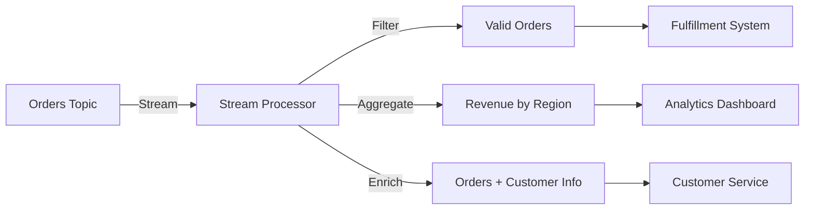

# Process Data Streams with Kafka

Learn how to transform, aggregate, and enrich data in real-time using Kafka Streams and Apache Flink.

---

## What You'll Learn

By the end of this guide, you'll be able to:

- ✅ Understand stream processing concepts and use cases
- ✅ Build stateless and stateful transformations
- ✅ Implement windowing and time-based aggregations
- ✅ Join streams and tables in real-time
- ✅ Use Kafka Streams for lightweight processing
- ✅ Use Apache Flink for advanced analytics
- ✅ Deploy stream processing applications in production

**Prerequisites:**

- Docker and Docker Compose installed
- Understanding of producers and consumers
- Familiarity with Java or Python (for code examples)

**Estimated Time:** 45 minutes

---

## Quick Start: Run Kafka with Docker Compose

Use this Docker Compose configuration to run a single-node Kafka cluster with **KRaft** (no Zookeeper needed):

```yaml title="docker-compose.yml" linenums="1"
version: "3.8"

services:
  kafka:
    image: confluentinc/cp-kafka:latest # (1)!
    container_name: kafka-kraft
    ports:
      - "9092:9092" # (2)!
    environment:
      # KRaft settings
      KAFKA_NODE_ID: 1 # (3)!
      KAFKA_PROCESS_ROLES: broker,controller # (4)!
      KAFKA_LISTENERS: PLAINTEXT://0.0.0.0:9092,CONTROLLER://0.0.0.0:9093 # (5)!
      KAFKA_ADVERTISED_LISTENERS: PLAINTEXT://localhost:9092 # (6)!
      KAFKA_CONTROLLER_LISTENER_NAMES: CONTROLLER
      KAFKA_LISTENER_SECURITY_PROTOCOL_MAP: CONTROLLER:PLAINTEXT,PLAINTEXT:PLAINTEXT
      KAFKA_CONTROLLER_QUORUM_VOTERS: 1@localhost:9093 # (7)!

      # Cluster ID (generate with: kafka-storage random-uuid)
      CLUSTER_ID: MkU3OEVBNTcwNTJENDM2Qk # (8)!

      # Storage
      KAFKA_LOG_DIRS: /var/lib/kafka/data # (9)!

      # Disable Confluent metrics (optional for minimal setup)
      KAFKA_CONFLUENT_SUPPORT_METRICS_ENABLE: "false" # (10)!

      # Stream processing optimizations
      KAFKA_NUM_PARTITIONS: 3 # (11)!
      KAFKA_DEFAULT_REPLICATION_FACTOR: 1
      KAFKA_MIN_INSYNC_REPLICAS: 1
    volumes:
      - kafka-data:/var/lib/kafka/data
    healthcheck:
      test: ["CMD-SHELL", "kafka-broker-api-versions --bootstrap-server localhost:9092"]
      interval: 10s
      timeout: 5s
      retries: 5

volumes:
  kafka-data:
    driver: local
```

1. Confluent Platform Kafka image (includes KRaft mode)
2. Kafka broker port exposed to host
3. Unique node ID in the KRaft cluster
4. This node acts as both broker and controller (combined mode)
5. Listeners: PLAINTEXT for clients, CONTROLLER for internal cluster communication
6. Advertised listener for external clients
7. Quorum voters for KRaft consensus (format: `id@host:port`)
8. Unique cluster ID - generate with `docker run confluentinc/cp-kafka kafka-storage random-uuid`
9. Log directory for Kafka data storage
10. Disable Confluent Support metrics collection for minimal local setup
11. Default partition count for new topics (good for parallel stream processing)

### Start Kafka and Create Topics

```bash
# Start Kafka
docker-compose up -d

# Wait for Kafka to be ready
docker-compose ps

# Create input topics for stream processing
docker exec kafka-kraft kafka-topics \
  --bootstrap-server localhost:9092 \
  --create --topic orders --partitions 3 --replication-factor 1

docker exec kafka-kraft kafka-topics \
  --bootstrap-server localhost:9092 \
  --create --topic customers --partitions 3 --replication-factor 1 \
  --config cleanup.policy=compact  # (1)!

# Produce sample data
docker exec -i kafka-kraft kafka-console-producer \
  --bootstrap-server localhost:9092 \
  --topic orders \
  --property "parse.key=true" \
  --property "key.separator=:" << EOF
ORD-001:{"order_id":"ORD-001","customer_id":"CUST-123","amount":99.99,"region":"US-WEST"}
ORD-002:{"order_id":"ORD-002","customer_id":"CUST-456","amount":149.50,"region":"US-EAST"}
ORD-003:{"order_id":"ORD-003","customer_id":"CUST-123","amount":75.25,"region":"US-WEST"}
EOF

# Stop Kafka
docker-compose down
```

1. Compacted topic for customer data (keeps only latest value per key)

!!! tip "Verify Stream Processing Setup"
```bash # List topics
docker exec kafka-kraft kafka-topics \
 --bootstrap-server localhost:9092 --list

    # Consume from orders topic
    docker exec kafka-kraft kafka-console-consumer \
      --bootstrap-server localhost:9092 \
      --topic orders --from-beginning --max-messages 3
    ```

!!! warning "Running Kafka Streams Applications"
Kafka Streams applications run as **separate Java processes**, not inside Kafka:

    ```bash
    # Build your Kafka Streams application
    mvn clean package

    # Run locally (connects to Docker Kafka)
    java -jar target/stream-processor-1.0.jar
    ```

    For Flink, you'll need a separate Flink cluster (see [Deployment Strategies](#deployment-strategies) section).

---

## What is Stream Processing?

**Stream Processing** is the real-time processing of continuous data streams. Unlike batch processing (which processes historical data), stream processing analyzes data as it arrives—enabling instant insights and actions.

!!! info "Stream Processing vs Batch Processing"
**Batch Processing:** Process data in large chunks every hour/day (e.g., nightly ETL jobs)  
 **Stream Processing:** Process each event immediately as it arrives (e.g., fraud detection, real-time dashboards)



!!! tip "When to Use Stream Processing" - **Real-time analytics** - Live dashboards, metrics, monitoring - **Event-driven actions** - Fraud detection, alerting, notifications - **Data enrichment** - Join events with reference data in real-time - **Continuous ETL** - Transform and route data between systems - **Complex event processing** - Detect patterns across multiple events

---

## Stream Processing Frameworks

Kafka ecosystem offers two main frameworks:

<div class="grid cards" markdown>

- **:simple-apachekafka: Kafka Streams**

  ***

  **Best For:** Lightweight, embedded processing

  **Pros:**
  - Java library - no separate cluster needed
  - Exactly-once semantics built-in
  - Auto-scaling with consumer groups
  - Simple deployment (just a JAR file)

  **Cons:**
  - Java/Scala only (no Python)
  - Limited to Kafka as source/sink
  - Less advanced analytics features

- **:simple-apacheflink: Apache Flink**

  ***

  **Best For:** Advanced analytics, complex CEP

  **Pros:**
  - Powerful SQL interface
  - Advanced windowing and joins
  - Python support (PyFlink)
  - Multiple sources/sinks (Kafka, databases, files)

  **Cons:**
  - Requires separate cluster (JobManager + TaskManagers)
  - More operational complexity
  - Heavier resource footprint

</div>

!!! tip "Which Framework to Choose?" - **Start with Kafka Streams** if you need simple transformations and want minimal ops overhead - **Use Apache Flink** if you need SQL, Python support, or advanced windowing/joins

---

## Step 1: Stateless Transformations (Filter, Map)

Stateless operations process each event independently without remembering previous events.

### Kafka Streams Example: Filter and Transform Orders

=== ":simple-openjdk: Java (Kafka Streams)"

    ```java title="OrderProcessor.java" linenums="1" hl_lines="15-19 21-25"
    import org.apache.kafka.streams.*;
    import org.apache.kafka.streams.kstream.*;
    import org.apache.kafka.common.serialization.Serdes;

    public class OrderProcessor {
        public static void main(String[] args) {
            Properties props = new Properties();
            props.put(StreamsConfig.APPLICATION_ID_CONFIG, "order-processor");  // (1)!
            props.put(StreamsConfig.BOOTSTRAP_SERVERS_CONFIG, "localhost:9092");
            props.put(StreamsConfig.DEFAULT_KEY_SERDE_CLASS_CONFIG, Serdes.String().getClass());
            props.put(StreamsConfig.DEFAULT_VALUE_SERDE_CLASS_CONFIG, Serdes.String().getClass());

            StreamsBuilder builder = new StreamsBuilder();

            // Read from orders topic
            KStream<String, String> orders = builder.stream("orders");  // (2)!

            // Filter: only high-value orders (> $100)
            KStream<String, String> highValueOrders = orders.filter(  // (3)!
                (key, value) -> parseAmount(value) > 100.0
            );

            // Map: add VIP flag to high-value orders
            KStream<String, String> vipOrders = highValueOrders.mapValues(  // (4)!
                value -> value + ",vip=true"
            );

            // Write to new topic
            vipOrders.to("vip-orders");  // (5)!

            KafkaStreams streams = new KafkaStreams(builder.build(), props);
            streams.start();

            Runtime.getRuntime().addShutdownHook(new Thread(streams::close));
        }

        private static double parseAmount(String json) {
            // Parse JSON and extract amount field
            return 150.0; // Simplified
        }
    }
    ```

    1. Application ID - used for consumer group and state store naming
    2. Read stream from `orders` topic - creates a KStream
    3. Filter operation - only keeps orders > $100 (stateless)
    4. Map operation - transforms each order by adding VIP flag
    5. Write filtered/transformed stream to `vip-orders` topic

=== ":simple-python: Python (Flink)"

    ```python title="order_processor.py" linenums="1"
    from pyflink.datastream import StreamExecutionEnvironment
    from pyflink.datastream.connectors.kafka import KafkaSource, KafkaOffsetsInitializer
    from pyflink.common.serialization import SimpleStringSchema
    import json

    env = StreamExecutionEnvironment.get_execution_environment()

    # Kafka source
    kafka_source = KafkaSource.builder() \
        .set_bootstrap_servers("localhost:9092") \
        .set_topics("orders") \
        .set_group_id("order-processor") \
        .set_starting_offsets(KafkaOffsetsInitializer.earliest()) \
        .set_value_only_deserializer(SimpleStringSchema()) \
        .build()

    # Read stream
    orders = env.from_source(kafka_source, "Kafka Source")  # (1)!

    # Filter: only high-value orders
    def is_high_value(order_json):
        order = json.loads(order_json)
        return order.get('amount', 0) > 100.0  # (2)!

    high_value_orders = orders.filter(is_high_value)  # (3)!

    # Map: add VIP flag
    def add_vip_flag(order_json):
        order = json.loads(order_json)
        order['vip'] = True
        return json.dumps(order)  # (4)!

    vip_orders = high_value_orders.map(add_vip_flag)

    # Print results (in production, write to Kafka sink)
    vip_orders.print()

    env.execute("Order Processor")
    ```

    1. Create Flink DataStream from Kafka source
    2. Filter predicate - return True to keep the event
    3. Filter operation - removes low-value orders
    4. Map transformation - adds VIP flag and returns JSON string

### Use Cases for Stateless Transformations

- **Filtering:** Remove invalid events, route by type, compliance filtering
- **Mapping:** Format conversion, field extraction, enrichment with constants
- **FlatMap:** Parse complex events into multiple simple events

---

## Step 2: Stateful Aggregations (Count, Sum)

Stateful operations maintain state across multiple events—enabling aggregations like counts, sums, and averages.

### Kafka Streams Example: Count Orders by Region

=== ":simple-openjdk: Java (Kafka Streams)"

    ```java title="RegionalOrderCount.java" linenums="1" hl_lines="16-20 22-26"
    import org.apache.kafka.streams.*;
    import org.apache.kafka.streams.kstream.*;
    import org.apache.kafka.common.serialization.Serdes;

    public class RegionalOrderCount {
        public static void main(String[] args) {
            Properties props = new Properties();
            props.put(StreamsConfig.APPLICATION_ID_CONFIG, "regional-order-count");
            props.put(StreamsConfig.BOOTSTRAP_SERVERS_CONFIG, "localhost:9092");

            StreamsBuilder builder = new StreamsBuilder();

            KStream<String, String> orders = builder.stream("orders");

            // Extract region from order and use as key
            KStream<String, String> ordersByRegion = orders.selectKey(  // (1)!
                (key, value) -> extractRegion(value)  // region becomes the key
            );

            // Group by key (region) and count
            KTable<String, Long> orderCounts = ordersByRegion  // (2)!
                .groupByKey()  // (3)!
                .count(Materialized.as("order-count-store"));  // (4)!

            // Write counts to topic
            orderCounts.toStream().to("order-counts",  // (5)!
                Produced.with(Serdes.String(), Serdes.Long())
            );

            KafkaStreams streams = new KafkaStreams(builder.build(), props);
            streams.start();
        }

        private static String extractRegion(String json) {
            return "US-WEST"; // Simplified - parse JSON in reality
        }
    }
    ```

    1. Re-key stream by region - required for grouping
    2. KTable represents aggregated state (region → count)
    3. Group by key (region) - prepares for aggregation
    4. Count operation - maintains state in RocksDB store named "order-count-store"
    5. Convert KTable back to KStream and write to output topic

=== ":simple-python: Python (Flink)"

    ```python title="regional_order_count.py" linenums="1"
    from pyflink.datastream import StreamExecutionEnvironment
    from pyflink.datastream.connectors.kafka import KafkaSource
    from pyflink.common.serialization import SimpleStringSchema
    import json

    env = StreamExecutionEnvironment.get_execution_environment()

    kafka_source = KafkaSource.builder() \
        .set_bootstrap_servers("localhost:9092") \
        .set_topics("orders") \
        .set_group_id("regional-count") \
        .set_value_only_deserializer(SimpleStringSchema()) \
        .build()

    orders = env.from_source(kafka_source, "Kafka Source")

    # Extract region from order
    def extract_region(order_json):
        order = json.loads(order_json)
        region = order.get('region', 'UNKNOWN')
        return (region, 1)  # (1)!

    region_counts = orders.map(extract_region) \
        .key_by(lambda x: x[0]) \  # (2)!
        .sum(1)  # (3)!

    region_counts.print()

    env.execute("Regional Order Count")
    ```

    1. Transform to tuple (region, 1) - 1 represents one order
    2. Key by region (first element of tuple)
    3. Sum the second element (count) - Flink maintains state automatically

!!! warning "State Management"
Stateful operations require **persistent state stores**: - **Kafka Streams:** Uses RocksDB (embedded key-value store) + changelog topic for fault tolerance - **Flink:** Uses checkpoint snapshots to distributed storage (HDFS, S3)

---

## Step 3: Windowing and Time-Based Aggregations

Windowing groups events into time buckets—enabling operations like "orders per minute" or "revenue per hour."

### Window Types

<div class="grid cards" markdown>

- **:material-clock-outline: Tumbling Windows**

  ***

  Fixed-size, non-overlapping windows

  **Use Case:** "Count orders every 5 minutes"

  ```
  [0-5min] [5-10min] [10-15min]
  ```

- **:material-clock-fast: Hopping Windows**

  ***

  Fixed-size, overlapping windows

  **Use Case:** "Revenue per 10 minutes, updated every 5 minutes"

  ```
  [0-10min]
     [5-15min]
        [10-20min]
  ```

- **:material-clock-check: Sliding Windows**

  ***

  Window per event (continuous)

  **Use Case:** "Average of last 100 events"

  ```
  Window moves with each event
  ```

- **:material-clock-alert: Session Windows**

  ***

  Gap-based windows (activity-driven)

  **Use Case:** "User sessions with 30-min inactivity timeout"

  ```
  [Events...] <30min gap> [Events...]
  ```

</div>

### Kafka Streams Example: Tumbling Window (5-Minute Revenue)

=== ":simple-openjdk: Java (Kafka Streams)"

    ```java title="WindowedRevenue.java" linenums="1" hl_lines="14-18 20-25"
    import org.apache.kafka.streams.*;
    import org.apache.kafka.streams.kstream.*;
    import java.time.Duration;

    public class WindowedRevenue {
        public static void main(String[] args) {
            Properties props = new Properties();
            props.put(StreamsConfig.APPLICATION_ID_CONFIG, "windowed-revenue");
            props.put(StreamsConfig.BOOTSTRAP_SERVERS_CONFIG, "localhost:9092");

            StreamsBuilder builder = new StreamsBuilder();
            KStream<String, String> orders = builder.stream("orders");

            // Extract region and amount
            KStream<String, Double> regionRevenue = orders.map(  // (1)!
                (key, value) -> KeyValue.pair(
                    extractRegion(value),
                    extractAmount(value)
                )
            );

            // Tumbling window: 5-minute buckets
            TimeWindows tumblingWindow = TimeWindows  // (2)!
                .ofSizeWithNoGrace(Duration.ofMinutes(5));  // (3)!

            // Group by region, window, and sum
            KTable<Windowed<String>, Double> windowedRevenue = regionRevenue
                .groupByKey()
                .windowedBy(tumblingWindow)  // (4)!
                .reduce(Double::sum);  // (5)!

            // Print windowed results
            windowedRevenue.toStream().foreach((windowedKey, revenue) -> {  // (6)!
                String region = windowedKey.key();
                long start = windowedKey.window().start();
                long end = windowedKey.window().end();
                System.out.printf("Region: %s, Window: [%d-%d], Revenue: $%.2f%n",
                    region, start, end, revenue);
            });

            KafkaStreams streams = new KafkaStreams(builder.build(), props);
            streams.start();
        }

        private static String extractRegion(String json) { return "US-WEST"; }
        private static Double extractAmount(String json) { return 99.99; }
    }
    ```

    1. Transform stream to (region, amount) pairs
    2. Define tumbling window - fixed 5-minute buckets
    3. `ofSizeWithNoGrace` - no late event handling (events must arrive on time)
    4. Apply windowing to grouped stream
    5. Sum amounts within each window
    6. Windowed key contains both the region and window metadata (start/end times)

=== ":simple-python: Python (Flink SQL)"

    ```python title="windowed_revenue.py" linenums="1"
    from pyflink.table import StreamTableEnvironment, EnvironmentSettings

    # Create Flink SQL environment
    env_settings = EnvironmentSettings.in_streaming_mode()
    table_env = StreamTableEnvironment.create(env_settings)

    # Define Kafka source table with event time
    table_env.execute_sql("""
        CREATE TABLE orders (
            order_id STRING,
            region STRING,
            amount DOUBLE,
            order_time TIMESTAMP(3),  -- (1)!
            WATERMARK FOR order_time AS order_time - INTERVAL '5' SECOND  -- (2)!
        ) WITH (
            'connector' = 'kafka',
            'topic' = 'orders',
            'properties.bootstrap.servers' = 'localhost:9092',
            'properties.group.id' = 'windowed-revenue',
            'format' = 'json'
        )
    """)

    # Define output table
    table_env.execute_sql("""
        CREATE TABLE windowed_revenue (
            region STRING,
            window_start TIMESTAMP(3),
            window_end TIMESTAMP(3),
            total_revenue DOUBLE
        ) WITH (
            'connector' = 'kafka',
            'topic' = 'windowed-revenue',
            'format' = 'json'
        )
    """)

    # SQL query with tumbling window
    table_env.execute_sql("""
        INSERT INTO windowed_revenue
        SELECT
            region,
            TUMBLE_START(order_time, INTERVAL '5' MINUTE) AS window_start,  -- (3)!
            TUMBLE_END(order_time, INTERVAL '5' MINUTE) AS window_end,
            SUM(amount) AS total_revenue  -- (4)!
        FROM orders
        GROUP BY
            region,
            TUMBLE(order_time, INTERVAL '5' MINUTE)  -- (5)!
    """)
    ```

    1. Event time column - timestamp extracted from message payload
    2. Watermark strategy - allows 5 seconds of late events
    3. Window start time - beginning of 5-minute tumbling window
    4. Aggregate function - sum revenue within window
    5. Tumbling window definition - groups events into 5-minute buckets

!!! tip "Event Time vs Processing Time" - **Event Time:** Timestamp from the event itself (e.g., order creation time) - **use this for accurate analytics** - **Processing Time:** Timestamp when event is processed by stream processor - simpler but less accurate

---

## Step 4: Joining Streams and Tables

Joins combine data from multiple streams or tables in real-time—enabling enrichment and correlation.

### Join Types

| Join Type         | Description                       | Use Case                                         |
| ----------------- | --------------------------------- | ------------------------------------------------ |
| **Stream-Stream** | Join two event streams            | Correlate related events (e.g., order + payment) |
| **Stream-Table**  | Enrich stream with reference data | Add customer info to orders                      |
| **Table-Table**   | Join two tables (KTables)         | Combine aggregated views                         |

### Kafka Streams Example: Enrich Orders with Customer Data

=== ":simple-openjdk: Java (Kafka Streams)"

    ```java title="OrderEnrichment.java" linenums="1" hl_lines="15-18 20-24 26-35"
    import org.apache.kafka.streams.*;
    import org.apache.kafka.streams.kstream.*;

    public class OrderEnrichment {
        public static void main(String[] args) {
            Properties props = new Properties();
            props.put(StreamsConfig.APPLICATION_ID_CONFIG, "order-enrichment");
            props.put(StreamsConfig.BOOTSTRAP_SERVERS_CONFIG, "localhost:9092");

            StreamsBuilder builder = new StreamsBuilder();

            // Stream: orders (key = customer_id)
            KStream<String, String> orders = builder.stream("orders");

            // Table: customer info (key = customer_id, compacted topic)
            KTable<String, String> customers = builder.table(  // (1)!
                "customers",
                Materialized.as("customer-store")  // (2)!
            );

            // Re-key orders by customer_id (if needed)
            KStream<String, String> ordersByCustomer = orders.selectKey(  // (3)!
                (key, orderJson) -> extractCustomerId(orderJson)
            );

            // Join stream with table (left join)
            KStream<String, String> enrichedOrders = ordersByCustomer.leftJoin(  // (4)!
                customers,  // (5)!
                (orderJson, customerJson) -> {  // (6)!
                    return String.format(
                        "{\"order\": %s, \"customer\": %s}",
                        orderJson, customerJson
                    );
                }
            );

            // Write enriched orders to output topic
            enrichedOrders.to("enriched-orders");

            KafkaStreams streams = new KafkaStreams(builder.build(), props);
            streams.start();
        }

        private static String extractCustomerId(String json) { return "CUST-123"; }
    }
    ```

    1. KTable from compacted topic - represents current state of customers
    2. Materialized view stored in RocksDB for fast lookups
    3. Re-key orders stream to match customer table key (customer_id)
    4. Left join - keeps orders even if customer not found (customerJson = null)
    5. Join with customer table - lookup happens in state store (fast)
    6. Value joiner - combines order and customer JSON into enriched event

=== ":simple-python: Python (Flink SQL)"

    ```python title="order_enrichment.py"
    from pyflink.table import StreamTableEnvironment, EnvironmentSettings

    env_settings = EnvironmentSettings.in_streaming_mode()
    table_env = StreamTableEnvironment.create(env_settings)

    # Define orders stream
    table_env.execute_sql("""
        CREATE TABLE orders (
            order_id STRING,
            customer_id STRING,
            amount DOUBLE,
            PRIMARY KEY (order_id) NOT ENFORCED
        ) WITH (
            'connector' = 'kafka',
            'topic' = 'orders',
            'properties.bootstrap.servers' = 'localhost:9092',
            'format' = 'json'
        )
    """)

    # Define customers table (compacted topic)
    table_env.execute_sql("""
        CREATE TABLE customers (
            customer_id STRING,
            name STRING,
            email STRING,
            PRIMARY KEY (customer_id) NOT ENFORCED
        ) WITH (
            'connector' = 'kafka',
            'topic' = 'customers',
            'properties.bootstrap.servers' = 'localhost:9092',
            'scan.startup.mode' = 'earliest-offset',  -- (1)!
            'format' = 'json'
        )
    """)

    # Join orders with customers
    result = table_env.sql_query("""
        SELECT
            o.order_id,
            o.customer_id,
            o.amount,
            c.name AS customer_name,  -- (2)!
            c.email AS customer_email
        FROM orders o
        LEFT JOIN customers c  -- (3)!
        ON o.customer_id = c.customer_id
    """)

    result.execute().print()
    ```

    1. Read all customer data from beginning to build state
    2. Enrich order with customer name and email
    3. Left join - keeps orders even if customer not found

!!! warning "Join Performance Considerations" - **Stream-Table joins** are fast (in-memory lookup) but require the table to fit in state - **Stream-Stream joins** require windowing (join events within time window) - Use **compacted topics** for tables to keep state small (only latest value per key)

---

## Step 5: Advanced Patterns

### Pattern 1: Sessionization (Session Windows)

Track user sessions with inactivity timeout:

```java
// Session window: group events with <30-minute gap into same session
SessionWindows sessionWindow = SessionWindows.ofInactivityGapWithNoGrace(
    Duration.ofMinutes(30)  // (1)!
);

KTable<Windowed<String>, Long> sessionCounts = clickstream
    .groupByKey()
    .windowedBy(sessionWindow)  // (2)!
    .count();
```

1. If no events for 30 minutes, session ends
2. Dynamic windows - each user can have different session duration

### Pattern 2: Deduplication

Remove duplicate events using state:

```java
KStream<String, String> deduplicated = orders
    .groupByKey()
    .reduce(  // (1)!
        (oldValue, newValue) -> newValue,  // Keep latest
        Materialized.as("dedup-store")
    )
    .toStream();
```

1. Reduce keeps only one value per key - effectively deduplicates

### Pattern 3: Changelog Stream

Convert KTable (state) to changelog stream:

```java
KTable<String, Long> counts = orders.groupByKey().count();

KStream<String, Long> changelog = counts.toStream();  // (1)!
// Emits: (key=US-WEST, value=1), (key=US-WEST, value=2), ...
```

1. Changelog emits every state update - useful for downstream systems

---

## Step 6: Exactly-Once Semantics

Kafka Streams supports exactly-once processing (EOS) to prevent duplicate results.

### Enable Exactly-Once in Kafka Streams

```java
Properties props = new Properties();
props.put(StreamsConfig.APPLICATION_ID_CONFIG, "order-processor");
props.put(StreamsConfig.BOOTSTRAP_SERVERS_CONFIG, "localhost:9092");
props.put(StreamsConfig.PROCESSING_GUARANTEE_CONFIG,
    StreamsConfig.EXACTLY_ONCE_V2);  // (1)!

KafkaStreams streams = new KafkaStreams(builder.build(), props);
streams.start();
```

1. Exactly-once v2 - uses transactional writes and idempotent producers

!!! danger "Exactly-Once Requirements" - Kafka 2.5+ required for EOS v2 - Replication factor ≥ 3 recommended - `min.insync.replicas` ≥ 2 - Slight performance overhead (~5-10%) vs at-least-once

---

## Best Practices

<div class="grid cards" markdown>

- **:material-check-circle: DO**

  ***
  - Use **event time** (not processing time) for windowing
  - Enable **exactly-once semantics** for critical applications
  - Use **compacted topics** for KTables (changelog retention)
  - Monitor **consumer lag** and **state store size**
  - Test with **out-of-order and late events**

- **:material-close-circle: DON'T**

  ***
  - Store unbounded state (use windowing or TTL)
  - Use large windows without tuning state store size
  - Assume events arrive in order (handle late events)
  - Ignore rebalancing and state migration time
  - Process sensitive data without encryption

</div>

### Production Checklist

- [x] Exactly-once semantics enabled for critical apps
- [x] State stores configured with appropriate retention
- [x] Monitoring: consumer lag, processing latency, state size
- [x] Fault tolerance: changelog topics replicated (RF ≥ 3)
- [x] Scaling: multiple instances for parallel processing
- [x] Error handling: dead letter queue for poison pills
- [x] Testing: unit tests with TopologyTestDriver (Kafka Streams)

---

## Troubleshooting

??? bug "Error: `StreamsException: State store not found`"
**Cause:** State store not materialized or query before ready

    **Solution:**
    1. Ensure state store is materialized:
       ```java
       .count(Materialized.as("my-store"))
       ```
    2. Wait for state to restore after rebalance:
       ```java
       streams.setStateListener((newState, oldState) -> {
           if (newState == KafkaStreams.State.RUNNING) {
               // State restored, ready to query
           }
       });
       ```

??? bug "Error: `Late events dropped by window`"
**Cause:** Events arrived after window closed (past allowed lateness)

    **Solution:**
    1. Increase grace period for late events:
       ```java
       TimeWindows.ofSizeAndGrace(
           Duration.ofMinutes(5),  // Window size
           Duration.ofMinutes(1)   // Allow 1 minute of lateness
       )
       ```
    2. Use watermarks in Flink to handle late events
    3. Monitor late event metrics

??? bug "Error: `RocksDB out of memory`"
**Cause:** State store grew too large for available memory

    **Solution:**
    1. Add windowing to bound state size
    2. Increase RocksDB block cache:
       ```java
       props.put(StreamsConfig.ROCKSDB_CONFIG_SETTER_CLASS_CONFIG,
           CustomRocksDBConfig.class);
       ```
    3. Scale horizontally (more instances = state partitioned)
    4. Use TTL for state entries

---

## Complete Example: Real-Time Fraud Detection

```java title="FraudDetector.java" linenums="1"
import org.apache.kafka.streams.*;
import org.apache.kafka.streams.kstream.*;
import java.time.Duration;

public class FraudDetector {
    public static void main(String[] args) {
        Properties props = new Properties();
        props.put(StreamsConfig.APPLICATION_ID_CONFIG, "fraud-detector");
        props.put(StreamsConfig.BOOTSTRAP_SERVERS_CONFIG, "localhost:9092");
        props.put(StreamsConfig.PROCESSING_GUARANTEE_CONFIG,
            StreamsConfig.EXACTLY_ONCE_V2);  // Exactly-once for accuracy

        StreamsBuilder builder = new StreamsBuilder();

        // Input: transaction events
        KStream<String, Transaction> transactions = builder.stream(
            "transactions",
            Consumed.with(Serdes.String(), transactionSerde())
        );

        // Rule 1: Flag high-value transactions (>$10,000)
        KStream<String, Transaction> highValue = transactions.filter(
            (key, txn) -> txn.amount > 10000.0
        );

        // Rule 2: Detect rapid successive transactions (>3 in 5 minutes)
        KTable<Windowed<String>, Long> transactionCounts = transactions
            .groupByKey()
            .windowedBy(TimeWindows.ofSizeAndGrace(
                Duration.ofMinutes(5),
                Duration.ofMinutes(1)
            ))
            .count();

        KStream<String, Long> rapidTransactions = transactionCounts
            .toStream()
            .filter((windowedKey, count) -> count > 3)
            .selectKey((windowedKey, count) -> windowedKey.key());

        // Rule 3: Detect transactions from new locations (join with user profile)
        KTable<String, UserProfile> userProfiles = builder.table("user-profiles");

        KStream<String, String> suspiciousLocations = transactions
            .selectKey((key, txn) -> txn.userId)  // Re-key by user_id
            .leftJoin(
                userProfiles,
                (txn, profile) -> {
                    if (profile != null && !profile.knownLocations.contains(txn.location)) {
                        return String.format("New location: %s for user %s",
                            txn.location, txn.userId);
                    }
                    return null;
                }
            )
            .filter((key, alert) -> alert != null);

        // Combine all fraud signals
        highValue.mapValues(txn -> "High value: $" + txn.amount)
            .to("fraud-alerts");

        rapidTransactions.mapValues(count -> "Rapid transactions: " + count)
            .to("fraud-alerts");

        suspiciousLocations.to("fraud-alerts");

        KafkaStreams streams = new KafkaStreams(builder.build(), props);
        streams.start();

        Runtime.getRuntime().addShutdownHook(new Thread(streams::close));
    }

    // Simplified POJO classes
    static class Transaction {
        String txnId;
        String userId;
        double amount;
        String location;
    }

    static class UserProfile {
        String userId;
        List<String> knownLocations;
    }

    private static Serde<Transaction> transactionSerde() {
        // JSON serde implementation
        return null; // Simplified
    }
}
```

---

## Deployment Strategies

### Kafka Streams Deployment

```yaml title="kubernetes-deployment.yaml"
apiVersion: apps/v1
kind: Deployment
metadata:
  name: order-processor
spec:
  replicas: 3 # (1)!
  selector:
    matchLabels:
      app: order-processor
  template:
    metadata:
      labels:
        app: order-processor
    spec:
      containers:
        - name: processor
          image: order-processor:1.0
          env:
            - name: KAFKA_BOOTSTRAP_SERVERS
              value: "kafka:9092"
          resources: # (2)!
            requests:
              memory: "2Gi"
              cpu: "1"
            limits:
              memory: "4Gi"
              cpu: "2"
```

1. 3 replicas for parallel processing - auto-scaling possible
2. Resource limits - RocksDB state store needs memory

### Flink Deployment

```yaml title="flink-cluster.yaml"
apiVersion: flink.apache.org/v1beta1
kind: FlinkDeployment
metadata:
  name: flink-stream-processor
spec:
  image: flink:1.18
  flinkVersion: v1_18
  jobManager: # (1)!
    replicas: 1
    resource:
      memory: "2Gi"
      cpu: 1
  taskManager: # (2)!
    replicas: 3
    resource:
      memory: "4Gi"
      cpu: 2
  job:
    jarURI: s3://my-bucket/stream-processor.jar
    parallelism: 6 # (3)!
    upgradeMode: stateful # (4)!
```

1. JobManager - orchestrates job execution
2. TaskManagers - execute parallel tasks
3. Parallelism level - distribute work across task slots
4. Stateful upgrade - preserve state during redeployment

---

## What's Next?

Now that you understand stream processing, explore:

- **[Kafka Connect](kafka-connect-systems.md)** - Integrate stream processing with external systems
- **[Schema Registry](kafka-use-schema-registry.md)** - Use Avro for efficient stream serialization
- **[Kafka Getting Started](../tutorials/kafka-getting-started.md)** - Review Kafka fundamentals

---

## Additional Resources

### Official Documentation

- [Apache Kafka Streams Documentation](https://kafka.apache.org/documentation/streams/)
- [Kafka Streams API Javadoc](https://kafka.apache.org/documentation/streams/javadocs/)
- [Apache Flink Documentation](https://flink.apache.org/docs/stable/)
- [Flink Kafka Connector](https://nightlies.apache.org/flink/flink-docs-stable/docs/connectors/datastream/kafka/)

### Tutorials & Courses

- [Kafka Streams 101 Course](https://developer.confluent.io/learn-kafka/kafka-streams/get-started/) - Free Confluent course
- [Apache Flink Hands-On Training](https://flink.apache.org/training.html)
- [Stream Processing Fundamentals](https://www.confluent.io/learn/stream-processing/)
- [Building Streaming Applications Tutorial](https://kafka.apache.org/documentation/streams/tutorial)

### Books & Guides

- [Designing Event-Driven Systems](https://www.confluent.io/resources/ebook/designing-event-driven-systems/) - Free O'Reilly book by Ben Stopford
- [Stream Processing with Apache Flink](https://www.oreilly.com/library/view/stream-processing-with/9781491974285/) - Fabian Hueske & Vasiliki Kalavri
- [Kafka Streams in Action](https://www.manning.com/books/kafka-streams-in-action) - Bill Bejeck
- [Mastering Kafka Streams](https://www.oreilly.com/library/view/mastering-kafka-streams/9781492062486/) - Mitch Seymour

### Advanced Topics

- [Kafka Streams State Stores](https://kafka.apache.org/documentation/streams/developer-guide/processor-api.html#state-stores)
- [Flink State Management](https://nightlies.apache.org/flink/flink-docs-stable/docs/dev/datastream/fault-tolerance/state/)
- [Exactly-Once Semantics in Kafka Streams](https://www.confluent.io/blog/exactly-once-semantics-are-possible-heres-how-apache-kafka-does-it/)
- [Windowing Strategies Comparison](https://www.confluent.io/blog/windowing-in-kafka-streams/)

---

!!! info "Course Attribution"
This guide is based on content from Apache Kafka Streams documentation, Apache Flink documentation, Confluent tutorials, and industry best practices.
