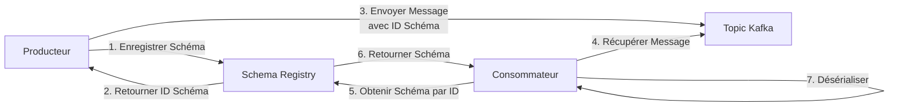

# Utiliser Kafka Schema Registry

Apprenez à gérer les schémas de données, garantir la compatibilité et sérialiser les données efficacement avec Kafka Schema Registry.

---

## Ce que Vous Allez Apprendre

À la fin de ce guide, vous serez capable de :

- ✅ Comprendre pourquoi la gestion des schémas est critique pour l'intégrité des données
- ✅ Configurer Kafka Schema Registry
- ✅ Enregistrer et faire évoluer des schémas avec des règles de compatibilité
- ✅ Sérialiser et désérialiser des données avec Avro, Protobuf et JSON Schema
- ✅ Intégrer Schema Registry avec les producteurs et consommateurs
- ✅ Gérer l'évolution des schémas en production

**Prérequis :**

- Docker et Docker Compose installés
- Compréhension de base des producteurs et consommateurs
- Familiarité avec les formats de sérialisation de données

**Temps Estimé :** 30 minutes

---

## Démarrage Rapide : Exécuter Kafka avec Schema Registry

Utilisez cette configuration Docker Compose pour exécuter Kafka avec **KRaft** et **Schema Registry** :

```yaml title="docker-compose.yml" linenums="1"
version: "3.8"

services:
  kafka:
    image: confluentinc/cp-kafka:latest # (1)!
    container_name: kafka-kraft
    ports:
      - "9092:9092"
    environment:
      KAFKA_NODE_ID: 1
      KAFKA_PROCESS_ROLES: broker,controller
      KAFKA_LISTENERS: PLAINTEXT://0.0.0.0:9092,CONTROLLER://0.0.0.0:9093
      KAFKA_ADVERTISED_LISTENERS: PLAINTEXT://kafka:9092
      KAFKA_CONTROLLER_LISTENER_NAMES: CONTROLLER
      KAFKA_LISTENER_SECURITY_PROTOCOL_MAP: CONTROLLER:PLAINTEXT,PLAINTEXT:PLAINTEXT
      KAFKA_CONTROLLER_QUORUM_VOTERS: 1@kafka:9093
      CLUSTER_ID: MkU3OEVBNTcwNTJENDM2Qk
      KAFKA_LOG_DIRS: /var/lib/kafka/data
    volumes:
      - kafka-data:/var/lib/kafka/data
    healthcheck:
      test: ["CMD-SHELL", "kafka-broker-api-versions --bootstrap-server localhost:9092"]
      interval: 10s
      timeout: 5s
      retries: 5

  schema-registry:
    image: confluentinc/cp-schema-registry:latest # (1)!
    container_name: schema-registry
    depends_on:
      kafka:
        condition: service_healthy
    ports:
      - "8081:8081" # (2)!
    environment:
      SCHEMA_REGISTRY_HOST_NAME: schema-registry # (3)!
      SCHEMA_REGISTRY_KAFKASTORE_BOOTSTRAP_SERVERS: kafka:9092 # (4)!
      SCHEMA_REGISTRY_LISTENERS: http://0.0.0.0:8081 # (5)!
      SCHEMA_REGISTRY_KAFKASTORE_TOPIC: _schemas # (6)!
      SCHEMA_REGISTRY_KAFKASTORE_TOPIC_REPLICATION_FACTOR: 1 # (7)!
      SCHEMA_REGISTRY_SCHEMA_REGISTRY_INTER_INSTANCE_PROTOCOL: http
      SCHEMA_REGISTRY_LOG4J_ROOT_LOGLEVEL: INFO
    healthcheck:
      test: ["CMD-SHELL", "curl -f http://localhost:8081/ || exit 1"]
      interval: 10s
      timeout: 5s
      retries: 5

volumes:
  kafka-data:
    driver: local
```

1. Image Confluent Schema Registry - compatible avec Apache Kafka
2. Port de l'API REST Schema Registry
3. Nom d'hôte pour la découverte de service
4. Serveurs bootstrap Kafka pour stocker les schémas
5. Point de terminaison de l'API REST pour les opérations de schéma
6. Topic Kafka interne pour stocker les schémas (créé automatiquement)
7. Facteur de réplication 1 pour le développement (utiliser 3+ en production)

### Démarrer les Services

```bash
# Démarrer Kafka et Schema Registry
docker-compose up -d

# Attendre que les services soient prêts
docker-compose ps

# Vérifier que Schema Registry fonctionne
curl http://localhost:8081/

# Vérifier les sujets (devrait être vide initialement)
curl http://localhost:8081/subjects

# Arrêter les services
docker-compose down
```

!!! tip "Tester l'Enregistrement de Schéma"
```bash # Enregistrer un schéma Avro simple
curl -X POST http://localhost:8081/subjects/test-value/versions \
 -H "Content-Type: application/vnd.schemaregistry.v1+json" \
 -d '{
"schema": "{\"type\":\"record\",\"name\":\"Test\",\"fields\":[{\"name\":\"id\",\"type\":\"string\"}]}"
}'

    # Lister les sujets (devrait montrer "test-value")
    curl http://localhost:8081/subjects
    ```

!!! warning "Considérations de Production"
Pour les déploiements en production : - Exécuter plusieurs instances Schema Registry (3+) pour la haute disponibilité - Définir le facteur de réplication à 3 pour le topic `_schemas` - Activer l'authentification (basic auth ou mutual TLS) - Utiliser HTTPS pour l'API REST Schema Registry - Surveiller la disponibilité et la latence de Schema Registry

---

## Qu'est-ce que Schema Registry ?

**Schema Registry** est un référentiel centralisé pour gérer et valider les schémas de données. Il garantit que les producteurs et consommateurs s'accordent sur la structure des messages, évitant la corruption des données et permettant une évolution sûre des schémas.

!!! info "Pourquoi Utiliser Schema Registry ?"
Sans Schema Registry, les changements de schéma incompatibles peuvent casser les consommateurs. Schema Registry applique des **règles de compatibilité** qui empêchent le déploiement de changements cassants.



!!! tip "Avantages de Schema Registry" - **Intégrité des Données :** Empêche les données incompatibles d'entrer dans les topics - **Évolution du Schéma :** Supporte l'ajout/suppression de champs sans casser les consommateurs - **Économie de Bande Passante :** Les messages ne contiennent qu'un petit ID de schéma au lieu du schéma complet - **Application de Compatibilité :** Plusieurs modes de compatibilité (backward, forward, full)

---

## Étape 1 : Configurer Schema Registry

### Installation

=== ":simple-docker: Docker Compose"

    ```yaml title="docker-compose.yml" linenums="1" hl_lines="12-21"
    services:
      zookeeper:
        image: confluentinc/cp-zookeeper:latest
        environment:
          ZOOKEEPER_CLIENT_PORT: 2181

      kafka:
        image: confluentinc/cp-kafka:latest
        depends_on: [zookeeper]
        # ... configuration kafka

      schema-registry:  # (1)!
        image: confluentinc/cp-schema-registry:latest
        depends_on: [kafka]
        ports:
          - "8081:8081"  # (2)!
        environment:
          SCHEMA_REGISTRY_HOST_NAME: schema-registry  # (3)!
          SCHEMA_REGISTRY_KAFKASTORE_BOOTSTRAP_SERVERS: kafka:9092  # (4)!
          SCHEMA_REGISTRY_LISTENERS: http://0.0.0.0:8081  # (5)!
    ```

    1. Service Schema Registry - stocke les schémas dans le topic interne `_schemas`
    2. Port par défaut de l'API REST Schema Registry
    3. Nom d'hôte pour la découverte du service Schema Registry
    4. Connexion au cluster Kafka pour stocker les schémas
    5. Point de terminaison de l'API REST pour les opérations de schéma

    ```bash
    docker-compose up -d schema-registry
    ```

=== ":simple-linux: Installation Manuelle"

    ```bash
    # Télécharger Confluent Platform
    wget https://packages.confluent.io/archive/7.5/confluent-7.5.0.tar.gz  # (1)!
    tar -xzf confluent-7.5.0.tar.gz
    cd confluent-7.5.0

    # Configurer Schema Registry
    cat <<EOF > etc/schema-registry/schema-registry.properties
    listeners=http://0.0.0.0:8081  # (2)!
    kafkastore.bootstrap.servers=localhost:9092  # (3)!
    kafkastore.topic=_schemas  # (4)!
    debug=false
    EOF

    # Démarrer Schema Registry
    bin/schema-registry-start etc/schema-registry/schema-registry.properties
    ```

    1. Télécharger Confluent Platform qui inclut Schema Registry
    2. Point de terminaison de l'API REST - accessible à `http://localhost:8081`
    3. Connexion au cluster Kafka pour stocker les schémas
    4. Topic interne pour le stockage des schémas (créé automatiquement)

### Vérifier l'Installation

```bash
# Vérifier la santé de Schema Registry
curl http://localhost:8081/  # (1)!

# Lister les sujets (devrait être vide initialement)
curl http://localhost:8081/subjects  # (2)!
```

1. Devrait retourner `{}` si Schema Registry fonctionne
2. Retourne la liste des sujets de schéma enregistrés (topics + suffixe key/value)

!!! success "Schema Registry est Prêt"
Si les deux commandes réussissent, Schema Registry fonctionne et est prêt à gérer les schémas.

---

## Étape 2 : Choisir un Format de Sérialisation

Schema Registry supporte trois formats de sérialisation. Choisissez en fonction de votre cas d'usage :

<div class="grid cards" markdown>

- **:simple-apache: Avro**

  ***

  **Idéal Pour :** Sérialisation de données généraliste

  **Avantages :**
  - Format binaire compact
  - Types de données riches (unions, maps, arrays)
  - Écosystème mature

  **Inconvénients :**
  - Nécessite la génération de code (optionnel)
  - Moins lisible par l'humain

- **:material-buffer: Protobuf**

  ***

  **Idéal Pour :** Microservices haute performance

  **Avantages :**
  - Sérialisation/désérialisation la plus rapide
  - Compatible backward et forward par conception
  - Typage fort avec génération de code

  **Inconvénients :**
  - Nécessite des fichiers `.proto`
  - Support de schéma dynamique limité

- **:simple-json: JSON Schema**

  ***

  **Idéal Pour :** Données lisibles par l'humain, APIs

  **Avantages :**
  - Format lisible par l'humain
  - Pas de génération de code requise
  - Débogage facile

  **Inconvénients :**
  - Taille de message plus grande
  - Parsing plus lent
  - Moins compact qu'Avro/Protobuf

</div>

!!! tip "Choix le Plus Courant"
**Avro** est le format le plus populaire pour Kafka car il équilibre compacité, flexibilité et évolution de schéma. Ce guide se concentre sur Avro, avec des exemples pour Protobuf et JSON Schema.

---

## Étape 3 : Enregistrer un Schéma

### Définir un Schéma Avro

Créer un schéma pour un événement `Order` :

```json title="order-schema.avsc"
{
  "type": "record",
  "name": "Order",
  "namespace": "com.example.orders",
  "fields": [
    { "name": "order_id", "type": "string" }, // (1)!
    { "name": "customer_id", "type": "string" },
    { "name": "amount", "type": "double" },
    { "name": "timestamp", "type": "long" } // (2)!
  ]
}
```

1. Identifiant unique de commande - champ obligatoire
2. Horodatage Unix en millisecondes - champ obligatoire

### Enregistrer le Schéma

=== ":simple-curl: REST API"

    ```bash
    curl -X POST http://localhost:8081/subjects/orders-value/versions \  # (1)!
      -H "Content-Type: application/vnd.schemaregistry.v1+json" \  # (2)!
      -d '{
        "schema": "{\"type\":\"record\",\"name\":\"Order\",\"namespace\":\"com.example.orders\",\"fields\":[{\"name\":\"order_id\",\"type\":\"string\"},{\"name\":\"customer_id\",\"type\":\"string\"},{\"name\":\"amount\",\"type\":\"double\"},{\"name\":\"timestamp\",\"type\":\"long\"}]}"  # (3)!
      }'
    ```

    1. Nom du sujet : `<topic>-<key|value>` - ici `orders-value` pour les valeurs de message
    2. Type de contenu requis pour l'API Schema Registry
    3. Définition de schéma en chaîne encodée JSON (notez les guillemets échappés)

    **Réponse :**
    ```json
    {"id": 1}  // (1)!
    ```

    1. ID de schéma - utilisé pour référencer ce schéma dans les messages

=== ":simple-python: Python"

    ```python
    from confluent_kafka.schema_registry import SchemaRegistryClient
    from confluent_kafka.schema_registry.avro import AvroSerializer

    # Configurer le client Schema Registry
    sr_client = SchemaRegistryClient({
        'url': 'http://localhost:8081'  # (1)!
    })

    # Définir le schéma Avro
    avro_schema = """
    {
      "type": "record",
      "name": "Order",
      "namespace": "com.example.orders",
      "fields": [
        {"name": "order_id", "type": "string"},
        {"name": "customer_id", "type": "string"},
        {"name": "amount", "type": "double"},
        {"name": "timestamp", "type": "long"}
      ]
    }
    """

    # Enregistrer le schéma
    schema_id = sr_client.register_schema(  # (2)!
        subject_name='orders-value',
        schema=Schema(avro_schema, schema_type='AVRO')
    )

    print(f"Schéma enregistré avec l'ID : {schema_id}")
    ```

    1. Point de terminaison Schema Registry - ajustez pour votre déploiement
    2. Retourne l'ID de schéma qui est mis en cache pour les recherches futures

### Vérifier l'Enregistrement

```bash
# Lister tous les sujets
curl http://localhost:8081/subjects

# Obtenir le dernier schéma pour un sujet
curl http://localhost:8081/subjects/orders-value/versions/latest  # (1)!

# Obtenir le schéma par ID
curl http://localhost:8081/schemas/ids/1  # (2)!
```

1. Retourne la dernière version du schéma pour le sujet `orders-value`
2. Retourne la définition du schéma pour l'ID de schéma 1

---

## Étape 4 : Produire des Messages avec Schéma

### Utiliser le Sérialiseur Avro

=== ":simple-python: Python"

    ```python title="producer_with_schema.py" linenums="1" hl_lines="12-15 22-27"
    from confluent_kafka import SerializingProducer
    from confluent_kafka.schema_registry import SchemaRegistryClient
    from confluent_kafka.schema_registry.avro import AvroSerializer
    import time

    # Client Schema Registry
    sr_client = SchemaRegistryClient({'url': 'http://localhost:8081'})

    # Schéma Avro (identique à celui enregistré)
    avro_schema_str = """..."""  # (1)!

    # Créer le sérialiseur Avro
    avro_serializer = AvroSerializer(  # (2)!
        schema_registry_client=sr_client,
        schema_str=avro_schema_str
    )

    # Configurer le producteur avec le sérialiseur Avro
    producer = SerializingProducer({
        'bootstrap.servers': 'localhost:9092',
        'key.serializer': StringSerializer('utf_8'),
        'value.serializer': avro_serializer  # (3)!
    })

    # Créer le message de commande (dictionnaire Python)
    order = {  # (4)!
        'order_id': 'ORD-12345',
        'customer_id': 'CUST-67890',
        'amount': 99.99,
        'timestamp': int(time.time() * 1000)
    }

    # Envoyer le message (validation du schéma automatique)
    producer.produce(  # (5)!
        topic='orders',
        key='ORD-12345',
        value=order,  # (6)!
        on_delivery=lambda err, msg: print(f"Livré : {msg.topic()}[{msg.partition()}]")
    )

    producer.flush()
    ```

    1. Définition complète du schéma Avro (identique à celui enregistré dans Schema Registry)
    2. Sérialiseur Avro - recherche automatiquement l'ID de schéma depuis Schema Registry
    3. Assigner le sérialiseur Avro au sérialiseur de valeur (la clé peut utiliser String)
    4. Dictionnaire Python correspondant à la structure du schéma Avro
    5. Le producteur sérialise automatiquement la valeur en utilisant le schéma Avro
    6. Message envoyé comme : `[magic_byte][schema_id][avro_binary_data]`

=== ":simple-openjdk: Java"

    ```java title="OrderProducer.java" linenums="1"
    import io.confluent.kafka.serializers.KafkaAvroSerializer;
    import org.apache.kafka.clients.producer.*;
    import org.apache.avro.generic.GenericRecord;
    import org.apache.avro.generic.GenericData;

    Properties props = new Properties();
    props.put("bootstrap.servers", "localhost:9092");
    props.put("key.serializer", StringSerializer.class);
    props.put("value.serializer", KafkaAvroSerializer.class);  // (1)!
    props.put("schema.registry.url", "http://localhost:8081");  // (2)!

    KafkaProducer<String, GenericRecord> producer = new KafkaProducer<>(props);

    // Créer Avro GenericRecord
    GenericRecord order = new GenericData.Record(schema);  // (3)!
    order.put("order_id", "ORD-12345");
    order.put("customer_id", "CUST-67890");
    order.put("amount", 99.99);
    order.put("timestamp", System.currentTimeMillis());

    // Envoyer le message
    producer.send(new ProducerRecord<>("orders", "ORD-12345", order));  // (4)!
    producer.close();
    ```

    1. Sérialiseur Kafka Avro de Confluent - gère l'intégration avec Schema Registry
    2. URL Schema Registry pour la recherche et l'enregistrement de schéma
    3. GenericRecord représente les données Avro sans génération de code
    4. Le sérialiseur récupère automatiquement l'ID de schéma et sérialise en binaire

!!! warning "Validation du Schéma au Moment de la Production"
Si le message ne correspond pas au schéma, le producteur lèvera une **SerializationException** avant d'envoyer à Kafka. Cela empêche les données invalides d'entrer dans le pipeline.

---

## Étape 5 : Consommer des Messages avec Schéma

=== ":simple-python: Python"

    ```python title="consumer_with_schema.py" linenums="1" hl_lines="9-12 19-20"
    from confluent_kafka import DeserializingConsumer
    from confluent_kafka.schema_registry import SchemaRegistryClient
    from confluent_kafka.schema_registry.avro import AvroDeserializer

    # Client Schema Registry
    sr_client = SchemaRegistryClient({'url': 'http://localhost:8081'})

    # Désérialiseur Avro (schéma récupéré automatiquement par ID)
    avro_deserializer = AvroDeserializer(  # (1)!
        schema_registry_client=sr_client,
        schema_str=avro_schema_str  # (2)!
    )

    # Configurer le consommateur
    consumer = DeserializingConsumer({
        'bootstrap.servers': 'localhost:9092',
        'group.id': 'order-processor',
        'auto.offset.reset': 'earliest',
        'key.deserializer': StringDeserializer('utf_8'),
        'value.deserializer': avro_deserializer  # (3)!
    })

    consumer.subscribe(['orders'])

    while True:
        msg = consumer.poll(1.0)
        if msg is None:
            continue

        # La valeur est automatiquement désérialisée en dictionnaire Python
        order = msg.value()  # (4)!
        print(f"Commande : {order['order_id']}, Montant : ${order['amount']}")
    ```

    1. Désérialiseur Avro - lit l'ID de schéma du message et récupère le schéma
    2. Optionnel : fournir le schéma pour validation (le désérialiseur peut le récupérer depuis le registre)
    3. Assigner le désérialiseur Avro au désérialiseur de valeur
    4. Message automatiquement désérialisé en dictionnaire Python

=== ":simple-openjdk: Java"

    ```java title="OrderConsumer.java"
    import io.confluent.kafka.serializers.KafkaAvroDeserializer;
    import org.apache.kafka.clients.consumer.*;
    import org.apache.avro.generic.GenericRecord;

    Properties props = new Properties();
    props.put("bootstrap.servers", "localhost:9092");
    props.put("group.id", "order-processor");
    props.put("key.deserializer", StringDeserializer.class);
    props.put("value.deserializer", KafkaAvroDeserializer.class);  // (1)!
    props.put("schema.registry.url", "http://localhost:8081");

    KafkaConsumer<String, GenericRecord> consumer = new KafkaConsumer<>(props);
    consumer.subscribe(Collections.singletonList("orders"));

    while (true) {
        ConsumerRecords<String, GenericRecord> records = consumer.poll(Duration.ofMillis(1000));
        for (ConsumerRecord<String, GenericRecord> record : records) {
            GenericRecord order = record.value();  // (2)!
            System.out.println("Commande : " + order.get("order_id"));
        }
    }
    ```

    1. Désérialiseur Kafka Avro - récupère automatiquement le schéma depuis le registre
    2. Valeur automatiquement désérialisée en Avro GenericRecord

---

## Étape 6 : Évolution du Schéma

### Modes de Compatibilité

Schema Registry supporte quatre modes de compatibilité :

| Mode         | Description                                       | Changements Autorisés                               |
| ------------ | ------------------------------------------------- | --------------------------------------------------- |
| **BACKWARD** | Le nouveau schéma peut lire les anciennes données | Supprimer des champs, ajouter des champs optionnels |
| **FORWARD**  | L'ancien schéma peut lire les nouvelles données   | Ajouter des champs, supprimer des champs optionnels |
| **FULL**     | Compatible backward et forward                    | Ajouter/supprimer uniquement des champs optionnels  |
| **NONE**     | Aucune vérification de compatibilité              | Tout changement autorisé (⚠️ dangereux)             |

!!! tip "Mode de Compatibilité par Défaut"
Schema Registry utilise la compatibilité **BACKWARD** par défaut, qui est le choix le plus courant. Les consommateurs peuvent être mis à jour indépendamment sans casser.

### Configurer le Mode de Compatibilité

```bash
# Définir le mode de compatibilité pour un sujet
curl -X PUT http://localhost:8081/config/orders-value \  # (1)!
  -H "Content-Type: application/vnd.schemaregistry.v1+json" \
  -d '{"compatibility": "BACKWARD"}'  # (2)!

# Définir la compatibilité globale par défaut
curl -X PUT http://localhost:8081/config \  # (3)!
  -H "Content-Type: application/vnd.schemaregistry.v1+json" \
  -d '{"compatibility": "FULL"}'
```

1. Définir le mode de compatibilité pour un sujet spécifique
2. Mode de compatibilité : BACKWARD, FORWARD, FULL ou NONE
3. Définir le mode de compatibilité par défaut pour tous les nouveaux sujets

### Faire Évoluer le Schéma (Ajouter un Champ Optionnel)

Ajoutons un champ `status` au schéma `Order` :

```json title="order-schema-v2.avsc" hl_lines="9"
{
  "type": "record",
  "name": "Order",
  "namespace": "com.example.orders",
  "fields": [
    { "name": "order_id", "type": "string" },
    { "name": "customer_id", "type": "string" },
    { "name": "amount", "type": "double" },
    { "name": "timestamp", "type": "long" },
    { "name": "status", "type": "string", "default": "PENDING" } // (1)!
  ]
}
```

1. Nouveau champ optionnel avec valeur par défaut - compatible backward

```bash
# Enregistrer la nouvelle version
curl -X POST http://localhost:8081/subjects/orders-value/versions \
  -H "Content-Type: application/vnd.schemaregistry.v1+json" \
  -d '{"schema": "{...}"}'  # (1)!

# Réponse : {"id": 2}  # (2)!
```

1. Nouveau schéma avec champ `status` ajouté
2. Nouvel ID de schéma assigné - les anciens consommateurs peuvent toujours lire les nouveaux messages

!!! success "Évolution du Schéma en Action" - **Anciens consommateurs** (utilisant le schéma v1) peuvent lire les nouveaux messages - ils ignorent le champ `status` - **Nouveaux producteurs** (utilisant le schéma v2) peuvent écrire avec le champ `status` - **Aucun temps d'arrêt requis** - migration graduelle possible

### Changements Cassants (Incompatibles)

```json title="order-schema-v3-INVALIDE.avsc" hl_lines="6"
{
  "type": "record",
  "name": "Order",
  "namespace": "com.example.orders",
  "fields": [
    { "name": "order_id", "type": "int" }, // (1)!
    { "name": "customer_id", "type": "string" },
    { "name": "amount", "type": "double" }
  ]
}
```

1. Type de `order_id` changé de `string` à `int` - **CHANGEMENT CASSANT**

```bash
# Essayer d'enregistrer un schéma incompatible
curl -X POST http://localhost:8081/subjects/orders-value/versions \
  -H "Content-Type: application/vnd.schemaregistry.v1+json" \
  -d '{"schema": "{...}"}'

# Réponse : HTTP 409 Conflict  # (1)!
# {
#   "error_code": 409,
#   "message": "Le schéma en cours d'enregistrement est incompatible avec un schéma antérieur"
# }
```

1. Schema Registry **rejette** les schémas incompatibles - empêche de casser les consommateurs

---

## Étape 7 : Utiliser Protobuf et JSON Schema

### Exemple Protobuf

=== "Définir le Schéma (.proto)"

    ```protobuf title="order.proto"
    syntax = "proto3";

    package com.example.orders;

    message Order {
      string order_id = 1;     // (1)!
      string customer_id = 2;
      double amount = 3;
      int64 timestamp = 4;
    }
    ```

    1. Les numéros de champ ne doivent jamais changer - utilisés pour la compatibilité backward

=== "Enregistrer le Schéma"

    ```bash
    curl -X POST http://localhost:8081/subjects/orders-proto-value/versions \
      -H "Content-Type: application/vnd.schemaregistry.v1+json" \
      -d '{
        "schemaType": "PROTOBUF",  # (1)!
        "schema": "syntax = \"proto3\"; package com.example.orders; message Order { string order_id = 1; string customer_id = 2; double amount = 3; int64 timestamp = 4; }"
      }'
    ```

    1. Spécifier le type de schéma `PROTOBUF` (par défaut c'est AVRO)

=== "Producteur (Python)"

    ```python
    from confluent_kafka.schema_registry.protobuf import ProtobufSerializer

    protobuf_serializer = ProtobufSerializer(  # (1)!
        msg_type=Order,  # (2)!
        schema_registry_client=sr_client
    )

    producer = SerializingProducer({
        'bootstrap.servers': 'localhost:9092',
        'value.serializer': protobuf_serializer
    })
    ```

    1. Sérialiseur Protobuf - similaire au sérialiseur Avro
    2. Classe Protobuf générée depuis le fichier `.proto`

### Exemple JSON Schema

=== "Définir le Schéma"

    ```json title="order-json-schema.json"
    {
      "$schema": "http://json-schema.org/draft-07/schema#",
      "type": "object",
      "properties": {
        "order_id": {"type": "string"},  // (1)!
        "customer_id": {"type": "string"},
        "amount": {"type": "number"},
        "timestamp": {"type": "integer"}
      },
      "required": ["order_id", "customer_id", "amount", "timestamp"]  // (2)!
    }
    ```

    1. Définitions de type JSON Schema - format JSON Schema standard
    2. Champs obligatoires - appliqués au moment de la sérialisation

=== "Producteur (Python)"

    ```python
    from confluent_kafka.schema_registry.json_schema import JSONSerializer

    json_serializer = JSONSerializer(
        schema_str=json_schema_str,
        schema_registry_client=sr_client
    )

    producer = SerializingProducer({
        'bootstrap.servers': 'localhost:9092',
        'value.serializer': json_serializer  # (1)!
    })

    # Envoyer un message JSON
    order = {  # (2)!
        'order_id': 'ORD-12345',
        'customer_id': 'CUST-67890',
        'amount': 99.99,
        'timestamp': 1702834567000
    }

    producer.produce('orders', value=order)
    ```

    1. Sérialiseur JSON Schema - valide contre le JSON Schema
    2. Dictionnaire Python simple - sérialisé en JSON avec validation de schéma

---

## Bonnes Pratiques

<div class="grid cards" markdown>

- **:material-check-circle: À FAIRE**

  ***
  - Utiliser la compatibilité **BACKWARD** ou **FULL** en production
  - Ajouter des valeurs par défaut aux nouveaux champs pour la compatibilité backward
  - Tester l'évolution du schéma en staging avant la production
  - Versionner les schémas sémantiquement (v1, v2, etc.)
  - Utiliser Avro pour la sérialisation de données généraliste

- **:material-close-circle: À ÉVITER**

  ***
  - Changer les types de champs sans créer un nouveau topic
  - Utiliser le mode de compatibilité `NONE` en production
  - Supprimer des champs obligatoires sans plan de migration
  - Déployer des changements de schéma cassants sans coordination
  - Coder en dur les ID de schéma dans le code applicatif

</div>

### Liste de Vérification Production

- [x] Schema Registry déployé avec HA (plusieurs réplicas)
- [x] Mode de compatibilité configuré (`BACKWARD` ou `FULL`)
- [x] Validation de schéma activée dans les producteurs
- [x] Surveillance de la disponibilité de Schema Registry
- [x] Stratégie de versionnement de schéma documentée
- [x] Plan de rollback pour les changements de schéma
- [x] Sécurité : SSL + authentification activés (voir [Sécurité Schema Registry](https://docs.confluent.io/platform/current/schema-registry/security/index.html))

---

## Dépannage

??? bug "Erreur : `Schema being registered is incompatible`"
**Cause :** Le nouveau schéma viole les règles de compatibilité

    **Solution :**
    1. Vérifier le mode de compatibilité : `curl http://localhost:8081/config/orders-value`
    2. Examiner les changements de schéma - assurer la compatibilité backward
    3. Ajouter des valeurs par défaut aux nouveaux champs
    4. Si un changement cassant est requis :
        - Créer un nouveau topic avec le nouveau schéma
        - Migrer les consommateurs graduellement
        - Utiliser Kafka Streams pour la transformation des données

??? bug "Erreur : `Subject not found`"
**Cause :** Schéma non enregistré pour le topic

    **Solution :**
    ```bash
    # Lister tous les sujets
    curl http://localhost:8081/subjects

    # Vérifier si le sujet existe
    curl http://localhost:8081/subjects/orders-value/versions
    ```

    Enregistrer le schéma manuellement via l'API REST ou le producteur avec `auto.register.schemas=true`

??? bug "Erreur : `Failed to deserialize Avro message`"
**Cause :** Message écrit sans schéma ou corrompu

    **Solution :**
    1. Vérifier l'ID de schéma dans l'en-tête du message : les 5 premiers octets devraient être `[0x00][schema_id]`
    2. Vérifier la disponibilité de Schema Registry
    3. S'assurer que le producteur a utilisé le sérialiseur Avro correctement
    4. Vérifier les incompatibilités d'ID de schéma (ancien schéma en cache)

---

## Exemple Complet : Service de Commandes avec Évolution de Schéma

```python title="order_service_with_schema.py" linenums="1"
from confluent_kafka import SerializingProducer, DeserializingConsumer
from confluent_kafka.schema_registry import SchemaRegistryClient, Schema
from confluent_kafka.schema_registry.avro import AvroSerializer, AvroDeserializer
from confluent_kafka.serialization import StringSerializer, StringDeserializer
import time

# Client Schema Registry
sr_config = {'url': 'http://localhost:8081'}
sr_client = SchemaRegistryClient(sr_config)

# Définir le schéma Avro (v2 avec champ status)
order_schema_str = """
{
  "type": "record",
  "name": "Order",
  "namespace": "com.example.orders",
  "fields": [
    {"name": "order_id", "type": "string"},
    {"name": "customer_id", "type": "string"},
    {"name": "amount", "type": "double"},
    {"name": "timestamp", "type": "long"},
    {"name": "status", "type": "string", "default": "PENDING"}
  ]
}
"""

# Configuration du producteur avec sérialiseur Avro
avro_serializer = AvroSerializer(sr_client, order_schema_str)

producer_config = {
    'bootstrap.servers': 'localhost:9092',
    'key.serializer': StringSerializer('utf_8'),
    'value.serializer': avro_serializer
}

producer = SerializingProducer(producer_config)

# Produire une commande avec schéma
order = {
    'order_id': 'ORD-99999',
    'customer_id': 'CUST-11111',
    'amount': 199.99,
    'timestamp': int(time.time() * 1000),
    'status': 'CONFIRMED'  # Nouveau champ en v2
}

producer.produce(
    topic='orders',
    key=order['order_id'],
    value=order,
    on_delivery=lambda err, msg: print(f"Commande livrée : {msg.key()}")
)

producer.flush()
print(f"Commande {order['order_id']} envoyée avec validation de schéma")

# Configuration du consommateur avec désérialiseur Avro
avro_deserializer = AvroDeserializer(sr_client, order_schema_str)

consumer_config = {
    'bootstrap.servers': 'localhost:9092',
    'group.id': 'order-processor-v2',
    'auto.offset.reset': 'earliest',
    'key.deserializer': StringDeserializer('utf_8'),
    'value.deserializer': avro_deserializer
}

consumer = DeserializingConsumer(consumer_config)
consumer.subscribe(['orders'])

# Traiter les commandes (gère les schémas v1 et v2)
print("Traitement des commandes...")
try:
    while True:
        msg = consumer.poll(1.0)
        if msg is None:
            continue

        order = msg.value()
        status = order.get('status', 'INCONNU')  # Gérer v1 (pas de champ status)

        print(f"Commande {order['order_id']} : ${order['amount']:.2f} - Statut : {status}")

except KeyboardInterrupt:
    pass
finally:
    consumer.close()
```

---

## Prochaines Étapes

Maintenant que vous comprenez la gestion des schémas, explorez :

- **[Stream Processing](kafka-stream-processing.md)** - Transformer les données avec Kafka Streams et Flink
- **[Kafka Connect](kafka-connect-systems.md)** - Utiliser Schema Registry avec les connecteurs source/sink
- **[Produire des Messages](kafka-produce-messages.md)** - Optimiser la configuration du producteur

---

## Ressources Additionnelles

### Documentation Officielle

- [Documentation Confluent Schema Registry](https://docs.confluent.io/platform/current/schema-registry/index.html)
- [Référence API REST Schema Registry](https://docs.confluent.io/platform/current/schema-registry/develop/api.html)
- [Options de Configuration Schema Registry](https://docs.confluent.io/platform/current/schema-registry/installation/config.html)

### Formats de Schémas

- [Spécification Apache Avro](https://avro.apache.org/docs/current/spec.html)
- [Documentation Protocol Buffers](https://protobuf.dev/)
- [Spécification JSON Schema](https://json-schema.org/)

### Tutoriels & Meilleures Pratiques

- [Tutoriel Schema Registry](https://developer.confluent.io/learn-kafka/schema-registry/get-started/) - Cours gratuit Confluent
- [Meilleures Pratiques d'Évolution de Schéma](https://docs.confluent.io/platform/current/schema-registry/avro.html#schema-evolution)
- [Guide Sérialisation et Schema Registry](https://www.confluent.io/blog/kafka-schemas-serialization-evolution/)
- [Patterns de Validation de Schéma](https://www.confluent.io/blog/schema-registry-kafka-stream-processing-yes-virginia-you-really-need-one/)

### Sujets Avancés

- [Sécurité Schema Registry](https://docs.confluent.io/platform/current/schema-registry/security/index.html)
- [Schema Registry Multi-Datacenter](https://docs.confluent.io/platform/current/schema-registry/multidc.html)
- [Schema Linking et Migration](https://docs.confluent.io/cloud/current/sr/schema-linking.html)

---

!!! info "Attribution du Cours"
Ce guide est basé sur le contenu de la documentation Confluent Schema Registry, la spécification Apache Avro, et les meilleures pratiques de l'industrie.
