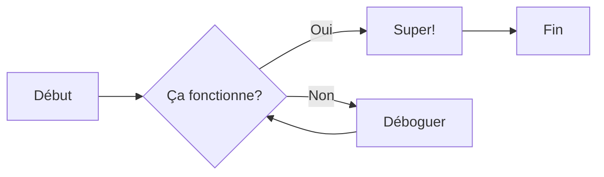

# Guide de Formatage

Cette page démontre les différentes options de formatage disponibles dans Material for MkDocs.

## Formatage de Texte

Vous pouvez utiliser différentes options de formatage de texte :

- **Texte en gras** avec `**gras**`
- _Texte en italique_ avec `*italique*`
- ~~Texte barré~~ avec `~~texte~~`
- ==Texte surligné== avec `==texte==`
- H~2~O indice avec `H~2~O`
- X^2^ exposant avec `X^2^`
- ++Souligné++ avec `++texte++`

## Touches de Clavier

Utiliser des raccourcis clavier :

- ++ctrl+c++ pour copier
- ++ctrl+v++ pour coller
- ++cmd+shift+p++ pour la palette de commandes

## Code

Code en ligne : `pip install mkdocs-material`

Bloc de code avec numéros de ligne :

```python linenums="1"
def fibonacci(n):
    """Calculer le nombre de Fibonacci."""
    if n <= 1:
        return n
    return fibonacci(n-1) + fibonacci(n-2)

# Calculer le 10ème nombre de Fibonacci
resultat = fibonacci(10)
print(f"Fibonacci(10) = {resultat}")
```

Code avec lignes spécifiques surlignées :

```python hl_lines="2 3"
def saluer(nom):
    message = f"Bonjour, {nom}!"
    print(message)
    return message
```

## Onglets

=== "Python"

    ```python
    print("Bonjour le Monde!")
    ```

=== "JavaScript"

    ```javascript
    console.log("Bonjour le Monde!");
    ```

=== "Bash"

    ```bash
    echo "Bonjour le Monde!"
    ```

## Avertissements

!!! note
Ceci est un avertissement de note.

!!! abstract
Ceci est un avertissement abstrait.

!!! info
Ceci est un avertissement d'information.

!!! tip
Ceci est un avertissement d'astuce.

!!! success
Ceci est un avertissement de succès.

!!! question
Ceci est un avertissement de question.

!!! warning
Ceci est un avertissement d'alerte.

!!! failure
Ceci est un avertissement d'échec.

!!! danger
Ceci est un avertissement de danger.

!!! bug
Ceci est un avertissement de bug.

!!! example
Ceci est un avertissement d'exemple.

!!! quote
Ceci est un avertissement de citation.

??? note "Avertissement Pliable"
Cet avertissement est pliable !

## Listes

### Listes Non Ordonnées

- Élément 1
- Élément 2
  - Élément imbriqué 2.1
  - Élément imbriqué 2.2
- Élément 3

### Listes Ordonnées

1. Premier élément
2. Deuxième élément
3. Troisième élément
   1. Élément imbriqué 3.1
   2. Élément imbriqué 3.2

### Listes de Tâches

- [x] Tâche terminée
- [x] Autre tâche terminée
- [ ] Tâche incomplète
- [ ] Autre tâche incomplète

## Diagrammes avec Mermaid



## Boutons

[Commencer](#){ .md-button }
[Voir sur GitHub](#){ .md-button .md-button--primary }

## Notes de Bas de Page

Voici une phrase avec une note de bas de page[^1].

[^1]: Ceci est le contenu de la note de bas de page.
