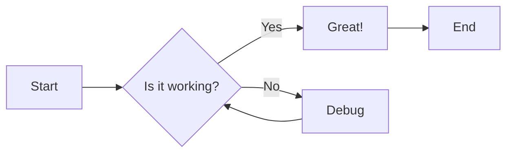

# Formatting Guide

This page demonstrates various formatting options available in Material for MkDocs.

## Text Formatting

You can use various text formatting options:

- **Bold text** with `**bold**`
- _Italic text_ with `*italic*`
- ~~Strikethrough~~ with `~~text~~`
- ==Highlighted text== with `==text==`
- H~2~O subscript with `H~2~O`
- X^2^ superscript with `X^2^`
- ++Underline++ with `++text++`

## Keyboard Keys

Use keyboard shortcuts:

- ++ctrl+c++ to copy
- ++ctrl+v++ to paste
- ++cmd+shift+p++ for command palette

## Code

Inline code: `pip install mkdocs-material`

Code block with line numbers:

```python linenums="1"
def fibonacci(n):
    """Calculate fibonacci number."""
    if n <= 1:
        return n
    return fibonacci(n-1) + fibonacci(n-2)

# Calculate the 10th fibonacci number
result = fibonacci(10)
print(f"Fibonacci(10) = {result}")
```

Code with highlighting specific lines:

```python hl_lines="2 3"
def greet(name):
    message = f"Hello, {name}!"
    print(message)
    return message
```

## Tabs

=== "Python"

    ```python
    print("Hello World!")
    ```

=== "JavaScript"

    ```javascript
    console.log("Hello World!");
    ```

=== "Bash"

    ```bash
    echo "Hello World!"
    ```

## Admonitions

!!! note
This is a note admonition.

!!! abstract
This is an abstract admonition.

!!! info
This is an info admonition.

!!! tip
This is a tip admonition.

!!! success
This is a success admonition.

!!! question
This is a question admonition.

!!! warning
This is a warning admonition.

!!! failure
This is a failure admonition.

!!! danger
This is a danger admonition.

!!! bug
This is a bug admonition.

!!! example
This is an example admonition.

!!! quote
This is a quote admonition.

??? note "Collapsible Admonition"
This admonition is collapsible!

## Lists

### Unordered Lists

- Item 1
- Item 2
  - Nested item 2.1
  - Nested item 2.2
- Item 3

### Ordered Lists

1. First item
2. Second item
3. Third item
   1. Nested item 3.1
   2. Nested item 3.2

### Task Lists

- [x] Completed task
- [x] Another completed task
- [ ] Incomplete task
- [ ] Another incomplete task

## Diagrams with Mermaid



## Buttons

[Get Started](#){ .md-button }
[View on GitHub](#){ .md-button .md-button--primary }

## Footnotes

Here's a sentence with a footnote[^1].

[^1]: This is the footnote content.
