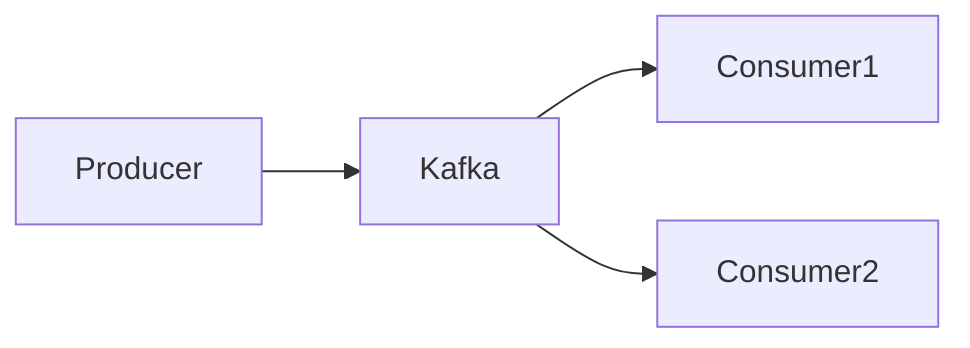

# Documentation Writing Best Practices

Reference guide for writing clear, maintainable, and effective technical documentation following the Diátaxis framework.

## Documentation Structure

### Follow Diátaxis Framework

Organize content according to its purpose:

| Type | Purpose | Audience | Style | Location |
|------|---------|----------|-------|----------|
| **Tutorials** | Learning by doing | Beginners | Step-by-step, prescriptive | `tutorials/` |
| **How-to** | Solving problems | Users with basic knowledge | Goal-oriented, practical | `how-to/` |
| **Reference** | Looking things up | Practitioners | Factual, comprehensive | `reference/` |
| **Explanation** | Understanding concepts | Users wanting deeper knowledge | Discursive, theoretical | `explanation/` |

!!! tip "Quadrant Selection"

    Ask yourself: "Is this teaching (tutorial), guiding (how-to), informing (reference), or explaining (explanation)?"

### Use Descriptive File Names

<div class="grid cards" markdown>

- :material-check-circle:{ .lg .middle } **DO**

    ---

    ```
    how-to/deploy-to-kubernetes.md
    how-to/configure-ssl-certificates.md
    reference/api-endpoints.md
    explanation/event-streaming-concepts.md
    ```

- :material-close-circle:{ .lg .middle } **DON'T**

    ---

    ```
    guide1.md
    tutorial.md
    docs.md
    misc.md
    ```

</div>

### Group Related Content

```
reference/
  api/
    authentication.md
    endpoints.md
    rate-limits.md
  configuration/
    environment-variables.md
    settings.md
    secrets.md
```

## Writing Style

### Keep It Concise

**One idea per paragraph:**

```markdown
✅ Good:
Kafka topics are partitioned for scalability. Each partition is an ordered, 
immutable sequence of records.

Partitions enable parallel processing. Multiple consumers can read from 
different partitions simultaneously.

❌ Bad:
Kafka topics are partitioned for scalability and each partition is an ordered, 
immutable sequence of records that cannot be changed and partitions enable 
parallel processing where multiple consumers can read from different partitions 
at the same time which improves throughput.
```

### Use Active Voice

<div class="grid cards" markdown>

- :material-check-circle:{ .lg .middle } **Active Voice**

    ---

    - The producer sends messages to Kafka
    - Run the command to start the service
    - Configure the settings before deployment

- :material-close-circle:{ .lg .middle } **Passive Voice**

    ---

    - Messages are sent to Kafka by the producer
    - The command should be run to start the service
    - The settings must be configured before deployment

</div>

!!! tip "When Passive Is OK"

    Use passive voice when the actor is unknown or unimportant: "The file was corrupted" vs. "Something corrupted the file"

### Use Bullet Points for Lists

```markdown
✅ Good:
Prerequisites:

- Python 3.8 or higher
- Docker installed and running
- At least 4GB RAM available

❌ Bad:
Prerequisites: You need Python 3.8 or higher and Docker must be installed 
and running and you should have at least 4GB of RAM available.
```

### Include Code Examples

Every tutorial and how-to guide should include runnable examples:

```markdown
✅ Good:

Configure the producer:

```python
from kafka import KafkaProducer

producer = KafkaProducer(
    bootstrap_servers='localhost:9092',  # (1)!
    acks='all'                           # (2)!
)
\```

1. Connect to local Kafka broker
2. Wait for all replicas to acknowledge
```

## Admonition Usage

### Use Admonitions Wisely

!!! note "Guidelines"

    - **`!!! tip`** - Best practices, mental models, helpful insights
    - **`!!! warning`** - Important caveats, limitations, trade-offs  
    - **`!!! danger`** - Critical distinctions, security concerns, breaking changes
    - **`!!! info`** - Neutral information, configuration details
    - **`!!! success`** - Benefits, positive outcomes
    - **`!!! note`** - Supplementary information, clarifications

### Admonition Examples

```markdown
!!! tip "Pro Tip"

    Use meaningful topic names like `orders.created` instead of generic 
    names like `data` or `events`.

!!! warning "Breaking Change"

    Version 3.0 removes support for the legacy API. Migrate to the new 
    endpoints before upgrading.

!!! danger "Security Risk"

    Never commit API keys or secrets to version control. Use environment 
    variables or secret managers.
```

!!! warning "Don't Overuse"

    Too many admonitions reduce their impact. Use them for truly important information.

## Code Block Best Practices

### Add Titles to Code Blocks

````markdown
```python title="producer.py"
from kafka import KafkaProducer

producer = KafkaProducer(bootstrap_servers='localhost:9092')
```
````

### Use Line Numbers for Long Code

````markdown
```java title="KafkaProducerExample.java" linenums="1"
import org.apache.kafka.clients.producer.*;

public class KafkaProducerExample {
    public static void main(String[] args) {
        Properties props = new Properties();
        props.put("bootstrap.servers", "localhost:9092");
        KafkaProducer<String, String> producer = new KafkaProducer<>(props);
    }
}
```
````

### Highlight Important Lines

````markdown
```yaml title="config.yml" hl_lines="3-4"
server:
  port: 8080
  ssl:
    enabled: true  # Important: Enable SSL in production
    keystore: /path/to/keystore
```
````

## Cross-Referencing

### Link Related Content

```markdown
For more details on Kafka architecture, see the 
[Kafka Architecture Explanation](../explanation/kafka-architecture.md).

To configure producers, follow the 
[Producer Configuration Guide](configure-kafka-producers.md).
```

### Use Relative Links

```markdown
✅ Good: [Getting Started](../tutorials/getting-started.md)
❌ Bad: [Getting Started](/tutorials/getting-started.md)
```

!!! info "Why Relative Links?"

    Relative links work regardless of where the site is deployed (subdirectory, custom domain, etc.)

## Content Organization

### Start with Prerequisites

```markdown
## Prerequisites

Before starting this tutorial, ensure you have:

- [ ] Python 3.8+ installed
- [ ] Docker running locally
- [ ] Basic understanding of HTTP APIs
```

### End with Next Steps

```markdown
## Next Steps

Now that you've completed this tutorial, you can:

- [Configure Advanced Settings](configure-advanced.md)
- [Deploy to Production](deploy-production.md)
- [Monitor and Troubleshoot](troubleshooting.md)
```

### Use Clear Headings

```markdown
✅ Good:
## Install Dependencies
## Configure Environment Variables
## Start the Application

❌ Bad:
## Step 1
## Step 2
## Step 3
```

## Visual Aids

### Include Diagrams

Use Mermaid for architecture diagrams:

````markdown

````

### Use Screenshots Sparingly

!!! tip "Screenshot Guidelines"

    - Annotate screenshots to highlight key areas
    - Use WebP format for better compression
    - Add descriptive alt text for accessibility
    - Update screenshots when UI changes

## Accessibility

### Write Descriptive Alt Text

```markdown
✅ Good:


❌ Bad:

```

### Use Semantic Headings

```markdown
# Page Title (h1 - only one per page)

## Main Section (h2)

### Subsection (h3)

#### Detail Level (h4)
```

!!! danger "Heading Hierarchy"

    Never skip heading levels (h1 → h3). Always use them in order.

## Consistency

### Maintain Consistent Terminology

<div class="grid cards" markdown>

- :material-check-circle:{ .lg .middle } **Consistent**

    ---

    Throughout docs: "Kubernetes cluster"

- :material-close-circle:{ .lg .middle } **Inconsistent**

    ---

    Sometimes "K8s cluster", other times "Kubernetes environment"

</div>

### Use Style Guide

Create a style guide for your project:

```markdown
# Style Guide

- **Kafka topics:** Always lowercase with dots (e.g., `orders.created`)
- **Configuration files:** Use YAML, not JSON
- **Code examples:** Prefer Python and Java
- **Dates:** Use ISO 8601 format (2025-12-06)
```

## Review Checklist

Before publishing documentation:

- [ ] Content is in the correct Diátaxis quadrant
- [ ] File name is descriptive and follows naming conventions
- [ ] Code examples are tested and runnable
- [ ] Links are working and use relative paths
- [ ] Headings follow semantic hierarchy
- [ ] Alt text added to all images
- [ ] Admonitions highlight important information
- [ ] Prerequisites listed at the start
- [ ] Next steps provided at the end
- [ ] Spelling and grammar checked
- [ ] Technical accuracy verified

## Resources

- [Diátaxis Framework](https://diataxis.fr/)
- [Google Developer Documentation Style Guide](https://developers.google.com/style)
- [Microsoft Writing Style Guide](https://learn.microsoft.com/en-us/style-guide/welcome/)
- [MkDocs Material Reference](https://squidfunk.github.io/mkdocs-material/reference/)
