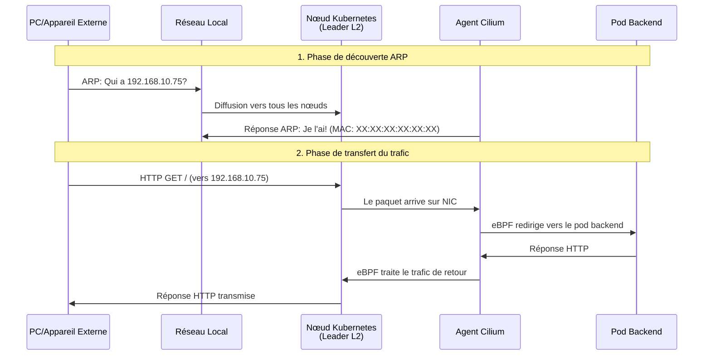

# Déployer Cilium avec un LoadBalancer sur Talos Linux

Apprenez à configurer des services LoadBalancer externes sur Kubernetes bare-metal `TalosLinux` en utilisant **Cilium CNI** avec des annonces L2.

## Ce que vous allez apprendre

À la fin de ce tutoriel, vous allez apprendre à :

- [x] Comprendre pourquoi le `LoadBalancer L2` est nécessaire sur Kubernetes bare-metal
- [x] Installer `Cilium CNI` sur Talos Linux avec support des annonces L2
- [x] Configurer les pools d'IP et les politiques d'annonce L2
  - [x] Déployer un service LoadBalancer accessible depuis les réseaux externes (LAN)
- [x] Vérifier et debuguer les annonces L2

!!! info "Durée"

    **Durée estimée:** 45-60 minutes  
    **Niveau:** Intermédiaire (connaissance de Kubernetes et réseaux recommandée)

## Prérequis

Avant de commencer, assurez-vous d'avoir :

- [x] Un cluster Talos Linux en cours d'exécution (v1.6+)
- [x] `kubectl` configuré pour accéder à votre cluster
- [x] CLI `helm` installé (v3.0+)
- [x] CLI `talosctl` installé
- [x] Compréhension de base des concepts de réseau Kubernetes
- [x] Accès administrateur pour configurer les ressources du cluster

!!! tip "Contexte Talos Linux"

    Ce tutoriel est spécifiquement écrit pour **Talos Linux**, un système d'exploitation Kubernetes immuable. Si vous utilisez des distributions Kubernetes standard, certaines étapes seront différentes (surtout l'installation du **CNI** et la configuration système).

## Introduction

### Le défi du LoadBalancer sur Bare-Metal, Homelab ou Environnements On-Premise

Dans les environnements cloud comme **AWS**, **Azure** ou **GCP**, créer un service k8s de type  `LoadBalancer` provisionne automatiquement un load balancer cloud (**AWS ELB**, **Azure Load Balancer**, **GCP Cloud Load Balancing**).
Cependant, sur des clusters Kubernetes `bare-metal` ou `homelab`, les services LoadBalancer restent en état `<pending>` car il n'y a pas d'intégration avec un fournisseur cloud.

```bash
# Exemple sur un cluster cloud (avec LB-IPAM fonctionnel)
$ kubectl expose deployment nginx --type=LoadBalancer --port=80
$ kubectl get svc nginx
NAME    TYPE           CLUSTER-IP      EXTERNAL-IP      PORT(S)
nginx   LoadBalancer   10.43.100.123   203.0.113.45     80:30080/TCP

# Sur bare-metal (sans LB-IPAM)
$ kubectl expose deployment nginx --type=LoadBalancer --port=80
$ kubectl get svc nginx
NAME    TYPE           CLUSTER-IP      EXTERNAL-IP      PORT(S)
nginx   LoadBalancer   10.43.100.123   <pending>        80:30080/TCP  # ❌ Bloqué!
```

### Solutions : MetalLB vs Cilium LB-IPAM

Deux solutions populaires existent pour les services LoadBalancer sur bare-metal :

1. **MetalLB** - Load balancer autonome pour Kubernetes
2. **Cilium LB-IPAM** - Gestion intégrée des adresses **IP** LoadBalancer dans Cilium le Controller Network Interface **CNI** de kubernetes.

Précédemment, j'utilisais **MetalLB** dans mes clusters homelab avec kube-proxy natif.
J'ai décidé récemment d'utiliser Cilium comme **CNI**, utiliser le **LB-IPAM** intégré de Cilium est donc le choix naturel.

!!! success "Pourquoi Cilium LB-IPAM ?"

    - **Solution intégrée** - Aucun composant supplémentaire nécessaire
    - **Basé sur eBPF** - Hautes performances avec faible overhead
    - **Support L2 et BGP** - Méthodes d'annonce flexibles
    - **Compatible KubePrism** - Fonctionne parfaitement avec Talos
    - **Géré par Helm** - Configuration et mises à jour faciles

## Comprendre le duo Talos + Cilium

### Architecture Talos Linux

Talos Linux est différent des distributions Linux traditionnelles :

- **OS immuable** - Pas de **SSH**, pas de shell, pas de gestionnaire de paquets
- **Piloté par API** - Géré via `talosctl` et l'**API** Kubernetes
- **Sécurisé par défaut** - Surface d'attaque minimale
- **CGroup v2** - Système de fichiers cgroup Linux moderne
- **KubePrism** - Proxy d'**API** Kubernetes intégré

### Pourquoi Talos nécessite une configuration Cilium spéciale

Talos ne permet pas les installations CNI traditionnelles. Vous devez configurer Cilium pour fonctionner avec les contraintes de Talos :

| Exigence             | Valeur Talos       | Pourquoi                                         |
|----------------------|--------------------|--------------------------------------------------|
| **Nom CNI**          | `none`             | Talos ne gère pas le **CNI**                     |
| **Kube-proxy**       | `disabled`         | Cilium remplace kube-proxy avec **eBPF**         |
| **Montage CGroup**   | `/sys/fs/cgroup`   | Pré-monté par Talos                              |
| **AutoMount CGroup** | `false`            | Talos fournit déjà cgroup v2                     |
| **Capacités**        | Ensemble restreint | Pas de `SYS_MODULE` (_modules kernel interdits_) |
| **Serveur API K8s**  | `localhost:7445`   | Proxy local **KubePrism**                        |

!!! tip "KubePrism"

    **KubePrism** est un proxy de serveur **API** Kubernetes local qui s'exécute sur chaque nœud Talos sur `localhost:7445`. 
    Cela fournit un accès **API** hautement disponible sans load balancers externes, ce qui est critique lors de l'exécution de Cilium avec `kubeProxyReplacement=true`.

### Flux réseau avec **les annonces L2**

Voici comment le trafic circule lors de l'accès à un service **LoadBalancer** en externe (hors du cluster) :



**Points clés :**

- **Élection du leader** - Un nœud par **IP** LoadBalancer devient le "leader" via des baux Kubernetes
- **Répondeur ARP** - Le nœud leader répond aux requêtes **ARP** pour l'**IP** LoadBalancer
- **Magie eBPF** - Cilium utilise des programmes **eBPF** pour transférer efficacement le trafic vers les pods

## Installation étape par étape

### Étape 1 : Préparer la configuration machine Talos

Tout d'abord, configurez Talos pour désactiver le **CNI** par défaut et kube-proxy. Créez un fichier de patch pour votre configuration Talos :

```yaml title="talos-cilium-patch.yaml" linenums="1"
# Exemple patch.yaml pour clusters existants
machine:
  features:
    kubePrism:
      enabled: true
      port: 7445

cluster:
  network:
    cni:
      name: none # (1)!
  proxy:
    disabled: true # (2)!
```

1. Indiquez à Talos de ne pas installer de **CNI** - nous installerons Cilium manuellement
2. Désactivez kube-proxy puisque Cilium le remplacera avec **eBPF**.

Appliquez ce patch lors de la génération ou de la mise à jour de votre configuration Talos :

```bash
# Si vous générez une nouvelle config de cluster
talosctl gen config \
  my-cluster https://mycluster.local:6443 \
  --config-patch @talos-cilium-patch.yaml

# Si vous mettez à jour un cluster existant
talosctl patch machineconfig \
  --nodes <node-ip> \
  --patch @talos-cilium-patch.yaml
```

!!! warning "Redémarrage du nœud requis"

    Après avoir appliqué ce patch, les nœuds redémarreront. Pendant le processus de démarrage, les nœuds sembleront bloqués à "phase 18/19" en attendant le **CNI**. C'est normal—les nœuds ne deviendront pas Ready tant que Cilium n'est pas installé.

### Étape 2 : Installer Cilium avec support L2

Maintenant, nous allons installer Cilium en utilisant **Helm** avec les annonces L2 activées.

Créez un fichier de valeurs **Helm** complet :

```yaml title="cilium-values.yaml" linenums="1"
# Configuration IPAM
ipam:
  mode: kubernetes  # (1)!

# Remplacement de Kube-proxy
kubeProxyReplacement: true  # (2)!

# Contexte de sécurité - Capacités spécifiques à Talos
securityContext:
  capabilities:
    ciliumAgent:  # (3)!
      - CHOWN
      - KILL
      - NET_ADMIN
      - NET_RAW
      - IPC_LOCK
      - SYS_ADMIN
      - SYS_RESOURCE
      - DAC_OVERRIDE
      - FOWNER
      - SETGID
      - SETUID
    cleanCiliumState:  # (4)!
      - NET_ADMIN
      - SYS_ADMIN
      - SYS_RESOURCE

# Configuration CGroup pour Talos
cgroup:
  autoMount:
    enabled: false  # (5)!
  hostRoot: /sys/fs/cgroup  # (6)!

# Serveur API Kubernetes - KubePrism
k8sServiceHost: localhost  # (7)!
k8sServicePort: 7445  # (8)!

# Support Gateway API (Optionnel)
gatewayAPI:
  enabled: true  # (9)!
  enableAlpn: true
  enableAppProtocol: true

# Annonces L2 - Support LoadBalancer
l2announcements:
  enabled: true  # (10)!
  leaseDuration: 15s  # (11)!
  leaseRenewDeadline: 5s
  leaseRetryPeriod: 2s

# Découverte de voisins L2 - ARP/NDP
l2NeighDiscovery:
  enabled: true  # (12)!
  refreshPeriod: 30s
```

1. Utiliser l'**IPAM** natif de Kubernetes pour l'allocation des **IP** de pods
2. Remplacer kube-proxy par l'implémentation **eBPF** de Cilium
3. Capacités Linux requises pour l'agent Cilium (notez : `SYS_MODULE` n'est **pas** inclus pour Talos)
4. Capacités pour le processus de nettoyage Cilium
5. **Critique pour Talos** - Ne pas monter automatiquement cgroup, Talos le fournit
6. **Critique pour Talos** - Chemin vers le cgroup v2 pré-monté de Talos
7. **Critique pour Talos** - Utiliser le proxy local **KubePrism**
8. **Critique pour Talos** - Port **KubePrism** (par défaut : 7445)
9. Activer le support **Gateway API** (utile pour le routage avancé)
10. **Activer les annonces L2** - Cela rend les **IP** LoadBalancer accessibles en externe
11. Durée du bail d'élection du leader pour les annonces L2
12. **Activer la découverte de voisins** - Requis pour les réponses **ARP**

Installez Cilium en utilisant **Helm** :

```bash
# Ajouter le dépôt Helm Cilium
helm repo add cilium https://helm.cilium.io/
helm repo update

# Vérifier les versions plus récentes sur https://artifacthub.io/packages/helm/cilium/cilium
# Installer Cilium avec support L2
helm install cilium cilium/cilium \
  --version 1.18.0 \
  --namespace kube-system \
  --values cilium-values.yaml \
  --wait \
  --timeout 10m
```

Après l'installation, vérifiez que Cilium fonctionne :

```bash
# Vérifier les pods Cilium
kubectl get pods -n kube-system -l k8s-app=cilium

# Sortie attendue :
NAME           READY   STATUS    RESTARTS   AGE
cilium-4cpgk   1/1     Running   0          2m
cilium-99sz2   1/1     Running   0          2m
cilium-tqpvv   1/1     Running   0          2m
```

Vos nœuds Talos devraient maintenant devenir Ready :

```bash
kubectl get nodes
NAME                           STATUS   ROLES           AGE   VERSION
cp1-lab.home.mombesoft.com     Ready    control-plane   10m   v1.33.1
node1-lab.home.mombesoft.com   Ready    <none>          10m   v1.33.1
```

!!! success "Cilium installé !"
    À ce stade, le **CNI** Cilium est complètement opérationnel. Cependant, les services LoadBalancer ne fonctionneront toujours pas tant que nous n'aurons pas configuré les annonces L2 dans les prochaines étapes.

### Étape 3 : Appliquer les permissions RBAC pour les annonces L2

Cilium a besoin de permissions pour gérer les baux Kubernetes pour l'élection du leader L2. Créez les ressources **RBAC** :

```yaml title="cilium-l2-rbac.yaml" linenums="1"
---
apiVersion: rbac.authorization.k8s.io/v1
kind: ClusterRole
metadata:
  name: cilium-l2-announcements
rules:
- apiGroups:
  - coordination.k8s.io  # (1)!
  resources:
  - leases  # (2)!
  verbs:
  - get
  - list
  - watch
  - create
  - update
  - patch
  - delete

---
apiVersion: rbac.authorization.k8s.io/v1
kind: ClusterRoleBinding
metadata:
  name: cilium-l2-announcements
roleRef:
  apiGroup: rbac.authorization.k8s.io
  kind: ClusterRole
  name: cilium-l2-announcements
subjects:
- kind: ServiceAccount
  name: cilium  # (3)!
  namespace: kube-system
```

1. Le groupe **API** `coordination.k8s.io` gère les primitives de coordination distribuée comme les baux
2. Les baux sont utilisés pour l'élection du leader - un nœud devient le "leader" pour chaque **IP** LoadBalancer
3. Lier les permissions au compte de service Cilium

Appliquez la configuration **RBAC** :

```bash
kubectl apply -f cilium-l2-rbac.yaml
```

Vérifiez les permissions :

```bash
# Tester si Cilium peut gérer les baux
kubectl auth can-i get leases \
  --as=system:serviceaccount:kube-system:cilium \
  -n kube-system

# Devrait afficher : yes
```

!!! danger "Étape critique"

    **Sans ces permissions RBAC**, Cilium journalisera des erreurs comme :
    ```shell
      error retrieving resource lock: leases.coordination.k8s.io "xxx" is forbidden
    ```
    Et les annonces L2 **ne fonctionneront pas**.

### Étape 4 : Créer le pool d'IP LoadBalancer

Définissez maintenant la plage d'adresses **IP** que Cilium peut attribuer aux services LoadBalancer. Choisissez des **IP** de votre **réseau local** qui sont :

- ✅ Dans le même sous-réseau que vos nœuds Kubernetes
- ✅ **Non** utilisées par votre serveur **DHCP**
- ✅ **Non** attribuées à d'autres appareils

```yaml title="cilium-loadbalancer-ippool.yaml" linenums="1"
apiVersion: cilium.io/v2alpha1
kind: CiliumLoadBalancerIPPool
metadata:
  name: lab-lb-pool # (1)!
spec:
  blocks:
    - start: "192.168.10.75" # (2)!
      stop:  "192.168.10.78" # (3)!
```

1. Nommez votre pool d'**IP** (vous pouvez avoir plusieurs pools pour différents usages)
2. Première adresse **IP** dans le pool (inclusive)
3. Dernière adresse **IP** dans le pool (inclusive) - Cela vous donne 4 **IP** au total

!!! tip "Choix des adresses IP"

    **Exemple de réseau:** `192.168.10.0/24`

    - Routeur: `192.168.10.1`
    - Plage DHCP: `192.168.10.100-192.168.10.200`
    - Nœuds Kubernetes: `192.168.10.215-192.168.10.220`
    - **Pool LoadBalancer: `192.168.10.75-192.168.10.78`** ✅ Choix sûr

    Assurez-vous que ces **IP** sont **en dehors** de votre plage DHCP et non déjà attribuées.

Appliquez le pool d'**IP** :

```bash
kubectl apply -f cilium-loadbalancer-ippool.yaml
```

Vérifiez le pool d'**IP** :

```bash
kubectl get ciliumloadbalancerippool

# Sortie attendue :
NAME          DISABLED   CONFLICTING   IPS AVAILABLE   AGE
lab-lb-pool   false      False         4               10s
```

### Étape 5 : Créer la politique d'annonce L2

La politique d'annonce L2 indique à Cilium **quelle interface réseau** utiliser pour annoncer les **IP** LoadBalancer via **ARP** (Address Resolution Protocol). Ceci est nécessaire car les services LoadBalancer Kubernetes s'appuient sur ARP.

Identifiez d'abord votre interface réseau sur les nœuds Talos :

```bash
# Obtenir le nom de l'interface depuis un nœud Talos
talosctl get links -n <node-ip>

# Exemple de sortie :
NODE            NAMESPACE   TYPE        ID       VERSION   HARDWARE ADDR      MTU
192.168.10.216  network     LinkStatus  enp0s1   2         f2:83:d9:c5:82:97  1500
192.168.10.216  network     LinkStatus  eth0     1         aa:bb:cc:dd:ee:ff  1500
```

Noms d'interface courants sur Talos :

- `enp0s1` - Périphérique réseau **PCIe** (courant dans les VM)
- `eth0` - Périphérique **Ethernet**
- `ens18` - Autre convention de nommage **PCIe**

Maintenant, créez la politique d'annonce L2 :

```yaml title="cilium-l2-announcement-policy.yaml" linenums="1"
apiVersion: cilium.io/v2alpha1
kind: CiliumL2AnnouncementPolicy
metadata:
  name: lab-lb-policy # (1)!
spec:
  loadBalancerIPs: true # (2)!
  externalIPs: true # (3)!

  interfaces:
    - enp0s1 # (4)!

  nodeSelector:
    matchLabels: {} # (5)!

  serviceSelector:
    matchLabels: {} # (6)!
```

1. Nommez votre politique L2 (vous pouvez avoir plusieurs politiques)
2. Annoncer les **IP** des services LoadBalancer (ce que nous voulons !)
3. Annoncer également les **IP** externes si les services utilisent le champ `externalIPs`
4. **Critique :** Remplacez par le nom réel de votre interface de l'étape 5
5. Sélecteur vide = s'applique à **tous les nœuds** (recommandé pour la plupart des configurations)
6. Sélecteur vide = annoncer **tous les services** (recommandé pour la plupart des configurations)

Appliquez la politique L2 :

```bash
kubectl apply -f cilium-l2-announcement-policy.yaml
```

Vérifiez la politique :

```bash
kubectl get ciliuml2announcementpolicy

# Sortie attendue :
NAME            AGE
lab-lb-policy   5s
```

!!! warning "Le nom de l'interface est critique"

    Si vous spécifiez le **mauvais nom d'interface**, les annonces **ARP** ne fonctionneront pas et les **IP** LoadBalancer seront inaccessibles. Vérifiez bien avec `talosctl get links -n <node-ip>`.

### Étape 6 : Déployer un service LoadBalancer de test

Testons maintenant la configuration complète en déployant nginx avec un service LoadBalancer :

```bash
# Créer un namespace de test
kubectl create namespace test-loadbalancer

# Déployer nginx
kubectl create deployment nginx \
  --image=nginx:latest \
  --namespace=test-loadbalancer

# Exposer nginx en tant que service LoadBalancer
kubectl expose deployment nginx \
  --type=LoadBalancer \
  --port=80 \
  --namespace=test-loadbalancer
```

Surveillez le service obtenir une **IP** externe :

```bash
kubectl get svc nginx -n test-loadbalancer --watch

# Progression attendue :
NAME    TYPE           CLUSTER-IP      EXTERNAL-IP   PORT(S)
nginx   LoadBalancer   10.43.100.50    <pending>     80:30492/TCP
nginx   LoadBalancer   10.43.100.50    192.168.10.75 80:30492/TCP  ✅
```

!!! success "IP externe attribuée !"

    Si vous voyez une **IP** de votre pool (par exemple, `192.168.10.75`), félicitations ! 
    Le **LB-IPAM** de Cilium fonctionne.

### Étape 7 : Vérifier l'accès externe

Testez maintenant que l'**IP** LoadBalancer est réellement accessible de l'extérieur du cluster :

#### Depuis votre machine locale

```bash
# Tester l'accès HTTP
curl http://192.168.10.75

# Sortie attendue :
<!DOCTYPE html>
<html>
<head>
<title>Welcome to nginx!</title>
...
```

#### Vérifier la table ARP

Vérifiez que votre machine a appris l'adresse **MAC** pour l'**IP** LoadBalancer :

```bash
# Sur macOS/Linux
arp -a | grep 192.168.10.75

# Sortie attendue (adresse MAC présente) :
? (192.168.10.75) at c2:d2:76:e3:7:ab on en1 ifscope [ethernet]

# Mauvaise sortie (signifie que les annonces L2 ne fonctionnent pas) :
? (192.168.10.75) at (incomplete) on en1 ifscope [ethernet]  ❌
```

!!! tip "Signification de l'entrée ARP"

      - **Adresse MAC présente** (par exemple, `c2:d2:76:e3:7:ab`) = Les annonces L2 fonctionnent ✅ 
      - **`(incomplete)`** = Le nœud ne répond pas aux requêtes ARP ❌

### Étape 8 : Vérifier les annonces L2

Vérifions en profondeur que Cilium annonce correctement l'**IP** LoadBalancer :

#### Vérifier la configuration Cilium

```bash
# Obtenir un nom de pod Cilium
CILIUM_POD=$(kubectl get pod -n kube-system -l k8s-app=cilium -o jsonpath='{.items[0].metadata.name}')

# Vérifier que les annonces L2 sont activées
kubectl exec -n kube-system $CILIUM_POD -- cilium-dbg debuginfo | grep enable-l2

# Sortie attendue :
enable-l2-announcements:true          ✅
enable-l2-neigh-discovery:true        ✅
enable-l2-pod-announcements:false     ℹ️ (pas nécessaire pour LoadBalancer)
```

#### Vérifier les baux d'élection du leader

Pour chaque service LoadBalancer, Cilium crée un bail pour l'élection du leader :

```bash
# Lister les baux d'annonce L2
kubectl get leases -n kube-system | grep l2announce

# Sortie attendue :
NAME                                   HOLDER                         AGE
cilium-l2announce-test-loadbalancer-nginx   cp1-lab.home.mombesoft.com    2m
```

La colonne `HOLDER` montre quel nœud est actuellement le leader pour annoncer cette **IP** LoadBalancer.

#### Vérifier le mappage de service Cilium

```bash
# Vérifier si Cilium connaît le service LoadBalancer
kubectl exec -n kube-system $CILIUM_POD -- cilium-dbg service list | grep 192.168.10.75

# Sortie attendue :
20   192.168.10.75:80/TCP      LoadBalancer
24   192.168.10.75:80/TCP/i    LoadBalancer   1 => 10.244.2.98:80/TCP (active)
```

#### Vérifier les tables BPF LoadBalancer

```bash
# Vérifier les mappages eBPF du load balancer
kubectl exec -n kube-system $CILIUM_POD -- cilium-dbg bpf lb list | grep 192.168.10.75

# Sortie attendue :
192.168.10.75:80/TCP (1)         10.244.2.98:80/TCP (20) (1)
192.168.10.75:80/TCP/i (0)       0.0.0.0:0 (24) (0) [LoadBalancer, Cluster, two-scopes]
```

!!! success "Toutes les vérifications réussies !"

    Si toutes les étapes de vérification montrent des résultats positifs, votre configuration Cilium L2 LoadBalancer est entièrement opérationnelle !

## Comprendre les politiques de trafic

Les services LoadBalancer Kubernetes supportent deux politiques de trafic via le champ `externalTrafficPolicy` :

### Cluster (Par défaut)

```yaml
spec:
  type: LoadBalancer
  externalTrafficPolicy: Cluster # Par défaut
```

**Comportement :**

- N'importe quel nœud du cluster peut recevoir du trafic externe
- Le trafic est transmis aux pods sur n'importe quel nœud (même s'il n'est pas local)
- L'**IP** source est **SNAT**'d (l'**IP** du client est perdue)

**Avantages :**

- ✅ Fonctionne quel que soit le nœud qui est le leader L2
- ✅ Distribution de charge égale entre les pods
- ✅ Configuration plus simple

**Inconvénients :**

- ❌ L'**IP** source du client n'est pas préservée
- ❌ Saut réseau supplémentaire si le pod est sur un nœud différent

### Local

```yaml
spec:
  type: LoadBalancer
  externalTrafficPolicy: Local
```

**Comportement :**

- Seuls les nœuds avec des pods locaux répondent au trafic
- Pas de **SNAT** - l'**IP** source du client est préservée
- Routage direct vers le pod local

**Avantages :**

- ✅ L'**IP** source du client est préservée (important pour les logs, la sécurité)
- ✅ Pas de saut réseau supplémentaire
- ✅ Latence plus faible

**Inconvénients :**

- ❌ La charge peut être inégale si les pods ne sont pas distribués uniformément
- ❌ Le leader d'annonce L2 doit avoir un pod local
- ❌ Configuration plus complexe

!!! warning "Piège de la politique Local"

    Avec `externalTrafficPolicy: Local`, si le nœud annonçant l'**IP** LoadBalancer (leader L2) n'a pas de réplique de pod, **le trafic échouera**. Pour la plupart des utilisateurs, `Cluster` est le choix le plus sûr.

## Points clés à retenir

!!! summary "Ce que nous avons accompli"

    ✅ **Installé Cilium sur Talos** avec configuration appropriée de **KubePrism** et cgroup  
    ✅ **Activé les annonces L2** pour l'accessibilité des **IP** LoadBalancer  
    ✅ **Configuré les permissions RBAC** pour l'élection du leader Cilium  
    ✅ **Créé un pool d'IP** pour l'allocation des **IP** LoadBalancer  
    ✅ **Défini la politique L2** spécifiant l'interface réseau pour **ARP**  
    ✅ **Déployé et vérifié** un service LoadBalancer fonctionnel  
    ✅ **Compris les politiques de trafic** et leurs implications

## Prochaines étapes

Maintenant que vous avez une configuration LoadBalancer fonctionnelle, explorez :

- **[Configurer des politiques L2 avancées](../../../../../how-to/containers/kubernetes/networking/cilium/cilium-configure-l2-announcements.md)** - Sélecteurs de nœuds, sélecteurs de services, pools d'IP multiples
- **[Dépanner les problèmes LoadBalancer](../../../../../how-to/containers/kubernetes/networking/cilium/cilium-troubleshoot-loadbalancer.md)** - Problèmes courants et solutions
- **[Comprendre l'architecture réseau L2](../../../../../explanation/containers/kubernetes/networking/cilium/cilium-l2-networking-talos.md)** - Plongée approfondie dans le fonctionnement
- **Déployer de vrais services** - Appliquer le type LoadBalancer à vos charges de travail réelles

## Nettoyage (Optionnel)

Pour supprimer le service LoadBalancer de test :

```bash
kubectl delete namespace test-loadbalancer
```

## Références

- [Talos Linux - Deploying Cilium CNI](https://docs.siderolabs.com/kubernetes-guides/cni/deploying-cilium)
- [Documentation Cilium - LB-IPAM](https://docs.cilium.io/en/stable/network/lb-ipam/)
- [Documentation Cilium - Annonces L2](https://docs.cilium.io/en/stable/network/l2-announcements/)
- [Kubernetes - Service External Traffic Policy](https://kubernetes.io/docs/tasks/access-application-cluster/create-external-load-balancer/#preserving-the-client-source-ip)

---

**Tutoriel terminé !** Vous avez maintenant une solution LoadBalancer prête pour la production sur votre cluster Talos Linux bare-metal.
