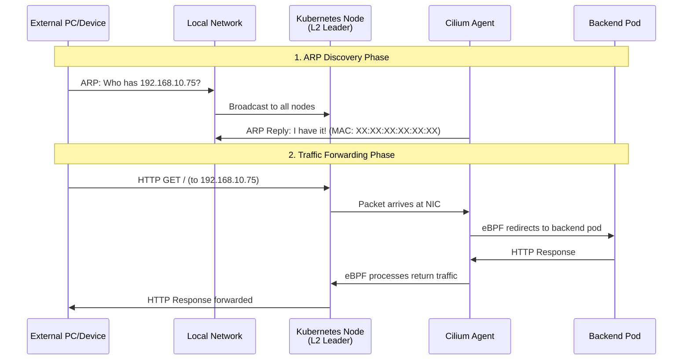

# Deploying Cilium with a LoadBalancer on Talos Linux

Learn how to set up external LoadBalancer services on bare-metal `TalosLinux` Kubernetes using **Cilium CNI** with L2 announcements.

## What You'll Learn

By the end of this tutorial, you will:

- [x] Understand why L2 LoadBalancer is needed on bare-metal Kubernetes
- [x] Install Cilium CNI on Talos Linux with L2 announcement support
- [x] Configure IP pools and L2 announcement policies
  - [x] Deploy a LoadBalancer service accessible from external networks (LAN)
- [x] Verify and troubleshoot L2 announcements

!!! info "Time Investment"

    **Estimated Time:** 45-60 minutes  
    **Skill Level:** Intermediate (Kubernetes and networking knowledge recommended)

## Prerequisites

Before you begin, ensure you have:

- [x] A running Talos Linux cluster (v1.6+)
- [x] `kubectl` configured to access your cluster
- [x] `helm` CLI installed (v3.0+)
- [x] `talosctl` CLI installed
- [x] Basic understanding of Kubernetes networking concepts
- [x] Administrative access to configure cluster resources

!!! tip "Talos Linux Context"

    This tutorial is specifically written for **Talos Linux**, an immutable Kubernetes operating system. If you're using standard Kubernetes distributions, some steps will differ (especially CNI installation and system configuration).

## Introduction

### The Bare-Metal LoadBalancer Challenge

In cloud environments like **AWS**, **Azure**, or **GCP**, creating a LoadBalancer service automatically provisions a cloud load balancer (**AWS ELB**, **Azure Load Balancer**, **GCP Cloud Load Balancing**). However, on bare-metal or homelab Kubernetes clusters, LoadBalancer services remain in `<pending>` state because there's no cloud provider integration.

```bash
# On cloud platforms (works automatically)
$ kubectl expose deployment nginx --type=LoadBalancer --port=80
$ kubectl get svc nginx
NAME    TYPE           CLUSTER-IP      EXTERNAL-IP      PORT(S)
nginx   LoadBalancer   10.43.100.123   203.0.113.45     80:30080/TCP

# On bare-metal (without LB-IPAM)
$ kubectl expose deployment nginx --type=LoadBalancer --port=80
$ kubectl get svc nginx
NAME    TYPE           CLUSTER-IP      EXTERNAL-IP      PORT(S)
nginx   LoadBalancer   10.43.100.123   <pending>        80:30080/TCP  # ❌ Stuck!
```

### Solutions: MetalLB vs Cilium LB-IPAM

Two popular solutions exist for bare-metal LoadBalancer services:

1. **MetalLB** - Standalone load balancer for Kubernetes
2. **Cilium LB-IPAM** - Integrated LoadBalancer **IP** Address Management in Cilium **CNI**

Previously, i used **MetalLB** in my homelab clusters with native kube-proxy.
Decide recently to use Cilium as my **CNI**, using Cilium's built-in **LB-IPAM** is the natural choice then.

!!! info "Why Choose Cilium Over MetalLB?"

    For a detailed comparison of MetalLB vs Cilium LB-IPAM, including architectural differences and use cases, see [Why Cilium LB-IPAM?](../../../../../explanation/containers/kubernetes/networking/cilium/cilium-l2-networking-talos.md#cilium-vs-metallb).

!!! success "Why Cilium LB-IPAM?"

    - **Integrated solution** - No additional components needed
    - **eBPF-based** - High performance with low overhead
    - **L2 and BGP support** - Flexible announcement methods
    - **KubePrism friendly** - Works seamlessly with Talos
    - **Helm managed** - Easy configuration and upgrades

## Understanding the Talos + Cilium Stack

!!! info "Deep Dive Available"

    For a comprehensive understanding of the underlying architecture and concepts, see [Cilium L2 Networking Architecture](../../../../../explanation/containers/kubernetes/networking/cilium/cilium-l2-networking-talos.md).

### Talos Linux Architecture

Talos Linux is different from traditional Linux distributions:

- **Immutable OS** - No **SSH**, no shell access, no package manager
- **API-driven** - Managed via `talosctl` and Kubernetes **API**
- **Secure by default** - Minimal attack surface
- **CGroup v2** - Modern Linux cgroup filesystem
- **KubePrism** - Built-in Kubernetes **API** proxy

### Why Talos Requires Special Cilium Configuration

Talos doesn't allow traditional CNI installations. You must configure Cilium to work with Talos's constraints:

| Requirement            | Talos Value      | Why                                           |
|------------------------|------------------|-----------------------------------------------|
| **CNI Name**           | `none`           | Talos doesn't manage **CNI**                  |
| **Kube-proxy**         | `disabled`       | Cilium replaces kube-proxy with **eBPF**      |
| **CGroup Mount**       | `/sys/fs/cgroup` | Pre-mounted by Talos                          |
| **CGroup AutoMount**   | `false`          | Talos already provides cgroup v2              |
| **Capabilities**       | Restricted set   | No `SYS_MODULE` _(kernel modules forbidden)_  |
| **K8s API Server**     | `localhost:7445` | KubePrism local proxy                         |

!!! tip "KubePrism"

    **KubePrism** is a local Kubernetes **API** server proxy that runs on every Talos node at `localhost:7445`. 
    This provides high-availability **API** access without external load balancers, which is critical when running Cilium with `kubeProxyReplacement=true`.

### Network Flow with **L2 Announcements**

Here's how traffic flows when accessing a **LoadBalancer** service externally (outside the cluster):



**Key Points:**

- **Leader Election** - One node per LoadBalancer IP becomes the "leader" via Kubernetes leases
- **ARP Responder** - The leader node responds to ARP requests for the LoadBalancer IP
- **eBPF Magic** - Cilium uses eBPF programs to efficiently forward traffic to pods

!!! tip "Learn More About L2 Networking"

    To understand how ARP works, leader election mechanisms, and eBPF packet processing in detail, read [Cilium L2 Networking Architecture](../../../../../explanation/containers/kubernetes/networking/cilium/cilium-l2-networking-talos.md).

## Step-by-Step Installation

### Step 1: Prepare Talos Machine Configuration

First, configure Talos to disable the default CNI and kube-proxy. Create a patch file for your Talos configuration:

```yaml title="talos-cilium-patch.yaml" linenums="1"
# Example patch.yaml for existing clusters
machine:
  features:
    kubePrism:
      enabled: true
      port: 7445

cluster:
  network:
    cni:
      name: none # (1)!
  proxy:
    disabled: true # (2)!
```

1. Tell Talos not to install any CNI - we'll install Cilium manually
2. Disable kube-proxy since Cilium will replace it with **eBPF**.

Apply this patch when generating or updating your Talos configuration:

```bash
# If generating a new cluster config
talosctl gen config \
  my-cluster https://mycluster.local:6443 \
  --config-patch @talos-cilium-patch.yaml

# If updating an existing cluster
talosctl patch machineconfig \
  --nodes <node-ip> \
  --patch @talos-cilium-patch.yaml
```

!!! warning "Node Reboot Required"

    After applying this patch, nodes will reboot. During the boot process, nodes will appear stuck at "phase 18/19" waiting for CNI. This is expected—nodes won't become Ready until Cilium is installed.

### Step 2: Install Cilium with L2 Support

Now we'll install Cilium using Helm with L2 announcements enabled.

Create a comprehensive Helm values file:

```yaml title="cilium-values.yaml" linenums="1"
# IPAM Configuration
ipam:
  mode: kubernetes # (1)!

# Kube-proxy Replacement
kubeProxyReplacement: true # (2)!

# Security Context - Talos-specific capabilities
securityContext:
  capabilities:
    ciliumAgent: # (3)!
      - CHOWN
      - KILL
      - NET_ADMIN
      - NET_RAW
      - IPC_LOCK
      - SYS_ADMIN
      - SYS_RESOURCE
      - DAC_OVERRIDE
      - FOWNER
      - SETGID
      - SETUID
    cleanCiliumState: # (4)!
      - NET_ADMIN
      - SYS_ADMIN
      - SYS_RESOURCE

# CGroup Configuration for Talos
cgroup:
  autoMount:
    enabled: false # (5)!
  hostRoot: /sys/fs/cgroup # (6)!

# Kubernetes API Server - KubePrism
k8sServiceHost: localhost # (7)!
k8sServicePort: 7445 # (8)!

# Gateway API Support (Optional)
gatewayAPI:
  enabled: true # (9)!
  enableAlpn: true
  enableAppProtocol: true

# L2 Announcements - LoadBalancer Support
l2announcements:
  enabled: true # (10)!
  leaseDuration: 15s # (11)!
  leaseRenewDeadline: 5s
  leaseRetryPeriod: 2s

# L2 Neighbor Discovery - ARP/NDP
l2NeighDiscovery:
  enabled: true # (12)!
  refreshPeriod: 30s
```

1. Use Kubernetes native IPAM for pod IP allocation
2. Replace kube-proxy with Cilium's eBPF implementation
3. Required Linux capabilities for Cilium agent (note: `SYS_MODULE` is **not** included for Talos)
4. Capabilities for Cilium cleanup process
5. **Critical for Talos** - Don't auto-mount cgroup, Talos provides it
6. **Critical for Talos** - Path to Talos's pre-mounted cgroup v2
7. **Critical for Talos** - Use KubePrism local proxy
8. **Critical for Talos** - KubePrism port (default: 7445)
9. Enable Gateway API support (useful for advanced routing)
10. **Enable L2 announcements** - This makes LoadBalancer IPs accessible externally
11. Leader election lease duration for L2 announcements
12. **Enable neighbor discovery** - Required for ARP responses

Install Cilium using Helm:

```bash
# Add Cilium Helm repository
helm repo add cilium https://helm.cilium.io/
helm repo update

# Check for more recent versions at https://artifacthub.io/packages/helm/cilium/cilium
# Install Cilium with L2 support
helm install cilium cilium/cilium \
  --version 1.18.0 \
  --namespace kube-system \
  --values cilium-values.yaml \
  --wait \
  --timeout 10m
```

### Step 3: Apply RBAC Permissions for L2 Announcements

Cilium needs permissions to manage Kubernetes leases for L2 leader election. Create the RBAC resources:

```yaml title="cilium-l2-rbac.yaml" linenums="1"
---
apiVersion: rbac.authorization.k8s.io/v1
kind: ClusterRole
metadata:
  name: cilium-l2-announcements
rules:
  - apiGroups:
      - coordination.k8s.io # (1)!
    resources:
      - leases # (2)!
    verbs:
      - get
      - list
      - watch
      - create
      - update
      - patch
      - delete

---
apiVersion: rbac.authorization.k8s.io/v1
kind: ClusterRoleBinding
metadata:
  name: cilium-l2-announcements
roleRef:
  apiGroup: rbac.authorization.k8s.io
  kind: ClusterRole
  name: cilium-l2-announcements
subjects:
  - kind: ServiceAccount
    name: cilium # (3)!
    namespace: kube-system
```

1. The `coordination.k8s.io` API group manages distributed coordination primitives like leases
2. Leases are used for leader election - one node becomes the "leader" for each LoadBalancer IP
3. Bind permissions to the Cilium service account

Apply the RBAC configuration:

```bash
kubectl apply -f cilium-l2-rbac.yaml
```

Verify the permissions:

```bash
# Test if Cilium can manage leases
kubectl auth can-i get leases \
  --as=system:serviceaccount:kube-system:cilium \
  -n kube-system

# Should output: yes
```

!!! danger "Critical Step"
    **Without these RBAC permissions**, Cilium will log errors like:
    
    ```
    error retrieving resource lock: leases.coordination.k8s.io "xxx" is forbidden
    ```
    
    And L2 announcements will **not work**.

### Step 4: Create LoadBalancer IP Pool

Now define the IP address range that Cilium can assign to LoadBalancer services. Choose IPs from your **local network** that are:

- ✅ In the same subnet as your Kubernetes nodes
- ✅ **Not** used by your DHCP server
- ✅ **Not** assigned to any other devices

```yaml title="cilium-loadbalancer-ippool.yaml" linenums="1"
apiVersion: cilium.io/v2alpha1
kind: CiliumLoadBalancerIPPool
metadata:
  name: lab-lb-pool # (1)!
spec:
  blocks:
    - start: "192.168.10.75" # (2)!
      stop:  "192.168.10.78" # (3)!
```

1. Name your IP pool (can have multiple pools for different purposes)
2. First IP address in the pool (inclusive)
3. Last IP address in the pool (inclusive) - This gives you 4 IPs total

!!! tip "Choosing IP Addresses"

    **Example Network:** `192.168.10.0/24`

    - Router: `192.168.10.1`
    - DHCP Range: `192.168.10.100-192.168.10.200`
    - Kubernetes Nodes: `192.168.10.215-192.168.10.220`
    - **LoadBalancer Pool: `192.168.10.75-192.168.10.78`** ✅ Safe choice

    Make sure these IPs are **outside** your DHCP range and not already assigned.

Apply the IP pool:

```bash
kubectl apply -f cilium-loadbalancer-ippool.yaml
```

Verify the IP pool:

```bash
kubectl get ciliumloadbalancerippool

# Expected output:
NAME          DISABLED   CONFLICTING   IPS AVAILABLE   AGE
lab-lb-pool   false      False         4               10s
```

### Step 5: Create L2 Announcement Policy

The L2 announcement policy tells Cilium **which network interface** to use for announcing LoadBalancer IPs via **ARP** (Address Resolution Protocol). This is necessary because Kubernetes LoadBalancer services rely on ARP.

First, identify your network interface on Talos nodes:

```bash
# Get the interface name from a Talos node
talosctl get links -n <node-ip>

# Example output:
NODE            NAMESPACE   TYPE        ID       VERSION   HARDWARE ADDR      MTU
192.168.10.216  network     LinkStatus  enp0s1   2         f2:83:d9:c5:82:97  1500
192.168.10.216  network     LinkStatus  eth0     1         aa:bb:cc:dd:ee:ff  1500
```

Common interface names on Talos:

- `enp0s1` - PCIe network device (common in VMs)
- `eth0` - Ethernet device
- `ens18` - Another PCIe naming convention

Now create the L2 announcement policy:

```yaml title="cilium-l2-announcement-policy.yaml" linenums="1"
apiVersion: cilium.io/v2alpha1
kind: CiliumL2AnnouncementPolicy
metadata:
  name: lab-lb-policy # (1)!
spec:
  loadBalancerIPs: true # (2)!
  externalIPs: true # (3)!

  interfaces:
    - enp0s1 # (4)!

  nodeSelector:
    matchLabels: {} # (5)!

  serviceSelector:
    matchLabels: {} # (6)!
```

1. Name your L2 policy (can have multiple policies)
2. Announce LoadBalancer service IPs (what we want!)
3. Also announce external IPs if services use `externalIPs` field
4. **Critical:** Replace with your actual interface name from Step 5
5. Empty selector = apply to **all nodes** (recommended for most setups)
6. Empty selector = announce **all services** (recommended for most setups)

Apply the L2 policy:

```bash
kubectl apply -f cilium-l2-announcement-policy.yaml
```

Verify the policy:

```bash
kubectl get ciliuml2announcementpolicy

# Expected output:
NAME            AGE
lab-lb-policy   5s
```

!!! warning "Interface Name is Critical"

    If you specify the **wrong interface name**, ARP announcements won't work and LoadBalancer IPs will be unreachable. Double-check with `talosctl get links -n <node-ip>`.

### Step 6: Deploy a Test LoadBalancer Service

Now let's test the complete setup by deploying nginx with a LoadBalancer service:

```bash
# Create a test namespace
kubectl create namespace test-loadbalancer

# Deploy nginx
kubectl create deployment nginx \
  --image=nginx:latest \
  --namespace=test-loadbalancer

# Expose nginx as a LoadBalancer service
kubectl expose deployment nginx \
  --type=LoadBalancer \
  --port=80 \
  --namespace=test-loadbalancer
```

Watch the service get an external IP:

```bash
kubectl get svc nginx -n test-loadbalancer --watch

# Expected progression:
NAME    TYPE           CLUSTER-IP      EXTERNAL-IP   PORT(S)
nginx   LoadBalancer   10.43.100.50    <pending>     80:30492/TCP
nginx   LoadBalancer   10.43.100.50    192.168.10.75 80:30492/TCP  ✅
```

!!! success "External IP Assigned!"

    If you see an IP from your pool (e.g., `192.168.10.75`), congratulations! Cilium's LB-IPAM is working.

### Step 7: Verify External Access

Now test that the LoadBalancer IP is actually accessible from outside the cluster:

#### From Your Local Machine

```bash
# Test HTTP access
curl http://192.168.10.75

# Expected output:
<!DOCTYPE html>
<html>
<head>
<title>Welcome to nginx!</title>
...
```

#### Check ARP Table

Verify that your machine has learned the MAC address for the LoadBalancer IP:

```bash
# On macOS/Linux
arp -a | grep 192.168.10.75

# Expected output (MAC address present):
? (192.168.10.75) at c2:d2:76:e3:7:ab on en1 ifscope [ethernet]

# Bad output (means L2 announcements aren't working):
? (192.168.10.75) at (incomplete) on en1 ifscope [ethernet]  ❌
```

!!! tip "ARP Entry Meaning"

      - **MAC address present** (e.g., `c2:d2:76:e3:7:ab`) = L2 announcements are working ✅ 
      - **`(incomplete)`** = Node is not responding to ARP requests ❌

### Step 8: Verify L2 Announcements

Let's dive deeper and verify that Cilium is properly announcing the LoadBalancer IP:

#### Check Cilium Configuration

```bash
# Get a Cilium pod name
CILIUM_POD=$(kubectl get pod -n kube-system -l k8s-app=cilium -o jsonpath='{.items[0].metadata.name}')

# Verify L2 announcements are enabled
kubectl exec -n kube-system $CILIUM_POD -- cilium-dbg debuginfo | grep enable-l2

# Expected output:
enable-l2-announcements:true          ✅
enable-l2-neigh-discovery:true        ✅
enable-l2-pod-announcements:false     ℹ️ (not needed for LoadBalancer)
```

#### Check Leader Election Leases

For each LoadBalancer service, Cilium creates a lease for leader election:

```bash
# List L2 announcement leases
kubectl get leases -n kube-system | grep l2announce

# Expected output:
NAME                                   HOLDER                         AGE
cilium-l2announce-test-loadbalancer-nginx   cp1-lab.home.mombesoft.com    2m
```

The `HOLDER` column shows which node is currently the leader for announcing this LoadBalancer IP.

#### Check Cilium Service Mapping

```bash
# Check if Cilium knows about the LoadBalancer service
kubectl exec -n kube-system $CILIUM_POD -- cilium-dbg service list | grep 192.168.10.75

# Expected output:
20   192.168.10.75:80/TCP      LoadBalancer
24   192.168.10.75:80/TCP/i    LoadBalancer   1 => 10.244.2.98:80/TCP (active)
```

#### Check BPF LoadBalancer Tables

```bash
# Check eBPF load balancer mappings
kubectl exec -n kube-system $CILIUM_POD -- cilium-dbg bpf lb list | grep 192.168.10.75

# Expected output:
192.168.10.75:80/TCP (1)         10.244.2.98:80/TCP (20) (1)
192.168.10.75:80/TCP/i (0)       0.0.0.0:0 (24) (0) [LoadBalancer, Cluster, two-scopes]
```

!!! success "All Checks Passed!"

    If all verification steps show positive results, your Cilium L2 LoadBalancer setup is fully operational!

## Understanding Traffic Policies

Kubernetes LoadBalancer services support two traffic policies via the `externalTrafficPolicy` field:

!!! info "Traffic Policy Deep Dive"

    For a detailed explanation of how traffic routing works with each policy, including packet flow diagrams and performance implications, see the [Traffic Policy Explanation](../../../../../explanation/containers/kubernetes/networking/cilium/cilium-l2-networking-talos.md#traffic-policies).

### Cluster (Default)

```yaml
spec:
  type: LoadBalancer
  externalTrafficPolicy: Cluster # Default
```

**Behavior:**

- Any node in the cluster can receive external traffic
- Traffic is forwarded to pods on any node (even if not local)
- Source IP is SNAT'd (client IP is lost)

**Advantages:**

- ✅ Works regardless of which node is the L2 leader
- ✅ Even load distribution across pods
- ✅ Simpler configuration

**Disadvantages:**

- ❌ Client source IP is not preserved
- ❌ Extra network hop if pod is on a different node

### Local

```yaml
spec:
  type: LoadBalancer
  externalTrafficPolicy: Local
```

**Behavior:**

- Only nodes with local pods respond to traffic
- No SNAT - client source IP is preserved
- Direct routing to local pod

**Advantages:**

- ✅ Client source IP is preserved (important for logging, security)
- ✅ No extra network hop
- ✅ Lower latency

**Disadvantages:**

- ❌ Load may be uneven if pods are not evenly distributed
- ❌ L2 announcement leader must have a local pod
- ❌ More complex to configure correctly

!!! warning "Local Policy Gotcha"

    With `externalTrafficPolicy: Local`, if the node announcing the LoadBalancer IP (L2 leader) doesn't have a pod replica, **traffic will fail**. For most users, `Cluster` is the safer choice.

## Key Takeaways

!!! summary "What We Accomplished"
✅ **Installed Cilium on Talos** with proper KubePrism and cgroup configuration  
 ✅ **Enabled L2 announcements** for LoadBalancer IP accessibility  
 ✅ **Configured RBAC permissions** for Cilium leader election  
 ✅ **Created an IP pool** for LoadBalancer IP allocation  
 ✅ **Defined L2 policy** specifying network interface for ARP  
 ✅ **Deployed and verified** a working LoadBalancer service  
 ✅ **Understood traffic policies** and their implications

## Next Steps

Now that you have a working LoadBalancer setup, explore:

- **[Configure Advanced L2 Policies](../../../../../how-to/containers/kubernetes/networking/cilium/cilium-configure-l2-announcements.md)** - Node selectors, service selectors, multiple IP pools
- **[Troubleshoot LoadBalancer Issues](../../../../../how-to/containers/kubernetes/networking/cilium/cilium-troubleshoot-loadbalancer.md)** - Common problems and solutions
- **[Understand L2 Networking Architecture](../../../../../explanation/containers/kubernetes/networking/cilium/cilium-l2-networking-talos.md)** - Deep dive into how it all works
- **Deploy Real Services** - Apply LoadBalancer type to your actual workloads

## Cleanup (Optional)

To remove the test LoadBalancer service:

```bash
kubectl delete namespace test-loadbalancer
```

## References

- [Talos Linux - Deploying Cilium CNI](https://docs.siderolabs.com/kubernetes-guides/cni/deploying-cilium)
- [Cilium Documentation - LB-IPAM](https://docs.cilium.io/en/stable/network/lb-ipam/)
- [Cilium Documentation - L2 Announcements](https://docs.cilium.io/en/stable/network/l2-announcements/)
- [Kubernetes - Service External Traffic Policy](https://kubernetes.io/docs/tasks/access-application-cluster/create-external-load-balancer/#preserving-the-client-source-ip)

---

**Tutorial Complete!** You now have a production-ready LoadBalancer solution on your bare-metal Talos Linux cluster.
