# Démarrer avec Apache Kafka

## Introduction

Apache Kafka® est devenu le fondement universel sur lequel les systèmes de données modernes sont construits. Que vous construisiez des pipelines de données pour l'analytique, connectiez des microservices, ou déplaciez des données entre systèmes, Kafka sera probablement une partie fondamentale de votre infrastructure.

Ce tutoriel vous présente les concepts fondamentaux d'Apache Kafka, de la compréhension des événements à la maîtrise de la façon dont Kafka stocke, partitionne et réplique les données à travers un cluster distribué.

## Ce que vous allez apprendre

- Comprendre les événements vs les objets
- Comment fonctionnent les topics Kafka en tant que logs immuables
- Le partitionnement pour la scalabilité
- L'architecture des brokers et du cluster
- La réplication pour la tolérance aux pannes

## Prérequis

- Compréhension de base des concepts de systèmes distribués
- Familiarité avec les interfaces en ligne de commande
- Aucune expérience préalable avec Kafka n'est requise

---

## Comprendre les Événements : Le Fondement de Kafka

### Des Objets aux Événements

!!! tip "Changement de Modèle Mental"
Quand vous pensez aux données, vous êtes probablement enclin à penser aux données comme des **tables**—des représentations d'_objets_ dans le monde : articles en stock, dispositifs IoT, comptes utilisateurs, etc.

    Kafka vous encourage à changer votre façon de penser des **objets** aux **événements**—des moments dans le temps où quelque chose se produit.

**Exemples d'Événements :**

- Un article vendu
- Un conducteur utilisant son clignotant
- Un utilisateur cliquant sur votre site
- Un capteur de température rapportant une mesure

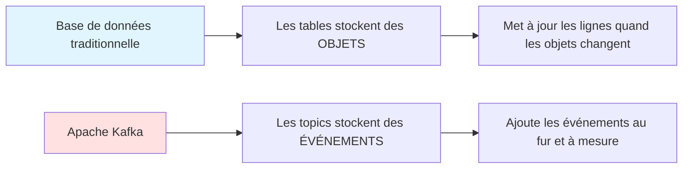

### Traitement en Temps Réel

!!! info "Focus Temps Réel"
Les événements se produisent à un moment précis dans le temps, et Kafka se concentre sur leur traitement **en temps réel**. Cela signifie :

    - ✅ Traiter les événements au moment où ils se produisent
    - ✅ Ne pas les stocker pour un traitement batch ultérieur
    - ✅ Réagir immédiatement à ce qui se passe maintenant

    Cependant, Kafka **peut se souvenir des événements**—il les stocke pour une relecture et une analyse futures.

### Exemple : Thermostat Intelligent

Considérez un réseau de thermostats intelligents dans des maisons. Dans une base de données traditionnelle :

**Approche Traditionnelle (Tables) :**

| sensor_id | location | temperature | timestamp        |
| --------- | -------- | ----------- | ---------------- |
| 42        | cuisine  | 22°C        | 2024-12-05 10:00 |
| 42        | cuisine  | 24°C        | 2024-12-05 10:15 |

!!! warning "Problème : Perte de Contexte"
Quand la température se met à jour, nous **perdons le contexte**—nous ne nous souvenons pas de ce qu'était la température avant.

**Approche Kafka (Log d'Événements) :**

```json
{"sensor_id": 42, "location": "cuisine", "temperature": 22, "timestamp": "2024-12-05T10:00:00Z"}  // (1)!
{"sensor_id": 42, "location": "cuisine", "temperature": 24, "timestamp": "2024-12-05T10:15:00Z"}  // (2)!
```

1. Première lecture à 10:00 - préservée pour toujours
2. Deuxième lecture à 10:15 - ajoutée au log

!!! success "Avantages des Logs d'Événements"
Nous préservons **l'historique complet** des changements de température, permettant des insights comme :

    - À quelle vitesse la cuisine chauffe-t-elle ?
    - À quel moment de la journée chauffe-t-elle ?
    - Tendances et patterns historiques

---

## Topics Kafka : Logs d'Événements Immuables

### Qu'est-ce qu'un Topic ?

Dans Kafka, un **topic** est l'endroit où nous stockons les messages. Contrairement aux tables de bases de données traditionnelles, les topics utilisent des **logs**—des séquences ordonnées d'enregistrements immuables.

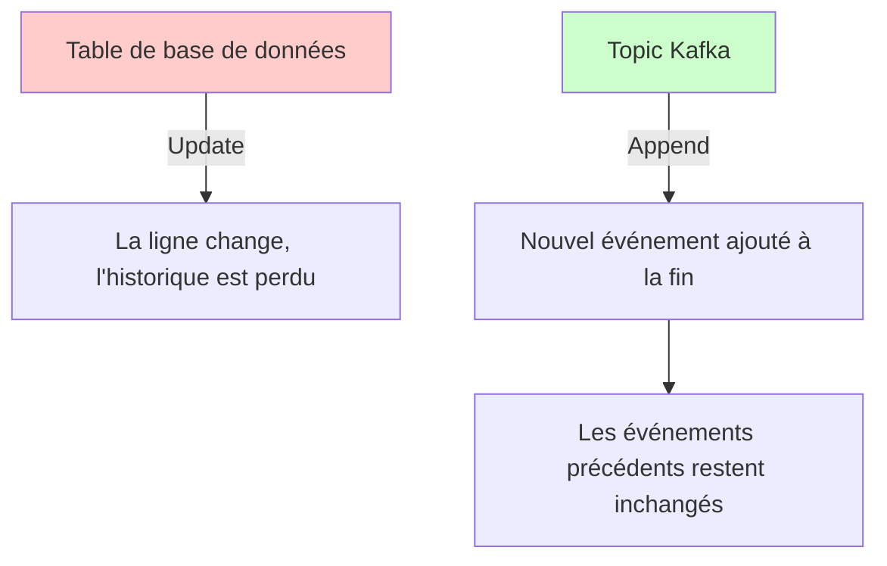

### Caractéristiques Clés des Topics

!!! note "Propriétés Fondamentales" 1. **Messages Immuables** : Une fois écrits, les messages ne peuvent pas être modifiés 2. **Append-Only** : Les nouveaux messages sont ajoutés à la fin 3. **Séquence Ordonnée** : Les messages maintiennent leur ordre dans le log 4. **Rejouables** : Les messages peuvent être lus plusieurs fois

### Exemple de Structure de Topic

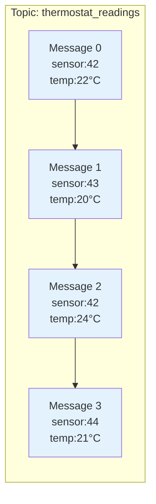

### Anatomie d'un Message

Chaque message dans un topic Kafka comprend :

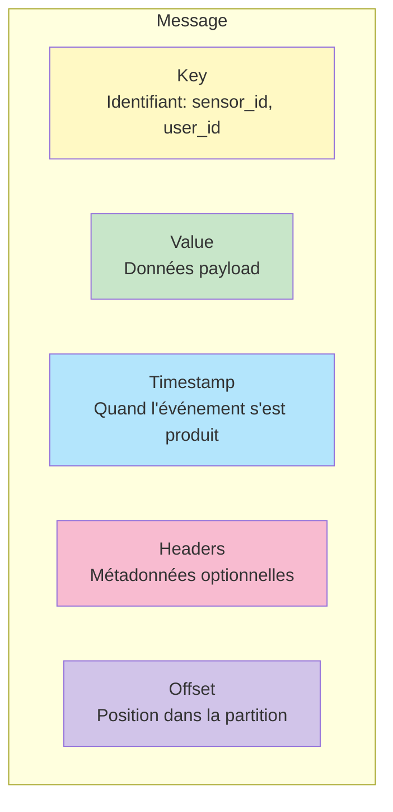

**Composants :**

- **Key** (optionnel) : Identifiant auquel l'événement se rapporte (ex: `sensor_id: 42`) // (1)!
- **Value** (requis) : Les données réelles de l'événement (JSON, Avro, Protobuf, etc.) // (2)!
- **Timestamp** : Quand l'événement a été produit ou reçu // (3)!
- **Headers** (optionnel) : Paires clé-valeur pour des métadonnées légères // (4)!
- **Offset** : ID séquentiel commençant à 0, incrémenté de 1 pour chaque message // (5)!

1. Utilisé pour l'assignation de partition - les messages avec la même clé vont à la même partition
2. Peut être n'importe quel format sérialisé : JSON, Avro, Protocol Buffers, texte brut, etc.
3. Peut être défini par le producteur (temps de l'événement) ou par le broker (temps d'ingestion)
4. Utile pour le traçage, le routage, ou l'ajout de contexte sans modifier la valeur
5. Unique dans une partition - utilisé par les consumers pour suivre leur position de lecture

### Exemple de Message

```json
{
  "key": 42,
  "value": {
    "sensor_id": 42,
    "location": "cuisine",
    "temperature": 22,
    "unit": "celsius",
    "read_at": "2024-12-05T10:00:00Z"
  },
  "timestamp": 1733396400000,
  "headers": {
    "source": "iot-gateway-01",
    "version": "1.0"
  },
  "offset": 1234567
}
```

### Les Topics ne sont pas des Queues

!!! danger "Distinction Critique"
**Queue** : Quand vous lisez un message, il disparaît—personne d'autre ne peut le lire

    **Topic Kafka** : Les messages restent disponibles pour que plusieurs consumers puissent les lire indépendamment

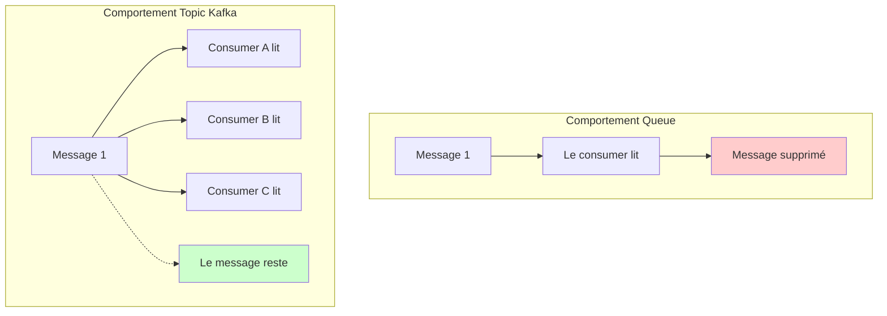

- **Queue** : Quand vous lisez un message, il disparaît—personne d'autre ne peut le lire
- **Topic Kafka** : Les messages restent disponibles pour que plusieurs consumers les lisent indépendamment

Cela permet :

!!! success "Avantages Clés" - **Rejouabilité** : Relire les messages - **Consumers multiples** : Différentes applications peuvent traiter les mêmes événements - **Tolérance aux pannes** : Si un consumer échoue, il peut reprendre là où il s'était arrêté

### Transformer des Données Immuables

Puisque les messages sont immuables, comment transformer les données ?

**Réponse :** Créer de nouveaux topics avec des données transformées.

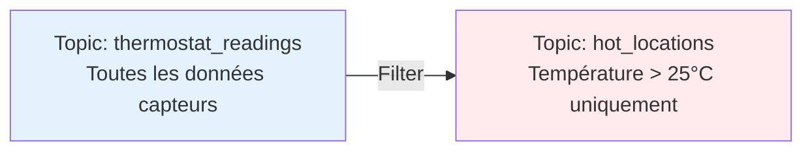

Exemple de transformation avec stream processing :

```sql
-- Filtrer uniquement les lectures chaudes
INSERT INTO hot_locations
SELECT * FROM thermostat_readings
WHERE temperature > 25;
```

### Log Compaction et Rétention

Kafka offre une gestion flexible des données :

**Politiques de Rétention :**

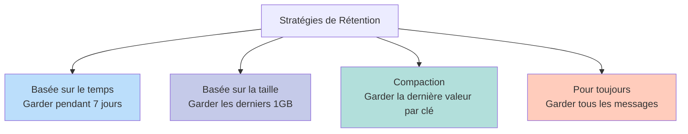

**Log Compaction** est particulièrement utile quand vous ne vous souciez que du dernier état :

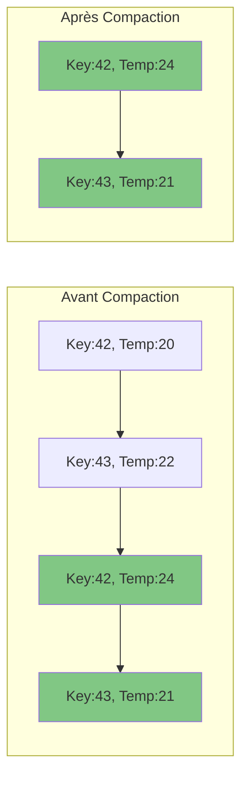

---

## Partitions : Mise à l'Échelle Horizontale de Kafka

### Pourquoi Partitionner ?

!!! warning "Limitations d'une Partition Unique"
Si un topic était stocké entièrement sur une seule machine, il serait limité par :

    - ❌ La capacité de stockage de cette machine
    - ❌ La puissance de traitement de cette machine
    - ❌ La bande passante réseau de cette machine

Le **partitionnement** résout ce problème en divisant un topic en plusieurs logs distribués sur différentes machines.

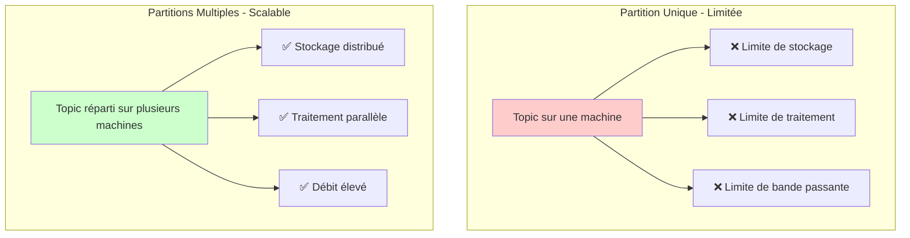

### Structure de Partition

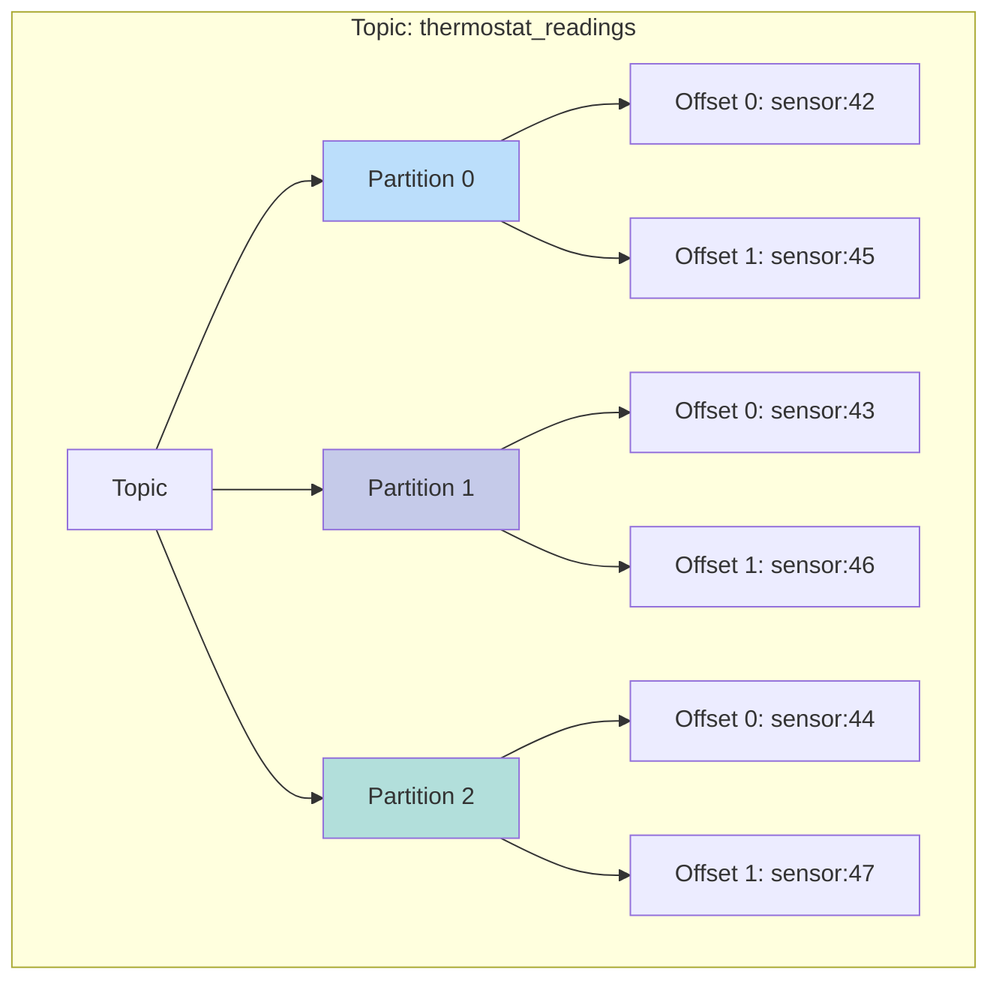

**Points Clés :**

- Chaque partition est un **log ordonné et immuable**
- Les partitions sont **indépendantes** les unes des autres
- Un topic peut avoir **des centaines ou des milliers** de partitions
- Kafka supporte jusqu'à **2 millions de partitions** avec KRaft

### Ordre des Messages

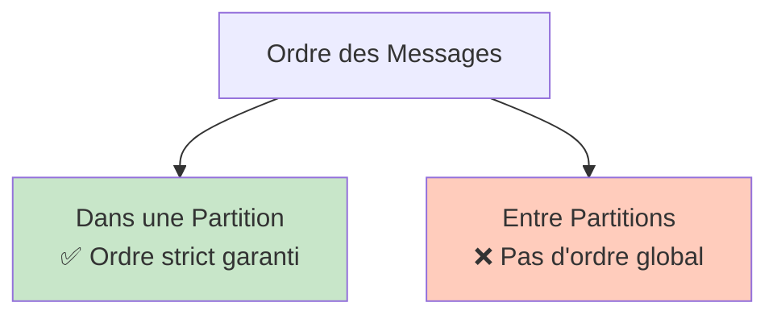

**Dans une partition :** Les messages sont lus dans la séquence exacte où ils ont été écrits.

**Entre partitions :** Aucune garantie d'ordre entre les partitions.

### Stratégies d'Attribution de Partition

#### 1. Avec Clé de Message (Basé sur le Hash)

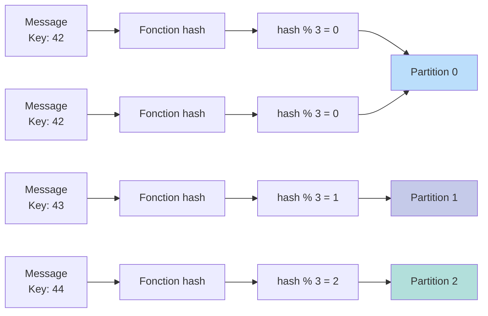

**Processus :**

1. Hasher la clé du message
2. Appliquer modulo avec le nombre de partitions : `hash(key) % num_partitions`
3. Router le message vers la partition résultante

**Résultat :** Tous les messages avec la **même clé** vont à la **même partition**, préservant l'ordre pour cette clé.

**Exemple :**

```
Tous les messages avec sensor_id=42 → Partition 0
Tous les messages avec sensor_id=43 → Partition 1
```

#### 2. Sans Clé de Message (Round-Robin)

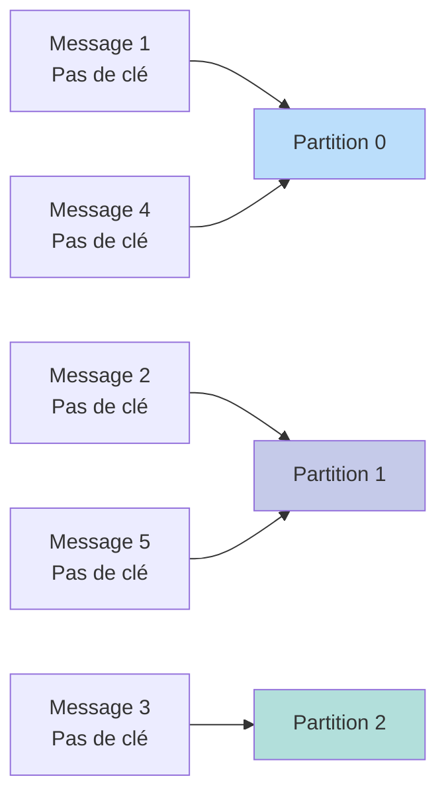

**Processus :** Les messages sont distribués uniformément entre les partitions en round-robin.

**Résultat :**

- ✅ Distribution de charge uniforme
- ❌ Aucune garantie d'ordre (les messages de la même source peuvent aller vers différentes partitions)

### Choisir le Nombre de Partitions

Considérez ces facteurs :

| Facteur          | Considération                                |
| ---------------- | -------------------------------------------- |
| **Débit**        | Plus de partitions = débit plus élevé        |
| **Parallélisme** | Max consumers = nombre de partitions         |
| **Latence**      | Trop de partitions peut augmenter la latence |
| **Stockage**     | Chaque partition consomme disque et mémoire  |

**Règle générale :** Commencer avec le nombre de brokers, puis ajuster selon la charge de travail.

---

## Brokers : L'Infrastructure du Cluster Kafka

### Qu'est-ce qu'un Broker ?

Un **broker** est un serveur Kafka qui :

- Stocke les données des partitions
- Gère les requêtes de lecture et d'écriture
- Gère la réplication
- Se coordonne avec les autres brokers

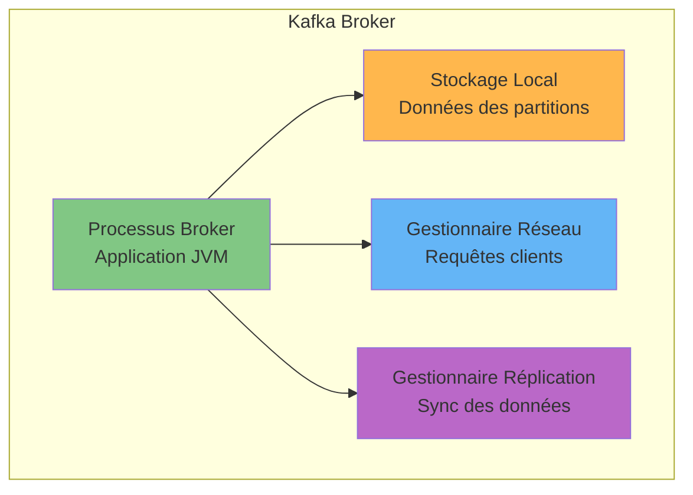

### Options de Déploiement des Brokers

Les brokers peuvent s'exécuter sur :

- 🖥️ Serveurs physiques (bare metal)
- ☁️ Instances cloud (AWS EC2, Azure VMs, GCP Compute)
- 🐳 Conteneurs (Docker, Kubernetes)
- 🔌 Dispositifs IoT (Raspberry Pi, edge computing)

**Configuration typique :** Les brokers ont accès à un **stockage SSD local** pour des performances I/O élevées.

### Architecture du Cluster Kafka

Plusieurs brokers forment un **cluster Kafka** :

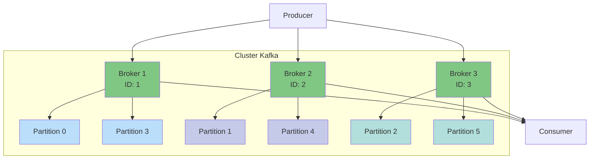

### Distribution des Topics entre Brokers

Exemple avec 2 topics :

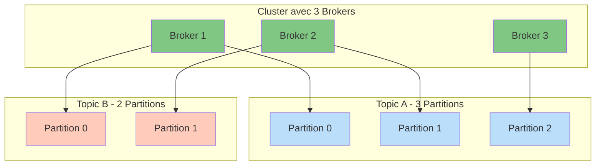

**Note :** Les topics peuvent avoir différents nombres de partitions selon leurs besoins de scalabilité.

### Responsabilités des Brokers

1. **Gérer les Requêtes Clients**

   ```mermaid
   graph LR
   P[Producer] -->|Requête Write| B[Broker]
   B -->|Acknowledgment| P
   B -->|Requête Read| C[Consumer]
   C -->|Acknowledgment| B
   ```

2. **Gérer le Stockage**
   - Écrire les messages dans les logs de partition
   - Maintenir des index pour des recherches rapides
   - Nettoyer les anciens messages selon les politiques de rétention

3. **Coordonner la Réplication**
   - Synchroniser les données entre brokers répliqués
   - Gérer les élections de leader
   - Assurer la cohérence des données

### Gestion des Métadonnées : KRaft

Kafka moderne (4.0+) utilise **KRaft** (Kafka Raft) pour la gestion des métadonnées :

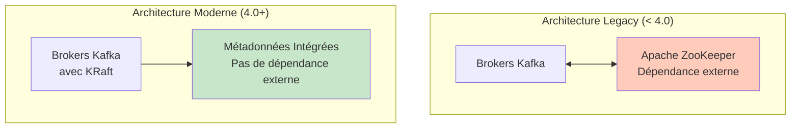

**Avantages de KRaft :**

- ✅ Pas de dépendance externe à ZooKeeper
- ✅ Operations simplifiées
- ✅ Mises à jour de métadonnées plus rapides
- ✅ Meilleure scalabilité (supporte 2M+ partitions)
- ✅ Basé sur le protocole de consensus Raft

**Important :** Depuis Kafka 4.0, ZooKeeper **n'est plus utilisé ni supporté**.

---

## Réplication : Assurer la Tolérance aux Pannes

### Pourquoi la Réplication ?

Les pannes de disque et de serveur **vont arriver**. La réplication protège contre la perte de données en maintenant plusieurs copies de chaque partition.

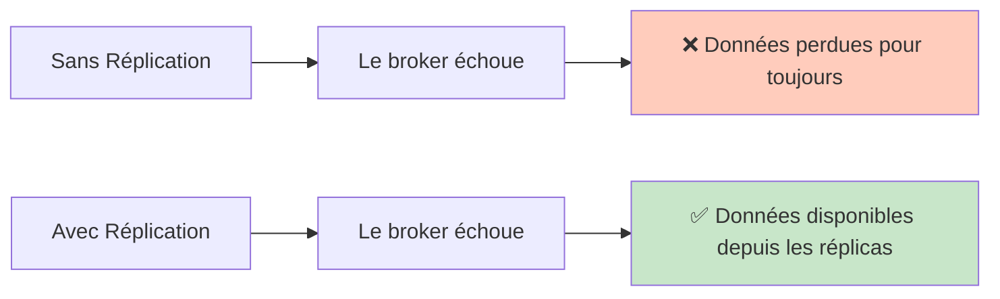

### Facteur de Réplication

Le **facteur de réplication** définit combien de copies de chaque partition maintenir.

**Exemple : Facteur de Réplication = 3**

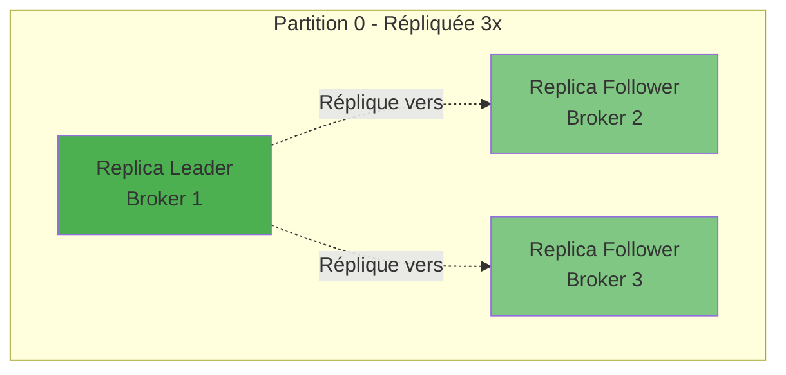

### Leader et Followers

Pour chaque ensemble de replicas de partition :

- **1 Leader** : Gère toutes les lectures et écritures
- **n-1 Followers** : Synchronisent les données depuis le leader

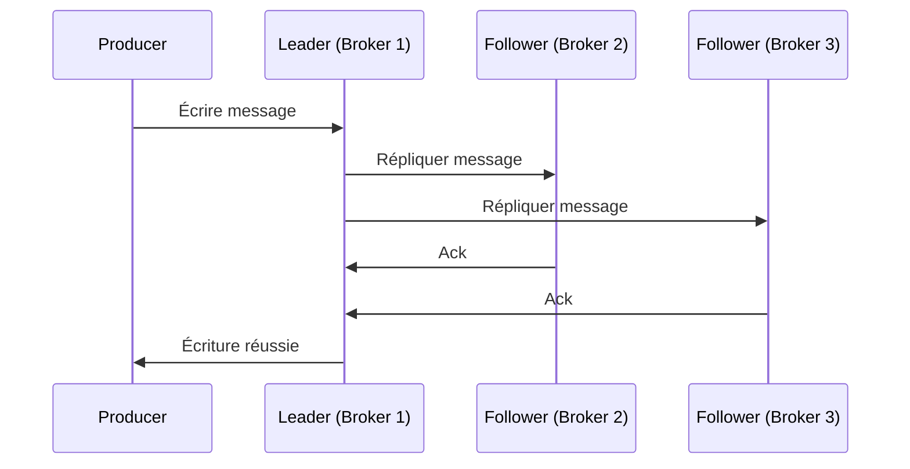

### Élection de Leader et Failover

Quand un broker échoue, Kafka élit automatiquement un nouveau leader :

```mermaid
graph TB
    subgraph "Opération Normale"
    L1[Leader<br/>Broker 1] --> F1[Follower<br/>Broker 2]
    L1 --> F2[Follower<br/>Broker 3]
    end

    subgraph "Broker 1 Échoue"
    X[❌ Broker 1<br/>Down]
    F1B[Follower<br/>Broker 2]
    F2B[Follower<br/>Broker 3]
    end

    subgraph "Après Élection de Leader"
    L2[Nouveau Leader<br/>Broker 2] --> F3[Follower<br/>Broker 3]
    L2 --> F4[Nouveau Follower<br/>Broker 4<br/>Remplace Broker 1]
    end

    style L1 fill:#4caf50
    style X fill:#f44336
    style L2 fill:#4caf50
    style F1 fill:#81c784
    style F2 fill:#81c784
    style F1B fill:#81c784
    style F2B fill:#81c784
    style F3 fill:#81c784
    style F4 fill:#81c784
```

**Processus :**

1. Le leader (Broker 1) échoue
2. Les followers restants détectent l'échec
3. Un follower (Broker 2) est élu comme nouveau leader
4. Les clients se connectent automatiquement au nouveau leader
5. Le cluster crée un nouveau replica sur un autre broker pour restaurer le facteur de réplication

### Patterns de Lecture et Écriture

#### Comportement par Défaut

```mermaid
graph TB
    P[Producer] -->|Écrit| L[Replica Leader]
    L -->|Lit| C[Consumer]

    L -.->|Réplique| F1[Follower<br/>Broker 2]
    L -.->|Réplique| F2[Follower<br/>Broker 3]

    style L fill:#4caf50
    style F1 fill:#81c784
    style F2 fill:#81c784
```

- **Écritures :** Vont toujours au leader
- **Lectures :** Par défaut, lisent depuis le leader

#### Follower Reads (Optionnel)

Pour améliorer la latence, les consumers peuvent lire depuis le replica le plus proche :

```mermaid
graph TB
    P[Producer<br/>US Est] -->|Write| L[Leader<br/>US Est]

    L -.->|Réplique| F1[Follower<br/>EU Ouest]
    L -.->|Réplique| F2[Follower<br/>Asie]

    L -->|Read| C1[Consumer<br/>US Est]
    F1 -->|Read| C2[Consumer<br/>EU Ouest]
    F2 -->|Read| C3[Consumer<br/>Asie]

    style L fill:#4caf50
    style F1 fill:#81c784
    style F2 fill:#81c784
```

**Avantages :**

- ✅ Latence plus faible pour les consumers géographiquement distribués
- ✅ Charge réduite sur le broker leader
- ⚠️ Potentiel pour des données légèrement obsolètes (cohérence éventuelle)

### Garanties de Réplication

Kafka fournit de fortes garanties de durabilité :

| Garantie                 | Description                                                  |
| ------------------------ | ------------------------------------------------------------ |
| **Au moins une fois**    | Les messages ne sont jamais perdus                           |
| **Ordre**                | Maintenu dans chaque partition                               |
| **Durabilité**           | Configurable via le paramètre `acks`                         |
| **Tolérance aux pannes** | Survit à f pannes de brokers avec facteur de réplication f+1 |

**Exemple :**

- Facteur de réplication = 3
- Peut tolérer 2 pannes de brokers
- Les données restent disponibles et cohérentes

---

## Tout Assembler

### Architecture Kafka Complète

```mermaid
graph TB
    subgraph "Cluster Kafka"
    B1[Broker 1<br/>avec KRaft]
    B2[Broker 2<br/>avec KRaft]
    B3[Broker 3<br/>avec KRaft]

    B1 <--> B2
    B2 <--> B3
    B3 <--> B1
    end

    subgraph "Topic: thermostat_readings"
    P0L[Partition 0<br/>Leader sur B1]
    P0F1[Partition 0<br/>Follower sur B2]
    P0F2[Partition 0<br/>Follower sur B3]

    P1L[Partition 1<br/>Leader sur B2]
    P1F1[Partition 1<br/>Follower sur B1]
    P1F2[Partition 1<br/>Follower sur B3]
    end

    B1 --> P0L
    B2 --> P0F1
    B3 --> P0F2

    B2 --> P1L
    B1 --> P1F1
    B3 --> P1F2

    PROD[Passerelle IoT<br/>Producer] -->|Écrit événements| B1
    PROD -->|Écrit événements| B2

    B1 -->|Lit événements| CONS[Application Analytics<br/>Consumer]
    B2 -->|Lit événements| CONS

    style B1 fill:#81c784
    style B2 fill:#81c784
    style B3 fill:#81c784
    style P0L fill:#4caf50
    style P1L fill:#4caf50
    style P0F1 fill:#a5d6a7
    style P0F2 fill:#a5d6a7
    style P1F1 fill:#a5d6a7
    style P1F2 fill:#a5d6a7
```

### Résumé du Flux de Données

```mermaid
sequenceDiagram
    participant IoT as Dispositif IoT
    participant P as Producer
    participant B1 as Broker 1 (Leader)
    participant B2 as Broker 2 (Follower)
    participant B3 as Broker 3 (Follower)
    participant C as Consumer

    IoT->>P: Lecture température: 22°C
    P->>P: Sérialiser en bytes
    P->>P: Hasher la clé (sensor_id=42)
    P->>P: Sélectionner partition (hash % 3 = 0)
    P->>B1: Écrire dans Partition 0
    B1->>B2: Répliquer message
    B1->>B3: Répliquer message
    B2->>B1: Ack réplication
    B3->>B1: Ack réplication
    B1->>P: Ack écriture réussie

    Note over C: Le consumer poll pour nouveaux messages
    C->>B1: Fetch depuis Partition 0
    B1->>C: Retourner messages
    C->>C: Désérialiser et traiter
    C->>B1: Commit offset
```

---

## Points Clés à Retenir

!!! summary "Événements vs Objets" - ✅ Kafka se concentre sur les **événements** (choses qui arrivent) plutôt que les **objets**  
 - ✅ Les événements capturent **quand** et **quoi** s'est passé  
 - ✅ Permet le traitement en temps réel et l'analyse historique

!!! summary "Topics" - ✅ Logs immuables, append-only d'événements  
 - ✅ Les messages ne sont jamais modifiés, seulement ajoutés  
 - ✅ Supportent plusieurs consumers indépendants  
 - ✅ Politiques de rétention et compaction configurables

!!! summary "Partitions" - ✅ Permettent la scalabilité horizontale  
 - ✅ Distribuent la charge entre plusieurs brokers  
 - ✅ Maintiennent l'ordre strict dans chaque partition  
 - ✅ Utilisent le hashing pour router les messages avec la même clé vers la même partition

!!! summary "Brokers" - ✅ Processus serveurs qui stockent et servent les données  
 - ✅ Forment un cluster distribué  
 - ✅ Gèrent les requêtes de lecture/écriture des clients  
 - ✅ Utilisent KRaft pour la gestion intégrée des métadonnées (pas de ZooKeeper)

!!! summary "Réplication" - ✅ Protège contre la perte de données  
 - ✅ Facteur de réplication configurable (typiquement 3)  
 - ✅ Le leader gère les écritures, les followers synchronisent les données  
 - ✅ Failover automatique quand les brokers échouent  
 - ✅ Supporte les follower reads pour une latence plus faible

---

## Prochaines Étapes

!!! tip "Continuez Votre Parcours Kafka"
Maintenant que vous comprenez les concepts fondamentaux, vous êtes prêt à :

    1. [:fontawesome-solid-paper-plane: **Produire des Messages**](../how-to/kafka-produce-messages.md) - Apprendre à écrire des données dans Kafka
    2. [:fontawesome-solid-download: **Consommer des Messages**](../how-to/kafka-consume-messages.md) - Apprendre à lire des données depuis Kafka
    3. [:fontawesome-solid-diagram-project: **Utiliser Schema Registry**](../how-to/kafka-use-schema-registry.md) - Gérer les schémas de données
    4. [:fontawesome-solid-link: **Connecter des Systèmes Externes**](../how-to/kafka-connect-systems.md) - Intégrer Kafka avec des bases de données et autres systèmes
    5. [:fontawesome-solid-stream: **Traiter des Streams**](../how-to/kafka-stream-processing.md) - Transformer des données en temps réel

---

## Ressources Supplémentaires

!!! note "Apprentissage Continu" - [Documentation Officielle Apache Kafka](https://kafka.apache.org/documentation/) - [Kafka Improvement Proposals (KIPs)](https://cwiki.apache.org/confluence/display/KAFKA/Kafka+Improvement+Proposals) - [Ressources Développeur Confluent](https://developer.confluent.io/) - [Kafka: The Definitive Guide (Livre)](https://www.confluent.io/resources/kafka-the-definitive-guide/)

---

!!! info "Source du Cours"
Ce tutoriel est basé sur le [cours Apache Kafka 101](https://developer.confluent.io/courses/apache-kafka/events/) de Confluent.
