# Getting Started with Apache Kafka

## Introduction

Apache Kafka® has become the universal foundation on which modern data systems are built. Whether you're building data pipelines for analytics, connecting microservices, or moving data across systems, Kafka is likely to be a foundational part of your infrastructure.

This tutorial introduces you to the core concepts of Apache Kafka, from understanding events to grasping how Kafka stores, partitions, and replicates data across a distributed cluster.

## What You'll Learn

- Understanding events vs. things
- How Kafka topics work as immutable logs
- Partitioning for scalability
- Brokers and cluster architecture
- Replication for fault tolerance

## Prerequisites

- Basic understanding of distributed systems concepts
- Familiarity with command-line interfaces
- No prior Kafka experience required

---

## Understanding Events: The Foundation of Kafka

### From Things to Events

!!! tip "Mental Model Shift"
When you think about data, you're probably inclined to think about data as **tables**—representations of _things_ in the world: items in inventory, IoT devices, user accounts, etc.

    Kafka encourages you to shift your thinking from **things** to **events**—moments in time when something happens.

**Examples of Events:**

- An item getting sold
- A driver using their turn signal
- A user clicking on your site
- A temperature sensor reporting a reading

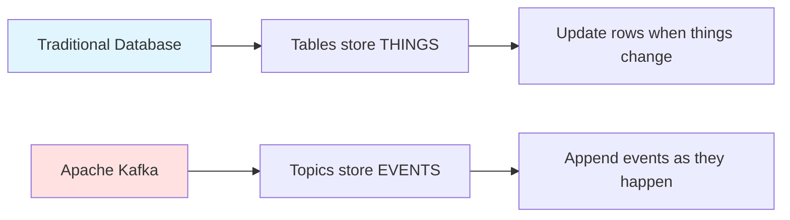

### Real-Time Processing

!!! info "Real-Time Focus"
Events happen at a specific point in time, and Kafka is focused on processing them **in real time**. This means:

    - ✅ Process events as they occur
    - ✅ Don't store them for batch processing later
    - ✅ React immediately to what's happening now

    However, Kafka **can remember events**—it stores them for future replay and analysis.

### Example: Smart Thermostat

Consider a network of smart thermostats in homes. In a traditional database:

**Traditional Approach (Tables):**

| sensor_id | location | temperature | timestamp        |
| --------- | -------- | ----------- | ---------------- |
| 42        | kitchen  | 22°C        | 2024-12-05 10:00 |
| 42        | kitchen  | 24°C        | 2024-12-05 10:15 |

!!! warning "Problem: Lost Context"
When the temperature updates, we **lose context**—we don't remember what the temperature used to be.

**Kafka Approach (Events Log):**

```json
{"sensor_id": 42, "location": "kitchen", "temperature": 22, "timestamp": "2024-12-05T10:00:00Z"}  // (1)!
{"sensor_id": 42, "location": "kitchen", "temperature": 24, "timestamp": "2024-12-05T10:15:00Z"}  // (2)!
```

1. First reading at 10:00 - preserved forever
2. Second reading at 10:15 - appended to log

!!! success "Benefits of Event Logs"
We preserve the **entire history** of temperature changes, enabling insights like:

    - How quickly does the kitchen heat up?
    - What time of day does it heat up?
    - Historical trends and patterns

---

## Kafka Topics: Immutable Event Logs

### What is a Topic?

In Kafka, a **topic** is where we store messages. Unlike traditional database tables, topics use **logs**—ordered sequences of immutable records.

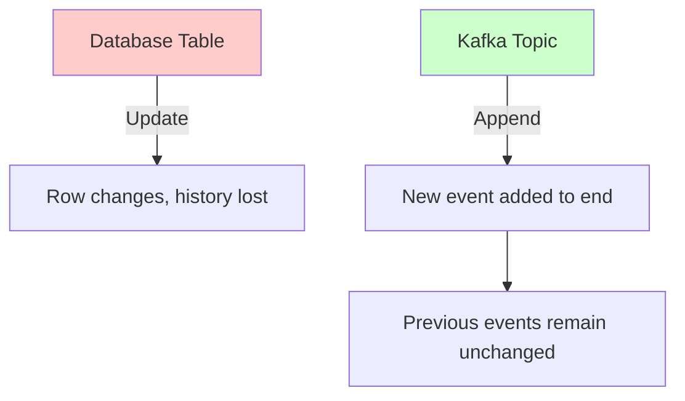

### Key Characteristics of Topics

!!! note "Core Properties" 1. **Immutable Messages**: Once written, messages cannot be changed 2. **Append-Only**: New messages are added to the end 3. **Ordered Sequence**: Messages maintain their order within the log 4. **Replayable**: Messages can be read multiple times

### Topic Structure Example

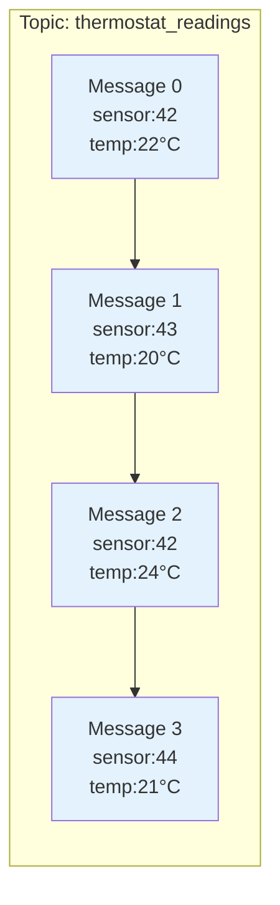

### Message Anatomy

Every message in a Kafka topic consists of:

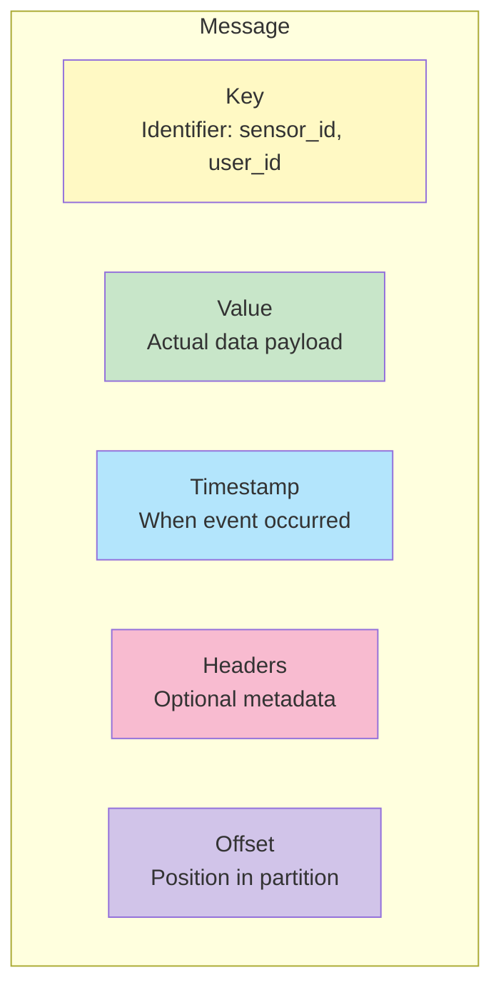

**Components:**

- **Key** (optional): Identifier that the event relates to (e.g., `sensor_id: 42`) // (1)!
- **Value** (required): The actual event data (JSON, Avro, Protobuf, etc.) // (2)!
- **Timestamp**: When the event was produced or received // (3)!
- **Headers** (optional): Key-value pairs for lightweight metadata // (4)!
- **Offset**: Sequential ID starting at 0, incrementing by 1 for each message // (5)!

1. Used for partition assignment - messages with same key go to same partition
2. Can be any serialized format: JSON, Avro, Protocol Buffers, plain text, etc.
3. Can be producer-set (event time) or broker-set (ingestion time)
4. Useful for tracing, routing, or adding context without modifying the value
5. Unique within a partition - used by consumers to track reading position

### Example Message

```json
{
  "key": 42,
  "value": {
    "sensor_id": 42,
    "location": "kitchen",
    "temperature": 22,
    "unit": "celsius",
    "read_at": "2024-12-05T10:00:00Z"
  },
  "timestamp": 1733396400000,
  "headers": {
    "source": "iot-gateway-01",
    "version": "1.0"
  },
  "offset": 1234567
}
```

### Topics Are Not Queues

!!! danger "Critical Distinction"
**Queue**: When you read a message, it's gone—nobody else can read it

    **Kafka Topic**: Messages remain available for multiple consumers to read independently

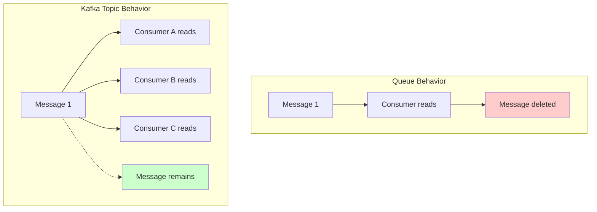

- **Queue**: When you read a message, it's gone—nobody else can read it
- **Kafka Topic**: Messages remain available for multiple consumers to read independently

This enables:

!!! success "Key Advantages" - **Replayability**: Read messages again - **Multiple consumers**: Different applications can process the same events - **Fault tolerance**: If a consumer fails, it can resume from where it left off

### Transforming Immutable Data

Since messages are immutable, how do we transform data?

**Answer:** Create new topics with transformed data.

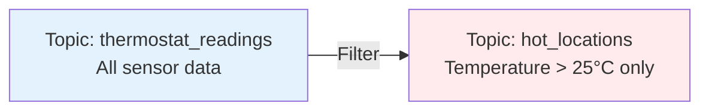

Example transformation using stream processing:

```sql
-- Filter to only hot readings
INSERT INTO hot_locations
SELECT * FROM thermostat_readings
WHERE temperature > 25;
```

### Log Compaction and Retention

Kafka offers flexible data management:

**Retention Policies:**

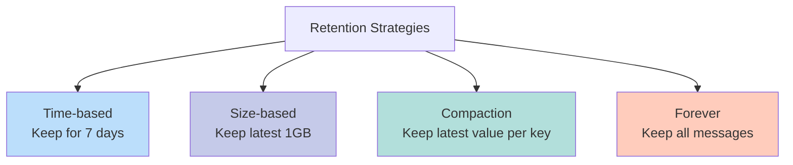

**Log Compaction** is particularly useful when you only care about the latest state:

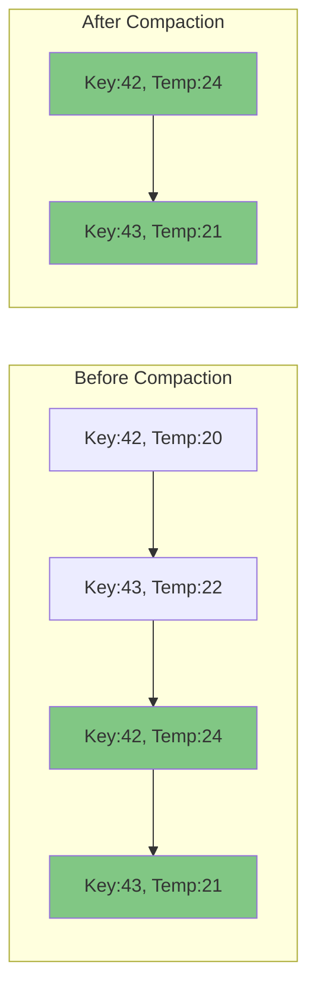

---

## Partitions: Scaling Kafka Horizontally

### Why Partition?

!!! warning "Single Partition Limitations"
If a topic were stored entirely on one machine, it would be limited by:

    - ❌ That machine's storage capacity
    - ❌ That machine's processing power
    - ❌ That machine's network bandwidth

**Partitioning** solves this by splitting a topic into multiple logs distributed across different machines.

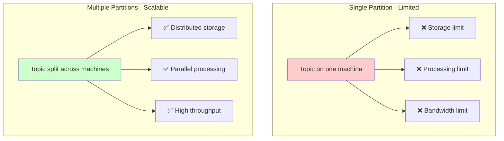

### Partition Structure

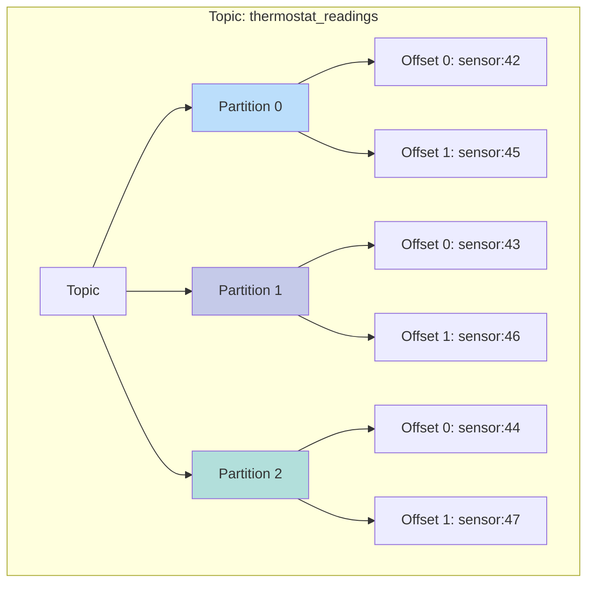

**Key Points:**

!!! info "Partition Characteristics" - Each partition is an **ordered, immutable log** - Partitions are **independent** of each other - A topic can have **hundreds or thousands** of partitions - Kafka supports up to **2 million partitions** with KRaft

### Message Ordering

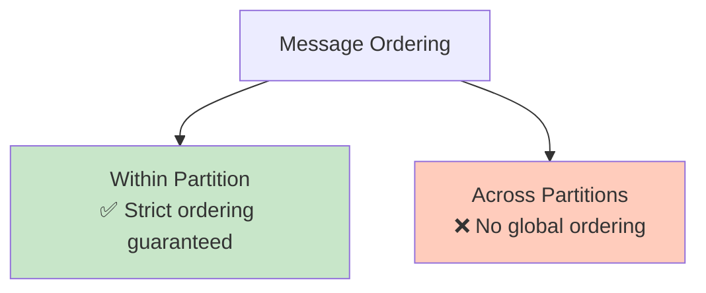

**Within a partition:** Messages are read in the exact sequence they were written.

**Across partitions:** No ordering guarantee between partitions.

!!! tip "Design Consideration"
If order matters for your use case, ensure related messages share the same key—they'll go to the same partition and maintain order.

### Partition Assignment Strategies

#### 1. With Message Key (Hash-Based)

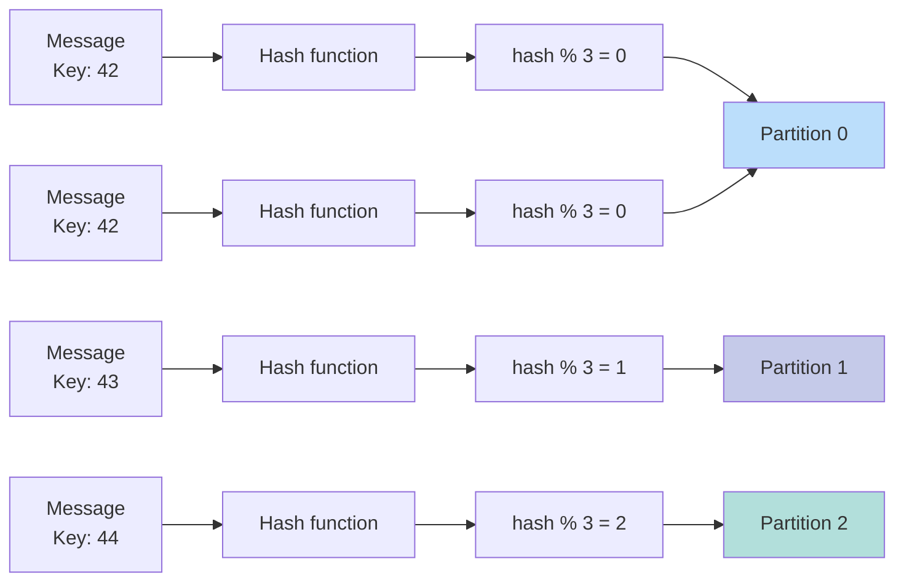

**Process:**

1. Hash the message key
2. Apply modulo with number of partitions: `hash(key) % num_partitions`
3. Route message to the resulting partition

**Result:** All messages with the **same key** go to the **same partition**, preserving order for that key.

!!! example "Practical Example"
`     All messages with sensor_id=42 → Partition 0
    All messages with sensor_id=43 → Partition 1
    `

    This ensures all temperature readings from sensor 42 are processed in chronological order.

#### 2. Without Message Key (Round-Robin)

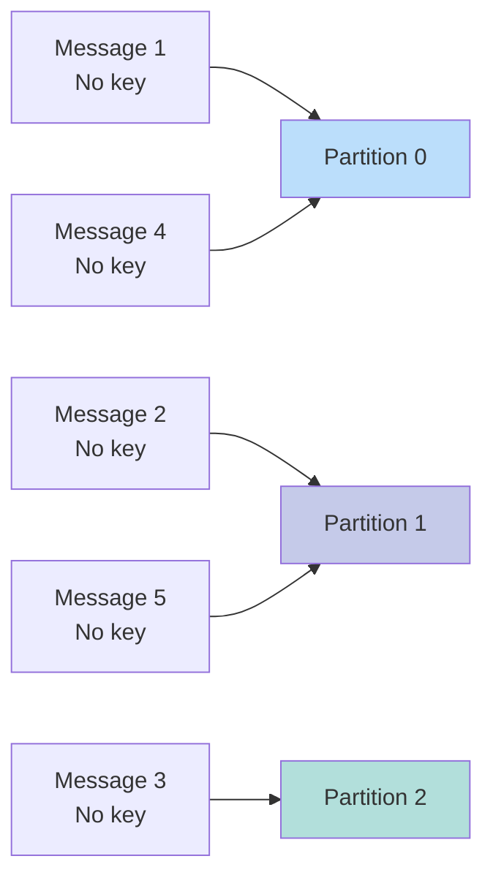

**Process:** Messages are distributed evenly across partitions in a round-robin fashion.

**Result:**

!!! success "Benefits"
✅ Even load distribution across partitions

!!! warning "Trade-off"
❌ No ordering guarantee (messages from same source can go to different partitions)

### Choosing Partition Count

!!! tip "Partition Count Guidelines"
Consider these factors:

    | Factor | Consideration |
    |--------|--------------|
    | **Throughput** | More partitions = higher throughput |
    | **Parallelism** | Max consumers = number of partitions |
    | **Latency** | Too many partitions can increase latency |
    | **Storage** | Each partition consumes disk and memory |

    **Rule of thumb:** Start with the number of brokers, then adjust based on workload.

---

## Brokers: The Kafka Cluster Infrastructure

### What is a Broker?

A **broker** is a Kafka server that:

- Stores partition data
- Handles read and write requests
- Manages replication
- Coordinates with other brokers

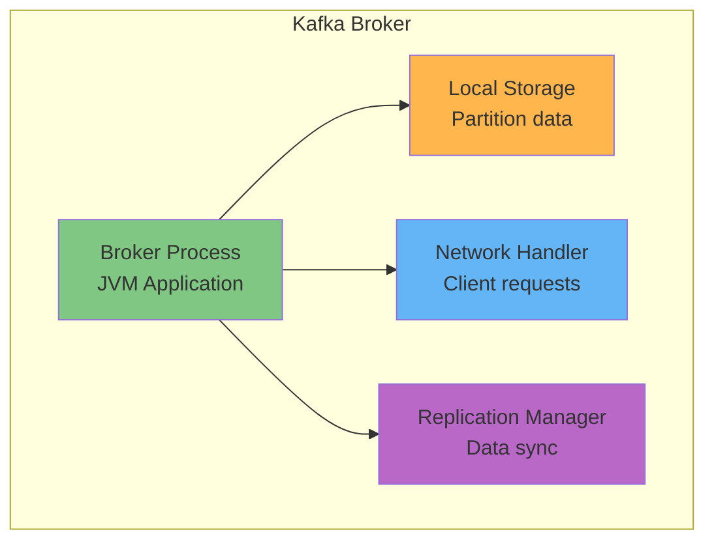

### Broker Deployment Options

!!! info "Deployment Flexibility"
Brokers can run on:

    - 🖥️ Physical servers (bare metal)
    - ☁️ Cloud instances (AWS EC2, Azure VMs, GCP Compute)
    - 🐳 Containers (Docker, Kubernetes)
    - 🔌 IoT devices (Raspberry Pi, edge computing)

    **Typical setup:** Brokers have access to **local SSD storage** for high-performance I/O.

### Kafka Cluster Architecture

Multiple brokers form a **Kafka cluster**:

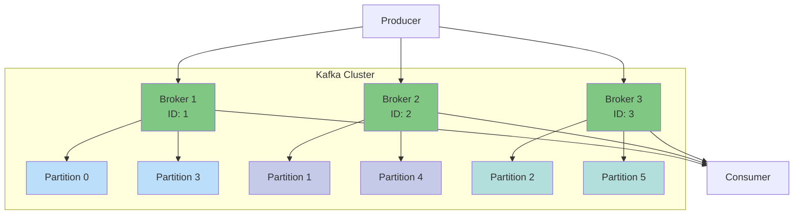

### Topic Distribution Across Brokers

Example with 2 topics:

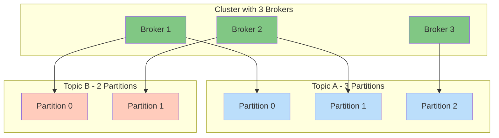

**Note:** Topics can have different numbers of partitions based on their scaling needs.

### Broker Responsibilities

1. **Handle Client Requests**

   ```mermaid
   graph LR
   P[Producer] -->|Write Request| B[Broker]
   B -->|Acknowledgment| P
   B -->|Read Request| C[Consumer]
   C -->|Acknowledgment| B
   ```

2. **Manage Storage**
   - Write messages to partition logs
   - Maintain indexes for fast lookups
   - Clean up old messages based on retention policies

3. **Coordinate Replication**
   - Sync data between replica brokers
   - Manage leader elections
   - Ensure data consistency

### Metadata Management: KRaft

Modern Kafka (4.0+) uses **KRaft** (Kafka Raft) for metadata management:

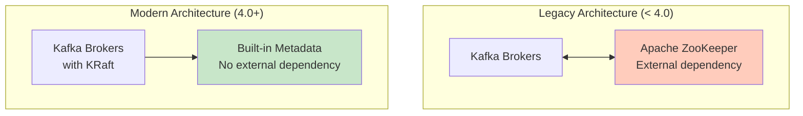

**KRaft Benefits:**

!!! success "Why KRaft Matters" - ✅ No external ZooKeeper dependency - ✅ Simplified operations - ✅ Faster metadata updates - ✅ Better scalability (supports 2M+ partitions) - ✅ Built on Raft consensus protocol

!!! danger "Breaking Change"
As of Kafka 4.0, ZooKeeper is **no longer used or supported**.

---

## Replication: Ensuring Fault Tolerance

### Why Replication?

!!! warning "Hardware Failure is Inevitable"
Disk and server failures **will happen**. Replication protects against data loss by maintaining multiple copies of each partition.

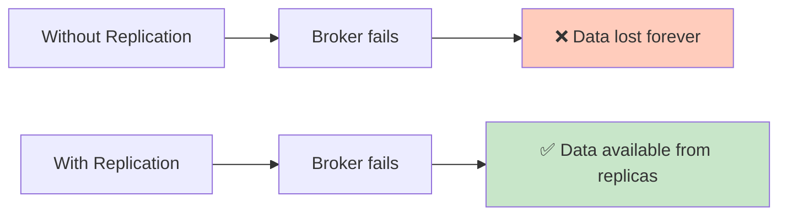

### Replication Factor

The **replication factor** defines how many copies of each partition to maintain.

**Example: Replication Factor = 3**

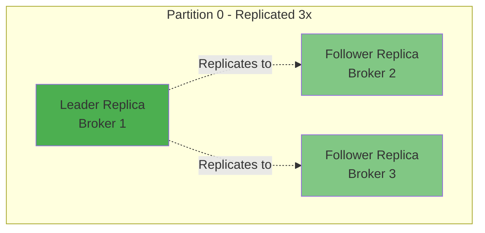

### Leader and Followers

For each partition replica set:

- **1 Leader**: Handles all reads and writes
- **n-1 Followers**: Sync data from the leader

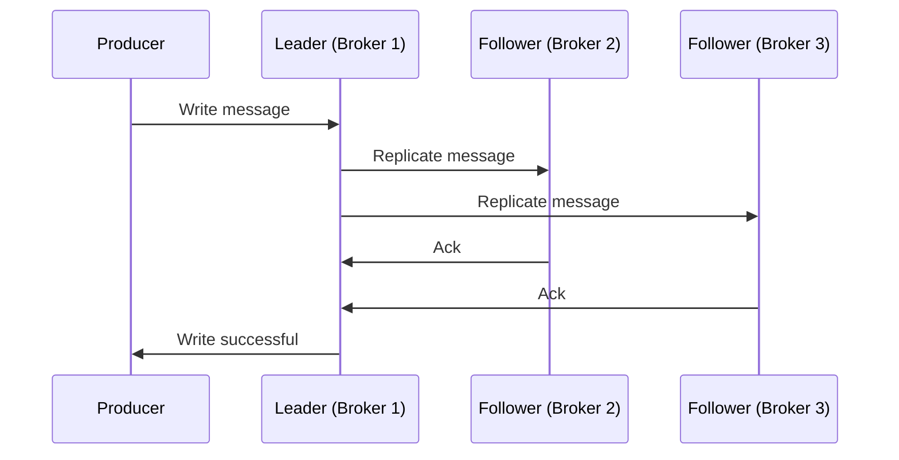

### Leader Election and Failover

When a broker fails, Kafka automatically elects a new leader:

```mermaid
graph TB
    subgraph "Normal Operation"
    L1[Leader<br/>Broker 1] --> F1[Follower<br/>Broker 2]
    L1 --> F2[Follower<br/>Broker 3]
    end

    subgraph "Broker 1 Fails"
    X[❌ Broker 1<br/>Down]
    F1B[Follower<br/>Broker 2]
    F2B[Follower<br/>Broker 3]
    end

    subgraph "After Leader Election"
    L2[New Leader<br/>Broker 2] --> F3[Follower<br/>Broker 3]
    L2 --> F4[New Follower<br/>Broker 4<br/>Replacing Broker 1]
    end

    style L1 fill:#4caf50
    style X fill:#f44336
    style L2 fill:#4caf50
    style F1 fill:#81c784
    style F2 fill:#81c784
    style F1B fill:#81c784
    style F2B fill:#81c784
    style F3 fill:#81c784
    style F4 fill:#81c784
```

**Process:**

1. Leader (Broker 1) fails
2. Remaining followers detect failure
3. One follower (Broker 2) is elected as new leader
4. Clients automatically connect to new leader
5. Cluster creates new replica on another broker to restore replication factor

### Read and Write Patterns

#### Default Behavior

```mermaid
graph TB
    P[Producer] -->|Writes| L[Leader Replica]
    L -->|Reads| C[Consumer]

    L -.->|Replicates| F1[Follower<br/>Broker 2]
    L -.->|Replicates| F2[Follower<br/>Broker 3]

    style L fill:#4caf50
    style F1 fill:#81c784
    style F2 fill:#81c784
```

- **Writes:** Always go to the leader
- **Reads:** By default, read from the leader

#### Follower Reads (Optional)

For improved latency, consumers can read from the nearest replica:

```mermaid
graph TB
    P[Producer<br/>US East] -->|Write| L[Leader<br/>US East]

    L -.->|Replicate| F1[Follower<br/>EU West]
    L -.->|Replicate| F2[Follower<br/>Asia]

    L -->|Read| C1[Consumer<br/>US East]
    F1 -->|Read| C2[Consumer<br/>EU West]
    F2 -->|Read| C3[Consumer<br/>Asia]

    style L fill:#4caf50
    style F1 fill:#81c784
    style F2 fill:#81c784
```

**Benefits:**

!!! success "Follower Read Advantages" - ✅ Lower latency for geographically distributed consumers - ✅ Reduced load on leader broker

!!! warning "Trade-off"
⚠️ Potential for slightly stale data (eventual consistency)

### Replication Guarantees

!!! info "Durability & Fault Tolerance"
Kafka provides strong durability guarantees:

    | Guarantee | Description |
    |-----------|-------------|
    | **At least once** | Messages are never lost |
    | **Ordering** | Maintained within each partition |
    | **Durability** | Configurable via `acks` parameter |
    | **Fault tolerance** | Survives f broker failures with replication factor f+1 |

    **Example:**

    - Replication factor = 3
    - Can tolerate 2 broker failures
    - Data remains available and consistent

---

## Putting It All Together

### Complete Kafka Architecture

```mermaid
graph TB
    subgraph "Kafka Cluster"
    B1[Broker 1<br/>with KRaft]
    B2[Broker 2<br/>with KRaft]
    B3[Broker 3<br/>with KRaft]

    B1 <--> B2
    B2 <--> B3
    B3 <--> B1
    end

    subgraph "Topic: thermostat_readings"
    P0L[Partition 0<br/>Leader on B1]
    P0F1[Partition 0<br/>Follower on B2]
    P0F2[Partition 0<br/>Follower on B3]

    P1L[Partition 1<br/>Leader on B2]
    P1F1[Partition 1<br/>Follower on B1]
    P1F2[Partition 1<br/>Follower on B3]
    end

    B1 --> P0L
    B2 --> P0F1
    B3 --> P0F2

    B2 --> P1L
    B1 --> P1F1
    B3 --> P1F2

    PROD[IoT Gateway<br/>Producer] -->|Write events| B1
    PROD -->|Write events| B2

    B1 -->|Read events| CONS[Analytics App<br/>Consumer]
    B2 -->|Read events| CONS

    style B1 fill:#81c784
    style B2 fill:#81c784
    style B3 fill:#81c784
    style P0L fill:#4caf50
    style P1L fill:#4caf50
    style P0F1 fill:#a5d6a7
    style P0F2 fill:#a5d6a7
    style P1F1 fill:#a5d6a7
    style P1F2 fill:#a5d6a7
```

### Data Flow Summary

```mermaid
sequenceDiagram
    participant IoT as IoT Device
    participant P as Producer
    participant B1 as Broker 1 (Leader)
    participant B2 as Broker 2 (Follower)
    participant B3 as Broker 3 (Follower)
    participant C as Consumer

    IoT->>P: Temperature reading: 22°C
    P->>P: Serialize to bytes
    P->>P: Hash key (sensor_id=42)
    P->>P: Select partition (hash % 3 = 0)
    P->>B1: Write to Partition 0
    B1->>B2: Replicate message
    B1->>B3: Replicate message
    B2->>B1: Ack replication
    B3->>B1: Ack replication
    B1->>P: Ack write successful

    Note over C: Consumer polls for new messages
    C->>B1: Fetch from Partition 0
    B1->>C: Return messages
    C->>C: Deserialize and process
    C->>B1: Commit offset
```

---

## Key Takeaways

!!! summary "Events vs Things" - ✅ Kafka focuses on **events** (things that happen) rather than **things** (objects)  
 - ✅ Events capture **when** and **what** happened  
 - ✅ Enables real-time processing and historical analysis

!!! summary "Topics" - ✅ Immutable, append-only logs of events  
 - ✅ Messages are never modified, only added  
 - ✅ Support multiple independent consumers  
 - ✅ Configurable retention and compaction policies

!!! summary "Partitions" - ✅ Enable horizontal scalability  
 - ✅ Distribute load across multiple brokers  
 - ✅ Maintain strict ordering within each partition  
 - ✅ Use hashing to route messages with same key to same partition

!!! summary "Brokers" - ✅ Server processes that store and serve data  
 - ✅ Form a distributed cluster  
 - ✅ Handle client read/write requests  
 - ✅ Use KRaft for built-in metadata management (no ZooKeeper)

!!! summary "Replication" - ✅ Protects against data loss  
 - ✅ Configurable replication factor (typically 3)  
 - ✅ Leader handles writes, followers sync data  
 - ✅ Automatic failover when brokers fail  
 - ✅ Supports follower reads for lower latency

---

## What's Next?

!!! tip "Continue Your Kafka Journey"
Now that you understand the core concepts, you're ready to:

    1. [:fontawesome-solid-paper-plane: **Produce Messages**](../how-to/kafka-produce-messages.md) - Learn how to write data to Kafka
    2. [:fontawesome-solid-download: **Consume Messages**](../how-to/kafka-consume-messages.md) - Learn how to read data from Kafka
    3. [:fontawesome-solid-diagram-project: **Use Schema Registry**](../how-to/kafka-use-schema-registry.md) - Manage data schemas
    4. [:fontawesome-solid-link: **Connect External Systems**](../how-to/kafka-connect-systems.md) - Integrate Kafka with databases and other systems
    5. [:fontawesome-solid-stream: **Process Streams**](../how-to/kafka-stream-processing.md) - Transform data in real-time

---

## Additional Resources

!!! note "Further Learning" - [Apache Kafka Official Documentation](https://kafka.apache.org/documentation/) - [Kafka Improvement Proposals (KIPs)](https://cwiki.apache.org/confluence/display/KAFKA/Kafka+Improvement+Proposals) - [Confluent Developer Resources](https://developer.confluent.io/) - [Kafka: The Definitive Guide (Book)](https://www.confluent.io/resources/kafka-the-definitive-guide/)

---

!!! info "Course Source"
This tutorial is based on the [Apache Kafka 101 course](https://developer.confluent.io/courses/apache-kafka/events/) from Confluent.
